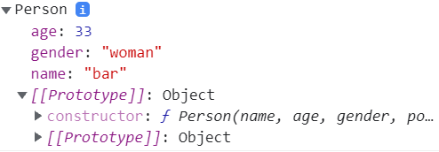

## Chapter 04. 함수와 프로토타입 체이닝


### 목차

- 4.1 함수 정의
  - 함수 리터럴
  - 함수 선언문 방식으로 함수 생성하기
  - 함수 표현식 방식으로 함수 생성하기
  - Function() 생성자 함수를 통한 함수 생성하기
  - 함수 호이스팅
- 4.2 함수 객체: 함수도 객체다
  - 자바스크립트에서는 함수도 객체다
  - 자바스크립트에서 함수는 값으로 취급된다
  - 함수 객체의 기본 프로퍼티
- 4.3 함수의 다양한 형태
  - 콜백 함수
  - 즉시 실행 함수
  - 내부 함수
  - 함수를 리턴하는 함수
- 4.4 함수 호출과 this
  - arguments 객체
  - 호출 패턴과 this 바인딩
  - 함수 리턴
- 4.5 프로토타입 체이닝
  - 프로토타입의 두 가지 의미
  - 객체 리터럴 방식으로 생성된 객체의 프로토타입 체이닝
  - 생성자 함수로 생성된 객체의 프로토타입 체이닝
  - 프로토타입 체이닝의 종점
  - 기본 데이터 타입 확장
  - 프로토타입도 자바스크립트 객체다
  - 프로토타입 메서드와 this 바인딩
  - 디폴트 프로토타입은 다른 객체로 변경이 가능하다
  - 객체의 프로퍼티 읽기나 메서드를 실행할 때만 프로토타입 체이닝이 동작한다.


## 4.1 함수 정의

- 함수를 생성하는 3가지 방법
  - 함수 선언문 (function statement)
  - 함수 표현식 (function expression)
  - Function() 생성자 함수


- 함수 리터럴

  - 자바스크립트에서는 함수도 일반 객체처럼 값으로 취급된다.

  - 때문에 객체 리터럴 방식으로 일반 객체를 생성할 수 있는 것처럼, 자바스크립트에서는 **함수 리터럴**을 이용해 함수를 생성할 수 있다.

  - 실제로 함수 선언문이나 함수 표현식 방법 모두 이런 함수 리터럴 방식으로 함수를 생성한다.

  - **[예시]** 함수 리터럴을 통한 add() 함수 정의

    ```javascript
    function add(x, y) {
    	return x + y;
    }
    ```

    - 함수명은 선택 사항이다. 자바스크립트에서는 함수명이 없는 함수를 익명 함수라고 한다.
    - 자바스크립트에서는 매개변수 타입을 기술하지 않는다.

    

- 함수 선언문 방식으로 함수 생성하기

  - 함수 선언문 방식은 앞에서 설명한 함수 리터럴 형태와 같다.

  - 주의할 점은 함수 선언문 방식으로 정의된 함수의 경우는 **반드시 함수명이 정의되어 있어야 한다**는 것이다.

  - **[예제 4-1]** add() 함수 생성 (함수 선언문 방식)

    ```javascript
    // add() 함수 선언문
    function add(x, y) {
    	return x + y;
    }
    
    console.log(add(3, 4));  // (출력값) 7
    ```

    

- 함수 표현식 방식으로 함수 생성하기

  - 자바스크립트에서는 함수도 하나의 값처럼 취급된다.

    - 따라서 함수도 숫자나 문자열처럼 변수에 할당되는 것이 가능하다.

  - 이런 방식으로 함수 리터럴로 하나의 함수를 만들고, 여기서 생성된 함수를 변수에 할당하여 함수를 생성하는 것을 **함수 표현식**이라고 말한다.

    

  - **[예제 4-2]** add() 함수 생성 (함수 표현식 방식)

    ```javascript
    // add() 함수 표현식
    var add = function (x, y) {
    	return x + y;
    };
    
    var plus = add;
    
    console.log(add(3,4));
    console.log(plus(5,6));
    ```

    - 여기서 함수 리터럴로 생성한 함수는 함수명이 없으므로 익명 함수이다.
    - 위 코드에서 알 수 있듯이 함수 표현식은 함수 선언문 문법과 거의 유사하다. 유일한 차이점은 함수 표현식 방법에서는 함수 이름이 선택 사항이며, 보통 사용하지 않는다는 것이다.

    - 위 방식은 **익명 함수를 이용한 함수 표현식 방법(익명 함수 표현식)**이다.

    - 이러한 익명 함수의 호출은 앞 예제와 같이 함수 변수에 함수 호출 연산자인 ()를 붙여서 기술하는 것으로 가능하다.

      

  - **[예제 4-3]** 기명 함수 표현식의 함수 호출 방법

    ```java
    var add = function sum(x, y) {
        return x + y;
    };
    
    console.log(add(3, 4)); // (출력값) 7
    console.log(sum(3, 4)); // ReferenceError: sum is not defined
    ```

    - 위와 같이 함수 이름이 포함된 함수 표현식을 **기명 함수 표현식**이라고 한다.

    - sum(3,4) statement는 에러가 발생하는데, 이것은 함수 표현식에서 사용된 함수명이 외부 코드에서 접근이 불가능하기 때문이다.

      - 함수 표현식에 사용된 함수명은 정의된 함수 내부에서 해당 함수를 재귀적으로 호출하거나, 디버거 등에서 함수를 구분할 때 사용된다.

        

  - 예제 4-1에서 함수 표현식이 아닌 함수 선언문으로 정의한 add() 함수는 어떻게 함수명으로 함수 외부에서 호출이 가능할까?

    - 함수 선언문 형식으로 정의된 add() 함수는 자바스크립트 엔진에 의해 다음과 같은 함수 표현식 형태로 변경되기 때문이다.

      ```javascript
      var add = function add(x, y) {
      	return x + y;
      };
      ```

    - 함수명과 함수 변수의 이름이 add로 같으므로, 함수명으로 함수가 호출되는 것처럼 보이지만, 실제로는 add 함수 변수로 함수 외부에서 호출이 가능하게 된 것이다.

    

  - **[예제 4-4]** 함수 표현식 방식으로 구현한 팩토리얼 함수

    ```javascript
    var factorialVar = function factorial(n) {
        if (n <= 1) {
            return 1;
        }
        return n * factorial(n - 1);
    };
    
    console.log(factorialVar(5)); // (출력값) 120
    console.log(factorial(3)); // ReferenceError: factorial is not defined
    ```


- 함수 선언문(function statement)와 함수 표현식(function expression)에서의 세미콜론

  - 함수 선언문 방식: 세미콜론 붙이지 않는다.
  - **<u>함수 표현식 방식: 세미콜론 붙인다.</u>**

  - 자바스크립트는 C와 같이 세미콜론 사용을 강제하지는 않는다.

    - 인터프리터가 자동으로 세미콜론을 삽입시켜 주기 때문
    - 그렇다고 해서 세미콜론 사용을 신경 쓰지 않는다면, 심각한 디버깅 상황에 직면할 수 있다.

  - **[예제]**

    ```javascript
    var func = function() {
        return 42;
    }   // 세미콜론을 사용하지 않음
    (function() {
        console.log("function called");
    })();
    ```

    - 이 예제 코드의 의도는 단순히 42를 리턴하는 func() 함수를 정의하고, 그런 다음 즉시 실행 함수 형식으로 "function called"를 출력하려고 했다.
    - 하지만 이 코드는 세미콜론을 사용하지 않았으므로, 실제로 func() 함수를 호출하면 의도와는 다르게 'number is not a function'이라는 에러가 발생한다.
    - 그 이유는 자바스크립트 파서가 func()의 함수 정의에서 세미콜론을 사용하지 않아, `return 42;` 문장을 지나 func()의 함수 정의 끝에 있는 중괄호만으로 func() 함수가 끝났다고 판단하지 않기 때문이다. 그리고 자바스크립트 파서는 이후에 괄호에 둘러싸여 정의된 즉시 실행 함수를 보고 이를 마치 func() 함수 호출 연산으로 생각해서 func() 함수를 호출해 버린다. 그렇기 때문에 func() 함수가 호출되면 42가 반환되고, 즉시 실행 함수를 실행하려고 남겨둔 마지막 () 괄호가 있으므로 `42();` 형태로 또다시 함수를 호출하려고 시도한다. 그러나 42는 숫자이지 함수가 아니므로 'number is not a function' 에러가 발생하게 되는 것이다.


- Function() 생성자 함수를 통한 함수 생성하기

  - 자바스크립트의 함수도 Function()이라는 기본 내장 생성자 함수로부터 생성된 **객체**라고 볼 수 있다.

    - 앞에서 설명한 함수 선언문이나 함수 표현식 또한 Function() 생성자 함수가 아닌 함수 리터럴 방식으로 함수를 생성하지만, 결국엔 이 또한 내부적으로는 Function() 생성자 함수로 함수가 생성된다고 볼 수 있다.

  - Function() 생성자 함수로 함수를 생성하는 문법

    ```javascript
    new Function(arg1, arg2, ... argN, functionBody)
    - arg1, arg2, ..., argN: 함수의 매개변수
    - functionBody: 함수가 호출될 때 실행될 코드를 포함한 "문자열"
    ```

  - **[예제 4-5]** Function() 생성자 함수를 이용한 add() 함수 생성

    ```javascript
    var add = new Function('x', 'y', 'return x + y');
    console.log(add(3, 4));
    ```

  - 일반적으로 Function() 생성자 함수를 사용한 함수 생성 방법은 자주 사용되지 않는다. 상식 수준으로 알아두자.


- 함수 호이스팅

  - 지금까지 살펴본 함수 생성 방법 3가지는 코드가 약간씩 다르지만 모두 같은 기능의 함수를 생성함을 확인할 수 있다. 하지만 이들 사이에는 동작 방식이 약간 차이가 있다.

    - 그 중의 하나가 바로 **함수 호이스팅**(Function Hoisting)이다.

  - 자바스크립트 Guru로 알려진 더글라스 크락포드는 **함수 생성에 있어서 함수 표현식만 사용**할 것을 권하고 있다. 그 이유 중의 하나가 바로 함수 호이스팅 때문이다.

  - **[예제 4-6]** 함수 선언문 방식과 함수 호이스팅

    ```javascript
    console.log(add(2, 3));  // 5
    
    // 함수 선언문 형태로 add() 함수 정의
    function add(x, y) {
        return x + y;
    }
    
    console.log(add(3, 4));  // 7
    ```

    - `add(2, 3)`을 호출할 때 `add()` 함수가 정의되지 않았음에도 함수를 호출하는 것이 가능하다. 이것은 함수가 자신이 위치한 코드에 상관없이 **함수 선언문 형태로 정의한 함수의 유효 범위는 코드의 맨 처음부터 시작한다**는 것을 알 수 있다. 이것을 **함수 호이스팅**이라고 부른다.

  - 더글라스 크락포드는 이러한 함수 호이스팅은 함수를 사용하기 전에 반드시 선언해야 한다는 규칙을 무시하므로 코드의 구조를 엉성하게 만들 수도 있다고 지적하며, 함수 표현식 사용을 권장한다.

  - **[예제 4-7]** 함수 표현식 방식과 함수 호이스팅

    ```javascript
    console.log(add(2, 3));  // TypeError: add is not a function
    
    // 함수 표현식 형태로 add() 함수 정의
    var add = function add(x, y) {
        return x + y;
    }
    
    console.log(add(3, 4));  // 7
    ```

    - 함수 표현식 형태로 작성된 함수는 함수 호이스팅이 일어나지 않는다.

  - 이러한 함수 호이스팅이 발생하는 원인은 자바스크립트의 **변수 생성**(Instantiation)과 **초기화**(Initialization)의 작업이 분리돼서 진행되기 때문이다.

    - 자세한 내용은 5장에서 다뤄본다.


## 4.2 함수 객체: 함수도 객체다

- 자바스크립트에서는 함수도 객체다.

  - JS에서는 함수의 기본 기능인 코드 실행뿐만 아니라, <u>함수 자체가 일반 객체처럼 프로퍼티들을 가질 수 있다</u>.

  - **[예제 4-8]** add() 함수도 객체처럼 프로퍼티를 가질 수 있다.

    ```javascript
    // 함수 선언 방식으로 add() 함수 정의
    function add(x, y) {
    	return x + y;
    } ---- (1)
    
    // add() 함수 객체에 result, status 프로퍼티 추가
    add.result = add(3, 2); ---- (2)
    add.status = 'OK'; 
    
    console.log(add.result);
    console.log(add.status);
    ```

    - (1): add() 함수를 생성할 때 함수 코드는 함수 객체의 **[[Code]] 내부 프로퍼티**에 자동으로 저장된다.
    - (2): add() 함수에 마치 일반 객체처럼 result 프로퍼티를 동적으로 생성하고, 여기에 add() 함수를 호출한 결과를 저장한 것을 확인할 수 있다.


- 자바스크립트에서 함수는 값으로 취급된다.
  - JS에서 함수는 객체다. 이는 **함수도 일반 객체처럼 취급될 수 있다**는 것을 말한다. 때문에 자바스크립트 함수는 다음과 같은 동작이 가능하다.
    - 리터럴에 의해 생성
    - 변수나 배열의 요소, 객체의 프로퍼티 등에 할당 가능
    - 함수의 인자로 전달 가능
    - 함수의 리턴값으로 리턴 가능
    - 동적으로 프로퍼티를 생성 및 할당 가능
  - 이와 같은 특징이 있으므로 자바스크립트에서는 함수를 **일급(First Class) 객체**라고 부른다.
    - 일급 객체란 위에서 나열한 기능이 모두 가능한 객체를 칭한다.
    - JS에서는 함수가 이러한 일급 객체의 특성을 가지므로 함수형 프로그래밍이 가능하다.
  - JS 함수의 기능은 C나 자바와 같은 다른 언어 함수의 기능과 거의 비슷하다. 입력한 값을 받아 처리한 다음 그 결과를 반환하는 구조다.
    - 하지만 이러한 기본적인 기능 외에도 JS에서 함수를 제대로 이해하려면 함수가 일급 객체이며 이는 곧 <u>함수가 일반 객체처럼 값(Value)으로 취급된다</u>는 것을 이해해야 한다.


- 변수나 프로퍼티의 값으로 할당

  - 함수는 숫자나 문자열처럼 변수나 프로퍼티의 값으로 할당될 수 있다.

  - **[예제 4-9]** 변수나 프로퍼티에 함수값을 할당하는 코드

    ```javascript
    // 변수에 함수 할당
    var foo = 100;
    var bar = function () { return 100; };
    console.log(bar());
    
    // 프로퍼티에 함수 할당
    var obj = {};
    obj.baz = function () { return 200; };
    console.log(obj.baz());
    ```

    

- 함수 인자로 전달

  - 함수는 다른 함수의 인자로도 전달이 가능하다.

  - **[예제 4-10]** 함수를 다른 함수의 인자로 넘긴 코드

    ```javascript
    // 함수 표현식으로 foo() 함수 생성
    var foo = function(func) {
    	func(); // 인자로 받은 func() 함수 호출
    };
    
    // foo() 함수 실행
    foo(function() {
        console.log('Function can be used as the argument');
    });
    ```


- 리턴값으로 활용

  - 함수는 다른 함수의 리턴값으로도 활용할 수 있다.

  - **[예제 4-11]** 함수를 다른 함수의 리턴값으로 활용한 코드

    ```javascript
    // 함수를 리턴하는 foo() 함수 정의
    var foo = function() {
    	return function () {
            console.log('this function is the return value.');
        };
    };
    
    var bar = foo();
    bar();
    ```


- 함수 객체의 기본 프로퍼티

  - 자바스크립트에서는 함수 역시 객체다.

    - 이것은 함수 역시 일반적인 객체의 기능에 추가로 호출됐을 때 정의된 코드를 실행하는 기능을 가지고 있다는 것이다.
    - 또한, 일반 객체와는 다르게 추가로 **함수 객체만의 표준 프로퍼티**가 정의되어 있다.

  - **[예제 4-12]** add() 함수 객체 프로퍼티를 출력하는 코드

    ```javascript
    function add(x, y) {
    	return x + y;
    }
    
    console.dir(add);
    ```

    

    - ECMA5 스크립트 명세서에는 모든 함수가 **length**와 **prototype** 프로퍼티를 가져야 한다고 기술하고 있다.
    - name 프로퍼티는 함수의 이름을 나타낸다.
    - caller 프로퍼티는 자신을 호출한 함수를 나타낸다.
    - arguments 프로퍼티는 함수를 호출할 때 전달된 인자값을 나타낸다.
    - [[Prototype]] 프로퍼티는 자신의 부모 역할을 하는 프로토타입 객체를 가리킨다.
      - 함수 객체의 부모 역할을 하는 프로토타입 객체를 **Function.prototype** 객체라고 하며, 이것 역시 **함수 객체**라고 정의한다.


- Function.prototype 객체
  - 앞 설명에서 '모든 함수들의 부모 객체는 Function Prototype 객체'라고 했다. 그런데 ECMAScript 명세서에는 Function.prototype은 함수라고 정의하고 있다. 그렇다면 이런 규칙에 의해 Function.prototype 함수 객체도 결국 함수이므로 Function Prototype 객체, 즉, '자기 자신을 부모가 갖는 것인가?'라는 의문이 생길 수 있다.
    - ECMAScript 명세서에는 예외적으로 Function.prototype 함수 객체의 부모는 자바스크립트의 모든 객체의 조상격인 **Object.prototype** 객체라고 설명하고 있다.
  - Function.prototype 객체는 모든 함수들의 부모 역할을 하는 프로토타입 객체다.
    - 때문에 모든 함수는 Function Prototype 객체가 갖고 있는 프로퍼티나 메서드를 마치 자신의 것처럼 상속받아 그대로 사용할 수 있다.
  - Function.prototype 객체가 가져야 하는 프로퍼티들은 아래와 같다.
    - constructor 프로퍼티
    - toString() 메서드
    - **apply(thisArg, argArray) 메서드**
    - **call(thisArg, [, arg1 [, arg2, ]]) 메서드**
    - bind(thisArg, [, arg1 [, arg2 ,]]) 메서드


- length 프로퍼티

  - 함수 객체의 length 프로퍼티는 앞서 설명했듯 ECMAScript에서 정한 모든 함수가 가져야 하는 표준 프로퍼티로서, **<u>함수가 정상적으로 실행될 때 기대되는 인자의 개수</u>**를 나타낸다.

  - **[예제 4-13]** 함수 객체의 length 프로퍼티

    ```javascript 
    function func0() {
    }
    
    function func1(x) {
        return x;
    }
    
    function func2(x, y) {
        return x + y;
    }
    
    function func3(x, y, z) {
        return x + y + z;
    }
    
    console.log('func0.length: ' + func0.length); // (출력값) 0
    console.log('func1.length: ' + func1.length); // (출력값) 1
    console.log('func2.length: ' + func2.length); // (출력값) 2
    console.log('func3.length: ' + func3.length); // (출력값) 3
    ```

    


- prototype 프로퍼티

  - 모든 함수는 객체로서 prototype 프로퍼티를 가지고 있다.

  - 여기서 주의할 것은 함수 객체의 **prototype 프로퍼티**는 앞서 설명한 모든 객체의 부모를 나타내는 **내부 프로퍼티**인 **[[Prototype]]**과 혼동하지 말아야 한다는 것이다.

  - **prototype 프로퍼티 vs [[Prototype]] 프로퍼티**

    - 두 프로퍼티 모두 프로토타입 객체를 가리킨다는 점에서 공통점이 있지만, 관점에 차이가 있다.
    - 모든 객체에 있는 내부 프로퍼티인 [[Prototype]]는 객체 입장에서 자신의 부모 역할을 하는 프로토타입 객체를 가리키는 반면,
    - 함수 객체가 가지는 prototype 프로퍼티는 이 함수가 생성자로 사용될 때 이 함수를 통해 생성된 객체의 부모 역할을 하는 프로토타입 객체를 가리킨다.

  - prototype 프로퍼티는 함수가 생성될 때 만들어지며, 다음 그림과 같이 단지 **constructor 프로퍼티** 하나만 있는 객체를 가리킨다.

    

  - 그리고 prototype 프로퍼티가 가리키는 프로토타입 객체의 유일한 constructor 프로퍼티는 자신과 연결된 함수를 가리킨다. 

  - 즉, 자바스크립트에서는 함수를 생성할 때, 함수 자신과 연결된 프로토타입 객체를 동시에 생성하며, 이 둘은 위 그림처럼 각각 prototype과 constructor라는 프로퍼티로 서로를 참조하게 된다.

  - **[예제 4-14]** 함수 객체와 프로토타입 객체와의 관계를 보여주는 코드

    ```javascript
    // MyFunction() 함수 정의
    function myFunction() {
        return true;
    }
    
    console.dir(myFunction.prototype);
    console.dir(myFunction.prototype.constructor);
    ```

    


## 4.3 함수의 다양한 형태

- 콜백 함수

  - 함수 표현식에서 함수 이름은 꼭 붙이지 않아도 되는 선택 사항이다. 이러한 함수가 익명 함수라고 이미 설명했다.

    - 이러한 익명 함수의 대표적인 용도가 바로 **콜백 함수**이다.

  - 콜백 함수는 코드를 통해 명시적으로 호출하는 함수가 아니라, 개발자는 단지 함수를 등록하기만 하고, **어떤 이벤트가 발생했거나 특정 시점에 도달했을 때 시스템에서 호출되는 함수**를 말한다.

  - 또한, 특정 함수의 인자로 넘겨서, 코드 내부에서 호출되는 함수 또한 콜백 함수가 될 수 있다.

  - 콜백 함수의 예시: 자바스크립트에서의 이벤트 핸들러 처리

    

  - **[예제 4-15]** window.onload 이벤트 핸들러 예제 코드

    ```html
    <!DOCTYPE html>
    <html><body>
    	<script>
    		// 페이지 로드 시 호출될 콜백 함수
    		window.onload = function() {
    			alert('This is the callback function.');
    		};
    	</script>
    </body></html>
    ```

    - window.onload는 이벤트 핸들러로서, 웹 페이지의 로딩이 끝나는 시점에 load 이벤트가 발생하면 실행된다.
    - 예제에서는 window.onload 이벤트 핸들러를 익명 함수로 연결했다. 따라서 익명 함수가 콜백 함수로 등록된 것이다.

    

- 즉시 실행 함수

  - 함수를 정의함과 동시에 바로 실행하는 함수를 **즉시 실행 함수**(Immediate functions)라고 한다.

    - 이 함수도 익명 함수를 응용한 형태이다.

  - **[예제 4-16]** 즉시 실행 함수 예제 코드

    ```javascript
    (function (name) {
    	console.log('This is the immediate function --> ' + name);
    })('foo');
    ```

  - 즉시 실행 함수를 만드는 방법

    1. 우선 함수 리터럴을 괄호 ()로 둘러싼다. 이때 함수 이름이 있든 없든 상관없다.
    2. 그런 다음 함수가 바로 호출될 수 있게 () 괄호 쌍을 추가한다. 이때 괄호 안에 값을 추가해 즉시 실행 함수의 인자로 넘길 수 있다.

  - 이렇게 함수가 선언되자마자 실행되게 만든 즉시 실행 함수의 경우, 같은 함수를 다시 호출할 수 없다.

    - 따라서 즉시 실행 함수의 이러한 특징을 이용한다면 **최초 한 번의 실행만을 필요로 하는 초기화 코드 부분** 등에 사용할 수 있다.
    - 그 외에도 jQuery와 같은 자바스크립트 라이브러리 코드가 로드되면 실행되는 초기화 작업을 할 때 많이 사용된다.


- 내부 함수

  - 자바스크립트에서는 함수 코드 내부에서도 다시 함수 정의가 가능하다.

  - 이렇게 함수 내부에 정의된 함수를 **내부 함수**(Inner function)라고 부른다.

  - 내부 함수의 용도

    - 자바스크립트의 기능을 보다 강력하게 해주는 클로저를 생성 하는 용도
    - 부모 함수 코드에서 외부에서의 접근을 막고 독립적인 헬퍼 함수를 구현하는 용도

  - **[예제 4-18]** 내부 함수 예제 코드

    ```javascript
    // parent() 함수 정의
    function parent() {
        var a = 100;
        var b = 200;
    
        // child() 내부 함수 정의
        function child() {
            var b = 300;
    
            console.log(a);
            console.log(b);
        }
        child();
    }
    
    parent();
    [출력 결과]
    100
    300
    
    child(); // ReferenceError: child is not defined
    ```

    - 내부 함수에서는 자신을 둘러싼 부모 함수의 변수에 접근이 가능하다.
      - child() 함수 내에서 부모 함수의 변수인 a에 접근이 가능하다.
      - 이것이 가능한 이유는 자바스크립트의 **스코프 체이닝** 때문이다.
    - 내부 함수는 일반적으로 자신이 정의된 부모 함수 내부에서만 호출이 가능하다.

  - **[예제 4-19]** 함수 스코프 외부에서 내부 함수 호출하는 예제 코드

    ```javascript
    function parent() {
        var a = 100;
    
        // child() 내부 함수
        var child = function () {
            console.log(a);
        }
    
        return child;
    }
    
    var inner = parent();
    inner();
    
    [출력 결과]
    100
    ```

    - 이와 같이 실행이 끝난 parent()와 같은 부모 함수 스코프의 변수를 참조하는 innert()와 같은 함수를 **클로저**라고 한다.

    

- 함수를 리턴하는 함수

  - JS에서는 함수도 일급 객체이므로 일반 값처럼 함수 자체를 리턴할 수도 있다.

    - 이러한 점을 활용해 함수를 호출함과 동시에 다른 함수로 바꾸거나,
    - 자기 자신을 재정의하는 함수를 구현할 수도 있다.

  - **[예제 4-20]** 자신을 재정의하는 함수 예제 코드

    ```javascript
    // self() 함수
    var self = function () {
        console.log('a');
    
        return function () {
            console.log('b');
        };
    };
    
    self = self();
    self();
    
    [출력 결과]
    a
    b
    ```


## 4.4 함수 호출과 this

- arguments 객체

  - C와 같은 엄격한 언어와 달리, 자바스크립트에서는 <u>함수를 호출할 때 함수 형식에 맞춰 인자를 넘기지 않더라도 에러가 발생하지 않는다</u>.

  - **[예제 4-21]** 함수 형식에 맞춰 인자를 넘기지 않더라도 함수 호출이 가능함을 나타내는 예제 코드

    ```javascript
    function func(arg1, arg2) {
        console.log(arg1, arg2);
    }
    
    func();
    func(1);
    func(1, 2);
    func(1, 2, 3);
    
    [출력 결과]
    undefined undefined
    1 undefined
    1 2
    1 2
    ```

    - 정의된 함수의 인자보다 적게 함수를 호출할 경우, 넘겨지지 않은 인자에는 **undefined** 값이 할당된다.
    - 이와 반대로 정의된 인자 개수보다 많게 함수를 호출했을 경우는 에러가 발생하지 않고, 초과된 인수는 무시된다.

  - JS의 이러한 특성 때문에 함수 코드를 작성할 때, 런타임 시에 호출된 인자의 개수를 확인하고 이에 따라 동작을 다르게 해줘야 할 경우가 있다.

    - 이를 가능케 하는 객체가 바로 **arguments 객체**다.
    - JS에서는 함수를 호출할 때 인수들과 함께 암묵적으로 arguments 객체가 함수 내부로 전달되기 때문이다.

  - arguments 객체는 함수를 호출할 때 넘긴 인자들이 배열 형태로 저장된 객체를 의미한다.

    - 특이한 점은 이 객체는 실제 배열이 아닌 **유사 배열 객체**라는 것이다.

  - **[예제 4-22]** arguments 객체 예제 코드

    ```javascript
    // add() 함수
    function add(a, b) {
    	// arguments 객체 출력
        console.dir(arguments);
        return a + b;
    }
    
    console.log(add(1));
    console.log(add(1, 2));
    console.log(add(1, 2, 3));
    ```

    - 실행결과에서 알 수 있듯이, arguments 객체는 다음과 같이 세 부분으로 구성되어 있다.
      - 함수를 호출할 때 넘겨진 인자 (배열 형태): 함수를 호출할 때 첫 번째 인자는 0번 인덱스, 두 번째 인자는 1번 인덱스, ...
      - length 프로퍼티: 호출할 때 넘겨진 인자의 개수
      - callee 프로퍼티: 현재 실행 중인 함수의 참조값 (예제에서는 add() 함수)
    - 앞서 얘기했듯이 arguments는 객체이지 배열이 아니다.
      - 즉, length 프로퍼티가 있으므로 배열과 유사하게 동작하지만, 배열은 아니므로 배열 메서드를 사용할 경우 에러가 발생한다는 것에 주의하자.

  - **[예제]** 매개변수 개수가 정해지지 않은 sum() 함수 구현

    ```javascript
    function sum() {
        var result = 0;
        for(var i = 0 ; i < arguments.length; i++) {
            result += arguments[i];
        }
    
        return result;
    }
    
    console.log(sum(1, 2, 3));
    console.log(sum(1, 2, 3, 4, 5, 6, 7, 8));
    ```

    

- 호출 패턴과 this 바인딩

  - 자바스크립트에서 함수를 호출할 때 기존 매개변수로 전달되는 인자값에 더해, 앞서 설명한 **arguments 객체** 및 **this 인자**가 함수 내부로 암묵적으로 전달된다.
  - 자바스크립트의 여러 가지 **함수가 호출되는 방식(호출 패턴)**에 따라 this가 다른 **객체를 참조**(this 바인딩)하기 때문에 this는 정확하게 이해할 필요가 있다. 


### this 바인딩 

#### 1. 객체의 메서드 호출할 때 this 바인딩

- 앞에서 설명했듯이 객체의 프로퍼티가 함수일 경우, 이 함수를 메서드라고 한다.

- 이러한 메서드를 호출할 때, 메서드 내부 코드에서 사용된 this는 **해당 메서드를 호출한 객체로 바인딩**된다.

- **[예제 4-23]** 메서드 호출 사용 시 this 바인딩

  ```javascript
  // myObject 객체 생성
  var myObject = {
      name: 'foo',
      sayName: function () {
          console.log(this.name);
      }
  };
  
  // otherObject 객체 생성
  var otherObject = {
      name: 'bar'
  };
  
  // otherObject.sayName() 메서드
  otherObject.sayName = myObject.sayName;
  
  // sayName() 메서드 호출
  myObject.sayName();
  otherObject.sayName();
  
  [출력 결과]
  foo
  bar
  ```


#### 2. 함수를 호출할 때 this 바인딩

- 자바스크립트에서 함수를 호출하면, 해당 함수 내부 코드에서 사용된 **this는 전역 객체에 바인딩**된다.

  - 브라우저에서 자바스크립트를 실행하는 경우 전역 객체는 **window** 객체가 된다.
  - Node.js에서의 전역 객체는 **global** 객체가 된다.

- 자바스크립트의 모든 전역 변수는 실제로는 이러한 전역 객체의 프로퍼티들이다.

- **[예제 4-24]** 전역 객체와 전역 변수의 관계를 보여주는 예제 코드

  ```javascript
  var foo = "I'm foo";     // 전역 변수 선언
  console.log(foo);        // (출력값) I'm foo
  console.log(window.foo); // (출력값) I'm foo
  ```

  - 전역 변수 foo를 정의하고 출력하는 예제 코드. window.foo를 출력해도 같은 결과를 얻을 수 있다.

- **[예제 4-25]** 함수를 호출할 때 this 바인딩을 보여주는 예제 코드

  ```javascript
  var test = 'This is test';
  console.log(window.test);
  
  // sayFoo() 함수
  var sayFoo = function () {
      console.log(this.test);
  };
  
  sayFoo();
  ```

  - `sayFoo()` 함수 내에서 `this.test`를 출력하고 있다. 자바스크립트에서는 함수를 호출할 때 this는 전역 객체에 바인딩된다고 했으므로, `sayFoo()` 함수가 호출된 시점에서 this는 전역 객체인 window에 바인딩된다. 즉, `this.test`는 `window.test`를 의미하므로 'This is test'가 출력되는 것이다.
  - 이러한 함수 호출에서의 this 바인딩 특성은 **내부 함수(inner function)를 호출했을 경우**에도 그대로 적용되므로, 내부 함수에서 this를 이용할 때는 주의해야 한다.

- **[예제 4-26]** 내부 함수의 this 바인딩 동작을 보여주는 예제 코드

  ```javascript
  // 전역 변수 value 정의
  var value = 100;
  
  // myObject 객체 생성
  var myObject = {
      value: 1,
      func1: function () {
          this.value += 1;
          console.log('func1() called. this.value: ' + this.value);
  
  
          // func2() 내부 함수
          func2 = function () {
              this.value += 1;
              console.log('func2() called. this.value: ' + this.value);
  
  
              // func3() 내부 함수
              func3 = function () {
                  this.value += 1;
                  console.log('func3() called. this.value: ' + this.value);
              }
  
              func3();
          }
  
          func2();
      }
  };
  
  myObject.func1();
  
  
  [출력 결과]
  func1() called. this.value: 2
  func2() called. this.value: 101
  func3() called. this.value: 102
  ```

  - func2()는 func1()을 부모 함수로 하여, func2() 내부 함수의 this는 당연히 부모 함수의 this와 같은 객체인 myObject를 가리킨다고 생각하는게 자연스러워 보인다. func3() 함수의 this도 마찬가지로, 자신의 부모 함수인 func2()의 this와 같이 myObject 객체를 가리킨다고 생각할 수 있다.
  - 하지만 위의 가정대로 코드가 동작한다면, this.value 값의 출력 결과가 2, 3, 4 순으로 나와야 한다. 하지만 2, 101, 102 순으로 출력된다.
  - 이렇게 실행결과가 예측과 다르게 출력된 이유는 자바스크립트에서 **내부 함수 호출 패턴을 정의해 놓지 않기 때문**이다.
    - 내부 함수도 결국 함수이므로 이를 호출할 때는 함수 호출로 취급된다.
    - 따라서 함수 호출 패턴 규칙에 따라 내부 함수의 this는 전역 객체(window)에 바인딩된다.
  - 이렇게 내부 함수가 this를 참조하는 자바스크립트의 한계를 극복하려면 **부모 함수(위 예제의 func1() 메서드)의 this**를 내부 함수가 접근 가능한 **다른 변수에 저장**하는 방법이 사용된다.
    - 보통 관례상 this 값을 저장하는 변수의 이름을 that이라고 짓는다. 
    - 이렇게 되면 내부 함수에서는 that 변수로 부모 함수의 this가 가리키는 객체에 접근할 수 있다.

- **[예제 4-27]** 내부 함수의 this 바인딩 문제를 해결한 예제 코드

  ```javascript
  // 내부 함수 this 바인딩
  var value = 100;
  
  var myObject = {
      value: 1,
      func1: function () {
          var that = this;
  
          this.value += 1;
          console.log('func1() called. this.value: ' + this.value);
  
          func2 = function () {
              that.value += 1;
              console.log('func2() called. this.value: ' + that.value);
  
              func3 = function () {
                  that.value += 1;
                  console.log('func3() called. this.value: ' + that.value);
              }
              func3();
          }
          func2();
      }
  };
  
  myObject.func1();
  
  [출력 결과]
  func1() called. this.value: 2
  func2() called. this.value: 3
  func3() called. this.value: 4
  ```

  - 자바스크립트에서는 이와 같은 this 바인딩의 한계를 극복하기 위해 this 바인딩을 명시적으로 할 수 있도록 call과 apply 메서드를 제공한다.
  - 게다가, jQuery, underscore.js 등과 같은 자바스크립트 라이브러리들의 경우 bind라는 이름의 메서드를 통해, 사용자가 원하는 객체를 this에 바인딩할 수 있는 기능을 제공하고 있다.


#### 3. 생성자 함수를 호출할 때 this 바인딩

- 3장에서 설명했듯이 자바스크립트 객체를 생성하는 방법은 크게 객체 리터럴 방식이나 생성자 함수를 이용하는 두 가지 방법이 있다.
  - 이번 절에서는 생성자 함수를 이용한 객체 생성 방법을 알아보자.
- 자바스크립트의 생성자 함수는 말 그대로 자바스크립트의 객체를 생성하는 역할을 한다.
  - 하지만 C++이나 자바와 같은 객체지향 언어에서의 생성자 함수의 형식과는 다르게 그 형식이 정해져 있는 것이 아니라, **기존 함수에 new 연산자를 붙여서 호출하면 해당 함수는 생성자 함수로 동작한다.**
  - 이는 반대로 생각하면 일반 함수에 new를 붙여 호출하면 원치 않는 생성자 함수처럼 동작할 수 있다.
  - 따라서 대부분의 자바스크립트 스타일 가이드에서는 특정 함수가 생성자 함수로 정의되어 있음을 알리려고 **함수 이름의 첫 문자를 대문자로 쓰기**를 권하고 있다.
  - 자바스크립트에서는 이러한 생성자 함수를 호출할 때, 생성자 함수 코드 내부에서 this는 앞서 알아본 메서드와 함수 호출 방식에서의 this 바인딩과는 다르게 동작한다. 
    - 이를 정확히 이해하려면 생성자 함수가 호출됐을 때 동작하는 방식을 살펴봐야 한다.


##### [생성자 함수가 동작하는 방식]

- new 연산자로 자바스크립트 함수를 생성자로 호출하면, 다음과 같은 순서로 동작한다.
  1. 빈 객체 생성 및 this 바인딩
     - 생성자 함수 코드가 실행되기 전 **빈 객체**가 생성된다.
     - 바로 이 객체가 생성자 함수가 새로 생성하는 객체이며, 이 객체는 this로 바인딩된다. 따라서 이후 생성자 함수의 코드 내부에서 사용된 this는 이 빈 객체를 가리킨다.
     - 하지만 여기서 생성된 객체는 엄밀히 말하면 **빈 객체는 아니다.** 
       - 앞서 설명했듯이 자바스크립트의 모든 객체는 자신의 부모인 프로토타입 객체와 연결되어 있으며, 이를 통해 부모 객체의 프로퍼티나 메서드를 마치 자신의 것처럼 사용할 수가 있기 때문이다.
     - 뒷 부분에서 살펴보겠지만, 이렇게 <u>생성자 함수가 생성한 객체는 자신을 생성한 **생성자 함수의 prototype 프로퍼티**가 가리키는 객체를 **자신의 프로토타입 객체**로 설정한다.</u>
  2. this를 통한 프로퍼티 생성
     - 이후에는 함수 코드 내부에서 this를 사용해서, 앞에서 생성된 빈 객체에 동적으로 프로퍼티나 메서드를 생성할 수 있다.
  3. 생성된 객체 리턴
     - 리턴문이 동작하는 방식은 경우에 따라 다르므로 주의해야 한다.
     - 리턴문이 없는 경우 (가장 일반적인 경우)
       - this로 바인딩된 새로 생성한 객체가 리턴된다.
       - 이것은 명시적으로 this를 리턴해도 결과는 같다(주의 - 생성자 함수가 아닌 일반 함수를 호출할 때 리턴값이 명시되어 있지 않으면 undefined가 리턴된다).
     - 리턴값이 새로 생성한 객체(this)가 아닌 다른 객체를 반환하는 경우
       - 생성자 함수를 호출했다고 하더라도 this가 아닌 해당 객체가 리턴된다.
       - 이 부분은 **함수 리턴**에서 좀 더 자세히 설명한다.


- **[예제 4-28]** 생성자 함수의 동작 방식

  ```javascript
  // Person() 생성자 함수
  var Person = function (name) {
      // 함수 코드 실행 전 --- (1)
      this.name = name;  --- (2)
      // 함수 리턴        --- (3)
  };
  
  // foo 객체 생성
  var foo = new Person('foo'); --- (4)
  console.log(foo.name);   // foo 출력
  ```

  - **생성자 함수의 동작 방식** 

    

    

    

  - (1): Person() 함수가 생성자로 호출되면, 함수 코드가 실행되기 전에 빈 객체가 생성된다. 여기서 생성된 빈 객체는 Person() 생성자 함수의 prototype 프로퍼티가 가리키는 객체(Person.prototype 객체)를 [[Prototype]] 링크로 연결해서 자신의 프로토타입으로 설정한다. 그리고 이렇게 생성된 객체는 생성자 함수 코드에서 사용되는 this로 바인딩된다.

  - (2): this가 가리키는 빈 객체에 name이라는 동적 프로퍼티를 생성했다.

  - (3): 리턴값이 특별히 없으므로 this로 바인딩한 객체가 생성자 함수의 리턴값으로 반환돼서, foo 변수에 저장된다.


##### [객체 리터럴 방식과 생성자 함수를 통한 객체 생성 방식의 차이]

- 자바스크립트에서 객체를 생성하는 두 가지 방법인 객체 리터럴 방식과 생성자 함수를 이용해서 객체를 생성하는 방식을 모두 알아봤다. 그렇다면 이 두 가지 방법의 차이점은 무엇일까?

- **[예제 4-29]** 객체 생성 두 가징 방법(객체 리터럴 vs 생성자 함수)

  ```javascript
  // 객체 리터럴 방식으로 foo 객체 생성
  var foo = {
      name: 'foo',
      age: 35,
      gender: 'man'
  };
  
  console.dir(foo);
  
  // 생성자 함수
  function Person(name, age, gender, position) {
      this.name = name;
      this.age = age;
      this.gender = gender;
  }
  
  // Person 생성자 함수를 이용해 bar 객체, baz 객체 생성
  var bar = new Person('bar', 33, 'woman');
  console.dir(bar);
  
  var baz = new Person('baz', 25, 'woman');
  console.dir(baz);
  ```

  - 첫 번째 차이점

    - 객체 리터럴 방식으로 생성된 객체는 같은 형태의 객체를 재생성할 수 없다.
    - 생성자 함수를 사용해 객체를 생성하면 같은 형태의 객체를 재생성할 수 있다.

  - 두 번째 차이점

    - 객체 리터럴 방식으로 생성한 객체 출력결과

      

      - 객체 리터럴 방식의 경우 자신의 프로토타입 객체가 **Object (Object.prototype)**

      

    - 생성자 함수 방식으로 생성한 객체 출력결과

      

      - 생성자 함수 방식의 경우 자신의 프로토타입 객체가 **Person (Person.prototype)**

      

    - 두 방식의 차이는 **프로토타입 객체(\__proto__ 프로퍼티)**에 있음을 알 수 있다.

    - 이렇게 차이가 발생하는 이유는 자바스크립트 객체 생성 규칙 때문이다.

    - 자바스크립트 객체는 자신을 생성한 **생성자 함수의 prototype 프로퍼티**가 가리키는 객체를 자신의 **프로토타입 객체**로 설정한다.

      - 객체 리터럴 방식에서는 객체 생성자 함수는 **Object()**이며, 생성자 함수 방식의 경우는 **생성자 함수** 자체(예제에서는 `Person()`)이므로 두 가지 방식이 다른 프로토타입 객체가 있는 것이다.

  

  

  #### [생성자 함수를 new를 붙이지 않고 호출할 경우]

  - 앞서 설명했듯이 자바스크립트에서는 일반 함수와 생성자 함수가 별도의 차이가 없다. new를 붙여서 함수를 호출하면 생성자 함수로 동작하는 것이다.
    - 때문에 객체 생성을 목적으로 작성한 생성자 함수를 new 없이 호출하거나 일반 함수를 new를 붙여서 호출할 경우 코드에서 오류가 발생할 수 있다.
    - 그 이유는 **<u>일반 함수 호출과 생성자 함수를 호출할 때 this 바인딩 방식이 다르기 때문</u>**이다.

  

  - this 바인딩 방식 차이
    - 일반 함수 호출: this가 window 전역 객체에 바인딩
    - 생성자 함수 호출: this가 새로 생성되는 빈 객체에 바인딩

  

  - **[예제 4-30]** new를 붙이지 않고 생성자 함수 호출 시의 오류

    ```javascript
    // 생성자 함수
    function Person(name, age, gender, position) {
        this.name = name;
        this.age = age;
        this.gender = gender;
    }
    
    var qux = Person('qux', 20, 'man');
    console.log(qux); // (출력값) undefined
    
    console.log(window.name); // (출력값) qux
    console.log(window.age); // (출력값) 20
    console.log(window.gender); // (출력값) man
    ```

    - 생성자 함수 `Person()`을 new 없이 일반 함수 형태로 호출할 경우, this는 함수 호출이므로 전역 객체인 window 객체로 바인딩된다.
    - 따라서 이 코드는 Person 객체를 생성해서 이를 qux 변수에 저장하려는 원래 의도와는 다르게 this가 바인딩된 **window 객체에 동적으로 name, age, gender 프로퍼티가 생성**된다.
    - 그리고 `Person()` 함수는 리턴값이 없다. 생성자 함수는 별도의 리턴값이 정해져 있지 않은 경우에 새로 생성된 객체가 리턴되지만, 일반 함수를 호출할 때는 undefined가 리턴된다. 그래서 `console.log(qux)`에서 undefined가 출력된 것이다.


- 강제로 인스턴스 생성하기
  
  - 더글라스 크락포드와 같은 자바스크립트 전문가들은 객체를 생성하는 다음과 같은 별도의 코드 패턴을 사용하기도 한다.
  
  - **[예제]**
  
    ```javascript
    function A(arg) {
        if(!(this instanceof A))  // new 키워드 생략한 경우
            return new A(arg);
        this.value = arg ? arg : 0;
    }
    
    var a = new A(100);
    var b = A(10);
    
    console.log(a.value); // (출력값) 100
    console.log(b.value); // (출력값) 10
    console.log(global.value); // (출력값) undefined
    ```
  
    - this가 A의 인스턴스가 아니라면, new로 호출된 것이 아님을 의미하고, 이 경우 new로 A를 호출하여 반환하게 하였다.
  
    - 어떤 코드에서는 앞과 같이 함수의 이름을 그대로 쓰지 않고 다음과 같은 표현식을 쓰곤 한다.
  
      ```javascript
      if(!(this instanceof arguments.callee)) ...
      ```
  
      - `arguments.callee`가 곧 호출된 함수를 가리킨다.
      - 이와 같이 하면, 특정 함수 이름과 상관없이 이 패턴을 공통으로 사용하는 모듈을 작성할 수 있는 장점이 있다.
  
    - 이 패턴으로 함수 사용자가 함수 작성자의 의도와는 다르게 함수를 호출할 때에도 문제가 발생하지 않게 한다.


#### 4. call과 apply 메서드를 이용한 명시적인 this 바인딩

- 자바스크립트는 내부적인 this 바인딩 이외에도 this를 특정 객체에 **명시적으로 바인딩**시키는 방법도 제공한다.

  - 이를 가능하게 하는 것이 바로 **함수 객체의 기본 프로퍼티**에서 간단히 설명한 **apply()**와 **call()** 메서드다.

  - 이 메서드들은 모든 함수의 부모 객체인 Function.prototype 객체의 메서드이므로, 모든 함수는 다음과 같은 형식으로 apply() 메서드를 호출하는 것이 가능하다.

    ```javascript
    function.apply(thisArg, argArray);
    ```

  - call() 메서드는 apply() 메서드와는 기능이 같고 단지 넘겨받는 인자의 형식만 다르다.


- `apply()` 메서드

  - apply() 메서드를 호출하는 주체는 함수고, apply() 메서드도 this를 특정 객체에 바인딩할 뿐 결국 본질적인 기능은 **함수 호출**이다.

    - 가령, Person()이라는 함수가 있고, Person.apply() 이렇게 호출하면 이것의 기본적인 기능은 Person() 함수를 호출하는 것이다.

  - apply() 메서드의 인자

    - 첫 번째 인자 `thisArg`: apply() 메서드를 호출한 함수 내부에서 사용한 this에 바인딩할 객체를 가리킨다. 즉, 첫 번째 인자로 넘긴 객체가 this로 명시적으로 바인딩되는 것이다.
    - 두 번째 인자 `argArray`: 함수를 호출할 때 넘길 인자들의 배열을 가리킨다.

  - **[예제 4-31]** apply() 메서드를 이용한 명시적인 this 바인딩

    ```javascript
    // 생성자 함수
    function Person(name, age, gender) {
        this.name = name;
        this.age = age;
        this.gender = gender;
    }
    
    
    // foo 빈 객체 생성
    var foo = {};
    
    // apply() 메서드 호출
    Person.apply(foo, ['foo', 30, 'man']);
    console.dir(foo);
    ```

    - 위 코드는 결국 **Person('foo', 30, 'man') 함수를 호출**하면서, **this를 foo 객체에 명시적으로 바인딩**하는 것을 의미한다.


- `call()` 메서드

  - call() 메서드의 경우는 apply()와 기능은 같지만, apply()의 두 번째 인자에서 배열 형태로 넘긴 것을 각각 하나의 인자로 넘긴다.

    ```javascript
    Person.call(foo, 'foo', 30, 'man');
    ```

    

- 이러한 apply()나 call() 메서드는 this를 원하는 값으로 명시적으로 매핑해서 특정 함수나 메서드를 호출할 수 있다는 장점이 있다.

  - 이들의 대표적인 용도가 바로 arguments 객체와 같은 **유사 배열 객체에서 배열 메서드를 사용**하는 경우다.

  - arguments 객체는 실제 배열이 아니므로 pop(), shift()와 같은 표준 배열 메서드를 사용할 수 없다.

  - 하지만 apply() 메서드를 이용하면 가능하다.

  - **[예제 4-32]** apply() 메서드를 활용한 arguments 객체의 배열 표준 메서드 slice() 활용 코드

    ```javascript
    function myFunction() {
        console.dir(arguments);
    
        // arguments.shift();  에러 발생   --- (1)
    
        // arguments 객체를 배열로 변환
        var args = Array.prototype.slice.apply(arguments); --- (2)
        console.dir(args);
    }
    
    myFunction(1, 2, 3); --- (3)
    ```

    - (1): 배열에서는 shift() 메서드를 사용해 첫 번째 원소를 쉽게 삭제할 수 있지만, arguments 객체는 length 프로퍼티만을 가진 유사 객체 배열이므로, 앞 코드에서 주석을 제거하고 arguments.shift()와 같이 표준 배열 메서드를 호출하면 에러가 발생하며 프로그램이 종료한다.

    - (2): 이러한 경우 apply() 메서드로 arguments 객체에서 마치 배열 메서드가 있는 것처럼 처리할 수 있다. 이를 가능케 하는 것이 바로 다음 코드다.

      `Array.prototype.slice.apply(arguments)`

      앞서 살펴본 apply() 메서드의 동작 방식을 떠올리며 코드를 해석하면 다음과 같다.

      **'Array.prototype.slice() 메서드를 호출해라. 이때 this는 arguemtns 객체로 바인딩해라.'**

      결국 이 말은 arguments 객체가 Array.prototype.slice() 메서드를 마치 자신의 메서드인 양 **arguments.slice()**와 같은 형태로 메서드를 호출하라는 것이다.

      여기서 **Array.prototype**은 모든 배열 객체의 부모 역할을 하는 자바스크립트 기본 프로토타입 객체로서 slice() 등을 비롯한 push(), pop()과 같은 배열 표준 메서드가 있다.

      slice(start, end) 메서드는 이 메서드를 호출한 배열의 start 인덱스에서 end-1 인덱스까지 복사한 배열을 리턴한다. end 인자를 지정하지 않을 경우 기본값은 배열의 length 값이다. slice() 메서드에 아무 인자도 넘기지 않을 경우에는 전체 배열이 복사된다.

      Array.prototype.slice.apply(arguments)의 결과값은 apply() 메서드의 두 번째 인자로 slice() 메서드를 호출할 때 사용할 인자를 넘기지 않았으므로, arguments 객체로 인자 없이 slice() 메서드를 호출한 형태가 된다.

      따라서 args 변수에는 arguments 객체의 모든 요소를 그대로 복사한 배열이 들어가게 된다.

      출력해보면 arguments와 args 모두 같은 프로퍼티가 있는 것처럼 보이지만 두 객체의 **\__proto__ 프로퍼티**는 다르다는 것을 확인할 수 있다.

      즉, arguments는 객체이므로 프로토타입이 Object.prototype인 반면에 args는 배열이므로 Array.prototype이 프로토타입인 것을 알 수 있다.


- 함수 리턴

  - **<u>자바스크립트 함수는 항상 리턴값을 반환한다</u>**.

  - 특히, return 문을 사용하지 않았더라도 다음의 규칙으로 항상 리턴값을 전달하게 된다.

  - **리턴 규칙 1) 일반 함수나 메서드는 리턴값을 지정하지 않을 경우, undefined 값이 리턴된다.**

    - **[예제 4-34]** return 문 없는 일반 함수의 리턴값 확인

      ```javascript
      // noReturnFunc() 함수
      var noReturnFunc = function () {
          console.log('This function has no return statement.');
      };
      
      var result = noReturnFunc();
      console.log(result);  // (출력값) undefined
      ```

      - 앞 예제에서 noReturnFunc()와 같이 return 문이 없는 함수의 경우, 함수를 호출할 때 **undefined 값**이 리턴된다.

  - **리턴 규칙 2) 생성자 함수에서 리턴값을 지정하지 않을 경우 생성된 객체가 리턴된다.**

    - 생성자 함수에서 별도의 리턴값을 지정하지 않을 경우 this로 바인딩된 새로 생성된 객체가 리턴된다. 때문에 생성자 함수에서는 일반적으로 리턴값을 지정하지 않는다.

    - 생성자 함수의 경우 리턴값을 처리하는 몇 가지 예외 상황이 있다.

    - 만약 다음 예제와 같이 생성자 함수에서 this로 바인딩되는 생성된 객체가 아닌 다른 객체를 리턴한다면 어떻게 될 것인가?

    - **[예제 4-35]** 생성자 함수에서 명시적으로 객체를 리턴했을 경우

      ```javascript
      // Person() 생성자 함수
      function Person(name, age, gender) {
          this.name = name;
          this.age = age;
          this.gender = gender;
      
          // 명시적으로 다른 객체 반환
          return {name: 'bar', age: 20, gender: 'woman'};
      }
      
      var foo = new Person('foo', 30, 'man');
      console.dir(foo);
      ```

      - 생성자 함수의 리턴값을 새로 생성한 객체가 아니라, 객체 리터럴 방식의 특정 객체로 지정한 경우 new 연산자로 Person() 생성자 함수를 호출해서 새로운 객체를 생성하더라도, 리턴값에서 명시적으로 넘긴 객체나 배열이 리턴된다.

    - 생성자 함수의 리턴값으로 넘긴 값이 객체가 아닌 불린, 숫자, 문자열의 경우는 이러한 리턴값을 무시하고 this로 바인딩된 객체가 리턴된다.

      - **[예제 4-36]** 생성자 함수에서 명시적으로 기본 타입 값을 리턴했을 경우

        ```javascript
        function Person(name, age, gender) {
            this.name = name;
            this.age = age;
            this.gender = gender;
        
            return 100;
        }
        
        var foo = new Person('foo', 30, 'man');
        console.log(foo);
        
        [출력 결과]
        Person { name: 'foo', age: 30, gender: 'man' }
        ```


## 4.5 프로토타입 체이닝

- 프로토타입의 두 가지 의미

  - 자바스크립트는 기존 C++이나 자바 같은 OOP 언어와는 다른 **프로토타입 기반의 객체지향 프로그래밍**을 지원한다.

  - 자바와 같은 OOP에서는 클래스를 정의하고 이를 통해 객체를 생성하지만, 자바스크립트에서는 이러한 클래스 개념이 없다.

    - 대신에 객체 리터럴이나 앞서 설명했던 생성자 함수로 객체를 생성한다.
    - 이렇게 생성된 객체의 부모 객체가 바로 '프로토타입' 객체다.
    - 즉, 상속 개념과 마찬가지로 자식 객체는 부모 객체가 가진 프로퍼티 접근이나 메서드를 상속받아 호출하는 것이 가능하다.

  - 앞서 여러 번 강조했듯이 자바스크립트의 모든 객체는 자신의 부모인 프로토타입 객체를 가리키는 참조 링크 형태의 숨겨진 프로퍼티가 있다.

    - ECMAScript에서는 이러한 링크를 **암묵적 프로토타입 링크(implicit prototype link)**라고 부르며 이러한 링크는 모든 객체의 [[Prototype]] 프로퍼티에 저장된다. (이 책에서는 이러한 링크를 **[[Prototype]] 링크**라고 명명한다.)

  - 여기서 주의해야 할 점이 있다. 앞에서 **prototype 프로퍼티**에서 설명했던 <u>함수 객체의 **prototype 프로퍼티**와 객체의 숨은 프로퍼티인 **[[Prototype]]** 링크를 구분해야 한다</u>는 점이다.

    - 이 둘의 차이점을 알려면 다음과 같은 **자바스크립트의 객체 생성 규칙**을 알아야 한다.

    - 자바스크립트에서 모든 객체는 자신을 생성한 생성자 함수의 **prototype 프로퍼티**가 가리키는 **프로토타입 객체**를 자신의 부모 객체로 설정하는 **[[Prototype]] 링크**로 연결한다.

    - **[예제 4-37]** prototype 프로퍼티와 [[Prototype]] 링크 구분

      ```javascript
      // Person 생성자 함수
      function Person(name) {
          this.name = name;
      }
      
      // foo 객체 생성
      var foo = new Person('foo');
      
      console.dir(Person);
      console.dir(foo);
      ```

      

      - Person() 생성자 함수는 prototype 프로퍼티로 자신과 링크된 **프로토타입 객체 Person.prototype**를 가리킨다.

      - 앞서 설명한 자바스크립트의 객체 생성 규칙에 의하면 Person() 생성자 함수로 생성된 foo 객체는 Person() 함수의 프로토타입 객체를 [[Prototype]] 링크로 연결한다.

      - prototype 프로퍼티는 함수의 입장에서 자신과 링크된 프로토타입 객체를 가리키고 있으며,

        이에 반해 [[Prototype]] 링크는 객체의 입장에서 자신의 부모 객체인 프로토타입 객체를 내부의 숨겨진 링크로 가리키고 있다.

      - 결국, 자바스크립트에서 객체를 생성하는 건 생성자 함수의 역할이지만, 생성된 객체의 실제 부모 역할을 하는 건 생성자 자신이 아닌 생성자의 prototype 프로퍼티가 가리키는 프로토타입 객체다.


- 객체 리터럴 방식으로 생성된 객체의 프로토타입 체이닝

  - 자바스크립트에서 객체는 자기 자신의 프로퍼티뿐만 아니라, 자신의 부모 역할을 하는 프로토타입 객체의 프로퍼티 또한 마치 자신의 것처럼 접근하는 게 가능하다. 이것을 가능케 하는 게 바로 **프로토타입 체이닝**이다.

  - **[예제 4-38]** 객체 리터럴 방식에서의 프로토타입 체이닝

    ```javascript
    var myObject = {
        name: 'foo',
        sayName: function () {
            console.log('My name is ' + this.name);
        }
    }
    
    myObject.sayName();  // (출력값) My name is foo
    console.log(myObject.hasOwnProperty('name'));  // (출력값) true
    console.log(myObject.hasOwnProperty('nickName'));  // (출력값) false
    myObject.sayNickName();  // Uncaught TypeError
    ```

    - myObject는 name 프로퍼티와 sayName() 메서드를 가진 객체다.
    - sayName() 메서드의 결과값은 제대로 출력되지만, sayNickName() 메서드는 myObject의 메서드가 아니므로 에러가 발생한다.
    - 그런데 <u>myObject 객체에 hasOwnProperty() 메서드가 없음에도 결과는 정상적으로 출력된다.</u>
      - 왜 myObject 객체가 hasOwnProperty() 메서드를 호출할 때는 에러가 발생하지 않았을까?
      - 이를 이해하려면 객체 리터럴 방식으로 생성한 객체와 프로토타입 체이닝의 개념을 살펴봐야 한다.

  - 3장 객체 생성에서 설명했듯이 객체 리터럴로 생성한 객체는 **Object()**라는 내장 생성자 함수로 생성된 것이다.

    - Object() 생성자 함수도 함수 객체이므로 prototype이라는 프로퍼티 속성이 있다.
    
    - 따라서 앞서 설명한 자바스크립트의 규칙으로 생성한 객체 리터럴 형태의 myObject는 다음 그림처럼 Object() 함수의 prototype 프로퍼티가 가리키는 Object.prototype 객체를 자신의 프로토타입 객체로 연결한다.
    
      
    
      **[객체 리터럴 방식에서의 객체와 프로토타입 객체의 관계]**
    
      
    
  - 프로토타입 체이닝
  
    - 자바스크립트에서 특정 객체의 프로퍼티나 메서드에 접근하려고 할 때, 해당 객체에 접근하려는 프로퍼티 또는 메서드가 없다면 **[[Prototype]] 링크**를 따라 자신의 부모 역할을 하는 프로토타입 객체의 프로퍼티를 차례대로 검색하는 것을 **프로토타입 체이닝**이라고 한다.


- 생성자 함수로 생성된 객체의 프로토타입 체이닝

  - 생성자 함수로 객체를 생성하는 경우는 객체 리터럴 방식과 약간 다른 프로토타입 체이닝이 이뤄진다.

  - 하지만 두 가지 방식 모두 다음과 같은 기본 원칙을 잘 지키고 있다.

    - 자바스크립트에서 모든 **객체**는 자신을 생성한 **생성자 함수**의 **prototype 프로퍼티가 가리키는 객체**를 자신의 **프로토타입 객체(부모 객체)**로 취급한다.

  - **[예제 4-39]** 생성자 함수 방식에서의 프로토타입 체이닝

    ```javascript
    // Person() 생성자 함수
    function Person(name, age, hobby) {
        this.name = name;
        this.age = age;
        this.hobby = hobby;
    }
    
    // foo 객체 생성
    var foo = new Person('foo', 30, 'tennis');
    
    // 프로토타입 체이닝
    console.dir(foo.hasOwnProperty('name'));  // true
    
    // Person.prototype 객체 출력
    console.dir(Person.prototype);
    ```

    - foo 객체의 생성자는 Person() 함수이므로, foo 객체의 프로토타입 객체는 Person.prototype이 된다.

    - foo.hasOwnProperty() 메서드를 호출했지만, foo 객체는 hasOwnProperty() 메서드가 없어서 프로토타입 체이닝으로 foo의 부모 객체인 Person.prototype 객체에서 hasOwnProperty() 메서드를 찾는다. 그러나 함수에 연결된 프로토타입 객체는 디폴트로 **constructor 프로퍼티**만을 가진 객체이므로 hasOwnProperty() 메서드는 없다. 하지만 Person.prototype 역시 자바스크립트 객체이므로 Object.prototype을 프로토타입 객체로 가진다. 따라서 프로토타입 체이닝은 Object.prototype 객체로 계속 이어진다. 그리고 Object.prototype 객체의 hasOwnProperty() 메서드가 실행되므로 에러가 발생하지 않고 true가 출력된다.

      

      **[생성자 함수 방식에서의 객체와 프로토타입 객체의 관계]**

      


- 프로토타입 체이닝의 종점
  - 자바스크립트에서 Object.prototype 객체는 **프로토타입 체이닝의 종점**이다.
    - 앞에서 살펴봤듯이 객체 리터럴 방식이나 생성자 함수를 이용한 방식이나 결국엔 Object.prototype에서 프로토타입 체이닝이 끝나는 것을 알 수 있다.
    - 이것을 달리 해석하면, 다음 그림과 같이 객체 리터럴 방식이나 생성자 함수 방식에 상관없이 모든 자바스크립트 객체는 프로토타입 체이닝으로 Object.prototype 객체가 가진 프로퍼티와 메서드에 접근하고, 서로 공유가 가능하다는 것을 알 수 있다.


- 기본 데이터 타입 확장

  - 앞서 자바스크립트의 모든 객체가 프로토타입 체이닝으로 Object.prototype에 정의한 메서드를 사용 가능하다는 것을 살펴봤다.

  - 즉, Object.prototype에 정의된 메서드들은 자바스크립트의 모든 객체의 표준 메서드라고 볼 수 있다.

  - 이와 같은 방식으로 자바스크립트의 숫자, 문자열, 배열 등에서 사용되는 표준 메서드들의 경우, 이들의 프로토타입인 **Number.prototype, String.prototype, Array.prototype** 등에 정의되어 있다.

    - 물론 이러한 기본 내장 프로토타입 객체 또한 **Object.prototype**을 자신의 프로토타입으로 가지고 있어서 프로토타입 체이닝으로 연결된다.

  - 자바스크립트는 Object.prototype, String.prototype 등과 같이 표준 빌트인 프로토타입 객체에도 사용자가 직접 정의한 메서드들을 추가하는 것을 허용한다.

    - **[예제 4-40]** String 기본 타입에 메서드 추가

      ```javascript
      String.prototype.testMethod = function () {
      	console.log('This is the String.prototype.testMethod()');
      };
      
      var str = "this is test";
      str.testMethod();
      
      console.dir(String.prototype);
      ```

      

- 프로토타입도 자바스크립트 객체다

  - 함수가 생성될 때, 자신의 prototype 프로퍼티에 연결되는 프로토타입 객체는 디폴트로 constructor 프로퍼티만을 가진 객체다.

  - 당연히 **프로토타입 객체 역시 자바스크립트 객체**이므로 일반 객체처럼 동적으로 프로퍼티를 추가/삭제하는 것이 가능하다.

    - 그리고 이렇게 변경된 프로퍼티는 실시간으로 프로토타입 체이닝에 반영된다.

  - **[예제 4-41]** 프로토타입 객체의 동적 메서드 생성 예제 코드

    ```javascript
    // Person() 생성자 함수
    function Person(name) {
        this.name = name;
    }
    
    // foo 객체 생성
    var foo = new Person('foo');
    
    // 프로토타입 객체에 sayHello() 메서드 정의
    Person.prototype.sayHello = function () { 
    	console.log('Hello');
    }
    
    foo.sayHello(); // Hello
    ```

    


- 프로토타입 메서드와 this 바인딩

  - 프로토타입 객체는 메서드를 가질 수 있다(이 책에서는 프로토타입 객체 메서드를 짧게 **프로토타입 메서드**라고도 부를 것이다).

  - 만약 프로토타입 메서드 내부에서 this를 사용한다면 이는 어디에 바인딩될 것인가?

    - 이에 대한 해답은 앞서 살펴본 **객체의 메서드를 호출할 때 this 바인딩**에서 설명한 this 바인딩 규칙을 그대로 적용하면 된다.

    - 즉, 메서드 호출 패턴에서의 this는 그 메서드를 호출한 객체에 바인딩된다는 것을 기억하자.

    - **[예제 4-42]** 프로토타입 메서드와 this 바인딩

      ```javascript
      // Person() 생성자 함수
      function Person(name) {
          this.name = name;
      }
      
      // getName() 프로토타입 메서드
      Person.prototype.getName = function () {
          return this.name;
      };
      
      // foo 객체 생성
      var foo = new Person('foo');
      
      console.log(foo.getName());  // (출력값) foo
      
      // Person.prototype 객체에 name 프로퍼티 동적 추가
      Person.prototype.name = 'person';
      
      console.log(Person.prototype.getName());  // (출력값) person
      ```

      - foo 객체에서 getName() 메서드를 호출하면, getName() 메서드는 foo 객체에서 찾을 수 없으므로 프로토타입 체이닝이 발생한다. foo 객체의 프로토타입 객체인 Person.prototype에서 getName() 메서드가 있으므로, 이 메서드가 호출된다. 이때 getName() 메서드를 호출한 객체는 foo이므로, this는 foo 객체에 바인딩된다. 따라서 foo.getName()의 결과값으로 foo가 출력된다.
      - Person.prototype.getName() 메서드와 같이 프로토타입 체이닝이 아니라, 바로 Person.prototype 객체에 접근해서 getName() 메서드를 호출하면 어떻게 될까? 
        - 이때는 getName() 메서드를 호출한 객체가 Person.prototype이므로 this도 여기에 바인딩된다. 그리고 Person.prototype 객체에 name 프로퍼티를 동적으로 추가하고 'person'을 저장했으므로 this.name은 'person'이 출력된다.

      

- 디폴트 프로토타입은 다른 객체로 변경이 가능하다

  - 디폴트 프로토타입 객체는 함수가 생성될 때 같이 생성되며, 함수의 prototype 프로퍼티에 연결된다.

  - 자바스크립트에서는 이렇게 함수를 생성할 때 해당 함수와 연결되는 **디폴트 프로토타입 객체를 다른 일반 객체로 변경하는 것이 가능하다**.

    - 이러한 특징을 이용해서 객체지향의 상속을 구현한다.

  - 여기서 주의할 점이 있다. 

    - 생성자 함수의 프로토타입 객체가 변경되면, 변경된 시점 이후에 생성된 객체들은 변경된 프로토타입 객체로 [[Prototype]] 링크를 연결한다는 점을 기억해야 한다.
    - 이에 반해 생성자 함수의 프로토타입이 변경되기 이전에 생성된 객체들은 기존 프로토타입 객체로의 [[Prototype]] 링크를 그대로 유지한다.

  - **[예제 4-43]** 프로토타입 객체 변경

    ```javascript
    // Person() 생성자 함수
    function Person(name) {
        this.name = name;
    }
    
    console.log(Person.prototype.constructor);  // Person(name)
    
    // foo 객체 생성
    var foo = new Person('foo');
    console.log(foo.country);  // undefined
    
    // 디폴트 프로토타입 객체 변경
    Person.prototype = {
        country: 'korea',
    };
    console.log(Person.prototype.constructor);  // Object()
    
    // bar 객체 생성
    var bar = new Person('bar');
    console.log(foo.country);  // undefined
    console.log(bar.country);  // korea
    console.log(foo.constructor);  // Person(name)
    console.log(bar.constructor);  // Object()
    ```

    

    - Person() 함수를 생성할 때 디폴트로 같이 생성되는 Person.prototype 객체는 자신과 연결된 Person() 생성자 함수를 가리키는 constructor 프로퍼티만을 가진다. 때문에 Person.prototype.constructor는 Person() 생성자 함수를 가리킨다.

    - foo 객체를 생성했다. 객체 생성 규칙에 따라 foo 객체는 Person.prototype 객체를 자신의 프로토타입으로 연결한다. 그러나 foo 객체는 country 프로퍼티가 없고 또한, 디폴트 프로토타입 객체 Person.prototype도 country 프로퍼티가 없으므로 프로토타입 체이닝이 일어나도 결국 undefined 값이 출력된다.

    - 앞서 설명했듯이 자바스크립트에서는 디폴트 프로토타입 객체 또한 변경이 가능하다. 여기서는 객체 리터럴 방식으로 생성한 country 프로퍼티를 가진 객체로 프로토타입 객체(Person.prototype)를 변경했다.

      그렇다면 Person.prototype.constructor는 어떤 값일까? 변경한 프로토타입 객체는 country 프로퍼티만 있으므로, 디폴트 프로토타입 객체처럼 **constructor 프로퍼티가 없다**. 이 경우도 똑같이 프로토타입 체이닝이 발생한다. 변경한 프로토타입 객체는 객체 리터럴 방식으로 생성했으므로 **Object.prototype**을 [[Prototype]] 링크로 연결한다. 따라서 Object.prototype 객체로 프로토타입 체이닝이 발생한다. Object.prototype 역시 Object() 생성자 함수와 연결된 빌트인 프로토타입 객체여서, Object() 생성자 함수를 constructor 프로퍼티에 연결하고 있다. 따라서 Person.prototype.constructor 값은 **Object() 생성자 함수**가 출력된다.

    - 이제 다시 bar 객체를 생성했다. 이때 Person() 생성자 함수의 prototype 프로퍼티는 디폴트 프로토타입 객체가 아닌 새로 변경된 프로토타입 객체를 가리키고 있다. 따라서 bar 객체는 새로 변경된 프로토타입 객체를 [[Prototype]] 링크로 가리키게 된다.


- 객체의 프로퍼티 읽기나 메서드를 실행할 때만 프로토타입 체이닝이 동작한다

  - 객체의 특정 프로퍼티를 읽으려고 할 때, 프로퍼티가 해당 객체에 없는 경우 프로토타입 체이닝이 발생한다.

  - 반대로 객체에 있는 특정 프로퍼티에 값을 쓰려고 한다면 이때는 프로토타입 체이닝이 일어나지 않는다.

    - 자바스크립트는 객체에 없는 프로퍼티에 값을 쓰려고 할 경우 동적으로 객체에 프로퍼티를 추가한다.

  - **[예제 4-44]** 프로토타입 체이닝과 동적 프로퍼티 생성

    ```javascript
    // Person() 생성자 함수
    function Person(name) {
    	this.name = name;
    }
    
    Person.prototype.country = 'Korea';
    
    var foo = new Person('foo');
    var bar = new Person('bar');
    console.log(foo.country); // Korea
    console.log(bar.country); // Korea
    foo.country = 'USA';
    
    console.log(foo.country); // USA
    console.log(bar.country); // Korea
    ```

    

    - foo와 bar 객체는 둘 다 Person.prototype 객체를 프로토타입으로 가진다.
    - 처음에는 foo, bar 객체 둘 다 country 프로퍼티가 없으므로 프로토타입 체이닝이 이뤄지면서 Person.prototype의 country 프로퍼티인 'Korea'가 출력된다.
    - foo.country에 'USA'값을 저장하면, 프로토타입 체이닝이 동작하는 것이 아니라, foo 객체에 country 프로퍼티값이 동적으로 생성된다.
    - 그러므로 foo.country는 프로토타입 체이닝 없이 바로 'USA' 값이 출력되는 반면, bar 객체는 프로토타입 체이닝을 거쳐 'Korea'가 출력된다.