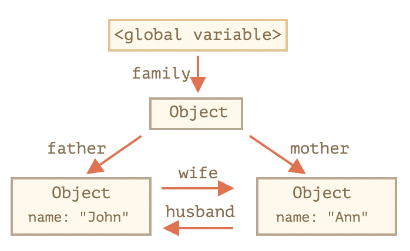
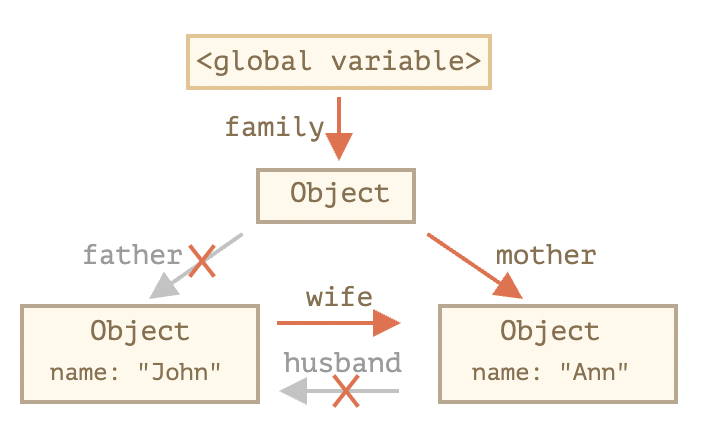
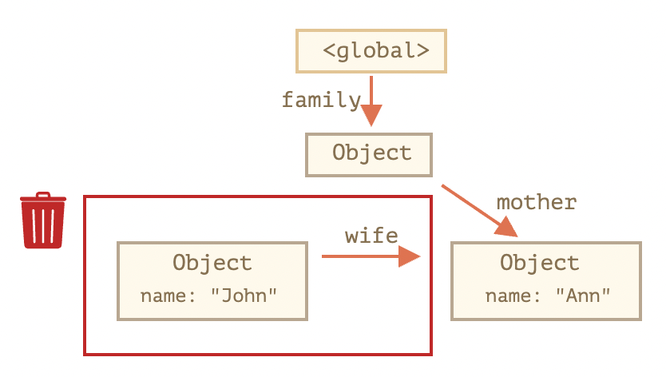
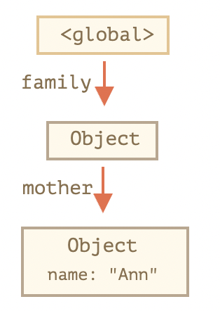
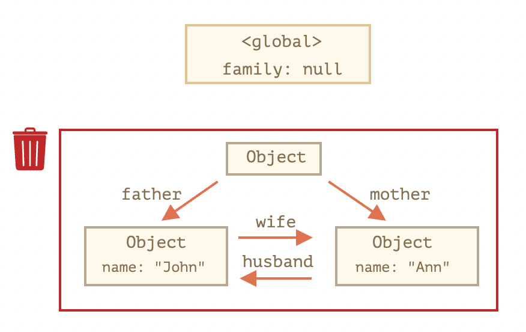
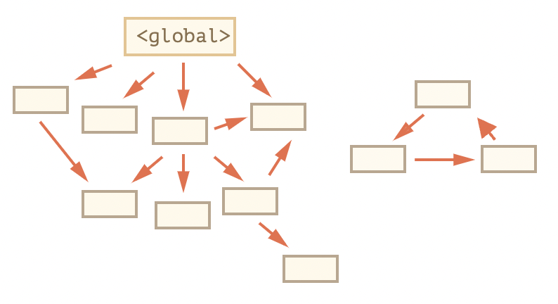
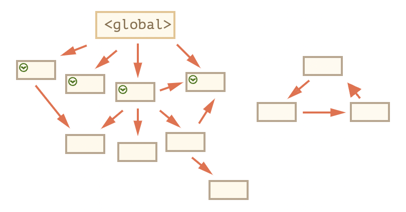
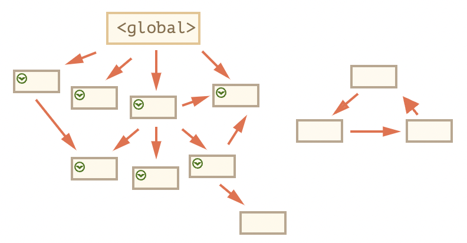
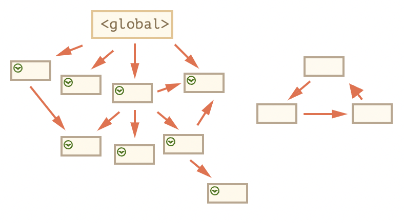
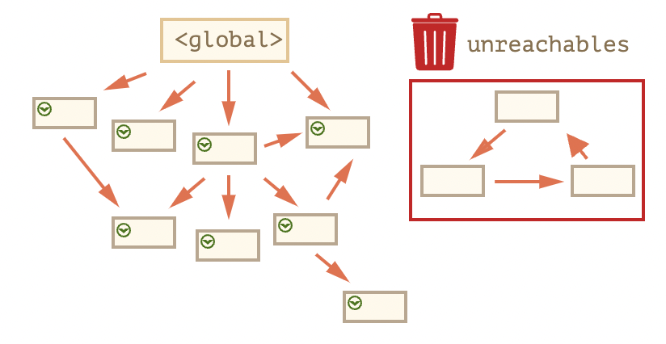

# [모던 JavaScript 튜토리얼 - 코어 자바스크립트] 4. 객체: 기본

> https://ko.javascript.info/object-basics


## 4.1 객체

**도입**

- [자료형](https://ko.javascript.info/types) 챕터에서 배웠듯이 자바스크립트엔 여덟 가지 자료형이 있습니다. 

  - 이 중 일곱 개는 오직 하나의 데이터(문자열, 숫자 등)만 담을 수 있어 **'원시형(primitive type)'**이라 부릅니다.
  - 그런데 **객체형**은 원시형과 달리 다양한 데이터를 담을 수 있습니다. 
    - 키로 구분된 데이터 집합이나 복잡한 개체(entity)를 저장할 수 있죠. 

- 객체는 자바스크립트 거의 모든 면에 녹아있는 개념이므로 자바스크립트를 잘 다루려면 객체를 잘 이해하고 있어야 합니다.

- 객체는 중괄호 `{…}`를 이용해 만들 수 있습니다. 

  - 중괄호 안에는 ‘키(key): 값(value)’ 쌍으로 구성된 *프로퍼티(property)* 를 여러 개 넣을 수 있는데,
  - `키`엔 문자형, `값`엔 모든 자료형이 허용됩니다. 
  - 프로퍼티 키는 ‘프로퍼티 이름’ 이라고도 부릅니다.

- 빈 객체(빈 서랍장)를 만드는 방법은 두 가지가 있습니다.

  ```js
  let user = new Object(); // '객체 생성자' 문법
  let user = {};  // '객체 리터럴' 문법
  ```

  - 중괄호 `{...}`를 이용해 객체를 선언하는 것을 ***객체 리터럴(object literal)*** 이라고 부릅니다. 객체를 선언할 땐 주로 이 방법을 사용합니다.


### 리터럴과 프로퍼티

- 중괄호 `{...}` 안에는 ‘키: 값’ 쌍으로 구성된 프로퍼티가 들어갑니다.

  ```js
  let user = {     // 객체
    name: "John",  // 키: "name",  값: "John"
    age: 30        // 키: "age", 값: 30
  };
  ```

  - `'콜론(:)'`을 기준으로 왼쪽엔 키가, 오른쪽엔 값이 위치합니다. 
  - 프로퍼티 키는 프로퍼티 ‘이름’ 혹은 '식별자’라고도 부릅니다.

- 개발자는 프로퍼티를 추가, 삭제할 수 있습니다. 

  - 프로퍼티 값엔 모든 자료형이 올 수 있습니다. 불린형 프로퍼티를 추가해봅시다.

    ```js
    user.isAdmin = true;
    ```

  - `delete` 연산자를 사용하면 프로퍼티를 삭제할 수 있습니다.

    ```js
    delete user.age;
    ```

- 점 표기법(dot notation)을 이용하면 프로퍼티 값을 읽는 것도 가능합니다.

  ```js
  // 프로퍼티 값 얻기
  alert( user.name ); // John
  alert( user.age ); // 30
  ```

- 여러 단어를 조합해 프로퍼티 이름을 만든 경우엔 프로퍼티 이름을 따옴표로 묶어줘야 합니다.

  ```js
  let user = {
    name: "John",
    age: 30,
    "likes birds": true  // 복수의 단어는 따옴표로 묶어야 합니다.
  };
  ```

- 마지막 프로퍼티 끝은 쉼표로 끝날 수 있습니다.

  ```js
  let user = {
    name: "John",
    age: 30,
  }
  ```

  - 이런 쉼표를 ‘trailing(길게 늘어지는)’ 혹은 ‘hanging(매달리는)’ 쉼표라고 부릅니다. 
  - 이렇게 끝에 쉼표를 붙이면 모든 프로퍼티가 유사한 형태를 보이기 때문에 프로퍼티를 추가, 삭제, 이동하는 게 쉬워집니다.

> **[주의] 상수 객체는 수정될 수 있습니다.**
>
> - 주의하세요. `const`로 선언된 객체는 수정될 수 있습니다.
>
> - 예시
>
>   ```js
>   const user = {
>     name: "John"
>   };
>   
>   user.name = "Pete"; // (*)
>   
>   alert(user.name); // Pete
>   ```
>
>   - `(*)`로 표시한 줄에서 오류를 일으키는 것처럼 보일 수 있지만 그렇지 않습니다. 
>
>     `const`는 `user`의 값을 고정하지만, 그 내용은 고정하지 않습니다.
>
>   - `const`는 `user=...`를 전체적으로 설정하려고 할 때만 오류가 발생합니다.
>
> - 상수 객체 프로퍼티를 만드는 또 다른 방법이 있습니다. 이후에 [프로퍼티 플래그와 설명자](https://ko.javascript.info/property-descriptors) 챕터에서 다루겠습니다.


### 대괄호 표기법

- 여러 단어를 조합해 프로퍼티 키를 만든 경우엔, 점 표기법을 사용해 프로퍼티 값을 읽을 수 없습니다.

  ```js
  // 문법 에러가 발생합니다.
  user.likes birds = true
  ```

  - 자바스크립트는 위와 같은 코드를 이해하지 못합니다. `user.likes`까지는 이해하다가 예상치 못한 `birds`를 만나면 문법 에러를 뱉어냅니다.
  - '점’은 키가 '유효한 변수 식별자’인 경우에만 사용할 수 있습니다. 
    - 유효한 변수 식별자엔 공백이 없어야 합니다. 
    - 또한 숫자로 시작하지 않아야 하며 
    - `$`와 `_`를 제외한 특수 문자가 없어야 합니다.

- 키가 유효한 변수 식별자가 아닌 경우엔 

  점 표기법 대신에 **'대괄호 표기법(square bracket notation)'**이라 불리는 방법을 사용할 수 있습니다. 

- 대괄호 표기법은 키에 어떤 문자열이 있던지 상관없이 동작합니다.

  ```js
  let user = {};
  
  // set
  user["likes birds"] = true;
  
  // get
  alert(user["likes birds"]); // true
  
  // delete
  delete user["likes birds"];
  ```

  - 이제 문법 에러가 발생하지 않네요. 
  - 대괄호 표기법 안에서 문자열을 사용할 땐 문자열을 따옴표로 묶어줘야 한다는 점에 주의하시기 바랍니다. 따옴표의 종류는 상관없습니다.

- 대괄호 표기법을 사용하면 아래 예시에서 변수를 키로 사용한 것과 같이 문자열뿐만 아니라 **<u>모든 표현식의 평가 결과를 프로퍼티 키로 사용할 수 있습니다.</u>**

  ```js
  let key = "likes birds";
  
  // user["likes birds"] = true; 와 같습니다.
  user[key] = true;
  ```

  - 변수 `key`는 런타임에 평가되기 때문에 사용자 입력값 변경 등에 따라 값이 변경될 수 있습니다. 

  - 어떤 경우든, 평가가 끝난 이후의 결과가 프로퍼티 키로 사용됩니다. 이를 응용하면 코드를 유연하게 작성할 수 있습니다.

  - 예시

    ```js
    let user = {
      name: "John",
      age: 30
    };
    
    let key = prompt("사용자의 어떤 정보를 얻고 싶으신가요?", "name");
    
    // 변수로 접근
    alert( user[key] ); // John (프롬프트 창에 "name"을 입력한 경우)
    ```

    그런데 점 표기법은 이런 방식이 불가능합니다.

    ```js
    let user = {
      name: "John",
      age: 30
    };
    
    let key = "name";
    alert( user.key ) // undefined
    ```


### 계산된 프로퍼티

- 객체를 만들 때 <u>객체 리터럴 안의 프로퍼티 키가 대괄호로 둘러싸여 있는 경우</u>, 이를 ***계산된 프로퍼티(computed property)*** 라고 부릅니다.

- 예시

  ```js
  let fruit = prompt("어떤 과일을 구매하시겠습니까?", "apple");
  
  let bag = {
    [fruit]: 5, // 변수 fruit에서 프로퍼티 이름을 동적으로 받아 옵니다.
  };
  
  alert( bag.apple ); // fruit에 "apple"이 할당되었다면, 5가 출력됩니다.
  ```

  - 위 예시에서 `[fruit]`는 프로퍼티 이름을 변수 `fruit`에서 가져오겠다는 것을 의미합니다.
  - 사용자가 프롬프트 대화상자에 `apple`을 입력했다면 `bag`엔 `{apple: 5}`가 할당되었을 겁니다.

- 아래 예시는 위 예시와 동일하게 동작합니다.

  ```js
  let fruit = prompt("어떤 과일을 구매하시겠습니까?", "apple");
  let bag = {};
  
  // 변수 fruit을 사용해 프로퍼티 이름을 만들었습니다.
  bag[fruit] = 5;
  ```

- 한편, 다음 예시처럼 대괄호 안에는 복잡한 표현식이 올 수도 있습니다.

  ```js
  let fruit = 'apple';
  let bag = {
    [fruit + 'Computers']: 5 // bag.appleComputers = 5
  };
  ```

  

- 대괄호 표기법은 프로퍼티 이름과 값의 제약을 없애주기 때문에 점 표기법보다 훨씬 강력합니다. 
  - 그런데 작성하기 번거롭다는 단점이 있습니다.
  - 이런 이유로 프로퍼티 이름이 확정된 상황이고, 단순한 이름이라면 처음엔 점 표기법을 사용하다가 뭔가 복잡한 상황이 발생했을 때 대괄호 표기법으로 바꾸는 경우가 많습니다.


### 단축 프로퍼티

- 실무에선 프로퍼티 값을 기존 변수에서 받아와 사용하는 경우가 종종 있습니다.

  ```js
  function makeUser(name, age) {
    return {
      name: name,
      age: age,
      // ...등등
    };
  }
  
  let user = makeUser("John", 30);
  alert(user.name); // John
  ```

  - 위 예시의 프로퍼티들은 이름과 값이 변수의 이름과 동일하네요. 

  - 이렇게 변수를 사용해 프로퍼티를 만드는 경우는 아주 흔한데, ***프로퍼티 값 단축 구문(property value shorthand)*** 을 사용하면 코드를 짧게 줄일 수 있습니다.

  - `name:name` 대신 `name`만 적어주어도 프로퍼티를 설정할 수 있죠.

    ```js
    function makeUser(name, age) {
      return {
        name, // name: name 과 같음
        age,  // age: age 와 같음
        // ...
      };
    }
    ```

- 한 객체에서 일반 프로퍼티와 단축 프로퍼티를 함께 사용하는 것도 가능합니다.

  ```js
  let user = {
    name,  // name: name 과 같음
    age: 30
  };
  ```


### 프로퍼티 이름의 제약 사항

- 아시다시피 변수 이름(키)엔 ‘for’, ‘let’, ‘return’ 같은 예약어를 사용하면 안됩니다.

  - 그런데 <u>객체 프로퍼티엔 이런 제약이 없습니다.</u>

    ```js
    // 예약어를 키로 사용해도 괜찮습니다.
    let obj = {
      for: 1,
      let: 2,
      return: 3
    };
    
    alert( obj.for + obj.let + obj.return );  // 6
    ```

- 이와 같이 프로퍼티 이름엔 특별한 제약이 없습니다. 

  - 어떤 문자형, 심볼형 값도 프로퍼티 키가 될 수 있죠(식별자로 쓰이는 심볼형에 대해선 뒤에서 다룰 예정입니다).

  - 문자형이나 심볼형에 속하지 않은 값은 문자열로 자동 형 변환됩니다.

  - 예시를 살펴봅시다. 키에 숫자 `0`을 넣으면 문자열 `"0"`으로 자동변환됩니다.

    ```js
    let obj = {
      0: "test" // "0": "test"와 동일합니다.
    };
    
    // 숫자 0은 문자열 "0"으로 변환되기 때문에 두 얼럿 창은 같은 프로퍼티에 접근합니다,
    alert( obj["0"] ); // test
    alert( obj[0] ); // test (동일한 프로퍼티)
    ```

- 이와 같이 객체 프로퍼티 키에 쓸 수 있는 문자열엔 제약이 없지만, 역사적인 이유 때문에 특별 대우를 받는 이름이 하나 있습니다. 바로, `__proto__`입니다.

  ```js
  let obj = {};
  obj.__proto__ = 5; // 숫자를 할당합니다.
  alert(obj.__proto__); // [object Object] - 숫자를 할당했지만 값은 객체가 되었습니다. 의도한대로 동작하지 않네요.
  ```

  - 원시값 `5`를 할당했는데 무시된 것을 확인할 수 있습니다.
  - `__proto__`의 본질은 [프로토타입 상속](https://ko.javascript.info/prototype-inheritance)에서, 이 문제를 어떻게 해결할 수 있을지에 대해선 [프로토타입 메서드와 __proto__가 없는 객체](https://ko.javascript.info/prototype-methods)에서 자세히 다룰 예정입니다.


### 'in' 연산자로 프로퍼티 존재 여부 확인하기

- 자바스크립트 객체의 중요한 특징 중 하나는 다른 언어와는 달리, 존재하지 않는 프로퍼티에 접근하려 해도 에러가 발생하지 않고 `undefined`를 반환한다는 것입니다.

  - 이런 특징을 응용하면 프로퍼티 존재 여부를 쉽게 확인할 수 있습니다.

  ```js
  let user = {};
  
  alert( user.noSuchProperty === undefined ); // true는 '프로퍼티가 존재하지 않음'을 의미합니다.
  ```

- 이렇게 `undefined`와 비교하는 것 이외에도 연산자 `in`을 사용하면 프로퍼티 존재 여부를 확인할 수 있습니다.

  - 문법은 다음과 같습니다.

    ```js
    "key" in object
    ```

  - 예시

    ```js
    let user = { name: "John", age: 30 };
    
    alert( "age" in user ); // user.age가 존재하므로 true가 출력됩니다.
    alert( "blabla" in user ); // user.blabla는 존재하지 않기 때문에 false가 출력됩니다.
    ```

    - `in` 왼쪽엔 반드시 *프로퍼티 이름*이 와야 합니다. 

      - 프로퍼티 이름은 보통 따옴표로 감싼 문자열입니다.

    - 따옴표를 생략하면 아래 예시와 같이 엉뚱한 변수가 조사 대상이 됩니다.

      ```js
      let user = { age: 30 };
      
      let key = "age";
      alert( key in user ); // true, 변수 key에 저장된 값("age")을 사용해 프로퍼티 존재 여부를 확인합니다.
      ```

- 그런데 이쯤 되면 "`undefined`랑 비교해도 충분한데 왜 `in` 연산자가 있는 거지?"라는 의문이 들 수 있습니다.

  - 대부분의 경우, 일치 연산자를 사용해서 프로퍼티 존재 여부를 알아내는 방법(`"=== undefined"`)은 꽤 잘 동작합니다. 

  - **<u>그런데 가끔은 이 방법이 실패할 때도 있습니다.</u>** 

    - 이럴 때 `in`을 사용하면 프로퍼티 존재 여부를 제대로 판별할 수 있습니다.

  - 프로퍼티는 존재하는데, 값에 `undefined`를 할당한 예시를 살펴봅시다.

    ```js
    let obj = {
      test: undefined
    };
    
    alert( obj.test ); // 값이 `undefined`이므로, 얼럿 창엔 undefined가 출력됩니다. 그런데 프로퍼티 test는 존재합니다.
    
    alert( "test" in obj ); // `in`을 사용하면 프로퍼티 유무를 제대로 확인할 수 있습니다(true가 출력됨).
    ```

    - `obj.test`는 실제 존재하는 프로퍼티입니다. 따라서 `in` 연산자는 정상적으로 true를 반환합니다.
    - `undefined`는 변수는 정의되어 있으나 값이 할당되지 않은 경우에 쓰기 때문에 프로퍼티 값이 `undefined`인 경우는 흔치 않습니다. 
    - 값을 ‘알 수 없거나(unknown)’ 값이 ‘비어 있다는(empty)’ 것을 나타낼 때는 주로 `null`을 사용합니다. 위 예시에서 `in` 연산자는 자리에 어울리지 않는 초대손님처럼 보이네요.


### 'for...in' 반복문

- `for..in` 반복문을 사용하면 객체의 모든 키를 순회할 수 있습니다. 

  - `for..in`은 앞서 학습했던 `for(;;)` 반복문과는 완전히 다릅니다.

- 문법

  ```js
  for (key in object) {
    // 각 프로퍼티 키(key)를 이용하여 본문(body)을 실행합니다.
  }
  ```

  아래 예시를 실행하면 객체 `user`의 모든 프로퍼티가 출력됩니다.

  ```js
  let user = {
    name: "John",
    age: 30,
    isAdmin: true
  };
  
  for (let key in user) {
    // 키
    alert( key );  // name, age, isAdmin
    // 키에 해당하는 값
    alert( user[key] ); // John, 30, true
  }
  ```

  - `for..in` 반복문에서도 `for(;;)`문처럼 반복 변수(looping variable)를 선언(`let key`)했다는 점에 주목해 주시기 바랍니다.
  - 반복 변수명은 자유롭게 정할 수 있습니다. `'for (let prop in obj)'`같이 `key` 말고 다른 변수명을 사용해도 괜찮습니다.


### 객체 정렬 방식

- 객체와 객체 프로퍼티를 다루다 보면 "프로퍼티엔 순서가 있을까?"라는 의문이 생기기 마련입니다.

- 반복문은 프로퍼티를 추가한 순서대로 실행될지, 그리고 이 순서는 항상 동일할지 궁금해지죠.

  - 답은 간단합니다. **<u>객체는 '특별한 방식으로 정렬’됩니다.</u>** 
  - **<u>정수 프로퍼티(integer property)는 자동으로 정렬되고, 그 외의 프로퍼티는 객체에 추가한 순서 그대로 정렬됩니다.</u>** 

- 자세한 내용은 예제를 통해 살펴봅시다.

  ```js
  let codes = {
    "49": "독일",
    "41": "스위스",
    "44": "영국",
    // ..,
    "1": "미국"
  };
  
  for (let code in codes) {
    alert(code); // 1, 41, 44, 49
  }
  ```

  - 현재 개발 중인 애플리케이션의 주 사용자가 독일인이라고 가정해 봅시다. 
    - 나라 번호를 선택하는 화면에서 `49`가 맨 앞에 오도록 하는 게 좋을 겁니다.
  - 그런데 코드를 실행해 보면 예상과는 전혀 다른 결과가 출력됩니다.
    - 미국(1)이 첫 번째로 출력됩니다.
    - 그 뒤로 스위스(41), 영국(44), 독일(49)이 차례대로 출력됩니다.
  - 이유는 나라 번호(키)가 정수이어서 `1, 41, 44, 49` 순으로 프로퍼티가 자동 정렬되었기 때문입니다.


> **정수 프로퍼티? 그게 뭔가요?**
>
> - **정수 프로퍼티**
>   - 변형 없이 **<u>정수에서 왔다 갔다 할 수 있는 문자열</u>**을 의미합니다.
>   - 문자열 "49"는 정수로 변환하거나 변환한 정수를 다시 문자열로 바꿔도 변형이 없기 때문에 정수 프로퍼티입니다. 
>   - 하지만 '+49’와 '1.2’는 정수 프로퍼티가 아닙니다.
>
> ```javascript
> // 함수 Math.trunc는 소수점 아래를 버리고 숫자의 정수부만 반환합니다.
> alert( String(Math.trunc(Number("49"))) ); // '49'가 출력됩니다. 기존에 입력한 값과 같으므로 정수 프로퍼티입니다.
> alert( String(Math.trunc(Number("+49"))) ); // '49'가 출력됩니다. 기존에 입력한 값(+49)과 다르므로 정수 프로퍼티가 아닙니다.
> alert( String(Math.trunc(Number("1.2"))) ); // '1'이 출력됩니다. 기존에 입력한 값(1.2)과 다르므로 정수 프로퍼티가 아닙니다.
> ```


- 한편, 키가 정수가 아닌 경우엔 작성된 순서대로 프로퍼티가 나열됩니다. 예시를 살펴봅시다.

  ```js
  let user = {
    name: "John",
    surname: "Smith"
  };
  user.age = 25; // 프로퍼티를 하나 추가합니다.
  
  // 정수 프로퍼티가 아닌 프로퍼티는 추가된 순서대로 나열됩니다.
  for (let prop in user) {
    alert( prop ); // name, surname, age
  }
  ```

- 위 예시에서 49(독일 나라 번호)를 가장 위에 출력되도록 하려면 나라 번호가 정수로 취급되지 않도록 속임수를 쓰면 됩니다. 

  - 각 나라 번호 앞에 `"+"`를 붙여봅시다.

  ```js
  let codes = {
    "+49": "독일",
    "+41": "스위스",
    "+44": "영국",
    // ..,
    "+1": "미국"
  };
  
  for (let code in codes) {
    alert( +code ); // 49, 41, 44, 1
  }
  ```

  

### 요약

객체는 몇 가지 특수한 기능을 가진 연관 배열(associative array)입니다.

객체는 프로퍼티(키-값 쌍)를 저장합니다.

- 프로퍼티 키는 문자열이나 심볼이어야 합니다. 보통은 문자열입니다.
- 값은 어떤 자료형도 가능합니다.

아래와 같은 방법을 사용하면 프로퍼티에 접근할 수 있습니다.

- 점 표기법: `obj.property`
- 대괄호 표기법 `obj["property"]`. 대괄호 표기법을 사용하면 `obj[varWithKey]`같이 변수에서 키를 가져올 수 있습니다.

객체엔 다음과 같은 추가 연산자를 사용할 수 있습니다.

- 프로퍼티를 삭제하고 싶을 때: `delete obj.prop`
- 해당 key를 가진 프로퍼티가 객체 내에 있는지 확인하고자 할 때: `"key" in obj`
- 프로퍼티를 나열할 때: `for (let key in obj)`

지금까진 '순수 객체(plain object)'라 불리는 일반 `객체`에 대해 학습했습니다.

자바스크립트에는 일반 객체 이외에도 다양한 종류의 객체가 있습니다.

- `Array` – 정렬된 데이터 컬렉션을 저장할 때 쓰임
- `Date` – 날짜와 시간 정보를 저장할 때 쓰임
- `Error` – 에러 정보를 저장할 때 쓰임
- 기타 등등

객체마다 고유의 기능을 제공하는데, 이에 대해선 추후 학습하겠습니다. 사람들은 종종 'Array 타입’이나 'Date 타입’이라는 용어를 쓰곤 합니다. 사실 Array와 Date는 독립적인 자료형이 아니라 '객체’형에 속합니다. 객체에 다양한 기능을 넣어 확장한 또 다른 객체이죠.

객체는 다재다능한 자료구조로 자바스크립트에서 그 영향력이 막강합니다. 지금까진 객체라는 거대한 주제의 극히 일부만 다루었습니다. 튜토리얼 뒤쪽에서 객체에 대한 더 상세한 내용을 다루도록 하겠습니다.


## 4.2 참조에 의한 객체 복사

> https://ko.javascript.info/object-copy


**도입**

- 객체와 원시 타입의 근본적인 차이 중 하나는 객체는 ‘참조에 의해(by reference)’ 저장되고 복사된다는 것입니다.

- 원시값(문자열, 숫자, 불린 값)은 ‘값 그대로’ 저장·할당되고 복사되는 반면에 말이죠.

- 예시

  ```js
  let message = "Hello!";
  let phrase = message;
  ```

  - 예시를 실행하면 두 개의 독립된 변수에 각각 문자열 `"Hello!"`가 저장됩니다.
  - JS에서는 문자열이 primitive 타입임!!!

- 그런데 객체의 동작방식은 이와 다릅니다.

  - **변수엔 객체가 그대로 저장되는 것이 아니라, 객체가 저장되어있는 '메모리 주소’인 객체에 대한 '참조 값’이 저장됩니다.**

    ```js
    let user = {
      name: "John"
    };
    ```

    - 객체는 메모리 내 어딘가에 저장되고, 변수 `user`엔 객체를 '참조’할 수 있는 값이 저장됩니다.

- 따라서 **객체가 할당된 변수를 복사할 땐 객체의 참조 값이 복사되고 객체는 복사되지 않습니다.**

  ```js
  let user = { name: "John" };
  let admin = user; // 참조값을 복사함
  ```

  - 변수는 두 개이지만 각 변수엔 동일 객체에 대한 참조 값이 저장되죠.
  - 따라서 객체에 접근하거나 객체를 조작할 땐 여러 변수를 사용할 수 있습니다.

  ```js
  let user = { name: 'John' };
  let admin = user;
  admin.name = 'Pete'; // 'admin' 참조 값에 의해 변경됨
  alert(user.name); // 'Pete'가 출력됨. 'user' 참조 값을 이용해 변경사항을 확인함
  ```


### 참조에 의한 비교

- 객체 비교 시 동등 연산자 `==`와 일치 연산자 `===`는 동일하게 동작합니다.

- **비교 시 피연산자인 두 객체가 동일한 객체인 경우에 참을 반환하죠.**

  - 두 변수가 같은 객체를 참조하는 예시를 살펴봅시다. 일치·동등 비교 모두에서 참이 반환됩니다.

    ```js
    let a = {};
    let b = a; // 참조에 의한 복사
    
    alert( a == b ); // true, 두 변수는 같은 객체를 참조합니다.
    alert( a === b ); // true
    ```

  - 다른 예시를 살펴봅시다. 두 객체 모두 비어있다는 점에서 같아 보이지만, 독립된 객체이기 때문에 일치·동등 비교하면 거짓이 반환됩니다.

    ```js
    let a = {};
    let b = {}; // 독립된 두 객체
    
    alert( a == b ); // false
    ```

- `obj1 > obj2` 같은 대소 비교나 `obj == 5` 같은 원시값과의 비교에선 <u>객체가 원시형으로 변환됩니다.</u> 

  - 객체가 어떻게 원시형으로 변하는지에 대해선 곧 학습할 예정인데, 이러한 비교(객체끼리의 대소 비교나 원시값과 객체를 비교하는 것)가 필요한 경우는 매우 드물긴 합니다.
  - 대개 코딩 실수 때문에 이런 비교가 발생합니다.


### 객체 복사, 병합과 Object.assign

- 객체가 할당된 변수를 복사하면 동일한 객체에 대한 참조 값이 하나 더 만들어진다는 걸 배웠습니다.

- 그런데 객체를 복제하고 싶다면 어떻게 해야 할까요? 

  - 기존에 있던 객체와 똑같으면서 독립적인 객체를 만들고 싶다면 말이죠.

- 방법은 있는데 자바스크립트는 객체 복제 내장 메서드를 지원하지 않기 때문에 조금 어렵습니다. 

  - 사실 객체를 복제해야 할 일은 거의 없습니다. 참조에 의한 복사로 해결 가능한 일이 대다수이죠.

- 정말 복제가 필요한 상황이라면 새로운 객체를 만든 다음 기존 객체의 프로퍼티들을 순회해 원시 수준까지 프로퍼티를 복사하면 됩니다.

  - 아래와 같이 말이죠.

    ```js
    let user = {
      name: "John",
      age: 30
    };
    
    let clone = {}; // 새로운 빈 객체
    
    // 빈 객체에 user 프로퍼티 전부를 복사해 넣습니다.
    for (let key in user) {
      clone[key] = user[key];
    }
    
    // 이제 clone은 완전히 독립적인 복제본이 되었습니다.
    clone.name = "Pete"; // clone의 데이터를 변경합니다.
    
    alert( user.name ); // 기존 객체에는 여전히 John이 있습니다.
    ```

- [Object.assign](https://developer.mozilla.org/ko/docs/Web/JavaScript/Reference/Global_Objects/Object/assign)를 사용하는 방법도 있습니다.

  - 문법과 동작방식은 다음과 같습니다.

    ```js
    Object.assign(dest, [src1, src2, src3...])
    ```

    - 
      첫 번째 인수 `dest`는 목표로 하는 객체입니다.
    - 이어지는 인수 `src1, ..., srcN`는 복사하고자 하는 객체입니다. `...`은 필요에 따라 얼마든지 많은 객체를 인수로 사용할 수 있다는 것을 나타냅니다.
    - 객체 `src1, ..., srcN`의 프로퍼티를 `dest`에 복사합니다. `dest`를 제외한 인수(객체)의 프로퍼티 전부가 첫 번째 인수(객체)로 복사됩니다.
    - 마지막으로 `dest`를 반환합니다.

  - `assign` 메서드를 사용해 여러 객체를 하나로 병합하는 예시를 살펴봅시다.

    ```js
    let user = { name: "John" };
    
    let permissions1 = { canView: true };
    let permissions2 = { canEdit: true };
    
    // permissions1과 permissions2의 프로퍼티를 user로 복사합니다.
    Object.assign(user, permissions1, permissions2);
    
    // now user = { name: "John", canView: true, canEdit: true }
    ```

    목표 객체(`user`)에 동일한 이름을 가진 프로퍼티가 있는 경우엔 기존 값이 덮어씌워 집니다.

    ```js
    let user = { name: "John" };
    Object.assign(user, { name: "Pete" });
    alert(user.name); // user = { name: "Pete" }
    ```

    `Object.assign`을 사용하면 반복문 없이도 간단하게 객체를 복사할 수 있습니다.

    ```js
    let user = {
      name: "John",
      age: 30
    };
    
    let clone = Object.assign({}, user);
    ```

    - 예시를 실행하면 `user`에 있는 모든 프로퍼티가 빈 배열에 복사되고 변수에 할당됩니다.


### 중첩 객체 복사

- 지금까진 `user`의 모든 프로퍼티가 원시값인 경우만 가정했습니다. 

  - 그런데 프로퍼티는 다른 객체에 대한 참조 값일 수도 있습니다. 

  - 이 경우는 어떻게 해야 할까요?

  - 아래와 같이 말이죠.

    ```js
    let user = {
      name: "John",
      sizes: {
        height: 182,
        width: 50
      }
    };
    
    alert( user.sizes.height ); // 182
    ```

- `clone.sizes = user.sizes`로 프로퍼티를 복사하는 것만으론 객체를 복제할 수 없습니다.

  `user.sizes`는 객체이기 때문에 참조 값이 복사되기 때문입니다. 

  `clone.sizes = user.sizes`로 프로퍼티를 복사하면 `clone`과 `user`는 같은 sizes를 공유하게 됩니다.

- 이 문제를 해결하려면 `user[key]`의 각 값을 검사하면서, 그 값이 객체인 경우 객체의 구조도 복사해주는 반복문을 사용해야 합니다. 

  - 이런 방식을 '깊은 복사(deep cloning)'라고 합니다.

- 자바스크립트 라이브러리 [lodash](https://lodash.com/)의 메서드인 [_.cloneDeep(obj)](https://lodash.com/docs#cloneDeep)을 사용하면 이 알고리즘을 직접 구현하지 않고도 깊은 복사를 처리할 수 있으므로 참고하시기 바랍니다.


### 요약

- 객체는 참조에 의해 할당되고 복사됩니다. 
- 변수엔 ‘객체’ 자체가 아닌 메모리상의 주소인 '참조’가 저장됩니다. 
- 따라서 객체가 할당된 변수를 복사하거나 함수의 인자로 넘길 땐 객체가 아닌 객체의 참조가 복사됩니다.
- 그리고 복사된 참조를 이용한 모든 작업(프로퍼티 추가·삭제 등)은 동일한 객체를 대상으로 이뤄집니다.

- 객체의 '진짜 복사본’을 만들려면 '얕은 복사(shallow copy)'를 가능하게 해주는 `Object.assign`이나 '깊은 복사’를 가능하게 해주는 [_.cloneDeep(obj)](https://lodash.com/docs#cloneDeep)를 사용하면 됩니다. 
  - 이때 얕은 복사본은 중첩 객체를 처리하지 못한다는 점을 기억해 두시기 바랍니다.


## 4.3 가비지 컬렉션

> https://ko.javascript.info/garbage-collection


**도입**

- 자바스크립트는 눈에 보이지 않는 곳에서 메모리 관리를 수행합니다.
- 원시값, 객체, 함수 등 우리가 만드는 모든 것은 메모리를 차지합니다. 
  - 그렇다면 더는 쓸모 없어지게 된 것들은 어떻게 처리될까요? 
  - 지금부턴 <u>자바스크립트 엔진이 어떻게 필요 없는 것을 찾아내 삭제하는지</u> 알아보겠습니다.


### 가비지 컬렉션 기준

- 자바스크립트는 *도달 가능성(reachability)* 이라는 개념을 사용해 메모리 관리를 수행합니다.

- **‘도달 가능한(reachable)’ 값**은 쉽게 말해 <u>어떻게든 접근하거나 사용할 수 있는 값</u>을 의미합니다. 

  - 도달 가능한 값은 메모리에서 삭제되지 않습니다.

    

  1. 아래 소개해 드릴 값들은 그 태생부터 도달 가능하기 때문에, 명백한 이유 없이는 삭제되지 않습니다.

     - 현재 함수의 지역 변수와 매개변수
     - 중첩 함수의 체인에 있는 함수에서 사용되는 변수와 매개변수
     - 전역 변수
     - 기타 등등

     이런 값들은 <u>루트(root)</u>라고 부릅니다.

     

  2. 루트가 참조하는 값이나 체이닝으로 루트에서 참조할 수 있는 값은 도달 가능한 값이 됩니다.

     - 전역 변수에 객체가 저장되어있다고 가정해 봅시다. 
     - 이 객체의 프로퍼티가 또 다른 객체를 참조하고 있다면, 프로퍼티가 참조하는 객체는 도달 가능한 값이 됩니다. 
     - 이 객체가 참조하는 다른 모든 것들도 도달 가능하다고 여겨집니다. 
     - 자세한 예시는 아래에서 살펴보겠습니다.


- 자바스크립트 엔진 내에선 [가비지 컬렉터(garbage collector)](https://en.wikipedia.org/wiki/Garbage_collection_(computer_science))가 끊임없이 동작합니다. 
  - 가비지 컬렉터는 모든 객체를 모니터링하고, 도달할 수 없는 객체는 삭제합니다.


### 간단한 예시

- 예시

  ```js
  // user엔 객체 참조 값이 저장됩니다.
  let user = {
    name: "John"
  };
  ```

  - 전역 변수 `"user"`는 `{name: "John"}` (줄여서 John)이라는 객체를 참조합니다. 

    

  ```js
  user = null;
  ```

  - `user`의 값을 다른 값으로 덮어쓰면 참조(화살표)가 사라집니다.
  - 이제 John은 도달할 수 없는 상태가 되었습니다. 
    - John에 접근할 방법도, John을 참조하는 것도 모두 사라졌습니다. 
    - 가비지 컬렉터는 이제 John에 저장된 데이터를 삭제하고, John을 메모리에서 삭제합니다.


### 연결된 객체

- 이제 가족관계를 나타내는 복잡한 예시를 살펴보겠습니다.

  ```js
  function marry(man, woman) {
    woman.husband = man;
    man.wife = woman;
  
    return {
      father: man,
      mother: woman
    }
  }
  
  let family = marry({
    name: "John"
  }, {
    name: "Ann"
  });
  ```

  - 함수 `marry`(결혼하다)는 매개변수로 받은 두 객체를 서로 참조하게 하면서 '결혼’시키고, 두 객체를 포함하는 새로운 객체를 반환합니다.

  - 메모리 구조는 아래와 같이 나타낼 수 있습니다.

    

    - 지금은 모든 객체가 도달 가능한 상태입니다. 이제 참조 두 개를 지워보겠습니다.

      

  ```js
  delete family.father;
  delete family.mother.husband;
  ```

  

  - 삭제한 두 개의 참조 중 하나만 지웠다면, 모든 객체가 여전히 도달 가능한 상태였을 겁니다.

  - 하지만 참조 두 개를 지우면 John으로 들어오는 참조(화살표)는 모두 사라져 John은 도달 가능한 상태에서 벗어납니다.

    

  

  - 외부로 나가는 참조는 도달 가능한 상태에 영향을 주지 않습니다. 

  - 외부에서 들어오는 참조만이 도달 가능한 상태에 영향을 줍니다. 

  - John은 이제 도달 가능한 상태가 아니기 때문에 메모리에서 제거됩니다. 

    - John에 저장된 데이터(프로퍼티) 역시 메모리에서 사라집니다.

      

  - 가비지 컬렉션 후 메모리 구조는 아래와 같습니다.

  


### 도달할 수 없는 섬

- 객체들이 연결되어 섬 같은 구조를 만드는데, 이 섬에 도달할 방법이 없는 경우, 섬을 구성하는 객체 전부가 메모리에서 삭제됩니다.

- 근원 객체 `family`가 아무것도 참조하지 않도록 해 봅시다.

  ```js
  family = null;
  ```

- 이제 메모리 내부 상태는 다음과 같아집니다.

  

  - 도달할 수 없는 섬 예제는 도달 가능성이라는 개념이 얼마나 중요한지 보여줍니다.
  - John과 Ann은 여전히 서로를 참조하고 있고, 두 객체 모두 외부에서 들어오는 참조를 갖고 있지만, 이것만으로는 충분하지 않다는걸 보여주죠.
  - `"family"` 객체와 루트의 연결이 사라지면 루트 객체를 참조하는 것이 아무것도 없게 됩니다. 섬 전체가 도달할 수 없는 상태가 되고, 섬을 구성하는 객체 전부가 메모리에서 제거되죠.


### 내부 알고리즘

- 'mark-and-sweep’이라 불리는 가비지 컬렉션 기본 알고리즘에 대해 알아봅시다.
- '가비지 컬렉션’은 대개 다음 단계를 거쳐 수행됩니다.
  - 가비지 컬렉터는 루트(root) 정보를 수집하고 이를 ‘mark(기억)’ 합니다.
  - 루트가 참조하고 있는 모든 객체를 방문하고 이것들을 ‘mark’ 합니다.
  - mark 된 모든 객체에 방문하고 *그 객체들이* 참조하는 객체도 mark 합니다. 
    - 한번 방문한 객체는 전부 mark 하기 때문에 같은 객체를 다시 방문하는 일은 없습니다.
  - 루트에서 도달 가능한 모든 객체를 방문할 때까지 위 과정을 반복합니다.
  - mark 되지 않은 모든 객체를 메모리에서 삭제합니다.


- 다음과 같은 객체 구조가 있다고 해봅시다.

  

  - 오른편에 '도달할 수 없는 섬’이 보이네요. 

  - 이제 가비지 컬렉터의 ‘mark-and-sweep’ 알고리즘이 이것을 어떻게 처리하는지 봅시다.

  - 첫 번째 단계에선 루트를 mark 합니다.

    

  - 이후 루트가 참조하고 있는 것들을 mark 합니다.

    

  - 도달 가능한 모든 객체를 방문할 때까지, mark 한 객체가 참조하는 객체를 계속해서 mark 합니다.

    

  - 방문할 수 없었던 객체를 메모리에서 삭제합니다.

    


- 루트에서 페인트를 들이붓는다고 상상하면 이 과정을 이해하기 쉽습니다. 
  - 루트를 시작으로 참조를 따라가면서 도달가능한 객체 모두에 페인트가 칠해진다고 생각하면 됩니다. 
  - 이때 페인트가 묻지 않은 객체는 메모리에서 삭제됩니다.


- 지금까지 가비지 컬렉션이 어떻게 동작하는지에 대한 개념을 알아보았습니다. 
  - 자바스크립트 엔진은 실행에 영향을 미치지 않으면서 가비지 컬렉션을 더 빠르게 하는 다양한 최적화 기법을 적용합니다.
  - 최적화 기법:
    - **generational collection(세대별 수집)** – 객체를 '새로운 객체’와 '오래된 객체’로 나눕니다. 객체 상당수는 생성 이후 제 역할을 빠르게 수행해 금방 쓸모가 없어지는데, 이런 객체를 '새로운 객체’로 구분합니다. 가비지 컬렉터는 이런 객체를 공격적으로 메모리에서 제거합니다. 일정 시간 이상 동안 살아남은 객체는 '오래된 객체’로 분류하고, 가비지 컬렉터가 덜 감시합니다.
    - **incremental collection(점진적 수집)** – 방문해야 할 객체가 많다면 모든 객체를 한 번에 방문하고 mark 하는데 상당한 시간이 소모됩니다. 가비지 컬렉션에 많은 리소스가 사용되어 실행 속도도 눈에 띄게 느려지겠죠. 자바스크립트 엔진은 이런 현상을 개선하기 위해 가비지 컬렉션을 여러 부분으로 분리한 다음, 각 부분을 별도로 수행합니다. 작업을 분리하고, 변경 사항을 추적하는 데 추가 작업이 필요하긴 하지만, 긴 지연을 짧은 지연 여러 개로 분산시킬 수 있다는 장점이 있습니다.
    - **idle-time collection(유휴 시간 수집)** – 가비지 컬렉터는 실행에 주는 영향을 최소화하기 위해 CPU가 유휴 상태일 때에만 가비지 컬렉션을 실행합니다.


### 요약

지금까지 알아본 내용을 요약해 봅시다.

- 가비지 컬렉션은 엔진이 자동으로 수행하므로 개발자는 이를 억지로 실행하거나 막을 수 없습니다.
- 객체는 도달 가능한 상태일 때 메모리에 남습니다.
- 참조된다고 해서 도달 가능한 것은 아닙니다. 서로 연결된 객체들도 도달 불가능할 수 있습니다.

모던 자바스크립트 엔진은 좀 더 발전된 가비지 컬렉션 알고리즘을 사용합니다.

어떤 알고리즘을 사용하는지 궁금하다면 ‘The Garbage Collection Handbook: The Art of Automatic Memory Management’(저자 – R. Jones et al)를 참고하시기 바랍니다.

저수준(low-level) 프로그래밍에 익숙하다면, [A tour of V8: Garbage Collection](http://jayconrod.com/posts/55/a-tour-of-v8-garbage-collection)을 읽어보세요. V8 가비지 컬렉터에 대한 자세한 내용을 확인해 볼 수 있습니다.

[V8 공식 블로그](https://v8.dev/)에도 메모리 관리 방법 변화에 대한 내용이 올라옵니다. 가비지 컬렉션을 심도 있게 학습하려면 V8 내부구조를 공부하거나 V8 엔지니어로 일했던 [Vyacheslav Egorov](http://mrale.ph/)의 블로그를 읽는 것도 좋습니다. 여러 엔진 중 ‘V8’ 엔진을 언급하는 이유는 인터넷에서 관련 글을 쉽게 찾을 수 있기 때문입니다. V8과 타 엔진들은 동작 방법이 비슷한데, 가비지 컬렉션 동작 방식에는 많은 차이가 있습니다.

저수준 최적화가 필요한 상황이라면, 엔진에 대한 조예가 깊어야 합니다. 먼저 자바스크립트에 익숙해진 후에 엔진에 대해 학습하는 것을 추천해 드립니다.


## 4.4 메서드와 this

> https://ko.javascript.info/object-methods


**도입**

- 객체는 사용자(user), 주문(order) 등과 같이 실제 존재하는 개체(entity)를 표현하고자 할 때 생성됩니다.

  ```js
  let user = {
    name: "John",
    age: 30
  };
  ```

- 사용자는 현실에서 장바구니에서 물건 선택하기, 로그인하기, 로그아웃하기 등의 행동을 합니다. 

  - 이와 마찬가지로 사용자를 나타내는 객체 user도 특정한 *행동*을 할 수 있습니다.

- 자바스크립트에선 <u>객체의 프로퍼티에 함수를 할당해 객체에게 **행동**할 수 있는 능력을 부여</u>해줍니다.


### 메서드 만들기

- 객체 `user`에게 인사할 수 있는 능력을 부여해 줍시다.

  ```js
  let user = {
    name: "John",
    age: 30
  };
  
  user.sayHi = function() {
    alert("안녕하세요!");
  };
  
  user.sayHi(); // 안녕하세요!
  ```

  - 함수 표현식으로 함수를 만들고, 객체 프로퍼티 `user.sayHi`에 함수를 할당해 주었습니다.
  - 이제 객체에 할당된 함수를 호출하면 user가 인사를 해줍니다.
  - 이렇게 객체 프로퍼티에 할당된 함수를 ***메서드(method)*** 라고 부릅니다.
  - 위 예시에선 `user`에 할당된 `sayHi`가 메서드이죠.

- 메서드는 아래와 같이 이미 정의된 함수를 이용해서 만들 수도 있습니다.

  ```js
  let user = {
    // ...
  };
  
  // 함수 선언
  function sayHi() {
    alert("안녕하세요!");
  };
  
  // 선언된 함수를 메서드로 등록
  user.sayHi = sayHi;
  
  user.sayHi(); // 안녕하세요!
  ```

  

> **객체 지향 프로그래밍**
>
> - 객체를 사용하여 개체를 표현하는 방식을 [객체 지향 프로그래밍(object-oriented programming, OOP)](https://en.wikipedia.org/wiki/Object-oriented_programming) 이라 부릅니다.
>
> - OOP는 그 자체만으로도 학문의 분야를 만드는 중요한 주제입니다. 
> - 올바른 개체를 선택하는 방법, 개체 사이의 상호작용을 나타내는 방법 등에 관한 의사결정은 객체 지향 설계를 기반으로 이뤄집니다. 
> - 객체 지향 프로그래밍 관련 추천도서로는 에릭 감마의 ‘GoF의 디자인 패턴’, 그래디 부치의 ‘UML을 활용한 객체지향 분석 설계’ 등이 있습니다.


### 메서드 단축 구문

- 객체 리터럴 안에 메서드를 선언할 때 사용할 수 있는 단축 문법을 소개해 드리겠습니다.

  ```js
  // 아래 두 객체는 동일하게 동작합니다.
  user = {
    sayHi: function() {
      alert("Hello");
    }
  };
  
  // 단축 구문을 사용하니 더 깔끔해 보이네요.
  user = {
    sayHi() { // "sayHi: function()"과 동일합니다.
      alert("Hello");
    }
  };
  ```

  - 위처럼 `function`을 생략해도 메서드를 정의할 수 있습니다.
  - <u>일반적인 방법과 단축 구문을 사용한 방법이 완전히 동일하진 않습니다.</u> 
    - 객체 상속과 관련된 미묘한 차이가 존재하는데 지금으로선 이 차이가 중요하지 않기 때문에 넘어가도록 하겠습니다.


### 메서드와 this

- 메서드는 객체에 저장된 정보에 접근할 수 있어야 제 역할을 할 수 있습니다. 

  - 모든 메서드가 그런 건 아니지만, 대부분의 메서드가 객체 프로퍼티의 값을 활용합니다.
  - `user.sayHi()`의 내부 코드에서 객체 `user`에 저장된 이름(name)을 이용해 인사말을 만드는 경우가 이런 경우에 속합니다.

- **메서드 내부에서 `this` 키워드를 사용하면 객체에 접근할 수 있습니다.**

  - 이때 '점 앞’의 `this`는 객체를 나타냅니다. 정확히는 **<u>메서드를 호출할 때 사용된 객체를 나타내죠.</u>**

  ```js
  let user = {
    name: "John",
    age: 30,
    sayHi() {
      // 'this'는 '현재 객체'를 나타냅니다.
      alert(this.name);
    }
  };
  
  user.sayHi(); // John
  ```

  - `user.sayHi()`가 실행되는 동안에 `this`는 `user`를 나타냅니다.

- `this`를 사용하지 않고 외부 변수를 참조해 객체에 접근하는 것도 가능합니다.

  ```js
  let user = {
    name: "John",
    age: 30,
    sayHi() {
      alert(user.name); // 'this' 대신 'user'를 이용함
    }
  };
  ```

- 그런데 이렇게 외부 변수를 사용해 객체를 참조하면 예상치 못한 에러가 발생할 수 있습니다.

  - `user`를 복사해 다른 변수에 할당(`admin = user`)하고, `user`는 전혀 다른 값으로 덮어썼다고 가정해 봅시다. 
  - `sayHi()`는 원치 않는 값(null)을 참조할 겁니다.

  ```js
  let user = {
    name: "John",
    age: 30,
    sayHi() {
      alert( user.name ); // Error: Cannot read property 'name' of null
    }
  };
  
  let admin = user;
  user = null; // user를 null로 덮어씁니다.
  
  admin.sayHi(); // sayHi()가 엉뚱한 객체를 참고하면서 에러가 발생했습니다.
  ```

  - `alert` 함수가 `user.name` 대신 `this.name`을 인수로 받았다면 에러가 발생하지 않았을 겁니다.


### 자유로운 this

- 자바스크립트의 `this`는 다른 프로그래밍 언어의 `this`와 동작 방식이 다릅니다. 

  - <u>자바스크립트에선 모든 함수에 `this`를 사용할 수 있습니다.</u>

- 아래와 같이 코드를 작성해도 문법 에러가 발생하지 않습니다.

  ```js
  function sayHi() {
    alert( this.name );
  }
  ```

- `this` 값은 런타임에 결정됩니다. 컨텍스트에 따라 달라지죠.

  - 동일한 함수라도 다른 객체에서 호출했다면 'this’가 참조하는 값이 달라집니다.

  ```js
  let user = { name: "John" };
  let admin = { name: "Admin" };
  
  function sayHi() {
    alert( this.name );
  }
  
  // 별개의 객체에서 동일한 함수를 사용함
  user.f = sayHi;
  admin.f = sayHi;
  
  // 'this'는 '점(.) 앞의' 객체를 참조하기 때문에
  // this 값이 달라짐
  user.f(); // John  (this == user)
  admin.f(); // Admin  (this == admin)
  
  admin['f'](); // Admin (점과 대괄호는 동일하게 동작함)
  ```

  - 규칙은 간단합니다.
  - `obj.f()`를 호출했다면 <u>`this`는 `f`를 호출하는 동안의 `obj`입니다</u>. 
  - 위 예시에선 `obj`가 `user`나 `admin`을 참조하겠죠.

  

> **객체 없이 호출하기: `this == undefined`**
>
> - 객체가 없어도 함수를 호출할 수 있습니다.
>
> ```javascript
> function sayHi() {
>   alert(this);
> }
> 
> sayHi(); // undefined
> ```
>
> - 위와 같은 코드를 엄격 모드에서 실행하면, `this`엔 `undefined`가 할당됩니다. `this.name`으로 name에 접근하려고 하면 에러가 발생하죠.
>
> - 그런데 엄격 모드가 아닐 때는 `this`가 *전역 객체*를 참조합니다. 
>   - 브라우저 환경에선 `window`라는 전역 객체를 참조하죠. 
>   - 이런 동작 차이는 `"use strict"`가 도입된 배경이기도 합니다. 전역 객체는 [전역 객체](https://ko.javascript.info/global-object)에서 자세히 다룰 예정입니다.
>
> - 이런 식의 코드는 대개 실수로 작성된 경우가 많습니다. 
> - 함수 본문에 `this`가 사용되었다면, 객체 컨텍스트 내에서 함수를 호출할 것이라고 예상하시면 됩니다.


> **자유로운 `this`가 만드는 결과**
>
> - 다른 언어를 사용하다 자바스크립트로 넘어온 개발자는 `this`를 혼동하기 쉽습니다.
>   - `this`는 항상 메서드가 정의된 객체를 참조할 것이라고 착각하죠. 
>   - 이런 개념을 'bound `this`'라고 합니다.
> - 자바스크립트에서 `this`는 런타임에 결정됩니다. 
>   - 메서드가 어디서 정의되었는지에 상관없이 `this`는 ‘점 앞의’ 객체가 무엇인가에 따라 ‘자유롭게’ 결정됩니다.
> - 이렇게 `this`가 런타임에 결정되면 좋은 점도 있고 나쁜 점도 있습니다. 
>   - 함수(메서드)를 하나만 만들어 여러 객체에서 재사용할 수 있다는 것은 장점이지만, 이런 유연함이 실수로 이어질 수 있다는 것은 단점입니다.
> - 자바스크립트가 `this`를 다루는 방식이 좋은지, 나쁜지는 우리가 판단할 문제가 아닙니다.
>   - 개발자는 `this`의 동작 방식을 충분히 이해하고 장점을 취하면서 실수를 피하는 데만 집중하면 됩니다.


### this가 없는 화살표 함수

- 화살표 함수는 일반 함수와는 달리 ‘고유한’ `this`를 가지지 않습니다. 

- <u>화살표 함수에서 `this`를 참조하면, 화살표 함수가 아닌 ‘평범한’ 외부 함수에서 `this` 값을 가져옵니다.</u>

- 아래 예시에서 함수 `arrow()`의 `this`는 외부 함수 `user.sayHi()`의 `this`가 됩니다.

  ```js
  let user = {
    firstName: "보라",
    sayHi() {
      let arrow = () => alert(this.firstName);
      arrow();
    }
  };
  
  user.sayHi(); // 보라
  ```

  - 별개의 `this`가 만들어지는 건 원하지 않고, 외부 컨텍스트에 있는 `this`를 이용하고 싶은 경우 화살표 함수가 유용합니다. 
  - 이에 대한 자세한 내용은 별도의 챕터, [화살표 함수 다시 살펴보기](https://ko.javascript.info/arrow-functions)에서 다루겠습니다.


### 요약

- 객체 프로퍼티에 저장된 함수를 '메서드’라고 부릅니다.
- `object.doSomthing()`은 객체를 '행동’할 수 있게 해줍니다.
- 메서드는 `this`로 객체를 참조합니다.

`this` 값은 런타임에 결정됩니다.

- 함수를 선언할 때 `this`를 사용할 수 있습니다. 다만, 함수가 호출되기 전까지 `this`엔 값이 할당되지 않습니다.
- 함수를 복사해 객체 간 전달할 수 있습니다.
- 함수를 객체 프로퍼티에 저장해 `object.method()`같이 ‘메서드’ 형태로 호출하면 `this`는 `object`를 참조합니다.

화살표 함수는 자신만의 `this`를 가지지 않는다는 점에서 독특합니다. 화살표 함수 안에서 `this`를 사용하면, 외부에서 `this` 값을 가져옵니다.


## 4.5 new 연산자와 생성자 함수

> https://ko.javascript.info/constructor-new


**도입**

- 객체 리터럴 `{...}` 을 사용하면 객체를 쉽게 만들 수 있습니다. 
- 그런데 개발을 하다 보면 유사한 객체를 여러 개 만들어야 할 때가 생기곤 합니다. 
  - 복수의 사용자, 메뉴 내 다양한 아이템을 객체로 표현하려고 하는 경우가 그렇죠.
- `'new'` 연산자와 생성자 함수를 사용하면 유사한 객체 여러 개를 쉽게 만들 수 있습니다.


### 생성자 함수

- 생성자 함수(constructor function)와 일반 함수에 기술적인 차이는 없습니다. 

- 다만 생성자 함수는 아래 두 관례를 따릅니다.

  1. 함수 이름의 첫 글자는 대문자로 시작합니다.
  2. 반드시 `'new'` 연산자를 붙여 실행합니다.

- 생성자 함수 예시

  ```js
  function User(name) {
    this.name = name;
    this.isAdmin = false;
  }
  
  let user = new User("보라");
  
  alert(user.name); // 보라
  alert(user.isAdmin); // false
  ```

  - `new User(...)`를 써서 함수를 실행하면 아래와 같은 알고리즘이 동작합니다.
    1. 빈 객체를 만들어 `this`에 할당합니다.
    2. 함수 본문을 실행합니다. `this`에 새로운 프로퍼티를 추가해 `this`를 수정합니다.
    3. `this`를 반환합니다.

- 예시를 이용해 `new User(...)`가 실행되면 무슨 일이 일어나는지 살펴 보도록 하겠습니다.

  ```js
  function User(name) {
    // this = {};  (빈 객체가 암시적으로 만들어짐)
  
    // 새로운 프로퍼티를 this에 추가함
    this.name = name;
    this.isAdmin = false;
  
    // return this;  (this가 암시적으로 반환됨)
  }
  ```

- 이제 `let user = new User("보라")`는 아래 코드를 입력한 것과 동일하게 동작합니다.

  ```js
  let user = {
    name: "보라",
    isAdmin: false
  };
  ```

  - `new User("보라")`이외에도 `new User("호진")`, `new User("지민")` 등을 이용하면 손쉽게 사용자 객체를 만들 수 있습니다. 
  - 객체 리터럴 문법으로 일일이 객체를 만드는 방법보다 훨씬 간단하고 읽기 쉽게 객체를 만들 수 있게 되었죠.
  - 생성자의 의의는 바로 여기에 있습니다. 재사용할 수 있는 객체 생성 코드를 구현하는 것이죠.


- 잠깐! 모든 함수는 생성자 함수가 될 수 있다는 점을 잊지 마시기 바랍니다. 
  - `new`를 붙여 실행한다면 어떤 함수라도 위에 언급된 알고리즘이 실행됩니다. 
  - 이름의 '첫 글자가 대문자’인 함수는 `new`를 붙여 실행해야 한다는 점도 잊지 마세요. 공동의 약속이니까요.


> **new function() { … }**
>
> - 재사용할 필요가 없는 복잡한 객체를 만들어야 한다고 해봅시다. 
>   - 많은 양의 코드가 필요할 겁니다. 
>   - 이럴 땐 아래와 같이 **코드를 익명 생성자 함수로 감싸주는 방식**을 사용할 수 있습니다.
>
> ```javascript
> let user = new function() {
>   this.name = "John";
>   this.isAdmin = false;
> 
>   // 사용자 객체를 만들기 위한 여러 코드.
>   // 지역 변수, 복잡한 로직, 구문 등의
>   // 다양한 코드가 여기에 들어갑니다.
> };
> ```
>
> - 위 생성자 함수는 익명 함수이기 때문에 어디에도 저장되지 않습니다. 
> - 처음 만들 때부터 단 한 번만 호출할 목적으로 만들었기 때문에 재사용이 불가능합니다. 
> - 이렇게 **<u>익명 생성자 함수를 이용하면 재사용은 막으면서 코드를 캡슐화 할 수 있습니다.</u>**


### new.target과 생성자 함수

> **심화 학습**
>
> 이 절에서 소개할 문법은 자주 쓰이지 않습니다. 자바스크립트의 모든 문법을 학습하고 싶지 않다면 넘어가셔도 좋습니다.

- `new.target` 프로퍼티를 사용하면 함수가 `new`와 함께 호출되었는지 아닌지를 알 수 있습니다.

  - 일반적인 방법으로 함수를 호출했다면 `new.target`은 undefined를 반환합니다. 
  - 반면 `new`와 함께 호출한 경우엔 `new.target`은 함수 자체를 반환해줍니다.

  ```js
  function User() {
    alert(new.target);
  }
  
  // 'new' 없이 호출함
  User(); // undefined
  
  // 'new'를 붙여 호출함
  new User(); // function User { ... }
  ```

  - 함수 본문에서 `new.target`을 사용하면 해당 함수가 `new`와 함께 호출되었는지(in constructor mode) 아닌지(in regular mode)를 확인할 수 있습니다.
  - 이를 활용해 일반적인 방법으로 함수를 호출해도 `new`를 붙여 호출한 것과 같이 동작하도록 만들어보겠습니다.

  ```js
  function User(name) {
    if (!new.target) { // new 없이 호출해도
      return new User(name); // new를 붙여줍니다.
    }
  
    this.name = name;
  }
  
  let bora = User("보라"); // 'new User'를 쓴 것처럼 바꿔줍니다.
  alert(bora.name); // 보라
  ```

- 라이브러리를 분석하다 보면 위와 같은 방식이 쓰인 걸 발견할 때가 있을 겁니다. 
  - 이런 방식을 사용하면 `new`를 붙여 함수를 호출하든 아니든 코드가 동일하게 동작하기 때문에, 좀 더 유연하게 코드를 작성할 수 있습니다.
  - 그런데 이 방법을 믿고 객체를 만드는 경우에도 `new`를 생략하면 코드가 정확히 무슨 일을 하는지 알기 어렵습니다. 
  - `new`가 붙어있으면 새로운 객체를 만든다는 걸 누구나 알 수 있기 때문에 `new`를 생략해서 객체를 만드는것은 정말 필요한 경우에만 사용하시고 남발하지 않으시길 바랍니다.


### 생성자와 return문

- 생성자 함수엔 보통 `return` 문이 없습니다. 반환해야 할 것들은 모두 `this`에 저장되고, `this`는 자동으로 반환되기 때문에 반환문을 명시적으로 써 줄 필요가 없습니다.

- 그런데 만약 `return` 문이 있다면 어떤 일이 벌어질까요? 아래와 같은 간단한 규칙이 적용됩니다.

  - 객체를 `return` 한다면 `this` 대신 객체가 반환됩니다.
  - 원시형을 `return` 한다면 `return`문이 무시됩니다.
  - `return` 뒤에 객체가 오면 생성자 함수는 해당 객체를 반환해주고, 이 외의 경우는 `this`가 반환되죠.

- 아래 예시에선 첫 번째 규칙이 적용돼 `return`은 `this`를 무시하고 객체를 반환합니다.

  ```js
  function BigUser() {
    this.name = "원숭이";
    return { name: "고릴라" };  // <-- this가 아닌 새로운 객체를 반환함
  }
  
  alert( new BigUser().name );  // 고릴라
  ```
  
- 아무것도 `return`하지 않는 예시를 살펴봅시다. 원시형을 반환하는 경우와 마찬가지로 두 번째 규칙이 적용됩니다.

  ```js
  function SmallUser() {
  
    this.name = "원숭이";
  
    return; // <-- this를 반환함
  }
  
  alert( new SmallUser().name );  // 원숭이
  ```

- `return`문이 있는 생성자 함수는 거의 없습니다. 여기선 튜토리얼의 완성도를 위해 특이 케이스를 소개해보았습니다.


> **괄호 생략하기**
>
> - 인수가 없는 생성자 함수는 괄호를 생략해 호출할 수 있습니다.
>
> ```javascript
> let user = new User; // <-- 괄호가 없음
> // 아래 코드는 위 코드와 똑같이 동작합니다.
> let user = new User();
> ```
>
> - 명세서엔 괄호를 생략해도 된다고 정의되어 있지만, '좋은 스타일’은 아닙니다.


### 생성자 메서드

- 생성자 함수를 사용하면 매개변수를 이용해 객체 내부를 자유롭게 구성할 수 있습니다. 엄청난 유연성이 확보되죠.

- 지금까진 `this`에 프로퍼티를 더해주는 예시만 살펴봤는데, 메서드를 더해주는 것도 가능합니다.

- 아래 예시에서 `new User(name)`는 프로퍼티 `name`과 메서드 `sayHi`를 가진 객체를 만들어줍니다.

  ```js
  function User(name) {
    this.name = name;
  
    this.sayHi = function() {
      alert( "제 이름은 " + this.name + "입니다." );
    };
  }
  
  let bora = new User("이보라");
  
  bora.sayHi(); // 내 이름은 이보라입니다.
  
  /*
  bora = {
     name: "이보라",
     sayHi: function() { ... }
  }
  */
  ```

- [class](https://ko.javascript.info/classes) 문법을 사용하면 생성자 함수를 사용하는 것과 마찬가지로 복잡한 객체를 만들 수 있습니다.

- [class](https://ko.javascript.info/classes)에 대해선 추후 학습하도록 하겠습니다.


### 요약

- 생성자 함수(짧게 줄여서 생성자)는 일반 함수입니다. 다만, 일반 함수와 구분하기 위해 함수 이름 첫 글자를 대문자로 씁니다.
- 생성자 함수는 반드시 `new` 연산자와 함께 호출해야 합니다. `new`와 함께 호출하면 내부에서 `this`가 암시적으로 만들어지고, 마지막엔 `this`가 반환됩니다.

생성자 함수는 유사한 객체를 여러 개 만들 때 유용합니다.

자바스크립트는 언어 차원에서 다양한 생성자 함수를 제공합니다. 날짜를 나타내는 데 쓰이는 `Date`, 집합(set)을 나타내는 데 쓰이는 `Set` 등의 내장 객체는 이런 생성자 함수를 이용해 만들 수 있습니다. 자세한 내용은 다시 살펴보도록 하겠습니다.


> **아직 배울 게 많습니다!**
>
> - 이번 챕터에서 다룬 것은 객체와 생성자에 대한 기본에 불과합니다. 
> - 이어지는 챕터에서 다룰 자료형과 함수를 이해하는 데 꼭 필요한 내용이죠.
>
> 
>
> - 객체에 대한 학습은 아직 끝나지 않았습니다. 
> - 자료형과 함수를 학습한 이후에 다시 객체로 돌아와 [프로토타입과 프로토타입 상속](https://ko.javascript.info/prototypes), [클래스](https://ko.javascript.info/classes)등을 다루도록 하겠습니다.


## 4.6 옵셔널 체이닝 '?.'

> https://ko.javascript.info/optional-chaining


> **최근에 추가됨**
>
> 스펙에 추가된 지 얼마 안 된 문법입니다. 구식 브라우저는 폴리필이 필요합니다.


**도입**

- 옵셔널 체이닝(optional chaining) `?.`을 사용하면 프로퍼티가 없는 중첩 객체를 에러 없이 안전하게 접근할 수 있습니다.


### 옵셔널 체이닝이 필요한 이유

- 이제 막 자바스크립트를 배우기 시작했다면 옵셔널 체이닝이 등장하게 된 배경 상황을 직접 겪어보지 않았을 겁니다. 

  - 몇 가지 사례를 재현하면서 왜 옵셔널 체이닝이 등장했는지 알아봅시다.

- 사용자가 여러 명 있는데 그중 몇 명은 주소 정보를 가지고 있지 않다고 가정해봅시다. 

  - 이럴 때 `user.address.street`를 사용해 주소 정보에 접근하면 에러가 발생할 수 있습니다.

  ```js
  let user = {}; // 주소 정보가 없는 사용자
  
  alert(user.address.street); // TypeError: Cannot read property 'street' of undefined
  ```

- 또 다른 사례론 브라우저에서 동작하는 코드를 개발할 때 발생할 수 있는 문제가 있습니다. 

  - 자바스크립트를 사용해 페이지에 존재하지 않는 요소에 접근해 요소의 정보를 가져오려 하면 문제가 발생하죠.

  ```js
  // querySelector(...) 호출 결과가 null인 경우 에러 발생
  let html = document.querySelector('.my-element').innerHTML;
  ```

- 명세서에 `?.`이 추가되기 전엔 이런 문제들을 해결하기 위해 `&&` 연산자를 사용하곤 했습니다.

  ```
  let user = {}; // 주소 정보가 없는 사용자
  
  alert( user && user.address && user.address.street ); // undefined, 에러가 발생하지 않습니다.
  ```

  - 중첩 객체의 특정 프로퍼티에 접근하기 위해 거쳐야 할 구성요소들을 AND로 연결해 실제 해당 객체나 프로퍼티가 있는지 확인하는 방법을 사용했었죠. 
  - 그런데 이렇게 AND를 연결해서 사용하면 코드가 아주 길어진다는 단점이 있습니다.


### 옵셔널 체이닝의 등장

- `?.`은 `?.`'앞’의 평가 대상이 `undefined`나 `null`이면 평가를 멈추고 `undefined`를 반환합니다.

- **설명이 장황해지지 않도록 지금부턴 평가후 결과가 `null`이나 `undefined`가 아닌 경우엔 값이 ‘있다’ 혹은 '존재한다’라고 표현하겠습니다.**

- 이제 옵셔널 체이닝을 사용해 `user.address.street`에 안전하게 접근해봅시다.

  ```js
  let user = {}; // 주소 정보가 없는 사용자
  
  alert( user?.address?.street ); // undefined, 에러가 발생하지 않습니다.
  ```

- `user?.address`로 주소를 읽으면 아래와 같이 `user` 객체가 존재하지 않더라도 에러가 발생하지 않습니다.

  ```js
  let user = null;
  
  alert( user?.address ); // undefined
  alert( user?.address.street ); // undefined
  ```

  - 위 예시를 통해 우리는 `?.`은 `?.` ‘앞’ 평가 대상에만 동작되고, 확장은 되지 않는다는 사실을 알 수 있습니다.

  - 참고로 위 예시에서 사용된 `user?.`는 `user`가 `null`이나 `undefined`인 경우만 처리할 수 있습니다.

  - `user`가 `null`이나 `undefined`가 아니고 실제 값이 존재하는 경우엔 반드시 `user.address` 프로퍼티는 있어야 합니다. 

    - 그렇지 않으면 `user?.address.street`의 두 번째 점 연산자에서 에러가 발생합니다.

      ```js
      let user = {
      	name: 'john',
      };
      
      console.log(user?.address);  // undefined (user?.address -> user.address)
      console.log(user?.address?.jibun);  // undefined (user?.address?.jibun) -> ((user.address)?.jibun) -> (undefined?.jibun) -> undefined
      ```

      

> **옵셔널 체이닝을 남용하지 마세요.**
>
> - `?.`는 존재하지 않아도 괜찮은 대상에만 사용해야 합니다.
>
> - 사용자 주소를 다루는 위 예시에서 논리상 `user`는 반드시 있어야 하는데 `address`는 필수값이 아닙니다. 
>   - 그러니 `user.address?.street`를 사용하는 것이 바람직합니다.
> - 실수로 인해 `user`에 값을 할당하지 않았다면 바로 알아낼 수 있도록 해야 합니다. 그렇지 않으면 에러를 조기에 발견하지 못하고 디버깅이 어려워집니다.


> **`?.`앞의 변수는 꼭 선언되어 있어야 합니다.**
>
> - 변수 `user`가 선언되어있지 않으면 `user?.anything` 평가시 에러가 발생합니다.
>
> ```javascript
> // ReferenceError: user is not defined
> user?.address;
> ```
>
> - `user?.anything`을 사용하려면 `let`이나 `const`, `var`를 사용해 `user`를 정의해야 하죠. 
> - 이렇게 옵셔널 체이닝은 선언이 완료된 변수를 대상으로만 동작합니다.


### 단락 평가

- `?.`는 왼쪽 평가대상에 값이 없으면(존재하지 않으면(`null` 또는 `undefined`)) 즉시 평가를 멈춥니다. 

  - 참고로 이런 평가 방법을 단락 평가(short-circuit)라고 부릅니다.

- 그렇기 때문에 함수 호출을 비롯한 `?.` 오른쪽에 있는 부가 동작은 `?.`의 평가가 멈췄을 때 더는 일어나지 않습니다.

  ```js
  let user = null;
  let x = 0;
  
  user?.sayHi(x++); // 아무 일도 일어나지 않습니다.
  
  alert(x); // 0, x는 증가하지 않습니다.
  ```


## ?.()와 ?.[\]

- `?.`은 연산자가 아닙니다.

  -  `?.`은 함수나 대괄호와 함께 동작하는 특별한 <u>문법 구조체(syntax construct)</u>입니다.

- 함수 관련 예시와 함께 존재 여부가 확실치 않은 함수를 호출할 때 `?.()`를 어떻게 쓸 수 있는지 알아봅시다.

- 한 객체엔 메서드 `admin`이 있지만 다른 객체엔 없는 상황입니다.

  ```js
  let user1 = {
    admin() {
      alert("관리자 계정입니다.");
    }
  }
  
  let user2 = {};
  
  user1.admin?.(); // 관리자 계정입니다.
  user2.admin?.();
  ```

  - 두 상황 모두에서 user 객체는 존재하기 때문에 `admin` 프로퍼티는 `.`만 사용해 접근했습니다.
  - 그리고 난 후 `?.()`를 사용해 `admin`의 존재 여부를 확인했습니다. 
    - `user1`엔 `admin`이 정의되어 있기 때문에 메서드가 제대로 호출되었습니다. 
    - 반면 `user2`엔 `admin`이 정의되어 있지 않았음에도 불구하고 메서드를 호출하면 에러 없이 그냥 평가가 멈추는 것을 확인할 수 있습니다.

- `.`대신 대괄호 `[]`를 사용해 객체 프로퍼티에 접근하는 경우엔 `?.[]`를 사용할 수도 있습니다.

  -  위 예시와 마찬가지로 `?.[]`를 사용하면 객체 존재 여부가 확실치 않은 경우에도 안전하게 프로퍼티를 읽을 수 있습니다.

  ```js
  let user1 = {
    firstName: "Violet"
  };
  
  let user2 = null; // user2는 권한이 없는 사용자라고 가정해봅시다.
  
  let key = "firstName";
  
  alert( user1?.[key] ); // Violet
  alert( user2?.[key] ); // undefined
  
  alert( user1?.[key]?.something?.not?.existing); // undefined
  ```

- `?.`은 `delete`와 조합해 사용할 수도 있습니다.

  ```js
  delete user?.name; // user가 존재하면 user.name을 삭제합니다.
  ```


> **`?.`은 읽기나 삭제하기에는 사용할 수 있지만 쓰기에는 사용할 수 없습니다.**
>
> - `?.`은 할당 연산자 왼쪽에서 사용할 수 없습니다.
>
> ```javascript
> // user가 존재할 경우 user.name에 값을 쓰려는 의도로 아래와 같이 코드를 작성해 보았습니다.
> 
> user?.name = "Violet"; // SyntaxError: Invalid left-hand side in assignment
> // 에러가 발생하는 이유는 undefined = "Violet"이 되기 때문입니다.
> ```


### 요약

옵셔널 체이닝 문법 `?.`은 세 가지 형태로 사용할 수 있습니다.

1. `obj?.prop` – `obj`가 존재하면 `obj.prop`을 반환하고, 그렇지 않으면 `undefined`를 반환함
2. `obj?.[prop]` – `obj`가 존재하면 `obj[prop]`을 반환하고, 그렇지 않으면 `undefined`를 반환함
3. `obj?.method()` – `obj`가 존재하면 `obj.method()`를 호출하고, 그렇지 않으면 `undefined`를 반환함

여러 예시를 통해 살펴보았듯이 옵셔널 체이닝 문법은 꽤 직관적이고 사용하기도 쉽습니다. `?.` 왼쪽 평가 대상이 `null`이나 `undefined`인지 확인하고 `null`이나 `undefined`가 아니라면 평가를 계속 진행합니다.

`?.`를 계속 연결해서 체인을 만들면 중첩 프로퍼티들에 안전하게 접근할 수 있습니다.

`?.`은 `?.`왼쪽 평가대상이 없어도 괜찮은 경우에만 선택적으로 사용해야 합니다.

꼭 있어야 하는 값인데 없는 경우에 `?.`을 사용하면 프로그래밍 에러를 쉽게 찾을 수 없으므로 이런 상황을 만들지 말도록 합시다.


## 4.7 심볼형

> https://ko.javascript.info/symbol


**도입**

- 자바스크립트는 객체 프로퍼티 키로 오직 문자형과 심볼형만을 허용합니다. 
  - 숫자형, 불린형 모두 불가능하고 오직 문자형과 심볼형만 가능하죠.
- 지금까지는 프로퍼티 키가 문자형인 경우만 살펴보았습니다. 
  - 이번 챕터에선 프로퍼티 키로 심볼값을 사용해 보면서, 심볼형 키를 사용할 때의 이점에 대해 살펴보도록 하겠습니다.


### 심볼

- '심볼(symbol)'은 유일한 식별자(unique identifier)를 만들고 싶을 때 사용합니다.

- `Symbol()`을 사용하면 심볼값을 만들 수 있습니다.

  ```js
  // id는 새로운 심볼이 됩니다.
  let id = Symbol();
  ```

- 심볼을 만들 때 심볼 이름이라 불리는 설명을 붙일 수도 있습니다. 심볼 이름은 디버깅 시 아주 유용합니다.

  ```js
  // 심볼 id에는 "id"라는 설명이 붙습니다.
  let id = Symbol("id");
  ```

- 심볼은 유일성이 보장되는 자료형이기 때문에, 설명이 동일한 심볼을 여러 개 만들어도 각 심볼값은 다릅니다. 

  - 심볼에 붙이는 설명(심볼 이름)은 어떤 것에도 영향을 주지 않는 이름표 역할만을 합니다.

- 설명이 같은 심볼 두 개를 만들고 이를 비교해보겠습니다. 

  - 동일 연산자(`==`)로 비교 시 `false`가 반환되는 것을 확인할 수 있습니다.

    ```js
    let id1 = Symbol("id");
    let id2 = Symbol("id");
    
    alert(id1 == id2); // false
    ```

- 참고로 Ruby 등의 언어에서도 '심볼’과 유사한 개념을 사용하는데, 자바스크립트의 심볼은 이들 언어에 쓰이는 심볼과는 다르기 때문에 혼동하지 마시길 바랍니다.


> **심볼은 문자형으로 자동 형 변환되지 않습니다.**
>
> - 자바스크립트에선 문자형으로의 암시적 형 변환이 비교적 자유롭게 일어나는 편입니다.
>   - `alert` 함수가 거의 모든 값을 인자로 받을 수 있는 이유가 이 때문이죠. 
> - 그러나 심볼은 예외입니다. 심볼형 값은 다른 자료형으로 암시적 형 변환(자동 형 변환)되지 않습니다.
>
> 
>
> - 아래 예시에서 `alert`는 에러를 발생시킵니다.
>
> ```javascript
> let id = Symbol("id");
> alert(id); // TypeError: Cannot convert a Symbol value to a string
> ```
>
> - 문자열과 심볼은 근본이 다르기 때문에 우연히라도 서로의 타입으로 변환돼선 안 됩니다. 
> - 자바스크립트에선 '언어 차원의 보호장치(language guard)'를 마련해 심볼형이 다른 형으로 변환되지 않게 막아줍니다.
>
> 
>
> - 심볼을 반드시 출력해줘야 하는 상황이라면 아래와 같이 `.toString()` 메서드를 명시적으로 호출해주면 됩니다.
>
> ```javascript
> let id = Symbol("id");
> alert(id.toString()); // Symbol(id)가 얼럿 창에 출력됨
> ```
>
> 
>
> - `symbol.description` 프로퍼티를 이용하면 설명만 보여주는 것도 가능합니다.
>
> ```javascript
> let id = Symbol("id");
> alert(id.description); // id
> ```


### '숨김' 프로퍼티

- 심볼을 이용하면 ‘숨김(hidden)’ 프로퍼티를 만들 수 있습니다. 

  - 숨김 프로퍼티는 외부 코드에서 접근이 불가능하고 값도 덮어쓸 수 없는 프로퍼티입니다.

- 서드파티 코드에서 가지고 온 `user`라는 객체가 여러 개 있고, `user`를 이용해 어떤 작업을 해야 하는 상황이라고 가정해 봅시다. `user`에 식별자를 붙여주도록 합시다.

- 식별자는 심볼을 이용해 만들도록 하겠습니다.

  ```js
  let user = { // 서드파티 코드에서 가져온 객체
    name: "John"
  };
  
  let id = Symbol("id");
  
  user[id] = 1;
  
  alert( user[id] ); // 심볼을 키로 사용해 데이터에 접근할 수 있습니다.
  ```

  - 그런데 문자열 `"id"`를 키로 사용해도 되는데 `Symbol("id")`을 사용한 이유가 무엇일까요?
  - `user`는 서드파티 코드에서 가지고 온 객체이므로 함부로 새로운 프로퍼티를 추가할 수 없습니다. 
    - 그런데 심볼은 서드파티 코드에서 접근할 수 없기 때문에, <u>심볼을 사용하면 서드파티 코드가 모르게 `user`에 식별자를 부여할 수 있습니다.</u>

- 상황 하나를 더 가정해보겠습니다. 

  - 제3의 스크립트(자바스크립트 라이브러리 등)에서 `user`를 식별해야 하는 상황이 벌어졌다고 해보죠. 

  - `user`의 원천인 서드파티 코드, 현재 작성 중인 스크립트, 제3의 스크립트가 각자 서로의 코드도 모른 채 `user`를 식별해야 하는 상황이 벌어졌습니다.

  - 제3의 스크립트에선 아래와 같이 `Symbol("id")`을 이용해 전용 식별자를 만들어 사용할 수 있습니다.

    ```js
    // ...
    let id = Symbol("id");
    
    user[id] = "제3 스크립트 id 값";
    ```

    - 심볼은 유일성이 보장되므로 우리가 만든 식별자와 제3의 스크립트에서 만든 식별자가 충돌하지 않습니다. 이름이 같더라도 말이죠.
    - 만약 심볼 대신 문자열 `"id"`를 사용해 식별자를 만들었다면 충돌이 발생할 *가능성이* 있습니다.

    ```js
    let user = { name: "John" };
    
    // 문자열 "id"를 사용해 식별자를 만들었습니다.
    user.id = "스크립트 id 값";
    
    // 만약 제3의 스크립트가 우리 스크립트와 동일하게 문자열 "id"를 이용해 식별자를 만들었다면...
    
    user.id = "제3 스크립트 id 값"
    // 의도치 않게 값이 덮어 쓰여서 우리가 만든 식별자는 무의미해집니다.
    ```


### Symbols in a literal

- 객체 리터럴 `{...}`을 사용해 객체를 만든 경우, 대괄호를 사용해 심볼형 키를 만들어야 합니다.

- 예시

  ```js
  let id = Symbol("id");
  
  let user = {
    name: "John",
    [id]: 123 // "id": 123은 안됨
  };
  ```

  - `"id: 123"`이라고 하면, 심볼 `id`가 아니라 문자열 "id"가 키가 됩니다.


### 심볼은 for...in 에서 배제됩니다

- 키가 심볼인 프로퍼티는 `for..in` 반복문에서 배제됩니다.

- 예시

  ```js
  let id = Symbol("id");
  let user = {
    name: "John",
    age: 30,
    [id]: 123
  };
  
  for (let key in user) alert(key); // name과 age만 출력되고, 심볼은 출력되지 않습니다.
  
  // 심볼로 직접 접근하면 잘 작동합니다.
  alert( "직접 접근한 값: " + user[id] );
  ```

  - `Object.keys(user)`에서도 키가 심볼인 프로퍼티는 배제됩니다. 
  - '심볼형 프로퍼티 숨기기(hiding symbolic property)'라 불리는 이런 원칙 덕분에 외부 스크립트나 라이브러리는 심볼형 키를 가진 프로퍼티에 접근하지 못합니다.

- 그런데 [Object.assign](https://developer.mozilla.org/ko/docs/Web/JavaScript/Reference/Global_Objects/Object/assign)은 키가 심볼인 프로퍼티를 배제하지 않고 객체 내 모든 프로퍼티를 복사합니다.

  ```js
  let id = Symbol("id");
  let user = {
    [id]: 123
  };
  
  let clone = Object.assign({}, user);
  
  alert( clone[id] ); // 123
  ```

  - 뭔가 모순이 있는 것 같아 보이지만, 이는 의도적으로 설계된 것입니다. 
  - 객체를 복사하거나 병합할 때, 대개 `id` 같은 심볼을 포함한 프로퍼티 *전부*를 사용하고 싶어 할 것이라는 생각에서 이렇게 설계되었습니다.


### 전역 심볼

- 앞서 살펴본 것처럼, 심볼은 이름이 같더라도 모두 별개로 취급됩니다. 

- 그런데 이름이 같은 심볼이 같은 개체를 가리키길 원하는 경우도 가끔 있습니다. 

- 애플리케이션 곳곳에서 심볼 `"id"`를 이용해 특정 프로퍼티에 접근해야 한다고 가정해 봅시다.

- ***전역 심볼 레지스트리(global symbol registry)*** 는 이런 경우를 위해 만들어졌습니다. 

  - 전역 심볼 레지스트리 안에 심볼을 만들고 해당 심볼에 접근하면, 이름이 같은 경우 항상 동일한 심볼을 반환해줍니다.

  - 레지스트리 안에 있는 심볼을 읽거나, 새로운 심볼을 생성하려면 `Symbol.for(key)`를 사용하면 됩니다.

  - 이 메서드를 호출하면 이름이 `key`인 심볼을 반환합니다. 

  - 조건에 맞는 심볼이 레지스트리 안에 없으면 새로운 심볼 `Symbol(key)`을 만들고 레지스트리 안에 저장합니다.

  - 예시

    ```javascript
    // 전역 레지스트리에서 심볼을 읽습니다.
    let id = Symbol.for("id"); // 심볼이 존재하지 않으면 새로운 심볼을 만듭니다.
    
    // 동일한 이름을 이용해 심볼을 다시 읽습니다(좀 더 멀리 떨어진 코드에서도 가능합니다).
    let idAgain = Symbol.for("id");
    
    // 두 심볼은 같습니다.
    alert( id === idAgain ); // true
    ```

- 전역 심볼 레지스트리 안에 있는 심볼은 *전역 심볼*이라고 불립니다. 
  - 애플리케이션에서 광범위하게 사용해야 하는 심볼이라면 전역 심볼을 사용하세요.


> **Ruby랑 비슷해 보이네요.**
>
> - Ruby 등의 몇몇 언어에선 이름이 같으면 심볼도 같습니다.
> - 자바스크립트에선 전역 심볼에만 이런 특징이 적용됩니다.


### Symbol.keyFor

- 전역 심볼을 찾을 때 사용되는 `Symbol.for(key)`에 반대되는 메서드도 있습니다.

- `Symbol.keyFor(sym)`를 사용하면 이름을 얻을 수 있습니다.

  ```js
  // 이름을 이용해 심볼을 찾음
  let sym = Symbol.for("name");
  let sym2 = Symbol.for("id");
  
  // 심볼을 이용해 이름을 얻음
  alert( Symbol.keyFor(sym) ); // name
  alert( Symbol.keyFor(sym2) ); // id
  ```

  - `Symbol.keyFor`는 전역 심볼 레지스트리를 뒤져서 해당 심볼의 이름을 얻어냅니다. 
  - 검색 범위가 전역 심볼 레지스트리이기 때문에 전역 심볼이 아닌 심볼에는 사용할 수 없습니다. 
  - 전역 심볼이 아닌 인자가 넘어오면 `Symbol.keyFor`는 `undefined`를 반환합니다.

- 전역 심볼이 아닌 모든 심볼은 `description` 프로퍼티가 있습니다. 

  - 일반 심볼에서 이름을 얻고 싶으면 `description` 프로퍼티를 사용하면 됩니다.

    ```js
    let globalSymbol = Symbol.for("name");
    let localSymbol = Symbol("name");
    
    alert( Symbol.keyFor(globalSymbol) ); // name, 전역 심볼
    alert( Symbol.keyFor(localSymbol) ); // undefined, 전역 심볼이 아님
    
    alert( localSymbol.description ); // name
    ```

    

### 시스템 심볼

- '시스템 심볼(system symbol)'은 자바스크립트 내부에서 사용되는 심볼입니다. 
  - 시스템 심볼을 활용하면 객체를 미세 조정할 수 있습니다.
- 명세서 내의 표, [잘 알려진 심볼(well-known symbols)](https://tc39.github.io/ecma262/#sec-well-known-symbols)에서 어떤 시스템 심볼이 있는지 살펴보세요.
  - `Symbol.hasInstance`
  - `Symbol.isConcatSpreadable`
  - `Symbol.iterator`
  - `Symbol.toPrimitive`
  - 기타 등등
- 객체가 어떻게 원시형으로 변환되는지 알기 위해선 `Symbol.toPrimitive`에 대해 알아야 하는데, 자세한 내용은 곧 다루도록 하겠습니다.
- 시스템 심볼 각각에 대한 내용은 연관되는 자바스크립트 기능을 학습하면서 알아보겠습니다.


### 요약

`Symbol`은 원시형 데이터로, 유일무이한 식별자를 만드는 데 사용됩니다.

`Symbol()`을 호출하면 심볼을 만들 수 있습니다. 설명(이름)은 선택적으로 추가할 수 있습니다.

심볼은 이름이 같더라도 값이 항상 다릅니다. 이름이 같을 때 값도 같길 원한다면 전역 레지스트리를 사용해야 합니다. `Symbol.for(key)`는 `key`라는 이름을 가진 전역 심볼을 반환합니다. `key`라는 이름을 가진 전역 심볼이 없으면 새로운 전역 심볼을 만들어줍니다. `key`가 같다면 `Symbol.for`는 어디서 호출하든 상관없이 항상 같은 심볼을 반환해 줍니다.

심볼의 주요 유스 케이스는 다음과 같습니다.

1. 객체의 ‘숨김’ 프로퍼티 – 외부 스크립트나 라이브러리에 ‘속한’ 객체에 새로운 프로퍼티를 추가해 주고 싶다면 심볼을 만들고, 이를 프로퍼티 키로 사용하면 됩니다. 키가 심볼인 경우엔 `for..in`의 대상이 되지 않아서 의도치 않게 프로퍼티가 수정되는 것을 예방할 수 있습니다. 외부 스크립트나 라이브러리는 심볼 정보를 갖고 있지 않아서 프로퍼티에 직접 접근하는 것도 불가능합니다. 심볼형 키를 사용하면 프로퍼티가 우연히라도 사용되거나 덮어씌워 지는 걸 예방할 수 있습니다.

   이런 특징을 이용하면 원하는 것을 객체 안에 ‘은밀하게’ 숨길 수 있습니다. 외부 스크립트에선 우리가 숨긴 것을 절대 볼 수 없습니다.

2. 자바스크립트 내부에서 사용되는 시스템 심볼은 `Symbol.*`로 접근할 수 있습니다. 시스템 심볼을 이용하면 내장 메서드 등의 기본 동작을 입맛대로 변경할 수 있습니다. [iterable 객체](https://ko.javascript.info/iterable)에선 `Symbol.iterator`를, [객체를 원시형으로 변환하기](https://ko.javascript.info/object-toprimitive)에선 `Symbol.toPrimitive`이 어떻게 사용되는지 알아보겠습니다.

사실 심볼을 완전히 숨길 방법은 없습니다. 내장 메서드 [Object.getOwnPropertySymbols(obj)](https://developer.mozilla.org/ko/docs/Web/JavaScript/Reference/Global_Objects/Object/getOwnPropertySymbols)를 사용하면 모든 심볼을 볼 수 있고, 메서드 [Reflect.ownKeys(obj)](https://developer.mozilla.org/ko/docs/Web/JavaScript/Reference/Global_Objects/Reflect/ownKeys)는 심볼형 키를 포함한 객체의 *모든* 키를 반환해줍니다. 그런데 대부분의 라이브러리, 내장 함수 등은 이런 메서드를 사용하지 않습니다.


## 4.8 객체를 원시형으로 변환하기

> https://ko.javascript.info/object-toprimitive


**도입**

- `obj1 + obj2` 처럼 객체끼리 더하는 연산을 하거나,

  `obj1 - obj2` 처럼 객체끼리 빼는 연산을 하면 어떤 일이 일어날까요? 

  `alert(obj)`로 객체를 출력할 때는 무슨 일이 발생할까요?

  - <u>이 모든 경우에 자동 형 변환이 일어납니다.</u> 
  - 객체는 원시값으로 변환되고, 그 후 의도한 연산이 수행됩니다.

- [형 변환](https://ko.javascript.info/type-conversions) 챕터에선 객체의 형 변환은 다루지 않았습니다. 

  - 원시형 자료가 어떻게 문자, 숫자, 논리형으로 변환되는지만 알아보았죠. 
  - 이젠 메서드와 심볼에 대한 지식을 갖추었으니 본격적으로 이 공백을 메꿔봅시다.

- 객체는 논리 평가 시 `true`를 반환합니다. 단 하나의 예외도 없죠. 

  - 따라서 <u>객체는 숫자형이나 문자형으로만 형 변환이 일어난다</u>고 생각하시면 됩니다.
  - 숫자형으로의 형 변환은 객체끼리 빼는 연산을 할 때나 수학 관련 함수를 적용할 때 일어납니다. 
    - 객체 `Date`끼리 차감하면(`date1 - date2`) 두 날짜의 시간 차이가 반환됩니다. 
    - `Date`에 대해선 [Date 객체와 날짜](https://ko.javascript.info/date)에서 다룰 예정입니다.
  - 문자형으로의 형 변환은 대개 `alert(obj)`같이 객체를 출력하려고 할 때 일어납니다.


### ToPrimitive

- 특수 객체 메서드를 사용하면 숫자형이나 문자형으로의 형 변환을 원하는 대로 조절할 수 있습니다.
- 객체 형 변환은 세 종류로 구분되는데, 'hint’라 불리는 값이 구분 기준이 됩니다. 
  - 'hint’가 무엇인지는 [명세서](https://tc39.github.io/ecma262/#sec-toprimitive)에 자세히 설명되어 있는데, ‘목표로 하는 자료형’ 정도로 이해하시면 될 것 같습니다.


- 첫번째: `"string"`

  - `alert` 함수같이 문자열을 기대하는 연산을 수행할 때는(객체-문자형 변환), hint가 `string`이 됩니다.

    ```js
    // 객체를 출력하려고 함
    alert(obj);
    
    // 객체를 프로퍼티 키로 사용하고 있음
    anotherObj[obj] = 123;
    ```

- 두번째: `"number"`

  - 수학 연산을 적용하려 할 때(객체-숫자형 변환), hint는 `number`가 됩니다.

    ```js
    // 명시적 형 변환
    let num = Number(obj);
    
    // (이항 덧셈 연산을 제외한) 수학 연산
    let n = +obj; // 단항 덧셈 연산
    let delta = date1 - date2;
    
    // 크고 작음 비교하기
    let greater = user1 > user2;
    ```

- 세번째: `"default"`

  - 연산자가 기대하는 자료형이 ‘확실치 않을 때’ hint는 `default`가 됩니다. 아주 드물게 발생합니다.

  - 이항 덧셈 연산자 `+`는 피연산자의 자료형에 따라 문자열을 합치는 연산을 할 수도 있고 숫자를 더해주는 연산을 할 수도 있습니다. 

    - 따라서 `+`의 인수가 객체일때는 hint가 `default`가 됩니다.

  - 동등 연산자 `==`를 사용해 객체-문자형, 객체-숫자형, 객체-심볼형끼리 비교할 때도, 객체를 어떤 자료형으로 바꿔야 할지 확신이 안 서므로 hint는 default가 됩니다.

    ```js
    // 이항 덧셈 연산은 hint로 `default`를 사용합니다.
    let total = obj1 + obj2;
    
    // obj == number 연산은 hint로 `default`를 사용합니다.
    if (user == 1) { ... };
    ```


- 크고 작음을 비교할 때 쓰이는 연산자 `<`, `>` 역시 피연산자에 문자형과 숫자형 둘 다를 허용하는데, 이 연산자들은 hint를 'number’로 고정합니다. 
  - hint가 'default’가 되는 일이 없죠. 이는 하위 호환성 때문에 정해진 규칙입니다.
- 실제 일을 할 때는 이런 사항을 모두 외울 필요는 없습니다. 
  - `Date` 객체를 제외한 모든 내장 객체는 hint가 `"default"`인 경우와 `"number"`인 경우를 동일하게 처리하기 때문입니다. 
  - 우리도 커스텀 객체를 만들 땐 이런 규칙을 따르면 됩니다.


> **`"boolean"` hint는 없습니다.**
>
> - hint는 총 세 가지입니다. 아주 간단하죠.
> - ‘boolean’ hint는 존재하지 않습니다. 
>   - 모든 객체는 그냥 `true`로 평가됩니다. 
> - 게다가 우리도 내장 객체에 사용되는 규칙처럼 `"default"`와 `"number"`를 동일하게 처리하면, 결국엔 두 종류의 형 변환(객체-문자형, 객체-숫자형)만 남게 됩니다.


- **자바스크립트는 형 변환이 필요할 때, 아래와 같은 알고리즘에 따라 원하는 메서드를 찾고 호출합니다.**
  1. 객체에 `obj[Symbol.toPrimitive](hint)`메서드가 있는지 찾고, 있다면 메서드를 호출합니다. `Symbol.toPrimitive`는 시스템 심볼로, 심볼형 키로 사용됩니다.
  2. 1에 해당하지 않고 hint가 `"string"`이라면,
     - `obj.toString()`이나 `obj.valueOf()`를 호출합니다(존재하는 메서드만 실행됨).
  3. 1과 2에 해당하지 않고, hint가 `"number"`나 `"default"`라면
     - `obj.valueOf()`나 `obj.toString()`을 호출합니다(존재하는 메서드만 실행됨).


### Symbol.toPrimitive

- 첫 번째 메서드부터 살펴봅시다. 

  - 자바스크립트엔 `Symbol.toPrimitive`라는 내장 심볼이 존재하는데, 

    이 심볼은 아래와 같이 목표로 하는 자료형(hint)을 명명하는 데 사용됩니다.

    ```js
    obj[Symbol.toPrimitive] = function(hint) {
      // 반드시 원시값을 반환해야 합니다.
      // hint는 "string", "number", "default" 중 하나가 될 수 있습니다.
    };
    ```

  - 예시 (`user` 객체에 객체-원시형 변환 메서드 `obj[Symbol.toPrimitive](hint)`를 구현해보겠습니다.)

    ```javascript
    let user = {
      name: "John",
      money: 1000,
    
      [Symbol.toPrimitive](hint) {
        alert(`hint: ${hint}`);
        return hint == "string" ? `{name: "${this.name}"}` : this.money;
      }
    };
    
    // 데모:
    alert(user); // hint: string -> {name: "John"}
    alert(+user); // hint: number -> 1000
    alert(user + 500); // hint: default -> 1500
    ```

    - 이렇게 메서드를 구현해 놓으면 `user`는 hint에 따라 (자기 자신을 설명해주는) 문자열로 변환되기도 하고 (가지고 있는 돈의 액수를 나타내는) 숫자로 변환되기도 합니다.
    - `user[Symbol.toPrimitive]`를 사용하면 메서드 하나로 모든 종류의 형 변환을 다룰 수 있습니다.


### toString과 valueOf

- `toString`과 `valueOf`는 심볼이 생기기 이전부터 존재해 왔던 ‘평범한’ 메서드입니다. 

  - 이 메서드를 이용하면 '구식’이긴 하지만 형 변환을 직접 구현할 수 있습니다.

- 객체에 `Symbol.toPrimitive`가 없으면 자바스크립트는 아래 규칙에 따라 `toString`이나 `valueOf`를 호출합니다.

  - hint가 'string’인 경우: `toString -> valueOf` 순(`toString`이 있다면 `toString`을 호출, `toString`이 없다면 `valueOf`를 호출함)
  - 그 외: `valueOf -> toString` 순

- 이 메서드들은 반드시 원시값을 반환해야합니다. 

  - `toString`이나 `valueOf`가 객체를 반환하면 그 결과는 무시됩니다. 
  - 마치 메서드가 처음부터 없었던 것처럼 되어버리죠.

- 일반 객체는 기본적으로 `toString`과 `valueOf`에 적용되는 다음 규칙을 따릅니다.

  - `toString`은 문자열 `"[object Object]"`을 반환합니다.
  - `valueOf`는 객체 자신을 반환합니다.

- 예시

  ```js
  let user = {name: "John"};
  
  alert(user); // [object Object]
  alert(user.valueOf() === user); // true
  ```

  - 이런 이유 때문에 `alert`에 객체를 넘기면 `[object Object]`가 출력되는 것입니다.
  - 여기서 `valueOf`는 튜토리얼의 완성도를 높이고 헷갈리는 것을 줄여주려고 언급했습니다. 
    - 앞서 본 바와 같이 `valueOf`는 객체 자신을 반환하기 때문에 그 결과가 무시됩니다. 
    - 왜 그런거냐고 이유를 묻지는 말아주세요. 그냥 역사적인 이유때문입니다. 우
    - 리는 그냥 이 메서드가 존재하지 않는다고 생각하면 됩니다.

- 이제 직접 이 메서드들을 사용한 예시를 구현해봅시다.

  - 아래 `user`는 `toString`과 `valueOf`를 조합해 만들었는데, `Symbol.toPrimitive`를 사용한 위쪽 예시와 동일하게 동작합니다.

    ```js
    let user = {
      name: "John",
      money: 1000,
    
      // hint가 "string"인 경우
      toString() {
        return `{name: "${this.name}"}`;
      },
    
      // hint가 "number"나 "default"인 경우
      valueOf() {
        return this.money;
      }
    
    };
    
    alert(user); // toString -> {name: "John"}
    alert(+user); // valueOf -> 1000
    alert(user + 500); // valueOf -> 1500
    ```

    - 출력 결과가 `Symbol.toPrimitive`를 사용한 예제와 완전히 동일하다는 걸 확인할 수 있습니다.

- 그런데 간혹 모든 형 변환을 한 곳에서 처리해야 하는 경우도 생깁니다. 

  - 이럴 땐 아래와 같이 `toString`만 구현해 주면 됩니다.

    ```js
    let user = {
      name: "John",
    
      toString() {
        return this.name;
      }
    };
    
    alert(user); // toString -> John
    alert(user + 500); // toString -> John500
    ```

    - 객체에 `Symbol.toPrimitive`와 `valueOf`가 없으면, `toString`이 모든 형 변환을 처리합니다.


### 반환 타입

- 위에서 소개해드린 세 개의 메서드는 'hint’에 명시된 자료형으로의 형 변환을 보장해 주지 않습니다.

  - `toString()`이 항상 문자열을 반환하리라는 보장이 없고, 

    `Symbol.toPrimitive`의 hint가 `"number"`일 때 항상 숫자형 자료가 반환되리라는 보장이 없습니다.

  - 확신할 수 있는 단 한 가지는 객체가 아닌 원시값을 반환해 준다는 것뿐입니다.

> **과거의 잔재**
>
> - `toString`이나 `valueOf`가 객체를 반환해도 에러가 발생하지 않습니다. 
>
>   - 다만 이때는 반환 값이 무시되고, 메서드 자체가 존재하지 않았던 것처럼 동작합니다. 
>
>   - 이렇게 동작하는 이유는 과거 자바스크립트엔 '에러’라는 개념이 잘 정립되어있지 않았기 때문입니다.
>
>     
>
> - 반면에 `Symbol.toPrimitive`는 *무조건* 원시자료를 반환해야 합니다. 
>   - 그렇지 않으면 에러가 발생합니다.


### 추가 형 변환

- 지금까지 살펴본 바와 같이 상당수의 연산자와 함수가 피연산자의 형을 변환시킵니다. 

  - 곱셈을 해주는 연산자 `*`는 피연산자를 숫자형으로 변환시키죠.

- 객체가 피연산자일 때는 다음과 같은 단계를 거쳐 형 변환이 일어납니다.

  1. 객체는 원시형으로 변화됩니다. 변환 규칙은 위에서 설명했습니다.
  2. 변환 후 원시값이 원하는 형이 아닌 경우엔 또다시 형 변환이 일어납니다.

  ```js
  let obj = {
    // 다른 메서드가 없으면 toString에서 모든 형 변환을 처리합니다.
    toString() {
      return "2";
    }
  };
  
  alert(obj * 2); // 4, 객체가 문자열 "2"로 바뀌고, 곱셈 연산 과정에서 문자열 "2"는 숫자 2로 변경됩니다.
  ```

  1. `obj * 2`에선 객체가 원시형으로 변화되므로 `toString`에의해 `obj`는 문자열 `"2"`가 됩니다.
  2. 곱셈 연산은 문자열은 숫자형으로 변환시키므로 `"2" * 2`는 `2 * 2`가 됩니다.

- 그런데 이항 덧셈 연산은 위와 같은 상황에서 문자열을 연결합니다.

  ```js
  let obj = {
    toString() {
      return "2";
    }
  };
  
  alert(obj + 2); // 22("2" + 2), 문자열이 반환되기 때문에 문자열끼리의 병합이 일어났습니다.
  ```

  

### 요약

원시값을 기대하는 내장 함수나 연산자를 사용할 때 객체-원시형으로의 형 변환이 자동으로 일어납니다.

객체-원시형으로의 형 변환은 hint를 기준으로 세 종류로 구분할 수 있습니다.

- `"string"` (`alert` 같이 문자열을 필요로 하는 연산)
- `"number"` (수학 연산)
- `"default"` (드물게 발생함)

연산자별로 어떤 hint가 적용되는지는 명세서에서 찾아볼 수 있습니다. 연산자가 기대하는 피연산자를 '확신할 수 없을 때’에는 hint가 `"default"`가 됩니다. 이런 경우는 아주 드물게 발생합니다. 내장 객체는 대개 hint가 `"default"`일 때와 `"number"`일 때를 동일하게 처리합니다. 따라서 실무에선 hint가 `"default"`인 경우와 `"number"`인 경우를 합쳐서 처리하는 경우가 많습니다.

객체-원시형 변환엔 다음 알고리즘이 적용됩니다.

1. 객체에 `obj[Symbol.toPrimitive](hint)`메서드가 있는지 찾고, 있다면 호출합니다.
2. 1에 해당하지 않고 hint가 `"string"`이라면,
   - `obj.toString()`이나 `obj.valueOf()`를 호출합니다.
3. 1과 2에 해당하지 않고, hint가 `"number"`나 `"default"`라면
   - `obj.valueOf()`나 `obj.toString()`을 호출합니다.

`obj.toString()`만 사용해도 '모든 변환’을 다 다룰 수 있기 때문에, 실무에선 `obj.toString()`만 구현해도 충분한 경우가 많습니다. 반환 값도 ‘사람이 읽고 이해할 수 있는’ 형식이기 때문에 실용성 측면에서 다른 메서드에 뒤처지지 않습니다. `obj.toString()`은 로깅이나 디버깅 목적으로도 자주 사용됩니다.