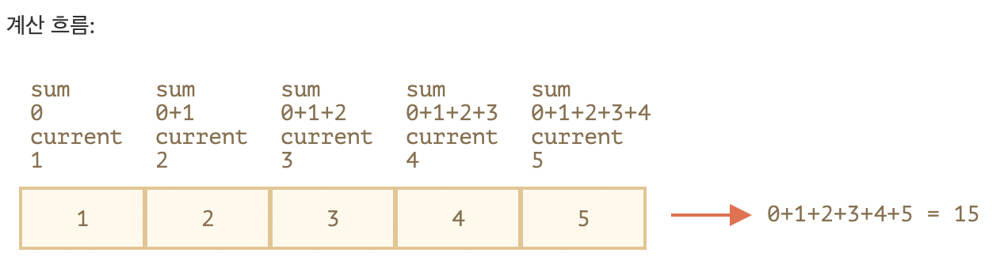

# [모던 JavaScript 튜토리얼 - 코어 자바스크립트] 5. 자료구조와 자료형

> https://ko.javascript.info/data-types

**목표**

- 자바스크립트에서 제공해주는 다양한 자료구조에 대해 알아봅시다.
- 여기에 더하여 자료형을 좀 더 깊이 학습해봅시다.


## 5.1 원시값의 메서드

> https://ko.javascript.info/primitives-methods

**도입**

- 자바스크립트는 원시값(문자열, 숫자 등)을 마치 객체처럼 다룰 수 있게 해줍니다. 
  - 원시값에도 객체에서처럼 메서드를 호출할 수 있죠. 
  - 원시값의 메서드에 대해선 곧 학습할 예정인데 그 전에, <u>원시값은 객체가 아니란 것</u>을 상기하도록 합시다.
- 원시값과 객체는 다음과 같은 차이점이 있습니다.
  - 원시값:
    - 원시형 값입니다.
    - 원시형의 종류는 `문자(string)`, `숫자(number)`, `bigint`, `불린(boolean)`, `심볼(symbol)`, `null`, `undefined`형으로 총 일곱 가지 입니다.
  - 객체:
    - 프로퍼티에 다양한 종류의 값을 저장할 수 있습니다.
    - `{name : "John", age : 30}`와 같이 대괄호 `{}`를 사용해 만들 수 있습니다. 
    - 자바스크립트에는 여러 종류의 객체가 있는데, 함수도 객체의 일종입니다.

- 객체의 장점 중 하나는 함수를 프로퍼티로 저장할 수 있다는 것입니다.

  ```js
  let john = {
    name: "John",
    sayHi: function() {
      alert("친구야 반갑다!");
    }
  };
  
  john.sayHi(); // 친구야 반갑다!
  ```

  - 객체 `john`을 만들고, 거기에 메서드 `sayHi`를 정의해보았습니다.
  - 자바스크립트는 날짜, 오류, HTML 요소(HTML element) 등을 다룰 수 있게 해주는 다양한 내장 객체를 제공합니다. 
    - 이 객체들은 고유한 프로퍼티와 메서드를 가집니다.
  - 하지만, 이런 기능을 사용하면 시스템 자원이 많이 소모된다는 단점이 있습니다.
  - 객체는 원시값보다 “무겁고”, 내부 구조를 유지하기 위해 추가 자원을 사용하기 때문입니다.


### 원시값을 객체처럼 사용하기

- 자바스크립트 창안자(creator)는 다음과 같은 모순적인 상황을 해결해야만 했었습니다.
  - 문자열이나 숫자와 같은 원시값을 다루어야 하는 작업이 많은데, 메서드를 사용하면 작업을 수월하게 할 수 있을 것 같다는 생각이 듭니다.
  - 그런데 원시값은 가능한 한 빠르고 가벼워야 합니다.
- 조금 어색해 보이지만, 자바스크립트 창안자는 아래와 같은 방법을 사용해 해결책을 모색하였습니다.
  1. 원시값은 원시값 그대로 남겨둬 단일 값 형태를 유지합니다.
  2. 문자열, 숫자, 불린, 심볼의 메서드와 프로퍼티에 접근할 수 있도록 언어 차원에서 허용합니다.
  3. 이를 가능하게 하기 위해, 원시값이 메서드나 프로퍼티에 접근하려 하면 추가 기능을 제공해주는 특수한 객체, "원시 래퍼 객체(object wrapper)"를 만들어 줍니다. 이 객체는 곧 삭제됩니다.

- "래퍼 객체"는 원시 타입에 따라 종류가 다양합니다. 

  - 각 래퍼 객체는 원시 자료형의 이름을 그대로 차용해, `String`,`Number`,`Boolean`, `Symbol`라고 부릅니다. 
  - 래퍼 객체 마다 제공하는 메서드 역시 다릅니다.

- 인수로 받은 문자열의 모든 글자를 대문자로 바꿔주는 메서드 [str.toUpperCase()](https://developer.mozilla.org/en/docs/Web/JavaScript/Reference/Global_Objects/String/toUpperCase)를 예로 들어보겠습니다.

  ```js
  let str = "Hello";
  alert( str.toUpperCase() ); // HELLO
  ```

  - 간단하죠? 아래는 `str.toUpperCase ()`가 호출될 때 내부에서 실제로 일어나는 일입니다.
    1. 문자열 `str`은 원시값이므로 원시값의 프로퍼티(toUpperCase)에 접근하는 순간 특별한 객체가 만들어집니다. 이 객체는 문자열의 값을 알고 있고, `toUpperCase()`와 같은 유용한 메서드를 가지고 있습니다.
    2. 메서드가 실행되고, 새로운 문자열이 반환됩니다(`alert` 창에 이 문자열이 출력됩니다).
    3. 특별한 객체는 파괴되고, 원시값 `str`만 남습니다.
  - 이런 내부 프로세스를 통해 원시값을 가볍게 유지하면서 메서드를 호출할 수 있는 것입니다.
  - 자바스크립트 엔진은 위 프로세스의 최적화에 많은 신경을 씁니다. 
    - 원시 래퍼 객체를 만들지 않고도 마치 원시 래퍼 객체를 생성(명세에 언급됨)한 것처럼 동작하게끔 해주죠.

- 숫자형도 고유한 메서드를 지원합니다. 메서드 [toFixed(n)](https://developer.mozilla.org/en-US/docs/Web/JavaScript/Reference/Global_Objects/Number/toFixed)를 이용하면 원하는 자리에서 소수점 아래 숫자를 반올림할 수 있습니다.

  ```js
  let n = 1.23456;
  alert( n.toFixed(2) ); // 1.23
  ```

- [숫자형](https://ko.javascript.info/number), [문자열](https://ko.javascript.info/string)에서 더 많은 메서드에 대해 알아보겠습니다.


> **`String/Number/Boolean`를 생성자론 쓰지 맙시다.**
>
> - Java 등의 몇몇 언어에선 `new Number(1)` 또는 `new Boolean(false)`와 같은 문법을 사용해 원하는 타입의 "래퍼 객체"를 직접 만들 수 있습니다.
>
> - 자바스크립트에서도 하위 호환성을 위해 이 기능을 남겨 두었는데, 이런 식으로 래퍼 객체를 만드는 건 **추천하지 않습니다**. 
>   - 몇몇 상황에서 혼동을 불러일으키기 때문입니다.
>
> 
>
> - 예시:
>
>   ```js
>   alert( typeof 0 ); // "number"
>   alert( typeof new Number(0) ); // "object"!
>   ```
>
> 
>
> - 객체는 논리 평가 시 항상 참을 반환하기 때문에, 아래 예시에서 얼럿창은 무조건 열립니다.
>
>   ```js
>   let zero = new Number(0);
>       
>   if (zero) { // 변수 zero는 객체이므로, 조건문이 참이 됩니다.
>     alert( "그런데 여러분은 zero가 참이라는 것에 동의하시나요!?!" );
>   }
>   ```
>
>   
>
> - 그런데, `new`를 붙이지 않고 `String / Number / Boolean`을 사용하는 건 괜찮습니다. 
>
>   - `new` 없이 사용하면 상식에 맞게 인수를 원하는 형의 원시값(문자열, 숫자, 불린 값)으로 바꿔줍니다. 아주 유용하죠.
>
>     ```js
>     let num = Number("123"); // 문자열을 숫자로 바꿔줌
>     ```


> **`null/undefined`는 메서드가 없습니다.**
>
> - 특수 자료형인 `null`과 `undefined`의 원시값(`null/undefined`)은 위와 같은 법칙을 따르지 않습니다. 
> - 이 자료형과 연관되는 "래퍼 객체"도 없고, 메서드도 제공하지 않습니다. 
>   - 어떤 의미에서는 두 자료형이 "가장 원시적"이라 할 수 있을 것 같습니다.
>
> 
>
> - 두 자료형에 속한 값의 프로퍼티에 접근하려 하면 에러가 발생합니다.
>
>   ```js
>   alert(null.test); // error
>   ```


### 요약

- 'null’과 'undefined’를 제외한 원시값에 다양한 메서드를 호출할 수 있습니다. 이에 대해선 별도의 챕터에서 곧 알아보도록 하겠습니다.
- 원시값에 메서드를 호출하려 하면 임시 객체가 만들어집니다. 그런데 자바스크립트 엔진은 내부 최적화가 잘 되어있어 메서드를 호출해도 많은 리소스를 쓰지 않습니다.


## 5.2 숫자형

> https://ko.javascript.info/number


**도입**

- 모던 자바스크립트는 숫자를 나타내는 두 가지 자료형을 지원합니다.
  1. 일반적인 숫자는 '배정밀도 부동소수점 숫자(double precision floating point number)'로 알려진 64비트 형식의 [IEEE-754](https://en.wikipedia.org/wiki/IEEE_754-2008_revision)에 저장됩니다. 튜토리얼 전체에서 이 형식을 사용하여 숫자를 표현할 예정입니다.
  2. 임의의 길이를 가진 정수는 BigInt 숫자로 나타낼 수 있습니다. 일반적인 숫자는 `2^53`이상이거나 `-2^53`이하일 수 없다는 제약 때문에 BigInt라는 새로운 자료형이 만들어졌습니다. BigInt는 아주 특별한 경우에만 사용되므로, 별도의 챕터 [BigInt](https://ko.javascript.info/bigint)에서 자세한 내용을 다루겠습니다.

- 자, 그럼 일반적인 숫자에 대해서 자세히 알아봅시다.


### 숫자를 입력하는 다양한 방법

- 10억을 입력해야 한다고 상상해 봅니다. 가장 분명한 방법은 아래와 같이 직접 10억(one billion)을 써주는 것입니다.

  ```js
  let billion = 1000000000;
  ```

- 그런데 이렇게 0을 많이 사용해 숫자를 표현하다 보면 잘못 입력하기 쉽기 때문에, 실제로는 이런 방법을 잘 사용하지 않습니다. 

  - 0을 많이 입력하는 게 귀찮기도 하지요. 
  - 그래서 대개는 10억(`billion`)을 나타낼 땐 `'1bn'`을 사용하고, 73억을 나타낼 땐 `'7.3bn'`을 사용합니다. 
  - 큰 숫자를 나타낼 땐 이런 방법이 주로 사용되죠.

- 자바스크립트에서도 숫자 옆에 `'e'`를 붙이고 0의 개수를 그 옆에 붙여주면 숫자를 줄일 수 있습니다.

  ```js
  let billion = 1e9;  // 10억, 1과 9개의 0
  alert( 7.3e9 );  // 73억 (7,300,000,000)
  ```

- 즉, `'e'`는 e 왼쪽의 수에 e 오른쪽에 있는 수만큼의 10의 거듭제곱을 곱하는 효과가 있습니다.

  ```js
  1e3 = 1 * 1000
  1.23e6 = 1.23 * 1000000
  ```

- 이제 아주 작은 숫자인 1마이크로초(백만 분의 1초)를 표현해보겠습니다.

  ```js
  let ms = 0.000001;
  ```

- 작은 숫자를 표현할 때도 큰 숫자를 표현할 때처럼 `'e'`를 사용할 수 있습니다. 0을 명시적으로 쓰고 싶지 않다면 다음과 같이 숫자를 표현할 수 있죠.

  ```js
  let ms = 1e-6; // 1에서 왼쪽으로 6번 소수점 이동
  ```

  - `0.000001`에서 0의 개수를 세면 6이므로 `0.000001`은 당연히 `1e-6`이 되죠.

- 이렇게 `'e'` 우측에 음수가 있으면, 이 음수의 절댓값 만큼 10을 거듭제곱한 수로 나누는 것을 의미합니다.

  ```js
  // 10을 세 번 거듭제곱한 수로 나눔
  1e-3 = 1 / 1000 (=0.001)
  
  // 10을 여섯 번 거듭제곱한 수로 나눔
  1.23e-6 = 1.23 / 1000000 (=0.00000123)
  ```


### 16진수, 2진수, 8진수

- [16진수](https://en.wikipedia.org/wiki/Hexadecimal)는 색을 나타내거나 문자를 인코딩할 때 등 다양한 곳에서 두루 쓰입니다. 

  - 다양한 곳에서 쓰이는 만큼 당연히 16진수를 짧게 표현하는 방법도 존재하겠죠. 

  - 16진수는 `0x`를 사용해 표현할 수 있습니다.

    ```js
    alert( 0xff ); // 255
    alert( 0xFF ); // 255 (대·소문자를 가리지 않으므로 둘 다 같은 값을 나타냅니다.)
    ```

- 2진수와 8진수는 아주 드물게 쓰이긴 하지만, 접두사 `0b`와 `0o`를 사용해 간단히 나타낼 수 있습니다.

  ```js
  let a = 0b11111111; // 255의 2진수
  let b = 0o377; // 255의 8진수
  
  alert( a == b ); // true, 진법은 다르지만, a와 b는 같은 수임
  ```

- 자바스크립트에서 지원하는 진법은 3개입니다. 

  - 이 외의 진법을 사용하려면 함수 `parseInt`를 사용해야 합니다(챕터 후반부에서 다룸).


### toString(base)

- `num.toString(base)` 메서드는 `base`진법으로 `num`을 표현한 후, 이를 문자형으로 변환해 반환합니다.

  ```js
  let num = 255;
  
  alert( num.toString(16) );  // ff
  alert( num.toString(2) );   // 11111111
  ```

- `base`는 `2`에서 `36`까지 쓸 수 있는데, 기본값은 `10`입니다.

- `base`별 유스 케이스는 다음과 같습니다.

  - **base=16** – 16진수 색, 문자 인코딩 등을 표현할 때 사용합니다. 숫자는 `0`부터 `9`, 10 이상의 수는 `A`부터 `F`를 사용하여 나타냅니다.

  - **base=2** – 비트 연산 디버깅에 주로 쓰입니다. 숫자는 `0` 또는 `1`이 될 수 있습니다.

  - **base=36** – 사용할 수 있는 `base` 중 최댓값으로, `0..9`와 `A..Z`를 사용해 숫자를 표현합니다. 알파벳 전체가 숫자를 나타내는 데 사용되죠. `36` 베이스는 url을 줄이는 것과 같이 숫자로 된 긴 식별자를 짧게 줄일 때 유용합니다. 예시를 살펴봅시다.

    ```js
    alert( 123456..toString(36) ); // 2n9c
    ```


> **점 두 개와 메서드 호출**
>
> - `123456..toString(36)`에 있는 점 두 개는 오타가 아닙니다. 
>   - 위 예시처럼 숫자를 대상으로 메서드 `toString`을 직접 호출하고 싶다면 숫자 다음에 점 두 개 `..`를 붙여야 합니다.
> - `123456.toString(36)`처럼 점을 한 개만 사용하면, 첫 번째 점 이후는 소수부로 인식되어 에러가 발생할 수 있습니다. 
>   - 점을 하나 더 추가하면 자바스크립트는 소수부가 없다고 판단하고 함수를 호출합니다.
> - `(123456).toString(36)`도 가능합니다.


### 어림수 구하기

- 어림수를 구하는 것(rounding)은 숫자를 다룰 때 가장 많이 사용되는 연산 중 하나입니다.

- 어림수 관련 내장 함수 몇 가지를 살펴봅시다.

  - `Math.floor`

    소수점 첫째 자리에서 내림(버림). `3.1`은 `3`, `-1.1`은 `-2`가 됩니다.

  - `Math.ceil`

    소수점 첫째 자리에서 올림. `3.1`은 `4`, `-1.1`은 `-1`이 됩니다.

  - `Math.round`

    소수점 첫째 자리에서 반올림. `3.1`은 `3`, `3.6`은 `4`, `-1.1`은 `-1`이 됩니다.

  - `Math.trunc` (Internet Explorer에서는 지원하지 않음)

    소수부를 무시. `3.1`은 `3`이 되고 `-1.1`은 `-1`이 됩니다.

- 각 내장 함수의 차이를 표로 나타내면 다음과 같습니다.

  |        | `Math.floor` | `Math.ceil` | `Math.round` | `Math.trunc` |
  | :----- | :----------- | :---------- | :----------- | :----------- |
  | `3.1`  | `3`          | `4`         | `3`          | `3`          |
  | `3.6`  | `3`          | `4`         | `4`          | `3`          |
  | `-1.1` | `-2`         | `-1`        | `-1`         | `-1`         |
  | `-1.6` | `-2`         | `-1`        | `-2`         | `-1`         |

- 위에서 소개한 내장 함수들만으로도 소수부에 관련된 연산 대부분을 처리할 수 있습니다. 

- 그런데 소수점 `n-th`번째 수를 기준으로 어림수를 구해야 하는 상황이라면 어떻게 해야 할까요?

  - 예를 들어 `1.2345`가 있는데 소수점 두 번째 자릿수까지만 남겨 `1.23`을 만들고 싶은 경우처럼 말이죠.

  - 두 가지 방법이 있습니다.

    1. 곱하기와 나누기

    - 소수점 두 번째 자리 숫자까지만 남기고 싶은 경우, 숫자에 `100` 또는 `100`보다 큰 `10`의 거듭제곱 수를 곱한 후, 원하는 어림수 내장 함수를 호출하고 처음 곱한 수를 다시 나누면 됩니다.

      ```js
      let num = 1.23456;
      
      alert( Math.floor(num * 100) / 100 ); // 1.23456 -> 123.456 -> 123 -> 1.23
      ```

    2. 소수점 `n` 번째 수까지의 어림수를 구한 후 이를 문자형으로 반환해주는 메서드인 [toFixed(n)](https://developer.mozilla.org/en-US/docs/Web/JavaScript/Reference/Global_Objects/Number/toFixed)를 사용합니다.

       ```js
       let num = 12.34;
       alert( num.toFixed(1) ); // "12.3"
       ```

       `toFixed`는 `Math.round`와 유사하게 가장 가까운 값으로 올림 혹은 버림해줍니다.

       ```js
       let num = 12.36;
       alert( num.toFixed(1) ); // "12.4"
       ```

       `toFixed`를 사용할 때 주의할 점은 이 메서드의 반환 값이 문자열이라는 것입니다. 소수부의 길이가 인수보다 작으면 끝에 0이 추가됩니다.

       ```js
       let num = 12.34;
       alert( num.toFixed(5) ); // "12.34000", 소수부의 길이를 5로 만들기 위해 0이 추가되었습니다.
       ```

       참고로, `+num.toFixed(5)`처럼 단항 덧셈 연산자를 앞에 붙이거나 `Number()`를 호출하면 문자형의 숫자를 숫자형으로 변환할 수 있습니다.

    

### 부정확한 계산

- 숫자는 내부적으로 64비트 형식 [IEEE-754](https://en.wikipedia.org/wiki/IEEE_754-2008_revision)으로 표현되기 때문에 숫자를 저장하려면 정확히 64비트가 필요합니다. 

  - 64비트 중 52비트는 숫자를 저장하는 데 사용되고, 
  - 11비트는 소수점 위치를(정수는 0), 
  - 1비트는 부호를 저장하는 데 사용됩니다.

- 그런데 숫자가 너무 커지면 64비트 공간이 넘쳐서 Infinity로 처리됩니다.

  ```js
  alert( 1e500 ); // Infinity
  ```

- 원인을 이해하려면 집중이 필요하긴 하지만, 꽤 자주 발생하는 현상인 정밀도 손실(loss of precision)도 있습니다.

  ```js
  alert( 0.1 + 0.2 == 0.3 ); // false
  ```

  - `0.1`과 `0.2`의 합이 `0.3`과 일치하는지 확인 했는데 `false`가 출력되었습니다.

  - 이상하네요! 합의 결과가 `0.3`이 아니라면 대체 무엇일까요?

    ```js
    alert( 0.1 + 0.2 ); // 0.30000000000000004
    ```

- 왜 이런 일이 발생할까요?

  - 숫자는 0과 1로 이루어진 이진수로 변환되어 연속된 메모리 공간에 저장됩니다. 
  - 그런데 10진법을 사용하면 쉽게 표현할 수 있는 `0.1`, `0.2` 같은 분수는 이진법으로 표현하면 무한 소수가 됩니다.
    - `0.1`은 1을 10으로 나눈 수인 `1/10`입니다. 10진법을 사용하면 이러한 숫자를 쉽게 표현할 수 있죠. 
    - `1/10`과 `1/3`을 비교해봅시다. `1/3`은 무한 소수 `0.33333(3)`이 됩니다.
  - 이렇게 `10`의 거듭제곱으로 나눈 값은 10진법에서 잘 동작하지만 `3`으로 나누게 되면 10진법에서 제대로 동작하지 않습니다. 
  - 같은 이유로 2진법 체계에서 `2`의 거듭제곱으로 나눈 값은 잘 동작하지만 `1/10`같이 `2`의 거듭제곱이 아닌 값으로 나누게 되면 무한 소수가 되어버립니다.
  - 10진법에서 1/3을 정확히 나타낼 수 없듯이, 2진법을 사용해 *0.1* 또는 *0.2*를 **정확하게** 저장하는 방법은 없습니다.

- IEEE-754에선 가능한 가장 가까운 숫자로 반올림하는 방법을 사용해 이런 문제를 해결합니다.

  - 그런데 반올림 규칙을 적용하면 발생하는 '작은 정밀도 손실’을 우리가 볼 수는 없지만 실제로 손실은 발생합니다.

  - 아래와 같이 코드를 작성하면 정밀도 손실을 눈으로 확인할 수 있죠.

    ```js
    alert( 0.1.toFixed(20) ); // 0.10000000000000000555
    ```

  - 그리고 두 숫자를 합하면 '정밀도 손실’도 더해집니다.

    - `0.1 + 0.2`가 정확히 `0.3`이 아닌 이유가 여기에 있습니다.

- 문제를 해결하는 방법은 없을까요? 물론 있습니다. 

  - 가장 신뢰할만한 방법은 [toFixed(n)](https://developer.mozilla.org/en-US/docs/Web/JavaScript/Reference/Global_Objects/Number/toFixed)메서드를 사용해 어림수를 만드는 것입니다.

    ```js
    let sum = 0.1 + 0.2;
    alert( sum.toFixed(2) ); // 0.30
    ```

  - 이때 `toFixed`는 항상 문자열을 반환한다는 점에 유의해야 합니다. 

    - 문자열을 반환하기 때문에 소수점 다음에 오는 숫자가 항상 2개가 될 수 있습니다. 
    - 인터넷 쇼핑몰을 구축 중이고 `$0.30`를 보여줘야 할 때 유용하죠. 

  - 문자형으로 바뀐 숫자를 다시 숫자형으로 강제 변환하려면 단항 덧셈 연산자를 사용하면 됩니다.

    ```js
    let sum = 0.1 + 0.2;
    alert( +sum.toFixed(2) ); // 0.3
    ```

  - 숫자에 임시로 100(또는 더 큰 숫자)을 곱하여 정수로 바꾸고, 원하는 연산을 한 후 다시 100으로 나누는 것도 하나의 방법이 될 수 있습니다.

    - 정수를 대상으로 하는 수학 연산은 소수를 대상으로 하는 연산보다 에러가 적기 때문입니다. 

    - 그런데 어쨌든 마지막에 나눗셈이 들어가기 때문에 소수가 다시 등장할 수 있다는 단점이 있습니다.

      ```js
      alert( (0.1 * 10 + 0.2 * 10) / 10 ); // 0.3
      alert( (0.28 * 100 + 0.14 * 100) / 100); // 0.4200000000000001
      ```

    - 이렇게 10의 거듭제곱을 곱하고 다시 동일한 숫자로 나누는 전략은 오류를 줄여주긴 하지만 완전히 없애지는 못합니다.

- 구현을 하다 보면 무한 소수가 나오는 경우를 완전히 차단해야 하는 경우가 생기곤 합니다. 

  - 달러가 아닌 센트 단위로 물품 가격을 저장하는 쇼핑몰을 담당하고 있는데, 행사 때문에 가격을 30% 할인해야 하는 경우가 그렇죠. 

- **<u>무한소수를 방지하는 완벽한 방법은 사실 없습니다.</u>** 

  - 필요할 때마다 '꼬리’를 잘라 어림수를 만드는 방법뿐이죠.


> **흥미로운 발견**
>
> - 아래 예시를 실행해보세요.
>
> ```javascript
> // 숫자가 스스로 증가하네요!
> alert( 9999999999999999 ); // 10000000000000000이 출력됩니다.
> ```
>
> - 문제의 원인은 역시나 정밀도 손실 때문입니다. 
>   - 숫자를 저장할 땐 64비트가 사용되는데, 이 중 실제 숫자를 저장하는 데 사용되는 52비트에 위 숫자를 저장하기엔 공간이 모자랍니다. 
>   - 따라서 최소 유효 숫자(the least significant digit)가 손실되어 버렸습니다.
>
> - 자바스크립트는 숫자 손실이 일어나도 오류를 발생시키지 않습니다. 
>   - 적절한 포맷으로 숫자를 맞추는 데 최선을 다하긴 하지만 유감스럽게도 위 예시의 숫자를 담기엔 포맷이 충분하지 않네요.


> **두 종류의 0**
>
> - 자바스크립트 내부에서 숫자를 표현하는 방식 때문에 발생하는 또 다른 흥미로운 현상은 `0`과 `-0`이라는 두 종류의 0이 존재한다는 사실입니다.
> - 자바스크립트에선 숫자의 부호가 단일 비트에 저장되는데 0을 포함한 모든 숫자에 부호를 설정할 수도, 설정하지 않을 수도 있기 때문입니다.
> - 대부분의 연산은 `0`과 `-0`을 동일하게 취급하기 때문에 두 0의 차이는 두드러지지 않는 편입니다.


### isNaN과 isFinite

- 아래 두 특수 숫자 값이 기억나시나요?

  - `Infinity`와 `-Infinity`: 그 어떤 숫자보다 큰 혹은 작은 특수 숫자 값
  - `NaN`: 에러를 나타내는 값

- 두 특수 숫자는 `숫자형`에 속하지만 ‘정상적인’ 숫자는 아니기 때문에, 정상적인 숫자와 구분하기 위한 특별한 함수가 존재합니다.

  - `isNaN(value)` – 인수를 숫자로 변환한 다음 `NaN`인지 테스트함

    ```js
    alert( isNaN(NaN) ); // true
    alert( isNaN("str") ); // true
    ```

  - 그런데 굳이 이 함수가 필요할까요? "`=== NaN` 비교를 하면 되지 않을까?"라는 생각이 들 수 있습니다. 

    - 안타깝게도 대답은 '필요하다’입니다. 

    - **<u>`NaN`은 `NaN` 자기 자신을 포함하여 그 어떤 값과도 같지 않다</u>**는 점에서 독특합니다.

      ```js
      alert( NaN === NaN ); // false
      ```

  - `isFinite(value)` - 인수를 숫자로 변환하고 변환한 숫자가 `NaN/Infinity/-Infinity`가 아닌 일반 숫자인 경우 `true`를 반환함

    ```js
    alert( isFinite("15") ); // true
    alert( isFinite("str") ); // false, NaN이기 때문입니다.
    alert( isFinite(Infinity) ); // false, Infinity이기 때문입니다.
    ```

  - `isFinite`는 문자열이 일반 숫자인지 검증하는 데 사용되곤 합니다.

    ```js
    let num = +prompt("숫자를 입력하세요.", '');
    
    // 숫자가 아닌 값을 입력하거나 Infinity, -Infinity를 입력하면 false가 출력됩니다.
    alert( isFinite(num) );
    ```

  - <u>빈 문자열이나 공백만 있는 문자열은 `isFinite`를 포함한 모든 숫자 관련 내장 함수에서 `0`으로 취급</u>된다는 점에 유의하시기 바랍니다.


> **`Object.is`와 비교하기**
>
> [`Object.is`](https://developer.mozilla.org/ko/docs/Web/JavaScript/Reference/Global_Objects/Object/is)는 `===`처럼 값을 비교할 때 사용되는 특별한 내장 메서드인데, 아래와 같은 두 가지 에지 케이스에선 `===`보다 좀 더 신뢰할만한 결과를 보여줍니다.
>
> 1. `NaN`을 대상으로 비교할 때: `Object.is(NaN, NaN) === true`임.
> 2. `0`과 `-0`이 다르게 취급되어야 할 때: `Object.is(0, -0) === false`임. 숫자를 나타내는 비트가 모두 0이더라도 부호를 나타내는 비트는 다르므로 `0`과 `-0`은 사실 다른 값이긴 합니다.
>
> 이 두 에지 케이스를 제외하곤, `Object.is(a, b)`와 `a === b`의 결과는 같습니다.
>
> 이런 식의 비교는 자바스크립트 명세서에서 종종 찾아볼 수 있습니다. 내부 알고리즘에서 두 값을 비교해야 하는데, 비교 결과가 정확해야 하는 경우 `Object.is`를 사용하죠. `Object.is`에서 사용되는 비교방식은 명세서에서 [SameValue](https://tc39.github.io/ecma262/#sec-samevalue)라고 불립니다.


### parseInt와 parseFloat

- 단항 덧셈 연산자 `+` 또는 `Number()`를 사용하여 숫자형으로 변형할 때 적용되는 규칙은 꽤 엄격합니다. 

  - 피연산자가 숫자가 아니면 형 변환이 실패합니다.

    ```js
    alert( +"100px" ); // NaN
    ```

  - 엄격한 규칙이 적용되지 않는 유일한 예외는 문자열의 처음 또는 끝에 공백이 있어서 공백을 무시할 때입니다.

- 그런데 실무에선 CSS 등에서 `'100px'`, `'12pt'`와 같이 숫자와 단위를 함께 쓰는 경우가 흔합니다. 

  - 대다수 국가에서 `'19€'`처럼 금액 뒤에 통화 기호를 붙여 표시하기도 하죠. 숫자만 추출하는 방법이 필요해 보이네요.
  - 내장 함수 `parseInt`와 `parseFloat`는 이런 경우를 위해 만들어졌습니다.

- 두 함수는 불가능할 때까지 문자열에서 숫자를 ‘읽습니다’. 

  - 숫자를 읽는 도중 오류가 발생하면 이미 수집된 숫자를 반환하죠. 

  - `parseInt`는 정수, `parseFloat`는 부동 소수점 숫자를 반환합니다.

    ```js
    alert( parseInt('100px') ); // 100
    alert( parseFloat('12.5em') ); // 12.5
    
    alert( parseInt('12.3') ); // 12, 정수 부분만 반환됩니다.
    alert( parseFloat('12.3.4') ); // 12.3, 두 번째 점에서 숫자 읽기를 멈춥니다.
    ```

- `parseInt`와 `parseFloat`가 `NaN`을 반환할 때도 있습니다. 읽을 수 있는 숫자가 없을 때 그렇죠.

  ```js
  alert( parseInt('a123') ); // NaN, a는 숫자가 아니므로 숫자를 읽는 게 중지됩니다.
  ```

  

> **`parseInt(str, radix)`의 두 번째 인수**
>
> - `parseInt()`의 두 번째 매개 변수는 선택적으로 사용할 수 있습니다. 
> - `radix`는 원하는 진수를 지정해 줄 때 사용합니다. 
>   - 따라서 `parseInt`를 사용하면 16진수 문자열, 2진수 문자열 등을 파싱할 수 있습니다.
>
> ```javascript
> alert( parseInt('0xff', 16) ); // 255
> alert( parseInt('ff', 16) ); // 255, 0x가 없어도 동작합니다.
> alert( parseInt('2n9c', 36) ); // 123456
> ```


### 기타 수학 함수

- 자바스크립트에서 제공하는 내장 객체 [Math](https://developer.mozilla.org/en/docs/Web/JavaScript/Reference/Global_Objects/Math)엔 다양한 수학 관련 함수와 상수들이 들어있습니다.

- 몇 가지 예시를 살펴봅시다.

  - `Math.random()`

    - 0과 1 사이의 난수를 반환합니다(1은 제외).

      ```js
      alert( Math.random() ); // 0.1234567894322
      alert( Math.random() ); // 0.5435252343232
      alert( Math.random() ); // ... (무작위 수)
      ```

  - `Math.max(a, b, c...)` / `Math.min(a, b, c...)`

    - 인수 중 최대/최솟값을 반환합니다.

      ```js
      alert( Math.max(3, 5, -10, 0, 1) ); // 5
      alert( Math.min(1, 2) ); // 1
      ```

  - `Math.pow(n, power)`

    - `n`을 power번 거듭제곱한 값을 반환합니다.

      ```js
      alert( Math.pow(2, 10) ); // 2의 10제곱 = 1024
      ```

  - 이 외에도 삼각법을 포함한 다양한 함수와 상수가 `Math`에 있습니다. 자세한 내용은 [MDN 문서](https://developer.mozilla.org/en/docs/Web/JavaScript/Reference/Global_Objects/Math)에서 읽어보시기 바랍니다.


### 요약

0이 많이 붙은 큰 숫자는 다음과 같은 방법을 사용해 씁니다.

- 0의 개수를 `'e'` 뒤에 추가합니다. `123e6`은 0이 6개인 숫자, `123000000`을 나타냅니다.
- `'e'` 다음에 음수가 오면, 음수의 절댓값 만큼 10을 거듭제곱한 숫자로 주어진 숫자를 나눕니다. `123e-6`은 `0.000123`을 나타냅니다.

다양한 진법을 사용할 수도 있습니다.

- 자바스크립트는 특별한 변환 없이 16진수(`0x`), 8진수(`0o`), 2진수(`0b`)를 바로 사용할 수 있게 지원합니다.
- `parseInt(str, base)`를 사용하면 `str`을 `base`진수로 바꿔줍니다(단, `2 ≤ base ≤ 36`).
- `num.toString(base)`는 숫자를 `base`진수로 바꾸고, 이를 문자열 형태로 반환합니다.

`12pt`나 `100px`과 같은 값을 숫자로 변환하는 것도 가능합니다.

- `parseInt/parseFloat`를 사용하면 문자열에서 숫자만 읽고, 읽은 숫자를 에러가 발생하기 전에 반환해주는 ‘약한’ 형 변환을 사용할 수 있습니다.

소수를 처리하는 데 쓰이는 메서드는 다음과 같습니다.

- `Math.floor`, `Math.ceil`, `Math.trunc`, `Math.round`, `num.toFixed(precision)`를 사용하면 어림수를 구할 수 있습니다.
- 소수를 다룰 땐 정밀도 손실에 주의하세요.

이 외에도 다양한 수학 함수가 있습니다.

- 수학 연산이 필요할 때 [Math](https://developer.mozilla.org/en/docs/Web/JavaScript/Reference/Global_Objects/Math) 객체를 찾아보세요. 작은 객체이지만 기본적인 연산은 대부분 다룰 수 있습니다.


## 5.3 문자열 

> https://ko.javascript.info/string

**도입**

- 자바스크립트엔 글자 하나만 저장할 수 있는 별도의 자료형이 없습니다. 
  - 텍스트 형식의 데이터는 길이에 상관없이 문자열 형태로 저장됩니다.
- 자바스크립트에서 문자열은 페이지 인코딩 방식과 상관없이 항상 [UTF-16](https://en.wikipedia.org/wiki/UTF-16) 형식을 따릅니다.


### 따옴표

- 따옴표의 종류가 무엇이 있었는지 상기해봅시다.

- 문자열은 작은따옴표나 큰따옴표, 백틱으로 감쌀 수 있습니다.

  ```js
  let single = '작은따옴표';
  let double = "큰따옴표";
  let backticks = `백틱`;
  ```

- 작은따옴표와 큰따옴표는 기능상 차이가 없습니다. 

- 그런데 백틱엔 특별한 기능이 있습니다. 

  - 표현식을 `${…}`로 감싸고 이를 백틱으로 감싼 문자열 중간에 넣어주면 해당 표현식을 문자열 중간에 쉽게 삽입할 수 있죠. 

  - 이런 방식을 **<u>템플릿 리터럴(template literal)</u>**이라고 부릅니다.

    ```js
    function sum(a, b) {
      return a + b;
    }
    
    alert(`1 + 2 = ${sum(1, 2)}.`); // 1 + 2 = 3.
    ```

  - 백틱을 사용하면 문자열을 여러 줄에 걸쳐 작성할 수도 있습니다.

    ```js
    let guestList = `손님:
     * John
     * Pete
     * Mary
    `;
    
    alert(guestList); // 손님 리스트를 여러 줄에 걸쳐 작성함
    ```

    - 자연스럽게 여러 줄의 문자열이 만들어졌네요. 작은따옴표나 큰따옴표를 사용하면 위와 같은 방식으로 여러 줄짜리 문자열을 만들 수 없습니다.

  - 아래 예시를 실행해봅시다. 에러가 발생합니다.

    ```js
    let guestList = "손님: // Error: Invalid or unexpected token
      * John";
    ```

    - 작은따옴표나 큰따옴표로 문자열을 표현하는 방식은 자바스크립트가 만들어졌을 때부터 있었습니다. 
    - 이때는 문자열을 여러 줄에 걸쳐 작성할 생각조차 못 했던 시기였죠. 
    - 백틱은 그 이후에 등장한 문법이기 때문에 따옴표보다 다양한 기능을 제공합니다.

- 백틱은 '템플릿 함수(template function)'에서도 사용됩니다. 

  - func \`string\` 같이 첫 번째 백틱 바로 앞에 함수 이름(`func`)을 써주면, 
  - 이 함수는 백틱 안의 문자열 조각이나 표현식 평가 결과를 인수로 받아 자동으로 호출됩니다. 
  - 이런 기능을 **'태그드 템플릿(tagged template)**'이라 부르는데, 태그드 템플릿을 사용하면 사용자 지정 템플릿에 맞는 문자열을 쉽게 만들 수 있습니다. 
  - 태그드 템플릿과 템플릿 함수에 대한 자세한 내용은 MDN [문서](https://developer.mozilla.org/ko/docs/Web/JavaScript/Reference/Template_literals#Tagged_templates)에서 확인해보세요. 참고로 이 기능은 자주 사용되진 않습니다.


### 특수 기호

- '줄 바꿈 문자(newline character)'라 불리는 특수기호 `\n`을 사용하면 작은따옴표나 큰따옴표로도 여러 줄 문자열을 만들 수 있습니다.

  ```js
  let guestList = "손님:\n * John\n * Pete\n * Mary";
  alert(guestList); // 손님 리스트를 여러 줄에 걸쳐 작성함
  ```

- 따옴표를 이용해 만든 여러 줄 문자열과 백틱을 이용해 만든 여러 줄 문자열은 표현 방식만 다를 뿐 차이가 없습니다.

  ```js
  let str1 = "Hello\nWorld"; // '줄 바꿈 기호'를 사용해 두 줄짜리 문자열을 만듦
  
  // 백틱과 일반적인 줄 바꿈 방법(엔터)을 사용해 두 줄짜리 문자열을 만듦
  let str2 = `Hello
  World`;
  
  alert(str1 == str2); // true
  ```

- 자바스크립트엔 줄 바꿈 문자를 비롯한 다양한 ‘특수’ 문자들이 있습니다.

  특수 문자 목록:

  | 특수 문자                                            | 설명                                                         |
  | :--------------------------------------------------- | :----------------------------------------------------------- |
  | `\n`                                                 | 줄 바꿈                                                      |
  | `\r`                                                 | 캐리지 리턴(carriage return). Windows에선 캐리지 리턴과 줄 바꿈 특수 문자를 조합(`\r\n`)해 줄을 바꿉니다. 캐리지 리턴을 단독으론 사용하는 경우는 없습니다. |
  | `\'`, `\"`                                           | 따옴표                                                       |
  | `\\`                                                 | 역슬래시                                                     |
  | `\t`                                                 | 탭                                                           |
  | `\b`, `\f`, `\v`                                     | 각각 백스페이스(Backspace), 폼 피드(Form Feed), 세로 탭(Vertical Tab)을 나타냅니다. 호환성 유지를 위해 남아있는 기호로 요즘엔 사용하지 않습니다. |
  | `\xXX`                                               | 16진수 유니코드 `XX`로 표현한 유니코드 글자입니다(예시: 알파벳 `'z'`는 `'\x7A'`와 동일함). |
  | `\uXXXX`                                             | UTF-16 인코딩 규칙을 사용하는 16진수 코드 `XXXX`로 표현한 유니코드 기호입니다. `XXXX`는 반드시 네 개의 16진수로 구성되어야 합니다(예시: `\u00A9`는 저작권 기호 `©`의 유니코드임). |
  | `\u{X…XXXXXX}`(한 개에서 여섯 개 사이의 16진수 글자) | UTF-32로 표현한 유니코드 기호입니다. 몇몇 특수한 글자는 두 개의 유니코드 기호를 사용해 인코딩되므로 4바이트를 차지합니다. 이 방법을 사용하면 긴 코드를 삽입할 수 있습니다. |

- 유니코드를 사용한 예시:

  ```js
  alert( "\u00A9" ); // ©
  alert( "\u{20331}" ); // 佫, 중국어(긴 유니코드)
  alert( "\u{1F60D}" ); // 😍, 웃는 얼굴 기호(긴 유니코드)
  ```

- 모든 특수 문자는 '이스케이프 문자(escape character)'라고도 불리는 역슬래시 (backslash character) `\`로 시작합니다.

  - 역슬래시는 문자열 내에 따옴표를 넣을 때도 사용할 수 있습니다.

    ```js
    alert( 'I\'m the Walrus!' ); // I'm the Walrus!
    ```

  - 위 예시에서 살펴본 바와 같이 문자열 내의 따옴표엔 `\`를 꼭 붙여줘야 합니다. 이렇게 하지 않으면 자바스크립트는 해당 따옴표가 문자열을 닫는 용도로 사용된 것이라 해석하기 때문입니다.

- 이스케이프 문자는 문자열을 감쌀 때 사용한 따옴표와 동일한 따옴표에만 붙여주면 됩니다. 문자열 내에서 좀 더 우아하게 따옴표를 사용하려면 아래와 같이 따옴표 대신 백틱으로 문자열을 감싸주면 됩니다.

  ```js
  alert( `I'm the Walrus!` ); // I'm the Walrus!
  ```


### 문자열의 길이

- `length` 프로퍼티엔 문자열의 길이가 저장됩니다.

  ```js
  alert( `My\n`.length ); // 3
  ```

  - `\n`은 ‘특수 문자’ 하나로 취급되기 때문에 `My\n`의 길이는 `3`입니다.


> **`length`는 프로퍼티입니다.**
>
> - 자바스크립트 이외의 언어를 사용했던 개발자들은 `str.length`가 아닌 `str.length()`로 문자열의 길이를 알아내려고 하는 경우가 있습니다. 
>   - 하지만 원하는 대로 동작하지 않습니다.
> - `length`는 함수가 아니고, 숫자가 저장되는 프로퍼티라는 점에 주의하시기 바랍니다. 
>   - 뒤에 괄호를 붙일 필요가 없습니다.


### 특정 글자에 접근하기

- 문자열 내 특정 위치인 `pos`에 있는 글자에 접근

  - `[pos]`같이 대괄호를 이용하거나
  -  [str.charAt(pos)](https://developer.mozilla.org/ko/docs/Web/JavaScript/Reference/Global_Objects/String/charAt)라는 메서드를 호출하면 됩니다. 
  - 위치는 0부터 시작합니다.

  ```js
  let str = `Hello`;
  
  // 첫 번째 글자
  alert( str[0] ); // H
  alert( str.charAt(0) ); // H
  
  // 마지막 글자
  alert( str[str.length - 1] ); // o
  ```

- 근래에는 대괄호를 이용하는 방식을 사용합니다. 

- `charAt`은 하위 호환성을 위해 남아있는 메서드라고 생각하시면 됩니다.

  - 두 접근 방식의 차이는 반환할 글자가 없을 때 드러납니다. 

  - 접근하려는 위치에 글자가 없는 경우 `[]`는 `undefined`를, `charAt`은 빈 문자열을 반환합니다.

    ```js
    let str = `Hello`;
    
    alert( str[1000] ); // undefined
    alert( str.charAt(1000) ); // '' (빈 문자열)
    ```

- `for..of`를 사용하면 문자열을 구성하는 글자를 대상으로 반복 작업을 할 수 있습니다.

  ```js
  for (let char of "Hello") {
    alert(char); // H,e,l,l,o (char는 순차적으로 H, e, l, l, o가 됩니다.)
  }
  ```

  

### 문자열의 불변성

- 문자열은 수정할 수 없습니다. 

  - 따라서 문자열의 중간 글자 하나를 바꾸려고 하면 에러가 발생합니다.

    ```js
    let str = 'Hi';
    
    str[0] = 'h'; // Error: Cannot assign to read only property '0' of string 'Hi'
    alert( str[0] ); // 동작하지 않습니다.
    ```

  - 이런 문제를 피하려면 완전히 새로운 문자열을 하나 만든 다음, 이 문자열을 `str`에 할당하면 됩니다.

    ```js
    let str = 'Hi';
    str = 'h' + str[1]; // 문자열 전체를 교체함
    alert( str ); // hi
    ```

    

### 대·소문자 변경하기

- 메서드 [toLowerCase()](https://developer.mozilla.org/ko/docs/Web/JavaScript/Reference/Global_Objects/String/toLowerCase)와 [toUpperCase()](https://developer.mozilla.org/ko/docs/Web/JavaScript/Reference/Global_Objects/String/toUpperCase)는 대문자를 소문자로, 소문자를 대문자로 변경(케이스 변경)시켜줍니다.

  ```js
  alert( 'Interface'.toUpperCase() ); // INTERFACE
  alert( 'Interface'.toLowerCase() ); // interface
  ```

- 글자 하나의 케이스만 변경하는 것도 가능합니다.

  ```js
  alert( 'Interface'[0].toLowerCase() ); // 'i'
  ```


### 부분 문자열 찾기

- 문자열에서 부분 문자열(substring)을 찾는 방법은 여러 가지가 있습니다.

  

1. `str.indexOf`

   - 첫 번째 방법은 [str.indexOf(substr, pos)](https://developer.mozilla.org/ko/docs/Web/JavaScript/Reference/Global_Objects/String/indexOf) 메서드를 이용하는 것입니다.

   - 이 메서드는 문자열 `str`의 `pos`에서부터 시작해, 부분 문자열 `substr`이 어디에 위치하는지를 찾아줍니다. 

     - 원하는 부분 문자열을 찾으면 위치를 반환하고 그렇지 않으면 `-1`을 반환합니다.

   - 예시

     ```javascript
     let str = 'Widget with id';
     
     alert( str.indexOf('Widget') ); // 0, str은 'Widget'으로 시작함
     alert( str.indexOf('widget') ); // -1, indexOf는 대·소문자를 따지므로 원하는 문자열을 찾지 못함
     
     alert( str.indexOf("id") ); // 1, "id"는 첫 번째 위치에서 발견됨 (Widget에서 id)
     ```

   - `str.indexOf(substr, pos)`의 두 번째 매개변수 `pos`는 선택적으로 사용할 수 있는데, 이를 명시하면 검색이 해당 위치부터 시작됩니다.

     - 부분 문자열 `"id"`는 위치 `1`에서 처음 등장하는데, 두 번째 인수에 `2`를 넘겨 `"id"`가 두 번째로 등장하는 위치가 어디인지 알아봅시다.

     ```js
     let str = 'Widget with id';
     alert( str.indexOf('id', 2) ) // 12
     ```

   - 문자열 내 부분 문자열 전체를 대상으로 무언가를 하고 싶다면 반복문 안에 `indexOf`를 사용하면 됩니다. 

     - 반복문이 하나씩 돌 때마다 검색 시작 위치가 갱신되면서 `indexOf`가 새롭게 호출됩니다.

     ```js
     let str = 'As sly as a fox, as strong as an ox';
     
     let target = 'as'; // as를 찾아봅시다.
     
     let pos = 0;
     while (true) {
       let foundPos = str.indexOf(target, pos);
       if (foundPos == -1) break;
     
       alert( `위치: ${foundPos}` );
       pos = foundPos + 1; // 다음 위치를 기준으로 검색을 이어갑니다.
     }
     ```


> **`str.lastIndexOf(substr, position)`**
>
> - [str.lastIndexOf(substr, position)](https://developer.mozilla.org/ko/docs/Web/JavaScript/Reference/Global_Objects/String/lastIndexOf)는 `indexOf`와 유사한 기능을 하는 메서드입니다. 
>   - 문자열 끝에서부터 부분 문자열을 찾는다는 점만 다릅니다.
> - 반환되는 부분 문자열 위치는 문자열 끝이 기준입니다.


- `if`문의 조건식에 `indexOf`를 쓸 때 주의할 점이 하나 있습니다. 

  - 아래와 같이 코드들 작성하면 원하는 결과를 얻을 수 없습니다.

  ```js
  let str = "Widget with id";
  
  if (str.indexOf("Widget")) {
      alert("찾았다!"); // 의도한 대로 동작하지 않습니다.
  }
  ```

  - `str.indexOf("Widget")`은 `0`을 반환하는데, `if`문에선 `0`을 `false`로 간주하므로 `alert` 창이 뜨지 않습니다.
  - 따라서 **<u>부분 문자열 여부를 검사하려면 아래와 같이 `-1`과 비교해야 합니다.</u>**

  ```js
  let str = "Widget with id";
  
  if (str.indexOf("Widget") != -1) {
      alert("찾았다!"); // 의도한 대로 동작합니다.
  }
  ```


### includes, startsWith, endsWith

- `includes` 메서드

  - 비교적 근래에 나온 메서드인 [str.includes(substr, pos)](https://developer.mozilla.org/ko/docs/Web/JavaScript/Reference/Global_Objects/String/includes)는 `str`에 부분 문자열 `substr`이 있는지에 따라 `true`나 `false`를 반환합니다.

  - 부분 문자열의 위치 정보는 필요하지 않고 포함 여부만 알고 싶을 때 적합한 메서드입니다.

    ```js
    alert( "Widget with id".includes("Widget") ); // true
    alert( "Hello".includes("Bye") ); // false
    ```

  - `str.includes`에도 `str.indexOf`처럼 두 번째 인수를 넘기면 해당 위치부터 부분 문자열을 검색합니다.

    ```js
    alert( "Widget".includes("id") ); // true
    alert( "Widget".includes("id", 3) ); // false, 세 번째 위치 이후엔 "id"가 없습니다.
    ```

- `startsWith`와 `endsWith` 메서드

  - 메서드 이름 그대로 문자열 `str`이 특정 문자열로 시작하는지(start with) 여부와 특정 문자열로 끝나는지(end with) 여부를 확인할 때 사용할 수 있습니다.

    ```js
    alert( "Widget".startsWith("Wid") ); // true, "Widget"은 "Wid"로 시작합니다.
    alert( "Widget".endsWith("get") ); // true, "Widget"은 "get"으로 끝납니다.
    ```


### 부분 문자열 추출하기

- 자바스크립트엔 부분 문자열 추출과 관련된 메서드가 세 가지 있습니다. 

  - 세 가지 메서드 `substring`, `substr`, `slice`를 하나씩 알아봅시다.

- `str.slice(start [, end])`

  - 문자열의 `start`부터 `end`까지(`end`는 미포함)를 반환합니다.

    ```js
    let str = "stringify";
    alert( str.slice(0, 5) ); // 'strin', 0번째부터 5번째 위치까지(5번째 위치의 글자는 포함하지 않음)
    alert( str.slice(0, 1) ); // 's', 0번째부터 1번째 위치까지(1번째 위치의 자는 포함하지 않음)
    ```

  - 두 번째 인수가 생략된 경우엔, 명시한 위치부터 문자열 끝까지를 반환합니다.

    ```js
    let str = "stringify";
    alert( str.slice(2) ); // ringify, 2번째부터 끝까지
    ```

  - `start`와 `end`는 음수가 될 수도 있습니다. <u>음수를 넘기면 문자열 끝에서부터 카운팅</u>을 시작합니다.

    ```js
    let str = "stringify";
    
    // 끝에서 4번째부터 시작해 끝에서 1번째 위치까지
    alert( str.slice(-4, -1) ); // gif
    ```

- `str.substring(start [, end])`

  - `start`와 `end` *사이*에 있는 문자열을 반환합니다.

  - `substring`은 `slice`와 아주 유사하지만 `start`가 `end`보다 커도 괜찮다는 데 차이가 있습니다.

    ```js
    let str = "stringify";
    
    // 동일한 부분 문자열을 반환합니다.
    alert( str.substring(2, 6) ); // "ring"
    alert( str.substring(6, 2) ); // "ring"
    
    // slice를 사용하면 결과가 다릅니다.
    alert( str.slice(2, 6) ); // "ring" (같음)
    alert( str.slice(6, 2) ); // "" (빈 문자열)
    ```

  - `substring`은 음수 인수를 허용하지 않습니다. 음수는 `0`으로 처리됩니다.

- `str.substr(start [, length])`

  - `start`에서부터 시작해 `length` 개의 글자를 반환합니다.

  - `substr`은 끝 위치 대신에 길이를 기준으로 문자열을 추출한다는 점에서 `substring`과 `slice`와 차이가 있습니다.

    ```js
    let str = "stringify";
    alert( str.substr(2, 4) ); // ring, 두 번째부터 글자 네 개
    ```

  - 첫 번째 인수가 음수면 뒤에서부터 개수를 셉니다.

    ```js
    let str = "stringify";
    alert( str.substr(-4, 2) ); // gi, 끝에서 네 번째 위치부터 글자 두 개
    ```

- 부분 문자열 추출과 관련된 메서드를 요약해 봅시다.

  | 메서드                  | 추출할 부분 문자열                    | 음수 허용 여부(인수)  |
  | :---------------------- | :------------------------------------ | :-------------------- |
  | `slice(start, end)`     | `start`부터 `end`까지(`end`는 미포함) | 음수 허용             |
  | `substring(start, end)` | `start`와 `end` 사이                  | 음수는 `0`으로 취급함 |
  | `substr(start, length)` | `start`부터 `length`개의 글자         | 음수 허용             |


> **어떤 메서드를 선택해야 하나요?**
>
> - 모두 사용해도 괜찮습니다. 그런데 `substr`에는 단점이 하나 있습니다. `substr`는 코어 자바스크립트 명세서(ECMA-262 – 옮긴이)가 아닌, 구식 스크립트에 대응하기 위해 남겨 둔 브라우저 전용 기능들을 명시해 놓은 부록 B(Annex B)에 정의되어있습니다. 거의 모든 곳에서 이 메서드가 동작하긴 하지만 브라우저 이외의 호스트 환경에서는 제대로 동작하지 않을 수 있습니다.
>
> - 남은 두 메서드 중 `slice`는 음수 인수를 허용한다는 측면에서 `substring`보다 좀 더 유연합니다. 메서드 이름도 더 짧죠. 따라서 세 메서드 중 `slice`만 외워놓고 사용해도 충분할 것 같습니다.


### 문자열 비교하기

- [비교 연산자](https://ko.javascript.info/comparison) 챕터에서 알아보았듯이 문자열을 비교할 땐 알파벳 순서를 기준으로 글자끼리 비교가 이뤄집니다.

- 그런데 아래와 같이 몇 가지 이상해 보이는 것들이 있습니다.

  1. 소문자는 대문자보다 항상 큽니다.

  ```javascript
  alert( 'a' > 'Z' ); // true
  ```

  2. 발음 구별 기호(diacritical mark)가 붙은 문자는 알파벳 순서 기준을 따르지 않습니다.

  ```javascript
  alert( 'Österreich' > 'Zealand' ); // true (Österreich는 오스트리아를 독일어로 표기한 것임 - 옮긴이)
  ```

  - 이런 예외사항 때문에 이름순으로 국가를 나열할 때 예상치 못한 결과가 나올 수 있습니다. 사람들은 `Österreich`가 `Zealand`보다 앞서 나올 것이라 예상하는데 그렇지 않죠.

- 자바스크립트 내부에서 문자열이 어떻게 표시되는지 상기하며 원인을 알아봅시다.

  - 모든 문자열은 [UTF-16](https://en.wikipedia.org/wiki/UTF-16)을 사용해 인코딩되는데, UTF-16에선 모든 글자가 숫자 형식의 코드와 매칭됩니다. 

  - 코드로 글자를 얻거나 글자에서 연관 코드를 알아낼 수 있는 메서드는 다음과 같습니다.

    - `str.codePointAt(pos)`: `pos`에 위치한 글자의 코드를 반환합니다.

      ```js
      // 글자는 같지만 케이스는 다르므로 반환되는 코드가 다릅니다.
      alert( "z".codePointAt(0) ); // 122
      alert( "Z".codePointAt(0) ); // 90
      ```

    - `String.fromCodePoint(code)`: 숫자 형식의 `code`에 대응하는 글자를 만들어준다.

      ```js
      alert( String.fromCodePoint(90) ); // Z
      ```

      `\u` 뒤에 특정 글자에 대응하는 16진수 코드를 붙이는 방식으로도 원하는 글자를 만들 수 있습니다.

      ```js
      // 90을 16진수로 변환하면 5a입니다.
      alert( '\u005a' ); // Z
      ```

- 이제 이 배경지식을 가지고 코드 `65`와 `220` 사이(라틴계열 알파벳과 기타 글자들이 여기에 포함됨)에 대응하는 글자들을 출력해봅시다.

  ```js
  let str = '';
  
  for (let i = 65; i <= 220; i++) {
    str += String.fromCodePoint(i);
  }
  alert( str );
  //ABCDEFGHIJKLMNOPQRSTUVWXYZ[\]^_`abcdefghijklmnopqrstuvwxyz{|}~€‚ƒ„
  // ¡¢£¤¥¦§¨©ª«¬­®¯°±²³´µ¶·¸¹º»¼½¾¿ÀÁÂÃÄÅÆÇÈÉÊËÌÍÎÏÐÑÒÓÔÕÖ×ØÙÚÛÜ
  ```

  - 보이시나요? 대문자 알파벳이 가장 먼저 나오고 특수 문자 몇 개가 나온 다음에 소문자 알파벳이 나오네요. `Ö`은 거의 마지막에 출력됩니다.

- 글자는 글자에 대응하는 숫자 형식의 코드를 기준으로 비교됩니다. 

  - 코드가 크면 대응하는 글자 역시 크다고 취급되죠. 
  - 따라서 `a`(코드:97)는 `Z`(코드:90) 보다 크다는 결론이 도출됩니다.
  - 알파벳 소문자의 코드는 대문자의 코드보다 크므로 소문자는 대문자 뒤에 옵니다.
  - `Ö` 같은 글자는 일반 알파벳과 멀리 떨어져 있습니다. `Ö`의 코드는 알파벳 소문자의 코드보다 훨씬 큽니다.


### 문자열 제대로 비교하기

- 언어마다 문자 체계가 다르기 때문에 문자열을 ‘제대로’ 비교하는 알고리즘을 만드는 건 생각보다 간단하지 않습니다.

- 문자열을 비교하려면 일단 페이지에서 어떤 언어를 사용하고 있는지 브라우저가 알아야 합니다.

- 다행히도 모던 브라우저 대부분이 국제화 관련 표준인 [ECMA-402](http://www.ecma-international.org/ecma-402/1.0/ECMA-402.pdf)를 지원합니다(IE10은 아쉽게도 [Intl.js](https://github.com/andyearnshaw/Intl.js/) 라이브러리를 사용해야 합니다).

- ECMA-402엔 언어가 다를 때 적용할 수 있는 문자열 비교 규칙과 이를 준수하는 메서드가 정의되어있습니다.

- [str.localeCompare(str2)](https://developer.mozilla.org/ko/docs/Web/JavaScript/Reference/Global_Objects/String/localeCompare)를 호출하면 ECMA-402에서 정의한 규칙에 따라 `str`이 `str2`보다 작은지, 같은지, 큰지를 나타내주는 정수가 반환됩니다.

  - `str`이 `str2`보다 작으면 음수를 반환합니다.
  - `str`이 `str2`보다 크면 양수를 반환합니다.
  - `str`과 `str2`이 같으면 `0`을 반환합니다.

  ```js
  alert( 'Österreich'.localeCompare('Zealand') ); // -1
  ```


### 문자열 심화

> **심화 학습**
>
> 이번 절에선 문자열을 더 깊게 다룹니다. 이모티콘이나 일부 수학 기호, 상형 문자를 비롯한 희귀 기호 등을 다뤄야 한다면 앞으로 배울 내용이 유용하게 사용될 것입니다.
>
> 이런 글자들을 사용할 계획이 없다면 본 절을 넘어가셔도 좋습니다.


#### 서로게이트 쌍

#### 발음 구별 기호와 유니코드 정규화


### 요약

- 자바스크립트엔 세 종류의 따옴표가 있는데, 이 중 하나인 백틱은 문자열을 여러 줄에 걸쳐 쓸 수 있게 해주고 문자열 중간에 `${…}`을 사용해 표현식도 넣을 수 있다는 점이 특징입니다.
- 자바스크립트에선 UTF-16을 사용해 문자열을 인코딩합니다.
- `\n` 같은 특수 문자를 사용할 수 있습니다. `\u...`를 사용하면 해당 문자의 유니코드를 사용해 글자를 만들 수 있습니다.
- 문자열 내의 글자 하나를 얻으려면 대괄호 `[]`를 사용하세요.
- 부분 문자열을 얻으려면 `slice`나 `substring`을 사용하세요.
- 소문자로 바꾸려면 `toLowerCase`, 대문자로 바꾸려면 `toUpperCase`를 사용하세요.
- `indexOf`를 사용하면 부분 문자열의 위치를 얻을 수 있습니다. 부분 문자열 여부만 알고 싶다면 `includes/startsWith/endsWith`를 사용하면 됩니다.
- 특정 언어에 적합한 비교 기준 사용해 문자열을 비교하려면 `localeCompare`를 사용하세요. 이 메서드를 사용하지 않으면 글자 코드를 기준으로 문자열이 비교됩니다.

이외에도 문자열에 쓸 수 있는 유용한 메서드 몇 가지가 있습니다.

- `str.trim()` – 문자열 앞과 끝의 공백 문자를 다듬어 줍니다(제거함).
- `str.repeat(n)` – 문자열을 `n`번 반복합니다.
- 이 외의 메서드는 [MDN 문서](https://developer.mozilla.org/ko/docs/Web/JavaScript/Reference/Global_Objects/String)에서 확인해보시기 바랍니다.

정규 표현식을 사용해 문자열을 찾거나 교체해주는 메서드도 여러 개 있는데 이는 아주 큰 주제이기 때문에 별도의 섹션 [정규 표현식](https://ko.javascript.info/regular-expressions)에서 다루겠습니다.


## 5.4 배열

> https://ko.javascript.info/array


**도입**

- 키를 사용해 식별할 수 있는 값을 담은 컬렉션은 객체라는 자료구조를 이용해 저장하는데, 객체만으로도 다양한 작업을 할 수 있습니다.
- 그런데 개발을 진행하다 보면 첫 번째 요소, 두 번째 요소, 세 번째 요소 등과 같이 ***<u>순서가 있는</u>** 컬렉션*이 필요할 때가 생기곤 합니다. 
  - 사용자나 물건, HTML 요소 목록같이 일목요연하게 순서를 만들어 정렬하기 위해서 말이죠.
- 순서가 있는 컬렉션을 다뤄야 할 때 객체를 사용하면 순서와 관련된 메서드가 없어 그다지 편리하지 않습니다. 
  - 객체는 태생이 순서를 고려하지 않고 만들어진 자료구조이기 때문에 객체를 이용하면 새로운 프로퍼티를 기존 프로퍼티 ‘사이에’ 끼워 넣는 것도 불가능합니다.
- 이럴 땐 순서가 있는 컬렉션을 저장할 때 쓰는 자료구조인 `배열`을 사용할 수 있습니다.


### 배열 선언

- 배열 생성

  ```js
  let arr = new Array();
  let arr = [];
  ```

  - 위의  두 문법을 사용하면 빈 배열을 만들 수 있습니다.

  - 대부분 두 번째 방법으로 배열을 선언하는데, 이때 대괄호 안에 초기 요소를 넣어주는 것도 가능합니다. 아래처럼 말이죠.

    ```js
    let fruits = ["사과", "오렌지", "자두"];
    ```

- 배열 요소 접근

  ```js
  let fruits = ["사과", "오렌지", "자두"];
  
  alert( fruits[0] ); // 사과
  alert( fruits[1] ); // 오렌지
  alert( fruits[2] ); // 자두
  ```

  - 각 배열 요소엔 0부터 시작하는 숫자(인덱스)가 매겨져 있습니다. 이 숫자들은 배열 내 순서를 나타냅니다.
  - 배열 내 특정 요소를 얻고 싶다면 대괄호 안에 순서를 나타내는 숫자인 인덱스를 넣어주면 됩니다.

- 배열 요소 값 수정

  ```js
  fruits[2] = '배'; // 배열이 ["사과", "오렌지", "배"]로 바뀜
  ```

- 배열에 새로운 요소 추가

  ```js
  fruits[3] = '레몬'; // 배열이 ["사과", "오렌지", "배", "레몬"]으로 바뀜
  ```

- 배열 길이

  ```js
  let fruits = ["사과", "오렌지", "자두"];
  alert( fruits.length ); // 3
  ```

  - `length`를 사용하면 배열에 담긴 요소가 몇 개인지 알아낼 수 있습니다.

- 배열 요소 전체 출력

  ```js
  let fruits = ["사과", "오렌지", "자두"];
  alert( fruits ); // 사과,오렌지,자두
  ```

- 배열 요소의 자료형엔 제약이 없습니다.

  ```js
  // 요소에 여러 가지 자료형이 섞여 있습니다.
  let arr = [ '사과', { name: '이보라' }, true, function() { alert('안녕하세요.'); } ];
  
  // 인덱스가 1인 요소(객체)의 name 프로퍼티를 출력합니다.
  alert( arr[1].name ); // 이보라
  
  // 인덱스가 3인 요소(함수)를 실행합니다.
  arr[3](); // 안녕하세요.
  ```


### pop&middot;push와 shift&middot;unshift

- 큐(queue)
  - [큐(queue)](https://en.wikipedia.org/wiki/Queue_(abstract_data_type))는 배열을 사용해 만들 수 있는 대표적인 자료구조로, 배열과 마찬가지로 순서가 있는 컬렉션을 저장하는 데 사용합니다. 
  - 큐의 주요 연산
    - `push` – 맨 끝에 요소를 추가합니다.  (뒤로 넣고)
    - `shift` – 제일 앞 요소를 꺼내 제거한 후 남아있는 요소들을 앞으로 밀어줍니다. 이렇게 하면 두 번째 요소가 첫 번째 요소가 됩니다.  (앞으로 뺀다)

- 스택(stack)
  - 배열은 큐 이외에 [스택(stack)](https://en.wikipedia.org/wiki/Stack_(abstract_data_type))이라 불리는 자료구조를 구현할 때도 쓰입니다.
  - 스택의 주요 연산
    - `push` – 요소를 스택 끝에 집어넣습니다.
    - `pop` – 스택 끝 요소를 추출합니다.


- 연산 정리

  - **배열 끝에 무언가를 해주는 메서드들**

    - `pop`: 배열 끝 요소를 제거하고, 제거한 요소를 반환합니다.

      ```js
      let fruits = ["사과", "오렌지", "배"];
      alert( fruits.pop() ); // 배열에서 "배"를 제거하고 제거된 요소를 얼럿창에 띄웁니다.
      alert( fruits ); // 사과,오렌지
      ```

    - `push`: 배열 끝에 요소를 추가합니다.

      ```js
      let fruits = ["사과", "오렌지"];
      fruits.push("배");
      alert( fruits ); // 사과,오렌지,배
      ```

  - **배열 앞에 무언가를 해주는 메서드들**

    - `shift`: 배열 앞 요소를 제거하고, 제거한 요소를 반환합니다.

      ```js
      let fruits = ["사과", "오렌지", "배"];
      alert( fruits.shift() ); // 배열에서 "사과"를 제거하고 제거된 요소를 얼럿창에 띄웁니다.
      alert( fruits ); // 오렌지,배
      ```

    - `unshift`: 배열 앞에 요소를 추가합니다.

      ```js
      let fruits = ["오렌지", "배"];
      fruits.unshift('사과');
      alert( fruits ); // 사과,오렌지,배
      ```

  - `push`와 `unshift`는 요소 여러 개를 한 번에 더해줄 수도 있습니다.

    ```js
    let fruits = ["사과"];
    
    fruits.push("오렌지", "배");
    fruits.unshift("파인애플", "레몬");
    
    // ["파인애플", "레몬", "사과", "오렌지", "배"]
    alert( fruits );
    ```


### 배열의 내부 동작 원리

- 배열은 특별한 종류의 **<u>객체</u>**입니다. 

  - 배열 `arr`의 요소를 `arr[0]`처럼 대괄호를 사용해 접근하는 방식은 객체 문법에서 왔습니다. 
  - 다만 배열은 키가 숫자라는 점만 다릅니다.

- 숫자형 키를 사용함으로써 배열은 객체 기본 기능 이외에도 순서가 있는 컬렉션을 제어하게 해주는 특별한 메서드를 제공합니다.

  - `length`라는 프로퍼티도 제공하죠. 그렇지만 어쨌든 **<u>배열의 본질은 객체</u>**입니다.

- 이렇게 배열은 자바스크립트의 일곱 가지 원시 자료형에 해당하지 않고, 원시 자료형이 아닌 객체형에 속하기 때문에 객체처럼 동작합니다.

- 예시를 하나 살펴봅시다. 배열은 객체와 마찬가지로 참조를 통해 복사됩니다.

  ```js
  let fruits = ["바나나"]
  let arr = fruits; // 참조를 복사함(두 변수가 같은 객체를 참조)
  alert( arr === fruits ); // true
  arr.push("배"); // 참조를 이용해 배열을 수정합니다.
  alert( fruits ); // 바나나,배 - 요소가 두 개가 되었습니다.
  ```

- 배열을 배열답게 만들어주는 것은 특수 내부 표현방식입니다. 

  - 자바스크립트 엔진은 아래쪽 그림에서처럼 배열의 요소를 인접한 메모리 공간에 차례로 저장해 연산 속도를 높입니다. 
  - 이 방법 이외에도 배열 관련 연산을 더 빠르게 해주는 최적화 기법은 다양합니다.

- 그런데 개발자가 배열을 '순서가 있는 자료의 컬렉션’처럼 다루지 않고 일반 객체처럼 다루면 이런 기법들이 제대로 동작하지 않습니다.

  ```js
  let fruits = []; // 빈 배열을 하나 만듭니다.
  fruits[99999] = 5; // 배열의 길이보다 훨씬 큰 숫자를 사용해 프로퍼티를 만듭니다.
  fruits.age = 25; // 임의의 이름을 사용해 프로퍼티를 만듭니다.
  ```

  - 배열은 객체이므로 예시처럼 원하는 프로퍼티를 추가해도 문제가 발생하지 않습니다.
  - 그런데 이렇게 코드를 작성하면 자바스크립트 엔진이 배열을 일반 객체처럼 다루게 되어 <u>배열을 다룰 때만 적용되는 최적화 기법이 동작하지 않아</u> 배열 특유의 이점이 사라집니다.

- 잘못된 방법의 예는 다음과 같습니다.

  - `arr.test = 5` 같이 숫자가 아닌 값을 프로퍼티 키로 사용하는 경우
  - `arr[0]`과 `arr[1000]`만 추가하고 그사이에 아무런 요소도 없는 경우
  - `arr[1000]`, `arr[999]`같이 요소를 역순으로 채우는 경우

- 배열은 *순서가 있는 자료*를 저장하는 용도로 만들어진 특수한 자료구조입니다. 

  - 배열 내장 메서드들은 이런 용도에 맞게 만들어졌죠. 
  - 자바스크립트 엔진은 이런 특성을 고려하여 배열을 신중하게 조정하고, 처리하므로 배열을 사용할 땐 이런 목적에 맞게 사용해 주시기 바랍니다. 
  - 임의의 키를 사용해야 한다면 배열보단 일반 객체 `{}`가 적합한 자료구조일 확률이 높습니다.


### 성능

- `push`와 `pop`은 빠르지만 `shift`와 `unshift`는 느립니다.
  - 땡겨줘야 하니깐...


### 반복문

- `for`문은 배열을 순회할 때 쓰는 가장 오래된 방법입니다. 순회시엔 인덱스를 사용합니다.

  ```js
  let arr = ["사과", "오렌지", "배"];
  
  for (let i = 0; i < arr.length; i++) {
    alert( arr[i] );
  }
  ```

- 배열에 적용할 수 있는 또 다른 순회 문법으론 `for..of`가 있습니다.

  ```js
  let fruits = ["사과", "오렌지", "자두"];
  
  // 배열 요소를 대상으로 반복 작업을 수행합니다.
  for (let fruit of fruits) {
    alert( fruit );
  }
  ```

  - `for..of`를 사용하면 현재 요소의 인덱스는 얻을 수 없고 값만 얻을 수 있습니다. 
  - 이 정도 기능이면 원하는 것을 충분히 구현할 수 있고 문법도 짧기 때문에 배열의 요소를 대상으로 반복 작업을 할 땐 `for..of`를 사용해 보시기 바랍니다.

- 배열은 객체형에 속하므로 `for..in`을 사용하는 것도 가능합니다.

  ```js
  let arr = ["사과", "오렌지", "배"];
  
  for (let key in arr) {
    alert( arr[key] ); // 사과, 오렌지, 배
  }
  ```

- 그런데 `for..in`은 다음과 같은 특징을 지니기 때문에 배열에 `for..in`을 사용하면 문제가 발생하므로 되도록 다른 반복문을 사용하시길 바랍니다.

  1. `for..in` 반복문은 *모든 프로퍼티*를 대상으로 순회합니다. 키가 숫자가 아닌 프로퍼티도 순회 대상에 포함됩니다.

     브라우저나 기타 호스트 환경에서 쓰이는 객체 중, *배열*과 유사한 형태를 보이는 ‘유사 배열(array-like)’ 객체가 있습니다. 유사 배열 객체엔 배열처럼 `length` 프로퍼티도 있고 요소마다 인덱스도 붙어 있죠. 그런데 여기에 더하여 유사 배열 객체엔 배열과는 달리 키가 숫자형이 아닌 프로퍼티와 메서드가 있을 수 있습니다. 유사 배열 객체와 `for..in`을 함께 사용하면 이 모든 것을 대상으로 순회가 이뤄집니다. 따라서 ‘필요 없는’ 프로퍼티들이 문제를 일으킬 가능성이 생깁니다.

     

  2. `for..in` 반복문은 배열이 아니라 객체와 함께 사용할 때 최적화되어 있어서 배열에 사용하면 객체에 사용하는 것 대비 10~100배 정도 느립니다. `for..in` 반복문의 속도가 대체로 빠른 편이기 때문에 병목 지점에서만 문제가 되긴 합니다만, `for..in` 반복문을 사용할 땐 이런 차이를 알고 적절한 곳에 사용하시길 바랍니다.


- **<u>그러니 배열엔 되도록 `for..in`를 쓰지 마세요.</u>**


### 'length' 프로퍼티

- 배열에 무언가 조작을 가하면 `length` 프로퍼티가 자동으로 갱신됩니다. 

- `length` 프로퍼티는 배열 내 요소의 개수가 아니라 **<u>가장 큰 인덱스에 1을 더한 값</u>**입니다.

  - 따라서 배열에 요소가 하나 있고, 이 요소의 인덱스가 아주 큰 정수라면 배열의 `length` 프로퍼티도 아주 커집니다.

    ```js
    let fruits = [];
    fruits[123] = "사과";
    
    alert( fruits.length ); // 124
    ```

    - 배열을 이렇게 사용하지 않도록 합시다.

- `length` 프로퍼티의 또 다른 독특한 특징 중 하나는 <u>쓰기가 가능하다</u>는 점입니다.

  - `length`의 값을 수동으로 증가시키면 아무 일도 일어나지 않습니다. 

  - 그런데 값을 감소시키면 배열이 잘립니다. 짧아진 배열은 다시 되돌릴 수 없습니다. 

  - 예시를 통해 이를 살펴봅시다.

    ```js
    let arr = [1, 2, 3, 4, 5];
    
    arr.length = 2; // 요소 2개만 남기고 잘라봅시다.
    alert( arr ); // [1, 2]
    
    arr.length = 5; // 본래 길이로 되돌려 봅시다.
    alert( arr[3] ); // undefined: 삭제된 기존 요소들이 복구되지 않습니다.
    ```

    - 이런 특징을 이용하면 `arr.length = 0;`을 사용해 아주 간단하게 배열을 비울 수 있습니다.


### new Array()

- 위에서도 잠시 언급했지만 `new Array()` 문법을 사용해도 배열을 만들 수 있습니다.

  ```js
  let arr = new Array("사과", "배", "기타");
  ```

  - 대괄호 `[]`를 사용하면 더 짧은 문법으로 배열을 만들 수 있기 때문에 `new Array()`는 잘 사용되지 않는 편입니다. 
  - `new Array()`엔 다루기 까다로운 기능도 있어서 더욱더 그렇습니다.

- 숫자형 인수 하나를 넣어서 `new Array`를 호출하면 배열이 만들어지는데, 

  이 배열엔 *요소가 없는 반면 길이는 인수와 같아*집니다. (`new Array(2)` -> 길이가 2인 배열을 만듦)

  ```js
  let arr = new Array(2); // 이렇게 하면 배열 [2]가 만들어질까요?
  alert( arr[0] ); // undefined가 출력됩니다. 요소가 하나도 없는 배열이 만들어졌네요.
  alert( arr.length ); // 길이는 2입니다.
  ```

  - 위 예시에서 확인해 본 것처럼 `new Array(number)`를 이용해 만든 배열의 요소는 모두 `undefined` 입니다.
  - 이런 뜻밖의 상황을 마주치지 않기 위해 `new Array`의 기능을 잘 알지 않는 한 대부분의 개발자가 대괄호를 써서 배열을 만듭니다.


### 다차원 배열

- 배열 역시 배열의 요소가 될 수 있습니다. 

  - 이런 배열을 가리켜 다차원 배열(multidimensional array)이라 부릅니다. 

  - 다차원 배열은 행렬을 저장하는 용도로 쓰입니다.

    ```js
    let matrix = [
      [1, 2, 3],
      [4, 5, 6],
      [7, 8, 9]
    ];
    
    alert( matrix[1][1] ); // 5, 중심에 있는 요소
    ```

    

### toString

- 배열엔 `toString` 메서드가 구현되어 있어 이를 호출하면 요소를 쉼표로 구분한 문자열이 반환됩니다.

  ```js
  let arr = [1, 2, 3];
  alert( arr ); // 1,2,3
  alert( String(arr) === '1,2,3' ); // true
  ```

- 예시

  ```js
  alert( [] + 1 ); // "1"
  alert( [1] + 1 ); // "11"
  alert( [1,2] + 1 ); // "1,21"
  ```

- 배열엔 `Symbol.toPrimitive`나 `valueOf` 메서드가 없습니다. 

  - 따라서 위 예시에선 문자열로의 형 변환이 일어나 `[]`는 빈 문자열, `[1]`은 문자열 `"1"`, `[1,2]`는 문자열 `"1,2"`로 변환됩니다.

- 이항 덧셈 연산자 `"+"`는 피연산자 중 하나가 문자열인 경우 나머지 피연산자도 문자열로 변환합니다. 

  - 따라서 위 예시는 아래 예시와 동일하게 동작합니다.

    ```js
    alert( "" + 1 ); // "1"
    alert( "1" + 1 ); // "11"
    alert( "1,2" + 1 ); // "1,21"
    ```

    

### 요약

배열은 특수한 형태의 객체로, 순서가 있는 자료를 저장하고 관리하는 용도에 최적화된 자료구조입니다.

- 선언 방법:

  ```javascript
  // 대괄호 (가장 많이 쓰이는 방법임)
  let arr = [item1, item2...];
  
  // new Array (잘 쓰이지 않음)
  let arr = new Array(item1, item2...);
  ```

  - `new Array(number)`을 호출하면 길이가 `number`인 배열이 만들어지는데, 이 때 요소는 비어있습니다.

- `length` 프로퍼티는 배열의 길이를 나타내줍니다. 정확히는 숫자형 인덱스 중 가장 큰 값에 1을 더한 값입니다. 배열 메서드는 `length` 프로퍼티를 자동으로 조정해줍니다.

- `length` 값을 수동으로 줄이면 배열 끝이 잘립니다.

다음 연산을 사용하면 배열을 데큐처럼 사용할 수 있습니다.

- `push(...items)` – `items`를 배열 끝에 더해줍니다.
- `pop()` – 배열 끝 요소를 제거하고, 제거한 요소를 반환합니다.
- `shift()` – 배열 처음 요소를 제거하고, 제거한 요소를 반환합니다.
- `unshift(...items)` – `items`를 배열 처음에 더해줍니다.

아래 방법을 사용하면 모든 요소를 대상으로 반복 작업을 할 수 있습니다.

- `for (let i=0; i<arr.length; i++)` – 가장 빠른 방법이고 오래된 브라우저와도 호환됩니다.
- `for (let item of arr)` – 배열 요소에만 사용되는 모던한 문법입니다.
- `for (let i in arr)` – 배열엔 절대 사용하지 마세요.

[배열과 메서드](https://ko.javascript.info/array-methods) 챕터에선 배열에 요소를 더하거나 빼기, 원하는 요소를 추출하기, 배열 정렬하기 등과 관련된 다양한 메서드를 학습할 예정입니다.


## 5.5 배열과 메서드

> https://ko.javascript.info/array-methods

**도입**

- 배열은 다양한 메서드를 제공합니다. 
- 학습 편의를 위해 본 챕터에선 배열 메서드를 몇 개의 그룹으로 나눠 소개하도록 하겠습니다.


### 요소 추가&middot;제거 메서드

- 배열의 맨 앞이나 끝에 요소(item)를 추가하거나 제거하는 메서드는 이미 학습한 바 있습니다.
  - `arr.push(...items)` – 맨 끝에 요소 추가
  - `arr.pop()` – 맨 끝 요소 제거
  - `arr.shift()` – 맨 앞 요소 제거
  - `arr.unshift(...items)` – 맨 앞에 요소 추가
- 이 외에 요소 추가와 제거에 관련된 메서드를 알아봅시다.
  - `splice`
  - `slice`
  - `concat`


#### `splice`

- 배열에서 요소를 하나만 지우고 싶다면 어떻게 해야 할까요?

  - 배열 역시 객체형에 속하므로 프로퍼티를 지울 때 쓰는 연산자 `delete`를 사용해 볼 수 있을 겁니다.

  ```js
  let arr = ["I", "go", "home"];
  
  delete arr[1]; // "go"를 삭제합니다.
  
  alert( arr[1] ); // undefined
  
  // delete를 써서 요소를 지우고 난 후 배열 --> arr = ["I",  , "home"];
  alert( arr.length ); // 3
  ```

  - 원하는 대로 요소를 지웠지만 배열의 요소는 여전히 세 개이네요. `arr.length == 3`을 통해 이를 확인할 수 있습니다.
  - 이는 자연스러운 결과입니다. `delete obj.key`는 `key`를 이용해 해당 키에 상응하는 값을 지우기 때문이죠. 
  - `delete` 메서드는 제 역할을 다 한 것입니다. 그런데 우리는 삭제된 요소가 만든 빈 공간을 나머지 요소들이 자동으로 채울 것이라 기대하며 이 메서드를 썼습니다. 배열의 길이가 더 짧아지길 기대하며 말이죠.
    - 이런 기대를 충족하려면 특별한 메서드를 사용해야 합니다.

- [arr.splice(start)](https://developer.mozilla.org/ko/docs/Web/JavaScript/Reference/Global_Objects/Array/splice)는 만능 스위스 맥가이버 칼 같은 메서드입니다.

  - 요소를 자유자재로 다룰 수 있게 해주죠. 
  - 이 메서드를 사용하면 요소 추가, 삭제, 교체가 모두 가능합니다.

- `arr.splice(start)` 문법

  ```js
  arr.splice(index[, deleteCount, elem1, ..., elemN])
  ```

  - 첫 번째 매개변수: 조작을 가할 첫 번째 요소를 가리키는 `인덱스(index)`
  - 두 번째 매개변수: `deleteCount`로, 제거하고자 하는 요소의 개수
  - 세 번째~ 매개변수: `elem1, ..., elemN`은 배열에 추가할 요소

- 예시

  - 요소 삭제

    ```javascript
    let arr = ["I", "study", "JavaScript"];
    
    arr.splice(1, 1); // 인덱스 1부터 요소 한 개를 제거
    
    alert( arr ); // ["I", "JavaScript"]
    ```

  - 요소 세 개(3)를 지우고, 그 자리를 다른 요소 두 개로 교체

    ```js
    let arr = ["I", "study", "JavaScript", "right", "now"];
    
    // 처음(0) 세 개(3)의 요소를 지우고, 이 자리를 다른 요소로 대체합니다.
    arr.splice(0, 3, "Let's", "dance");
    
    alert( arr ) // now ["Let's", "dance", "right", "now"]
    ```

  - `splice`는 삭제된 요소로 구성된 배열을 반환합니다. 

    ```js
    let arr = ["I", "study", "JavaScript", "right", "now"];
    
    // 처음 두 개의 요소를 삭제함
    let removed = arr.splice(0, 2);
    
    alert( removed ); // "I", "study" <-- 삭제된 요소로 구성된 배열
    ```

  - 요소 추가 (`deleteCount`를 0으로..)

    ```javascript
    let arr = ["I", "study", "JavaScript"];
    
    // 인덱스 2부터
    // 0개의 요소를 삭제합니다.
    // 그 후, "complex"와 "language"를 추가합니다.
    arr.splice(2, 0, "complex", "language");
    
    alert( arr ); // "I", "study", "complex", "language", "JavaScript"
    ```

> **음수 인덱스도 사용할 수 있습니다.**
>
> - slice 메서드 뿐만 아니라 배열 관련 메서드엔 **음수 인덱스**를 사용할 수 있습니다. 
> - 이때 **마이너스 부호 앞의 숫자**는 <u>배열 끝에서부터 센 요소 위치</u>를 나타냅니다. 아래와 같이 말이죠.
>
> ```javascript
> let arr = [1, 2, 5];
> 
> // 인덱스 -1부터 (배열 끝에서부터 첫 번째 요소)
> // 0개의 요소를 삭제하고
> // 3과 4를 추가합니다.
> arr.splice(-1, 0, 3, 4);
> 
> alert( arr ); // 1,2,3,4,5
> ```


#### `slice`

- [arr.slice](https://developer.mozilla.org/ko/docs/Web/JavaScript/Reference/Global_Objects/Array/slice)는 `arr.splice`와 유사해 보이지만 훨씬 간단합니다.

- 문법

  ```js
  arr.slice([start], [end])
  ```

  - 이 메서드는 `"start"` 인덱스부터 (`"end"`를 제외한) `"end"`인덱스까지의 요소를 복사한 새로운 배열을 반환합니다. 
  - `start`와 `end`는 둘 다 음수일 수 있는데 이땐, 배열 끝에서부터의 요소 개수를 의미합니다.

- `arr.slice`는 문자열 메서드인 `str.slice`와 유사하게 동작하는데

  `arr.slice`는 서브 문자열(substring) 대신 서브 배열(subarray)을 반환한다는 점이 다릅니다.

- 예시

  ```javascript
  let arr = ["t", "e", "s", "t"];
  
  alert( arr.slice(1, 3) ); // e,s (인덱스가 1인 요소부터 인덱스가 3인 요소까지를 복사(인덱스가 3인 요소는 제외))
  
  alert( arr.slice(-2) ); // s,t (인덱스가 -2인 요소부터 제일 끝 요소까지를 복사)
  ```

  - `arr.slice()`는 인수를 하나도 넘기지 않고 호출하여 `arr`의 복사본을 만들 수 있습니다. 
  - 이런 방식은 기존의 배열을 건드리지 않으면서 배열을 조작해 새로운 배열을 만들고자 할 때 자주 사용됩니다.


#### `concat`

- [arr.concat](https://developer.mozilla.org/ko/docs/Web/JavaScript/Reference/Global_Objects/Array/concat)은 기존 배열의 요소를 사용해 새로운 배열을 만들거나 기존 배열에 요소를 추가하고자 할 때 사용할 수 있습니다.

- 문법

  ```js
  arr.concat(arg1, arg2...)
  ```

  - 인수엔 배열이나 값이 올 수 있는데, 인수 개수엔 제한이 없습니다.
  - 메서드를 호출하면 `arr`에 속한 모든 요소와 `arg1`, `arg2` 등에 속한 모든 요소를 한데 모은 새로운 배열이 반환됩니다.
  - 인수 `argN`가 배열일 경우 배열의 모든 요소가 복사됩니다. 그렇지 않은경우(단순 값인 경우)는 인수가 그대로 복사됩니다.

- 예시

  ```javascript
  let arr = [1, 2];
  
  // arr의 요소 모두와 [3,4]의 요소 모두를 한데 모은 새로운 배열이 만들어집니다.
  alert( arr.concat([3, 4]) ); // 1,2,3,4
  
  // arr의 요소 모두와 [3,4]의 요소 모두, [5,6]의 요소 모두를 모은 새로운 배열이 만들어집니다.
  alert( arr.concat([3, 4], [5, 6]) ); // 1,2,3,4,5,6
  
  // arr의 요소 모두와 [3,4]의 요소 모두, 5와 6을 한데 모은 새로운 배열이 만들어집니다.
  alert( arr.concat([3, 4], 5, 6) ); // 1,2,3,4,5,6
  ```

- `concat` 메서드는 제공받은 배열의 요소를 복사해 활용합니다. 

  - 객체가 인자로 넘어오면 (배열처럼 보이는 유사 배열 객체이더라도) 객체는 분해되지 않고 통으로 복사되어 더해집니다.

  ```javascript
  let arr = [1, 2];
  
  let arrayLike = {
    0: "something",
    length: 1
  };
  
  alert( arr.concat(arrayLike) ); // 1,2,[object Object]
  ```

- 그런데 인자로 받은 유사 배열 객체에 특수한 프로퍼티 `Symbol.isConcatSpreadable`이 있으면 `concat`은 이 객체를 배열처럼 취급합니다. 

  - 따라서 객체 전체가 아닌 객체 프로퍼티의 값이 더해집니다.

  ```javascript
  let arr = [1, 2];
  
  let arrayLike = {
    0: "something",
    1: "else",
    [Symbol.isConcatSpreadable]: true,
    length: 2
  };
  
  alert( arr.concat(arrayLike) ); // 1,2,something,else
  ```


### forEach로 반복작업 하기

- [arr.forEach](https://developer.mozilla.org/ko/docs/Web/JavaScript/Reference/Global_Objects/Array/forEach)는 주어진 함수를 배열 요소 각각에 대해 실행할 수 있게 해줍니다.

- 문법

  ```javascript
  arr.forEach(function(item, index, array) {
    // 요소에 무언가를 할 수 있습니다.
  });
  ```

- 예시 (요소 모두를 얼럿창을 통해 출력해주는 코드)

  ```javascript
  // for each element call alert
  ["Bilbo", "Gandalf", "Nazgul"].forEach(alert);
  ```

- 예시 (인덱스 정보까지 더해서 출력해주는 좀 더 정교한 코드)

  ```javascript
  ["Bilbo", "Gandalf", "Nazgul"].forEach((item, index, array) => {
    alert(`${item} is at index ${index} in ${array}`);
  });
  ```

- 참고로, 인수로 넘겨준 함수의 반환값은 무시됩니다.


### 배열 탐색하기

- 배열 내에서 무언가를 찾고(search) 싶을 때 쓰는 메서드에 대해 알아봅시다. 
  - `indexOf`, `lastIndexOf`, `includes`
  - `find`, `findIndex`
  - `filter`


#### `indexOf`, `lastIndexOf`와 `includes`

- [arr.indexOf](https://developer.mozilla.org/ko/docs/Web/JavaScript/Reference/Global_Objects/Array/indexOf)와 [arr.lastIndexOf](https://developer.mozilla.org/ko/docs/Web/JavaScript/Reference/Global_Objects/Array/lastIndexOf), [arr.includes](https://developer.mozilla.org/ko/docs/Web/JavaScript/Reference/Global_Objects/Array/includes)는 같은 이름을 가진 문자열 메서드와 문법이 동일합니다. 물론 하는 일도 같습니다. 

  - 연산 대상이 문자열이 아닌 배열의 요소라는 점만 다릅니다.

  

- `arr.indexOf(item, from)`

  - 인덱스 `from`부터 시작해 `item(요소)`을 찾습니다. 
  - 요소를 발견하면 해당 요소의 인덱스를 반환하고, 발견하지 못했으면 `-1`을 반환합니다.

- `arr.lastIndexOf(item, from)`

  - 위 메서드와 동일한 기능을 하는데, 검색을 끝에서부터 시작한다는 점만 다릅니다.

- `arr.includes(item, from)` 

  - 인덱스 `from`부터 시작해 `item`이 있는지를 검색하는데, 해당하는 요소를 발견하면 `true`를 반환합니다.


- 예시

  ```javascript
  let arr = [1, 0, false];
  
  alert( arr.indexOf(0) ); // 1
  alert( arr.indexOf(false) ); // 2
  alert( arr.indexOf(null) ); // -1
  
  alert( arr.includes(1) ); // true
  ```

  - **<u>위 메서드들은 요소를 찾을 때 완전 항등 연산자 `===` 을 사용한다</u>**는 점에 유의하시기 바랍니다. 
    - 보시는 바와 같이 `false`를 검색하면 정확히 `false`만을 검색하지, 0을 검색하진 않습니다.
  - 요소의 위치를 정확히 알고 싶은게 아니고 요소가 배열 내 존재하는지 여부만 확인하고 싶다면 `arr.includes`를 사용하는 게 좋습니다.

- `includes`는 `NaN`도 제대로 처리한다는 점에서 `indexOf/lastIndexOf`와 약간의 차이가 있습니다.

  ```javascript
  const arr = [NaN];
  alert( arr.indexOf(NaN) ); // -1 (완전 항등 비교 === 는 NaN엔 동작하지 않으므로 0이 출력되지 않습니다.)
  alert( arr.includes(NaN) );// true (NaN의 여부를 확인하였습니다.)
  ```

  

#### `find`와 `findIndex`

- 객체로 이루어진 배열이 있다고 가정해 봅시다. 
  - 특정 조건에 부합하는 객체를 배열 내에서 어떻게 찾을 수 있을까요?
  - 이럴 때 [arr.find(fn)](https://developer.mozilla.org/ko/docs/Web/JavaScript/Reference/Global_Objects/Array/find)을 사용할 수 있습니다.

- `arr.find(fn)` 문법

  ```javascript
  let result = arr.find(function(item, index, array) {
    // true가 반환되면 반복이 멈추고 해당 요소를 반환합니다.
    // 조건에 해당하는 요소가 없으면 undefined를 반환합니다.
  });
  ```

  - 요소 전체를 대상으로 함수가 순차적으로 호출됩니다.

    - `item` – 함수를 호출할 요소
    - `index` – 요소의 인덱스
    - `array` – 배열 자기 자신

  - 함수가 참을 반환하면 탐색은 중단되고 해당 `요소`가 반환됩니다. 

  - 원하는 요소를 찾지 못했으면 `undefined`가 반환됩니다.

    

- `id`와 `name` 프로퍼티를 가진 사용자 객체로 구성된 배열을 예로 들어보겠습니다. 

  - 배열 내에서 `id == 1` 조건을 충족하는 사용자 객체를 찾아봅시다.

  ```javascript
  let users = [
    {id: 1, name: "John"},
    {id: 2, name: "Pete"},
    {id: 3, name: "Mary"}
  ];
  
  let user = users.find(item => item.id == 1);
  
  alert(user.name); // John
  ```

  - 실무에서 객체로 구성된 배열을 다뤄야 할 일이 잦기 때문에 `find` 메서드 활용법을 알아두면 좋습니다.


- [arr.findIndex](https://developer.mozilla.org/ko/docs/Web/JavaScript/Reference/Global_Objects/Array/findIndex)는 `find`와 동일한 일을 하나, 조건에 맞는 요소를 반환하는 대신 해당 요소의 인덱스를 반환한다는 점이 다릅니다. 
  - 조건에 맞는 요소가 없으면 `-1`이 반환됩니다.


#### `filter`

- `find` 메서드는 함수의 반환 값을 `true`로 만드는 **<u>단 하나</u>**의 요소를 찾습니다.

- 조건을 충족하는 요소가 <u>여러 개</u>라면 [arr.filter(fn)](https://developer.mozilla.org/ko/docs/Web/JavaScript/Reference/Global_Objects/Array/filter)를 사용하면 됩니다.

- `arr.filter(fn)` 문법

  - `filter`는 `find`와 문법이 유사하지만, 조건에 맞는 요소 전체를 담은 배열을 반환한다는 점에서 차이가 있습니다.

  ```javascript
  let results = arr.filter(function(item, index, array) {
    // 조건을 충족하는 요소는 results에 순차적으로 더해집니다.
    // 조건을 충족하는 요소가 하나도 없으면 빈 배열이 반환됩니다.
  });
  ```

- 예시

  ```javascript
  let users = [
    {id: 1, name: "John"},
    {id: 2, name: "Pete"},
    {id: 3, name: "Mary"}
  ];
  
  // 앞쪽 사용자 두 명을 반환합니다.
  let someUsers = users.filter(item => item.id < 3);
  
  alert(someUsers.length); // 2
  ```


### 배열을 변형하는 메서드

- 배열을 변형시키거나 요소를 재정렬해주는 메서드에 대해 알아봅시다.
  - `map`
  - `sort(fn)`
  - `reverse`
  - `split`과 `join`
  - `reduce`와 `reduceRight`


#### `map`

- [arr.map](https://developer.mozilla.org/ko/docs/Web/JavaScript/Reference/Global_Objects/Array/map)은 유용성과 사용 빈도가 아주 높은 메서드 중 하나입니다.

  - `map`은 배열 요소 전체를 대상으로 함수를 호출하고, 함수 호출 결과를 <u>배열로 반환</u>해줍니다.

- 문법

  ```javascript
  let result = arr.map(function(item, index, array) {
    // 요소 대신 새로운 값을 반환합니다.
  });
  ```

- 아래 예시에선 각 요소(문자열)의 길이를 출력해줍니다.

  ```javascript
  let lengths = ["Bilbo", "Gandalf", "Nazgul"].map(item => item.length);
  alert(lengths); // 5,7,6
  ```


#### `sort(fn)`

- [arr.sort()](https://developer.mozilla.org/ko/docs/Web/JavaScript/Reference/Global_Objects/Array/sort)는 배열의 요소를 정렬해줍니다. <u>배열 자체가 변경</u>됩니다.

- 메서드를 호출하면 재정렬 된 배열이 반환되는데, 이미 `arr` 자체가 수정되었기 때문에 반환 값은 잘 사용되지 않는 편입니다.

- 예시

  ```javascript
  let arr = [ 1, 2, 15 ];
  
  // arr 내부가 재 정렬됩니다.
  arr.sort();
  
  alert( arr );  // 1, 15, 2
  ```

  - **<u>엇! 뭔가 이상하네요!!!!</u>**
    - 재정렬 후 배열 요소가 `1, 15, 2`가 되었습니다. 기대하던 결과(`1, 2, 15`)와는 다르네요. 
    - **요소는 문자열로 취급되어 재 정렬되기 때문입니다.**

  

- <u>기본 정렬 기준 대신 새로운 정렬 기준을 만들려면 `arr.sort()`에 새로운 함수를 넘겨줘야 합니다.</u>

  - 인수로 넘겨주는 함수는 반드시 값 두 개를 비교해야 하고 반환 값도 있어야 합니다.

  ```javascript
  function compare(a, b) {
    if (a > b) return 1; // 첫 번째 값이 두 번째 값보다 큰 경우
    if (a == b) return 0; // 두 값이 같은 경우
    if (a < b) return -1; //  첫 번째 값이 두 번째 값보다 작은 경우
  }
  ```

- 이제 배열 요소를 숫자 오름차순 기준으로 정렬해봅시다.

  ```javascript
  function compareNumeric(a, b) {
    if (a > b) return 1;
    if (a == b) return 0;
    if (a < b) return -1;
  }
  
  let arr = [ 1, 2, 15 ];
  
  arr.sort(compareNumeric);
  
  alert(arr);  // 1, 2, 15
  ```


- 여기서 잠시 멈춰 위 예시에서 어떤 일이 일어났는지 생각해 봅시다. 
  - 사실 `arr`엔 숫자, 문자열, 객체 등이 들어갈 수 있습니다. 
    - 알 수 없는 *무언가*로 구성된 집합이 되는 거죠. 
  - 이제 이 비 동질적인 집합을 정렬해야 한다고 가정해봅시다.
  - 무언가를 정렬하려면 기준이 필요하겠죠? 
    - 이때 *정렬 기준을 정의해주는 함수(ordering function, 정렬 함수)* 가 필요합니다.
  - <u>`sort`에 정렬 함수를 인수로 넘겨주지 않으면 이 메서드는 사전편집 순으로 요소를 정렬합니다.</u>


- `arr.sort(fn)`는 포괄적인 정렬 알고리즘을 이용해 구현되어있습니다. 
  - 대개 최적화된 [퀵 소트(quicksort)](https://en.wikipedia.org/wiki/Quicksort)를 사용하는데, `arr.sort(fn)`는 주어진 함수를 사용해 정렬 기준을 만들고 이 기준에 따라 요소들을 재배열하므로 개발자는 내부 정렬 동작 원리를 알 필요가 없습니다. 
  - 우리가 해야 할 일은 정렬 함수 `fn`을 만들고 이를 인수로 넘겨주는 것뿐입니다.


- 정렬 과정에서 어떤 요소끼리 비교가 일어났는지 확인하고 싶다면 아래 코드를 활용하시면 됩니다.

  ```javascript
  [1, -2, 15, 2, 0, 8].sort(function(a, b) {
    alert( a + " <> " + b );
    return a - b;
  });
  ```


> **정렬 함수는 어떤 숫자든 반환할 수 있습니다.**
>
> - 정렬 함수의 반환 값엔 제약이 없습니다. 
>   - 양수를 반환하는 경우 첫 번째 인수가 두 번째 인수보다 '크다’를 나타내고, 
>   - 음수를 반환하는 경우 첫 번째 인수가 두 번째 인수보다 '작다’를 나타내기만 하면 됩니다.
>
> 이 점을 이용하면 정렬 함수를 더 간결하게 만들 수 있습니다.
>
> ```javascript
> let arr = [ 1, 2, 15 ];
> 
> arr.sort(function(a, b) { return a - b; });
> 
> alert(arr);  // 1, 2, 15
> ```


> **화살표 함수를 사용합시다.**
>
> - [화살표 함수](https://ko.javascript.info/arrow-functions-basics)를 사용하면 정렬 함수를 더 깔끔하게 만들 수 있습니다.
>
> ```javascript
> arr.sort( (a, b) => a - b );
> ```
>
> - 화살표 함수를 활용한 코드와 함수 선언문을 사용한 코드는 동일하게 작동합니다.


> **문자열엔 `localeCompare`를 사용하세요.**
>
> - [strings](https://ko.javascript.info/string#correct-comparisons)에서 배운 비교 알고리즘이 기억나시나요? 이 알고리즘은 유니코드를 기준으로 글자를 비교합니다.
>
> - `Ö`같은 문자가 있는 언어에도 대응하려면 `str.localeCompare` 메서드를 사용해 문자열을 비교하는 게 좋습니다.
>
> - 독일어로 나타낸 국가가 요소인 배열을 정렬해봅시다.
>
> ```javascript
> let countries = ['Österreich', 'Andorra', 'Vietnam'];
> 
> alert( countries.sort( (a, b) => a > b ? 1 : -1) ); // Andorra, Vietnam, Österreich (제대로 정렬이 되지 않았습니다.)
> 
> alert( countries.sort( (a, b) => a.localeCompare(b) ) ); // Andorra,Österreich,Vietnam (제대로 정렬되었네요!)
> ```


#### `reverse`

- [arr.reverse](https://developer.mozilla.org/ko/docs/Web/JavaScript/Reference/Global_Objects/Array/reverse)는 `arr`의 요소를 역순으로 정렬시켜주는 메서드입니다.

  - 반환 값은 재 정렬된 배열입니다.

- 예시

  ```javascript
  let arr = [1, 2, 3, 4, 5];
  arr.reverse();
  
  alert( arr ); // 5,4,3,2,1
  ```


#### `split`과 `join`

- 메시지 전송 애플리케이션을 만들고 있다고 가정해 봅시다. 
  - 수신자가 여러 명일 경우, 발신자는 쉼표로 각 수신자를 구분할 겁니다. `John, Pete, Mary`같이 말이죠. 
  - 개발자는 긴 문자열 형태의 수신자 리스트를 배열 형태로 전환해 처리하고 싶을 겁니다. <u>입력받은 문자열을 어떻게 배열로 바꿀 수 있을까요?</u>


- [str.split(delim)](https://developer.mozilla.org/ko/docs/Web/JavaScript/Reference/Global_Objects/String/split)을 이용하면 우리가 원하는 것을 정확히 할 수 있습니다. 이 메서드는 구분자(delimiter) `delim`을 기준으로 문자열을 쪼개줍니다.

- 아래 예시에선 쉼표와 공백을 합친 문자열이 구분자로 사용되고 있습니다.

  ```javascript
  let names = 'Bilbo, Gandalf, Nazgul';
  
  let arr = names.split(', ');
  
  for (let name of arr) {
    alert( `${name}에게 보내는 메시지` ); // Bilbo에게 보내는 메시지
  }
  ```

- `split` 메서드는 두 번째 인수로 숫자를 받을 수 있습니다. 

  - 이 숫자는 배열의 길이를 제한해주므로 길이를 넘어서는 요소를 무시할 수 있습니다. 

  - 실무에서 자주 사용하는 기능은 아닙니다.

    ```javascript
    let arr = 'Bilbo, Gandalf, Nazgul, Saruman'.split(', ', 2);
    
    alert(arr); // Bilbo, Gandalf
    ```


> **문자열을 글자 단위로 분리하기**
>
> - `split(s)`의 `s`를 빈 문자열로 지정하면 <u>문자열을 글자 단위로 분리할 수 있습니다.</u>
>
> ```javascript
> let str = "test";
> 
> alert( str.split('') ); // t,e,s,t
> ```


- [arr.join(glue)](https://developer.mozilla.org/ko/docs/Web/JavaScript/Reference/Global_Objects/Array/join)은 `split`과 반대 역할을 하는 메서드입니다. 

  - 인수 `glue`를 접착제처럼 사용해 배열 요소를 모두 합친 후 하나의 문자열을 만들어줍니다.

- 예시

  ```javascript
  let arr = ['Bilbo', 'Gandalf', 'Nazgul'];
  
  let str = arr.join(';'); // 배열 요소 모두를 ;를 사용해 하나의 문자열로 합칩니다.
  
  alert( str ); // Bilbo;Gandalf;Nazgul
  ```


#### `reduce`와 `reduceRight`

- `forEach`, `for`, `for..of`를 사용하면 배열 내 요소를 대상으로 반복 작업을 할 수 있습니다.

  - 각 요소를 돌면서 반복 작업을 수행하고, 작업 결과물을 새로운 배열 형태로 얻으려면 `map`을 사용하면 되죠.

- [arr.reduce](https://developer.mozilla.org/ko/docs/Web/JavaScript/Reference/Global_Objects/Array/reduce)와 [arr.reduceRight](https://developer.mozilla.org/ko/docs/Web/JavaScript/Reference/Global_Objects/Array/reduceRight)도 이런 메서드들과 유사한 작업을 해줍니다. 

  - 그런데 사용법이 조금 복잡합니다. 
  - `reduce`와 `reduceRight`는 배열을 기반으로 값 하나를 도출할 때 사용됩니다.

- 문법

  ```javascript
  let value = arr.reduce(function(accumulator, item, index, array) {
    // ...
  }, [initial]);
  ```

  - 인수로 넘겨주는 함수는 배열의 모든 요소를 대상으로 차례차례 적용되는데, 적용 결과는 다음 함수 호출 시 사용됩니다.
  - 함수의 인수는 다음과 같습니다.
    - `accumulator` – 이전 함수 호출의 결과. `initial`은 함수 최초 호출 시 사용되는 초깃값을 나타냄(옵션)
    - `item` – 현재 배열 요소
    - `index` – 요소의 위치
    - `array` – 배열
  - 이전 함수 호출 결과는 다음 함수를 호출할 때 첫 번째 인수(`previousValue`)로 사용됩니다.
  - 첫 번째 인수는 앞서 호출했던 함수들의 결과가 누적되어 저장되는 '누산기(accumulator)'라고 생각하면 됩니다. 
  - 마지막 함수까지 호출되면 이 값은 `reduce`의 반환 값이 됩니다.


- 복잡해 보이긴 하지만 예제를 통해 메서드를 이해해 봅시다.

  - `reduce`를 이용해 코드 한 줄로 배열의 모든 요소를 더한 값을 구해보겠습니다.

  ```javascript
  let arr = [1, 2, 3, 4, 5];
  
  let result = arr.reduce((sum, current) => sum + current, 0);
  
  alert(result); // 15
  ```

  - `reduce`에 전달한 함수는 오직 인수 두 개만 받고 있습니다. 대개 이렇게 인수를 두 개만 받습니다.

    

- 이제 어떤 과정을 거쳐 위와 같은 결과가 나왔는지 자세히 살펴보겠습니다.

  1. 함수 최초 호출 시, `reduce`의 마지막 인수인 `0(초깃값)`이 `sum`에 할당됩니다. 
     - `current`엔 배열의 첫 번째 요소인 `1`이 할당됩니다. 따라서 함수의 결과는 `1`이 됩니다.
  2. 두 번째 호출 시, `sum = 1` 이고 여기에 배열의 두 번째 요소(`2`)가 더해지므로 결과는 `3`이 됩니다.
  3. 세 번째 호출 시, `sum = 3` 이고 여기에 배열의 다음 요소가 더해집니다. 이런 과정이 계속 이어집니다.




- 표를 이용해 설명하면 아래와 같습니다. 함수가 호출될 때마다 넘겨지는 인수와 연산 결과는 각 열에서 확인할 수 있습니다.

|               | `sum` | `current` | result |
| :------------ | :---- | :-------- | :----- |
| 첫 번째 호출  | `0`   | `1`       | `1`    |
| 두 번째 호출  | `1`   | `2`       | `3`    |
| 세 번째 호출  | `3`   | `3`       | `6`    |
| 네 번째 호출  | `6`   | `4`       | `10`   |
| 다섯번째 호출 | `10`  | `5`       | `15`   |


- 한편, 아래와 같이 초깃값을 생략하는 것도 가능합니다.

```javascript
let arr = [1, 2, 3, 4, 5];

// reduce에서 초깃값을 제거함(0이 없음)
let result = arr.reduce((sum, current) => sum + current);

alert( result ); // 15
```

- 초깃값을 없애도 결과는 동일하네요. 

  - 초깃값이 없으면 `reduce`는 배열의 첫 번째 요소를 초깃값으로 사용하고 두 번째 요소부터 함수를 호출하기 때문입니다.

- 위 표에서 첫 번째 호출에 관련된 줄만 없애면 초깃값 없이 계산한 위 예제의 계산 흐름이 됩니다.

- <u>하지만 이렇게 초깃값 없이 `reduce`를 사용할 땐 극도의 주의를 기울여야 합니다.</u> 

  - 배열이 비어있는 상태면 `reduce` 호출 시 에러가 발생하기 때문입니다.

  - 예시:

    ```javascript
    let arr = [];
    
    // TypeError: Reduce of empty array with no initial value
    // 초깃값을 설정해 주었다면 초깃값이 반환되었을 겁니다.
    arr.reduce((sum, current) => sum + current);
    ```

    - 이런 예외상황 때문에 항상 초깃값을 명시해 줄 것을 권장합니다.
    - [arr.reduceRight](https://developer.mozilla.org/ko/docs/Web/JavaScript/Reference/Global_Objects/Array/reduceRight)는 `reduce`와 동일한 기능을 하지만 배열의 오른쪽부터 연산을 수행한다는 점이 다른 메서드입니다.


### Array.isArray로 배열 여부 알아내기

- 자바스크립트에서 배열은 독립된 자료형으로 취급되지 않고 객체형에 속합니다.

- 따라서 `typeof`로는 일반 객체와 배열을 구분할 수가 없죠.

  ```javascript
  alert(typeof {}); // object
  alert(typeof []); // object
  ```

  - 그런데 배열은 자주 사용되는 자료구조이기 때문에 배열인지 아닌지를 감별해내는 특별한 메서드가 있다면 아주 유용할 겁니다. 

- [Array.isArray(value)](https://developer.mozilla.org/ko/docs/Web/JavaScript/Reference/Global_Objects/Array/isArray)는 이럴 때 사용할 수 있는 유용한 메서드입니다. 

  - `value`가 배열이라면 `true`를, 배열이 아니라면 `false`를 반환해주죠.

  ```javascript
  alert(Array.isArray({})); // false
  alert(Array.isArray([])); // true
  ```


### 배열 메서드와 'thisArg'

- 함수를 호출하는 대부분의 배열 메서드(`find`, `filter`, `map` 등. `sort`는 제외)는 `thisArg`라는 매개변수를 옵션으로 받을 수 있습니다.

- 자주 사용되는 인수가 아니어서 지금까진 이 매개변수에 대해 언급하지 않았는데, 튜토리얼의 완성도를 위해 `thisArg`에 대해 잠시 언급하고 넘어가도록 하겠습니다.

- `thisArg`는 아래와 같이 활용할 수 있습니다.

  ```javascript
  arr.find(func, thisArg);
  arr.filter(func, thisArg);
  arr.map(func, thisArg);
  // ...
  // thisArg는 선택적으로 사용할 수 있는 마지막 인수입니다.
  ```

  - `thisArg`는 `func`의 `this`가 됩니다.

- 아래 예시에서 객체 `army`의 메서드를 `filter`의 인자로 넘겨주고 있는데, 이때 `thisArg`는 `canJoin`의 컨텍스트 정보를 넘겨줍니다.

  ```javascript
  let army = {
    minAge: 18,
    maxAge: 27,
    canJoin(user) {
      return user.age >= this.minAge && user.age < this.maxAge;
    }
  };
  
  let users = [
    {age: 16},
    {age: 20},
    {age: 23},
    {age: 30}
  ];
  
  // army.canJoin 호출 시 참을 반환해주는 user를 찾음
  let soldiers = users.filter(army.canJoin, army);
  
  alert(soldiers.length); // 2
  alert(soldiers[0].age); // 20
  alert(soldiers[1].age); // 23
  ```

  - `thisArgs`에 `army`를 지정하지 않고 단순히 `users.filter(army.canJoin)`를 사용했다면 `army.canJoin`은 단독 함수처럼 취급되고, 함수 본문 내 `this`는 `undefined`가 되어 에러가 발생했을 겁니다.
  - `users.filter(user => army.canJoin(user))`를 사용하면 `users.filter(army.canJoin, army)`를 대체할 수 있긴 한데 `thisArg`를 사용하는 방식이 좀 더 이해하기 쉬우므로 더 자주 사용됩니다.


### 요약

지금까지 살펴본 배열 메서드를 요약해보도록 합시다.

- 요소를 더하거나 지우기
  - `push(...items)` – 맨 끝에 요소 추가하기
  - `pop()` – 맨 끝 요소 추출하기
  - `shift()` – 첫 요소 추출하기
  - `unshift(...items)` – 맨 앞에 요소 추가하기
  - `splice(pos, deleteCount, ...items)` – `pos`부터 `deleteCount`개의 요소를 지우고, `items` 추가하기
  - `slice(start, end)` – `start`부터 `end` 바로 앞까지의 요소를 복사해 새로운 배열을 만듦
  - `concat(...items)` – 배열의 모든 요소를 복사하고 `items`를 추가해 새로운 배열을 만든 후 이를 반환함. `items`가 배열이면 이 배열의 인수를 기존 배열에 더해줌
- 원하는 요소 찾기
  - `indexOf/lastIndexOf(item, pos)` – `pos`부터 원하는 `item`을 찾음. 찾게 되면 해당 요소의 인덱스를, 아니면 `-1`을 반환함
  - `includes(value)` – 배열에 `value`가 있으면 `true`를, 그렇지 않으면 `false`를 반환함
  - `find/filter(func)` – `func`의 반환 값을 `true`로 만드는 첫 번째/전체 요소를 반환함
  - `findIndex`는 `find`와 유사함. 다만 요소 대신 인덱스를 반환함
- 배열 전체 순회하기
  - `forEach(func)` – 모든 요소에 `func`을 호출함. 결과는 반환되지 않음
- 배열 변형하기
  - `map(func)` – 모든 요소에 `func`을 호출하고, 반환된 결과를 가지고 새로운 배열을 만듦
  - `sort(func)` – 배열을 정렬하고 정렬된 배열을 반환함
  - `reverse()` – 배열을 뒤집어 반환함
  - `split/join` – 문자열을 배열로, 배열을 문자열로 변환함
  - `reduce(func, initial)` – 요소를 차례로 돌면서 `func`을 호출함. 반환값은 다음 함수 호출에 전달함. 최종적으로 하나의 값이 도출됨
- 기타
  - `Array.isArray(arr)` – `arr`이 배열인지 여부를 판단함

`sort`, `reverse`, `splice`는 기존 배열을 변형시킨다는 점에 주의하시기 바랍니다.

지금까지 배운 메서드만으로 배열과 관련된 작업 99%를 해결할 수 있습니다. 이 외의 배열 메서드도 있긴 한데 잠시 언급하고 넘어가겠습니다.

- [arr.some(fn)](https://developer.mozilla.org/ko/docs/Web/JavaScript/Reference/Global_Objects/Array/some)과 [arr.every(fn)](https://developer.mozilla.org/ko/docs/Web/JavaScript/Reference/Global_Objects/Array/every)는 배열을 확인합니다.

  두 메서드는 `map`과 유사하게 모든 요소를 대상으로 함수를 호출합니다. `some`은 함수의 반환 값을 `true`로 만드는 요소가 하나라도 있는지 여부를 확인하고 `every`는 모든 요소가 함수의 반환 값을 `true`로 만드는지 여부를 확인합니다. 두 메서드 모두 조건을 충족하면 `true`를, 그렇지 않으면 `false`를 반환합니다.

- [arr.fill(value, start, end)](https://developer.mozilla.org/ko/docs/Web/JavaScript/Reference/Global_Objects/Array/fill)은 `start`부터 `end`까지 `value`를 채워 넣습니다.

- [arr.copyWithin(target, start, end)](https://developer.mozilla.org/ko/docs/Web/JavaScript/Reference/Global_Objects/Array/copyWithin)은 `start`부터 `end`까지 요소를 복사하고, 복사한 요소를 `target`에 붙여넣습니다. 기존 요소가 있다면 덮어씁니다.

배열에 관한 모든 메서드는 [manual](https://developer.mozilla.org/ko/docs/Web/JavaScript/Reference/Global_Objects/Array)에서 찾아볼 수 있습니다.

배워야 할 메서드 종류가 너무 많아서 이걸 다 외워야 하나라는 생각이 들 수 있는데, 생각보다 쉬우니 너무 걱정하지 않으셨으면 좋겠습니다.


## 5.6 iterable 객체

> https://ko.javascript.info/iterable


**도입**

- *반복 가능한(iterable, 이터러블)* 객체는 배열을 일반화한 객체입니다. 
  - 이터러블 이라는 개념을 사용하면 어떤 객체에든 `for..of` 반복문을 적용할 수 있습니다.
- 배열은 대표적인 이터러블입니다. 
  - 배열 외에도 다수의 내장 객체가 반복 가능합니다. 
  - 문자열 역시 이터러블의 예입니다.
- 배열이 아닌 객체가 있는데, 이 객체가 어떤 것들의 컬렉션(목록, 집합 등)을 나타내고 있는 경우, `for..of` 문법을 적용할 수만 있다면 컬렉션을 순회하는데 유용할 겁니다. 
  - 이게 가능하도록 해봅시다.


### Symbol.iterator

- 직접 이터러블 객체를 만들어 이터러블이라는 개념을 이해해 보도록 합시다.

- `for..of`를 적용하기에 적합해 보이는 배열이 아닌 객체를 만들겠습니다.

  - 예시의 객체 `range`는 숫자 간격을 나타내고 있습니다.

  ```javascript
  let range = {
    from: 1,
    to: 5
  };
  
  // 아래와 같이 for..of가 동작할 수 있도록 하는 게 목표입니다.
  // for(let num of range) ... num=1,2,3,4,5
  ```

  - `range`를 이터러블로 만들려면(`for..of`가 동작하도록 하려면) 

    객체에 `Symbol.iterator`(특수 내장 심볼)라는 메서드를 추가해 아래와 같은 일이 벌어지도록 해야 합니다.

    1. `for..of`가 시작되자마자 `for..of`는 `Symbol.iterator`를 호출합니다(`Symbol.iterator`가 없으면 에러가 발생합니다). `Symbol.iterator`는 반드시 *이터레이터(iterator, 메서드 `next`가 있는 객체)* 를 반환해야 합니다.
    2. 이후 `for..of`는 *반환된 객체(이터레이터)만*을 대상으로 동작합니다.
    3. `for..of`에 다음 값이 필요하면, `for..of`는 이터레이터의 `next()`메서드를 호출합니다.
    4. `next()`의 반환 값은 `{done: Boolean, value: any}`와 같은 형태이어야 합니다. `done=true`는 반복이 종료되었음을 의미합니다. `done=false`일땐 `value`에 다음 값이 저장됩니다.

- `range`를 반복 가능한 객체로 만들어주는 코드는 다음과 같습니다.

  ```javascript
  let range = {
    from: 1,
    to: 5
  };
  
  // 1. for..of 최초 호출 시, Symbol.iterator가 호출됩니다.
  range[Symbol.iterator] = function() {
  
    // Symbol.iterator는 이터레이터 객체를 반환합니다.
    // 2. 이후 for..of는 반환된 이터레이터 객체만을 대상으로 동작하는데, 이때 다음 값도 정해집니다.
    return {
      current: this.from,
      last: this.to,
  
      // 3. for..of 반복문에 의해 반복마다 next()가 호출됩니다.
      next() {
        // 4. next()는 값을 객체 {done:.., value :...}형태로 반환해야 합니다.
        if (this.current <= this.last) {
          return { done: false, value: this.current++ };
        } else {
          return { done: true };
        }
      }
    };
  };
  
  // 이제 의도한 대로 동작합니다!
  for (let num of range) {
    alert(num); // 1, then 2, 3, 4, 5
  }
  ```

- 이터러블 객체의 핵심은 '관심사의 분리(Separation of concern, SoC)'에 있습니다.
  - `range`엔 메서드 `next()`가 없습니다.
  - 대신 `range[Symbol.iterator]()`를 호출해서 만든 ‘이터레이터’ 객체와 이 객체의 메서드 `next()`에서 반복에 사용될 값을 만들어냅니다.
  - 이렇게 하면 이터레이터 객체와 반복 대상인 객체를 분리할 수 있습니다.


- 이터레이터 객체와 반복 대상 객체를 합쳐서 `range` 자체를 이터레이터로 만들면 코드가 더 간단해집니다.

- 다음처럼 말이죠.

  ```javascript
  let range = {
    from: 1,
    to: 5,
  
    [Symbol.iterator]() {
      this.current = this.from;
      return this;
    },
  
    next() {
      if (this.current <= this.to) {
        return { done: false, value: this.current++ };
      } else {
        return { done: true };
      }
    }
  };
  
  for (let num of range) {
    alert(num); // 1, then 2, 3, 4, 5
  }
  ```

  - 이제 `range[Symbol.iterator]()`가 객체 `range` 자체를 반환합니다. 
    - 반환된 객체엔 필수 메서드인 `next()`가 있고 `this.current`에 반복이 얼마나 진행되었는지를 나타내는 값도 저장되어 있습니다. 
    - 코드는 더 짧아졌고요. 이렇게 작성하는 게 좋을 때가 종종 있습니다.
  - 단점은 두 개의 `for..of` 반복문을 하나의 객체에 동시에 사용할 수 없다는 점입니다. 
    - 이터레이터(객체 자신)가 하나뿐이어서 두 반복문이 반복 상태를 공유하기 때문이죠. 
    - 그런데 동시에 두 개의 `for..of`를 사용하는 것은 비동기 처리에서도 흔한 케이스는 아닙니다.

- 

>  **무한개의 이터레이터**
>
> - 무수히 많은 이터레이터도 가능합니다. 
>   - `range`에서 `range.to`에 `Infinity`를 할당하면 `range`가 무한대가 되죠. 
>   - 무수히 많은 의사 난수(pseudorandom numbers)를 생성하는 이터러블 객체를 만드는 것도 가능합니다. 
>   - 이 방법이 유용하게 쓰이는 경우도 있습니다.
>
> - `next`엔 제약사항이 없습니다.
>   - `next`가 값을 계속 반환하는 것은 정상적인 동작입니다.
>
> - 물론 위와 같은 이터러블에 `for..of` 반복문을 사용하면 끝이 없을 겁니다. 
>   - 그렇다 하더라도 `break`를 사용하면 언제든지 반복을 멈출 수 있습니다.


### 문자열은 이터러블입니다

- 배열과 문자열은 가장 광범위하게 쓰이는 내장 이터러블입니다.

- `for..of`는 문자열의 각 글자를 순회합니다.

  ```javascript
  for (let char of "test") {
    // 글자 하나당 한 번 실행됩니다(4회 호출).
    alert( char ); // t, e, s, t가 차례대로 출력됨
  }
  ```

- 서로게이트 쌍(surrogate pair)에도 잘 동작합니다.

  ```javascript
  let str = '𝒳😂';
  for (let char of str) {
      alert( char ); // 𝒳와 😂가 차례대로 출력됨
  }
  ```


### 이터레이터를 명시적으로 호출하기

- 이터레이터를 어떻게 명시적으로 사용할 수 있는지 살펴보면서 좀 더 깊게 이해해봅시다.

- `for..of`를 사용했을 때와 동일한 방법으로 문자열을 순회할 건데, 이번엔 직접 호출을 통해서 순회해보겠습니다. 

- 다음 코드는 문자열 이터레이터를 만들고, 여기서 값을 ‘수동으로’ 가져옵니다.

  ```javascript
  let str = "Hello";
  
  // for..of를 사용한 것과 동일한 작업을 합니다.
  // for (let char of str) alert(char);
  
  let iterator = str[Symbol.iterator]();
  
  while (true) {
    let result = iterator.next();
    if (result.done) break;
    alert(result.value); // 글자가 하나씩 출력됩니다.
  }
  ```

  - 이터레이터를 명시적으로 호출하는 경우는 거의 없는데, 이 방법을 사용하면 `for..of`를 사용하는 것보다 반복 과정을 더 잘 통제할 수 있다는 장점이 있습니다. 
  - 반복을 시작했다가 잠시 멈춰 다른 작업을 하다가 다시 반복을 시작하는 것과 같이 반복 과정을 여러 개로 쪼개는 것이 가능합니다.


### 이터러블과 유사 배열

- 비슷해 보이지만 아주 다른 용어 두 가지가 있습니다. 헷갈리지 않으려면 두 용어를 잘 이해하고 있어야 합니다.
  - ***이터러블(iterable)***은 위에서 설명한 바와 같이 메서드 `Symbol.iterator`가 구현된 객체입니다.
  - ***유사 배열(array-like)***은 인덱스와 `length` 프로퍼티가 있어서 배열처럼 보이는 객체입니다.


- 브라우저등의 호스트 환경에서 자바스크립트를 사용해 문제를 해결할 때 **이터러블 객체**나 **유사 배열 객체** 혹은 **둘 다인 객체**를 만날 수 있습니다.
- 이터러블 객체(`for..of` 를 사용할 수 있음)이면서 유사배열 객체(숫자 인덱스와 `length` 프로퍼티가 있음)인 문자열이 대표적인 예입니다.
- 이터러블 객체라고 해서 유사 배열 객체는 아닙니다. 유사 배열 객체라고 해서 이터러블 객체인 것도 아닙니다.
- 위 예시의 `range`는 이터러블 객체이긴 하지만 인덱스도 없고 `length` 프로퍼티도 없으므로 유사 배열 객체가 아닙니다.


- 아래 예시의 객체는 유사 배열 객체이긴 하지만 이터러블 객체가 아닙니다.

  ```javascript
  let arrayLike = { // 인덱스와 length프로퍼티가 있음 => 유사 배열
    0: "Hello",
    1: "World",
    length: 2
  };
  
  // Symbol.iterator가 없으므로 에러 발생
  for (let item of arrayLike) {}
  ```

  - 이터러블과 유사 배열은 대개 *배열이 아니기 때문에* `push`, `pop` 등의 메서드를 지원하지 않습니다. 
  - 이터러블과 유사 배열을 배열처럼 다루고 싶을 때 이런 특징은 불편함을 초래합니다. 
    - `range`에 배열 메서드를 사용해 무언가를 하고 싶을 때처럼 말이죠. 
    - <u>어떻게 하면 이터러블과 유사 배열에 배열 메서드를 적용할 수 있을까요?</u>


### Array.from

- 범용 메서드 [Array.from](https://developer.mozilla.org/ko/docs/Web/JavaScript/Reference/Global_Objects/Array/from)는 이터러블이나 유사 배열을 받아 ‘진짜’ `Array`를 만들어줍니다. 

  - 이 과정을 거치면 이터러블이나 유사 배열에 배열 메서드를 사용할 수 있습니다.

- 예시 (유사배열객체 사용)

  ```javascript
  let arrayLike = {
    0: "Hello",
    1: "World",
    length: 2
  };
  
  let arr = Array.from(arrayLike); // (*)
  alert(arr.pop()); // World (메서드가 제대로 동작합니다.)
  ```

  - `(*)`로 표시한 줄에 있는 `Array.from`은 객체를 받아 이터러블이나 유사 배열인지 조사합니다. 
  - 넘겨 받은 인수가 이터러블이나 유사 배열인 경우, 새로운 배열을 만들고 객체의 모든 요소를 새롭게 만든 배열로 복사합니다.

- 이터러블을 사용한 예시는 다음과 같습니다.

  ```javascript
  // range는 챕터 위쪽 예시에서 그대로 가져왔다고 가정합시다.
  let arr = Array.from(range);
  alert(arr); // 1,2,3,4,5 (배열-문자열 형 변환이 제대로 동작합니다.)
  ```

- `Array.from`엔 ‘매핑(mapping)’ 함수를 선택적으로 넘겨줄 수 있습니다.

  ```javascript
  Array.from(obj[, mapFn, thisArg])
  ```

  - `mapFn`을 두 번째 인수로 넘겨주면 새로운 배열에 `obj`의 요소를 추가하기 전에 각 요소를 대상으로 `mapFn`을 적용할 수 있습니다. 
  - 새로운 배열엔 `mapFn`을 적용하고 반환된 값이 추가됩니다. 
  - 세 번째 인수 `thisArg`는 각 요소의 `this`를 지정할 수 있도록 해줍니다.

- 예시

  ```javascript
  // range는 챕터 위쪽 예시에서 그대로 가져왔다고 가정합시다.
  // 각 숫자를 제곱
  let arr = Array.from(range, num => num * num);
  
  alert(arr); // 1,4,9,16,25
  ```

- 아래 예시에선 `Array.from`를 사용해 문자열을 배열로 만들어보았습니다.

  ```javascript
  let str = '𝒳😂';
  
  // str를 분해해 글자가 담긴 배열로 만듦
  let chars = Array.from(str);
  
  alert(chars[0]); // 𝒳
  alert(chars[1]); // 😂
  alert(chars.length); // 2
  ```

- `Array.from`은 `str.split`과 달리, 문자열 자체가 가진 이터러블 속성을 이용해 동작합니다. 

  - 따라서 `for..of`처럼 서로게이트 쌍에도 제대로 적용됩니다.

- 위 예시는 기술적으로 아래 예시와 동일하게 동작한다고 보시면 됩니다.

  ```javascript
  let str = '𝒳😂';
  
  let chars = []; // Array.from 내부에선 아래와 동일한 반복문이 돌아갑니다.
  for (let char of str) {
    chars.push(char);
  }
  
  alert(chars);
  ```

  - 어쨌든 `Array.from`을 사용한 예시가 더 짧습니다.

- `Array.from`을 사용하면 서로게이트 쌍을 처리할 수 있는 `slice`를 직접 구현할 수도 있습니다.

  ```javascript
  function slice(str, start, end) {
    return Array.from(str).slice(start, end).join('');
  }
  
  let str = '𝒳😂𩷶';
  
  alert( slice(str, 1, 3) ); // 😂𩷶
  
  // 내장 순수 메서드는 서로게이트 쌍을 지원하지 않습니다.
  alert( str.slice(1, 3) ); // 쓰레깃값 출력 (영역이 다른 특수 값)
  ```


### 요약

`for..of`을 사용할 수 있는 객체를 *이터러블*이라고 부릅니다.

- 이터러블엔 메서드 `Symbol.iterator`가 반드시 구현되어 있어야 합니다.
  - `obj[Symbol.iterator]`의 결과는 *이터레이터*라고 부릅니다. 이터레이터는 이어지는 반복 과정을 처리합니다.
  - 이터레이터엔 객체 `{done: Boolean, value: any}`을 반환하는 메서드 `next()`가 반드시 구현되어 있어야 합니다. 여기서 `done:true`은 반복이 끝났음을 의미하고 그렇지 않은 경우엔 `value`가 다음 값이 됩니다.
- 메서드 `Symbol.iterator`는 `for..of`에 의해 자동으로 호출되는데, 개발자가 명시적으로 호출하는 것도 가능합니다.
- 문자열이나 배열 같은 내장 이터러블에도 `Symbol.iterator`가 구현되어 있습니다.
- 문자열 이터레이터는 서로게이트 쌍을 지원합니다.

인덱스와 `length` 프로퍼티가 있는 객체는 *유사 배열*이라 불립니다. 유사 배열 객체엔 다양한 프로퍼티와 메서드가 있을 수 있는데 배열 내장 메서드는 없습니다.

명세서를 보면 대부분의 메서드는 ‘진짜’ 배열이 아닌 이터러블이나 유사 배열을 대상으로 동작한다고 쓰여 있는걸 볼 수 있습니다. 이 방법이 더 추상적이기 때문입니다.

`Array.from(obj[, mapFn, thisArg])`을 사용하면 이터러블이나 유사 배열인 `obj`를 진짜 `Array`로 만들 수 있습니다. 이렇게 하면 `obj`에도 배열 메서드를 사용할 수 있죠. 선택 인수 `mapFn`와 `thisArg`는 각 요소에 함수를 적용할 수 있게 해줍니다.


## 5.7 map과 set

> https://ko.javascript.info/map-set

**도입**

- 지금까진 아래와 같은 복잡한 자료구조를 학습해 보았습니다.
  - 객체 – 키가 있는 컬렉션을 저장함
  - 배열 – 순서가 있는 컬렉션을 저장함
- 하지만 현실 세계를 반영하기엔 이 두 자료구조 만으론 부족해서 `맵(Map)`과 `셋(Set)`이 등장하게 되었습니다.


### Map

- [맵(Map)](https://developer.mozilla.org/ko/docs/Web/JavaScript/Reference/Global_Objects/Map)은 키가 있는 데이터를 저장한다는 점에서 `객체`와 유사합니다. 
- 다만, `맵`은 키에 다양한 자료형을 허용한다는 점에서 차이가 있습니다.
- 맵에는 다음과 같은 주요 메서드와 프로퍼티가 있습니다.
  - `new Map()` – 맵을 만듭니다.
  - `map.set(key, value)` – `key`를 이용해 `value`를 저장합니다.
  - `map.get(key)` – `key`에 해당하는 값을 반환합니다. `key`가 존재하지 않으면 `undefined`를 반환합니다.
  - `map.has(key)` – `key`가 존재하면 `true`, 존재하지 않으면 `false`를 반환합니다.
  - `map.delete(key)` – `key`에 해당하는 값을 삭제합니다.
  - `map.clear()` – 맵 안의 모든 요소를 제거합니다.
  - `map.size` – 요소의 개수를 반환합니다.

- 예시

  ```javascript
  let map = new Map();
  
  map.set('1', 'str1');   // 문자형 키
  map.set(1, 'num1');     // 숫자형 키
  map.set(true, 'bool1'); // 불린형 키
  
  // 객체는 키를 문자형으로 변환한다는 걸 기억하고 계신가요?
  // 맵은 키의 타입을 변환시키지 않고 그대로 유지합니다. 따라서 아래의 코드는 출력되는 값이 다릅니다.
  alert( map.get(1)   ); // 'num1'
  alert( map.get('1') ); // 'str1'
  
  alert( map.size ); // 3
  ```

  - 맵은 객체와 달리 키를 문자형으로 변환하지 않습니다. 키엔 자료형 제약이 없습니다.


> **`map[key]`는 `Map`을 쓰는 바른 방법이 아닙니다.**
>
> - `map[key] = 2`로 값을 설정하는 것 같이 `map[key]`를 사용할 수 있긴 합니다. 
>   - 하지만 이 방법은 `map`을 일반 객체처럼 취급하게 됩니다. 따라서 여러 제약이 생기게 되죠.
> - `map`을 사용할 땐 `map`전용 메서드 `set`, `get` 등을 사용해야만 합니다.


- **맵은 키로 객체를 허용합니다.**

  - 예시:

    ```javascript
    let john = { name: "John" };
    
    // 고객의 가게 방문 횟수를 세본다고 가정해 봅시다.
    let visitsCountMap = new Map();
    
    // john을 맵의 키로 사용하겠습니다.
    visitsCountMap.set(john, 123);
    
    alert( visitsCountMap.get(john) ); // 123
    ```

    - 객체를 키로 사용할 수 있다는 점은 `맵`의 가장 중요한 기능 중 하나입니다. 
    - `객체`에는 문자열 키를 사용할 수 있습니다. 하지만 객체 키는 사용할 수 없습니다.

  

- 객체형 키를 `객체`에 써봅시다.

  ```javascript
  let john = { name: "John" };
  
  let visitsCountObj = {}; // 객체를 하나 만듭니다.
  
  visitsCountObj[john] = 123; // 객체(john)를 키로 해서 객체에 값(123)을 저장해봅시다.
  
  // 원하는 값(123)을 얻으려면 아래와 같이 키가 들어갈 자리에 `object Object`를 써줘야합니다.
  alert( visitsCountObj["[object Object]"] ); // 123
  ```

  - `visitsCountObj`는 객체이기 때문에 모든 키를 문자형으로 변환시킵니다. 
    - 이 과정에서 `john`은 문자형으로 변환되어 `"[object Object]"`가 됩니다.

  

> **`맵`이 키를 비교하는 방식**
>
> - `맵`은 [SameValueZero](https://tc39.github.io/ecma262/#sec-samevaluezero)라 불리는 알고리즘을 사용해 값의 등가 여부를 확인합니다. 
> - 이 알고리즘은 일치 연산자 `===`와 거의 유사하지만, `NaN`과 `NaN`을 같다고 취급하는 것에서 일치 연산자와 차이가 있습니다. 
> - 따라서 맵에선 `NaN`도 키로 쓸 수 있습니다.
>
> 이 알고리즘은 수정하거나 커스터마이징 하는 것이 불가능합니다.


> **체이닝**
>
> - `map.set`을 호출할 때마다 맵 자신이 반환됩니다. 
>   - 이를 이용하면 `map.set`을 '체이닝(chaining)'할 수 있습니다.
>
> ```javascript
> map.set('1', 'str1')
>   .set(1, 'num1')
>   .set(true, 'bool1');
> ```


### 맵의 요소에 반복 작업하기

- 다음 세 가지 메서드를 사용해 `맵`의 각 요소에 반복 작업을 할 수 있습니다.

  - `map.keys()` – 각 요소의 키를 모은 반복 가능한(iterable, 이터러블) 객체를 반환합니다.
  - `map.values()` – 각 요소의 값을 모은 이터러블 객체를 반환합니다.
  - `map.entries()` – 요소의 `[키, 값]`을 한 쌍으로 하는 이터러블 객체를 반환합니다. 이 이터러블 객체는 `for..of`반복문의 기초로 쓰입니다.

- 예시

  ```javascript
  let recipeMap = new Map([
    ['cucumber', 500],
    ['tomatoes', 350],
    ['onion',    50]
  ]);
  
  // 키(vegetable)를 대상으로 순회합니다.
  for (let vegetable of recipeMap.keys()) {
    alert(vegetable); // cucumber, tomatoes, onion
  }
  
  // 값(amount)을 대상으로 순회합니다.
  for (let amount of recipeMap.values()) {
    alert(amount); // 500, 350, 50
  }
  
  // [키, 값] 쌍을 대상으로 순회합니다.
  for (let entry of recipeMap) { // recipeMap.entries()와 동일합니다.
    alert(entry); // cucumber,500 ...
  }
  ```


> **맵은 삽입 순서를 기억합니다.**
>
> - `맵`은 값이 삽입된 순서대로 순회를 실시합니다.
> - `객체`가 프로퍼티 순서를 기억하지 못하는 것과는 다릅니다.


- 여기에 더하여 `맵`은 `배열`과 유사하게 내장 메서드 `forEach`도 지원합니다.

  ```javascript
  // 각 (키, 값) 쌍을 대상으로 함수를 실행
  recipeMap.forEach( (value, key, map) => {
    alert(`${key}: ${value}`); // cucumber: 500 ...
  });
  ```


### Object.entries: 객체를 맵으로 바꾸기

- 각 요소가 키-값 쌍인 배열이나 이터러블 객체를 초기화 용도로 `맵`에 전달해 새로운 `맵`을 만들 수 있습니다.

  ```javascript
  // 각 요소가 [키, 값] 쌍인 배열
  let map = new Map([
    ['1',  'str1'],
    [1,    'num1'],
    [true, 'bool1']
  ]);
  
  alert( map.get('1') ); // str1
  ```

- 평범한 객체를 가지고 `맵`을 만들고 싶다면 내장 메서드 [Object.entries(obj)](https://developer.mozilla.org/ko/docs/Web/JavaScript/Reference/Global_Objects/Object/entries)를 활용해야 합니다.

  - 이 메서드는 객체의 키-값 쌍을 요소(`[key, value]`)로 가지는 배열을 반환합니다.

    ```javascript
    let obj = {
      name: "John",
      age: 30
    };
    
    let map = new Map(Object.entries(obj));
    
    alert( map.get('name') ); // John
    ```


### Object.fromEntries: 맵을 객체로 바꾸기

- 방금까진 `Object.entries(obj)`를 사용해 평범한 객체를 `맵`으로 바꾸는 방법에 대해 알아보았습니다.

- 이젠 이 반대인 맵을 객체로 바꾸는 방법에 대해 알아보겠습니다.

- `Object.fromEntries`를 사용하면 가능합니다. 

  - 이 메서드는 각 요소가 `[키, 값]` 쌍인 배열을 객체로 바꿔줍니다.

  ```javascript
  let prices = Object.fromEntries([
    ['banana', 1],
    ['orange', 2],
    ['meat', 4]
  ]);
  
  // now prices = { banana: 1, orange: 2, meat: 4 }
  
  alert(prices.orange); // 2
  ```


- `Object.fromEntries`를 사용해 `맵`을 객체로 바꿔봅시다.

  - 자료가 `맵`에 저장되어있는데, 서드파티 코드에서 자료를 객체형태로 넘겨받길 원할 때 이 방법을 사용할 수 있습니다.

  - 예시

    ```javascript
    let map = new Map();
    map.set('banana', 1);
    map.set('orange', 2);
    map.set('meat', 4);
    
    let obj = Object.fromEntries(map.entries()); // 맵을 일반 객체로 변환 (*)
    
    // 맵이 객체가 되었습니다!
    // obj = { banana: 1, orange: 2, meat: 4 }
    
    alert(obj.orange); // 2
    ```

    - `map.entries()`를 호출하면 맵의 `[키, 값]`을 요소로 가지는 이터러블을 반환합니다.
    - `Object.fromEntries`를 사용하기 위해 딱 맞는 형태이죠.

  - `(*)`로 표시한 줄을 좀 더 짧게 줄이는 것도 가능합니다.

    ```javascript
    let obj = Object.fromEntries(map); // .entries()를 생략함
    ```

    - `Object.fromEntries`는 인수로 이터러블 객체를 받기 때문에 짧게 줄인 코드도 이전 코드와 동일하게 동작합니다.
    - 꼭 배열을 전달해줄 필요는 없습니다. 
      - 그리고 `map`에서의 일반적인 반복은 `map.entries()`를 사용했을 때와 같은 키-값 쌍을 반환합니다. 
      - 따라서 `map`과 동일한 키-값을 가진 일반 객체를 얻게 됩니다.


### Set

- `셋(Set)`은 중복을 허용하지 않는 값을 모아놓은 특별한 컬렉션입니다. 

  - 셋에 키가 없는 값이 저장됩니다.

- 주요 메서드는 다음과 같습니다.

  - `new Set(iterable)` – 셋을 만듭니다. `이터러블` 객체를 전달받으면(대개 배열을 전달받음) 그 안의 값을 복사해 셋에 넣어줍니다.
  - `set.add(value)` – 값을 추가하고 셋 자신을 반환합니다.
  - `set.delete(value)` – 값을 제거합니다. 호출 시점에 셋 내에 값이 있어서 제거에 성공하면 `true`, 아니면 `false`를 반환합니다.
  - `set.has(value)` – 셋 내에 값이 존재하면 `true`, 아니면 `false`를 반환합니다.
  - `set.clear()` – 셋을 비웁니다.
  - `set.size` – 셋에 몇 개의 값이 있는지 세줍니다.

- 셋 내에 동일한 값(value)이 있다면 `set.add(value)`을 아무리 많이 호출하더라도 아무런 반응이 없을 겁니다. 

  - 셋 내의 값에 중복이 없는 이유가 바로 이 때문이죠.

- 방문자 방명록을 만든다고 가정해 봅시다. 

  - 한 방문자가 여러 번 방문해도 방문자를 중복해서 기록하지 않겠다고 결정 내린 상황입니다. 
  - 즉, 한 방문자는 '단 한 번만 기록’되어야 합니다.
  - 이때 적합한 자료구조가 바로 `셋`입니다.

  ```javascript
  let set = new Set();
  
  let john = { name: "John" };
  let pete = { name: "Pete" };
  let mary = { name: "Mary" };
  
  // 어떤 고객(john, mary)은 여러 번 방문할 수 있습니다.
  set.add(john);
  set.add(pete);
  set.add(mary);
  set.add(john);
  set.add(mary);
  
  // 셋에는 유일무이한 값만 저장됩니다.
  alert( set.size ); // 3
  
  for (let user of set) {
    alert(user.name); // // John, Pete, Mary 순으로 출력됩니다.
  }
  ```

  - `셋` 대신 배열을 사용하여 방문자 정보를 저장한 후, 중복 값 여부는 배열 메서드인 [arr.find](https://developer.mozilla.org/ko/docs/Web/JavaScript/Reference/Global_Objects/Array/find)를 이용해 확인할 수도 있습니다. 
  - 하지만 `arr.find`는 배열 내 요소 전체를 뒤져 중복 값을 찾기 때문에, 셋보다 성능 면에서 떨어집니다. 
  - 반면, `셋`은 값의 유일무이함을 확인하는데 최적화되어있습니다.


### 셋의 값에 반복 작업하기

- `for..of`나 `forEach`를 사용하면 셋의 값을 대상으로 반복 작업을 수행할 수 있습니다.

  ```javascript
  let set = new Set(["oranges", "apples", "bananas"]);
  
  for (let value of set) alert(value);
  
  // forEach를 사용해도 동일하게 동작합니다.
  set.forEach((value, valueAgain, set) => {
    alert(value);
  });
  ```

  - 흥미로운 점이 눈에 띄네요. `forEach`에 쓰인 콜백 함수는 세 개의 인수를 받는데, 
    - 첫 번째는 `값`, 
    - 두 번째도 *같은 값*인 `valueAgain`을 받고 있습니다. 
    - 세 번째는 목표하는 객체(셋)이고요. 
    - 동일한 값이 인수에 두 번 등장하고 있습니다.
  - 이렇게 구현된 이유는 `맵`과의 호환성 때문입니다. 
    - `맵`의 `forEach`에 쓰인 콜백이 세 개의 인수를 받을 때를 위해서죠. 
    - 이상해 보이겠지만 이렇게 구현해 놓았기 때문에 `맵`을 `셋`으로 혹은 `셋`을 `맵`으로 교체하기가 쉽습니다.


- `셋`에도 `맵`과 마찬가지로 반복 작업을 위한 메서드가 있습니다.
  - `set.keys()` – 셋 내의 모든 값을 포함하는 이터러블 객체를 반환합니다.
  - `set.values()` – `set.keys`와 동일한 작업을 합니다. `맵`과의 호환성을 위해 만들어진 메서드입니다.
  - `set.entries()` – 셋 내의 각 값을 이용해 만든 `[value, value]` 배열을 포함하는 이터러블 객체를 반환합니다. `맵`과의 호환성을 위해 만들어졌습니다.


### 요약

`맵`은 키가 있는 값이 저장된 컬렉션입니다.

주요 메서드와 프로퍼티:

- `new Map([iterable])` – 맵을 만듭니다. `[key,value]`쌍이 있는 `iterable`(예: 배열)을 선택적으로 넘길 수 있는데, 이때 넘긴 이터러블 객체는 맵 초기화에 사용됩니다.
- `map.set(key, value)` – 키를 이용해 값을 저장합니다.
- `map.get(key)` – 키에 해당하는 값을 반환합니다. `key`가 존재하지 않으면 `undefined`를 반환합니다.
- `map.has(key)` – 키가 있으면 `true`, 없으면 `false`를 반환합니다.
- `map.delete(key)` – 키에 해당하는 값을 삭제합니다.
- `map.clear()` – 맵 안의 모든 요소를 제거합니다.
- `map.size` – 요소의 개수를 반환합니다.

일반적인 `객체`와의 차이점:

- 키의 타입에 제약이 없습니다. 객체도 키가 될 수 있습니다.
- `size` 프로퍼티 등의 유용한 메서드나 프로퍼티가 있습니다.

`셋`은 중복이 없는 값을 저장할 때 쓰이는 컬렉션입니다.

주요 메서드와 프로퍼티:

- `new Set([iterable])` – 셋을 만듭니다. `iterable` 객체를 선택적으로 전달받을 수 있는데(대개 배열을 전달받음), 이터러블 객체 안의 요소는 셋을 초기화하는데 쓰입니다.
- `set.add(value)` – 값을 추가하고 셋 자신을 반환합니다. 셋 내에 이미 `value`가 있는 경우 아무런 작업을 하지 않습니다.
- `set.delete(value)` – 값을 제거합니다. 호출 시점에 셋 내에 값이 있어서 제거에 성공하면 `true`, 아니면 `false`를 반환합니다.
- `set.has(value)` – 셋 내에 값이 존재하면 `true`, 아니면 `false`를 반환합니다.
- `set.clear()` – 셋을 비웁니다.
- `set.size` – 셋에 몇 개의 값이 있는지 세줍니다.

`맵`과 `셋`에 반복 작업을 할 땐, 해당 컬렉션에 요소나 값을 추가한 순서대로 반복 작업이 수행됩니다. 따라서 이 두 컬렉션은 정렬이 되어있지 않다고 할 수 없습니다. 그렇지만 컬렉션 내 요소나 값을 재 정렬하거나 (배열에서 인덱스를 이용해 요소를 가져오는 것처럼) 숫자를 이용해 특정 요소나 값을 가지고 오는 것은 불가능합니다.


## 5.8 weakMap과 weakSet

> https://ko.javascript.info/weakmap-weakset

**도입**

- [가비지 컬렉션](https://ko.javascript.info/garbage-collection)에서 배웠듯이 자바스크립트 엔진은 도달 가능한 (그리고 추후 사용될 가능성이 있는) 값을 메모리에 유지합니다.

  ```javascript
  let john = { name: "John" };
  
  // 위 객체는 john이라는 참조를 통해 접근할 수 있습니다.
  
  // 그런데 참조를 null로 덮어쓰면 위 객체에 더 이상 도달이 가능하지 않게 되어
  john = null;
  
  // 객체가 메모리에서 삭제됩니다.
  ```

  

- 자료구조를 구성하는 요소도 자신이 속한 자료구조가 메모리에 남아있는 동안 대개 도달 가능한 값으로 취급되어 메모리에서 삭제되지 않습니다. 

  - 객체의 프로퍼티나 배열의 요소, 맵이나 셋을 구성하는 요소들이 이에 해당합니다.

- 예를 들어봅시다. 

  - 배열에 객체 하나를 추가해 보겠습니다. 
  - 이때 배열이 메모리에 남아있는 한, 배열의 요소인 이 객체도 메모리에 남아있게 됩니다. 
    - 이 객체를 참조하는 것이 아무것도 없더라도 말이죠.
  - 아래 코드를 통해 확인해봅시다.

  ```javascript
  let john = { name: "John" };
  
  let array = [ john ];
  
  john = null; // 참조를 null로 덮어씀
  
  // john을 나타내는 객체는 배열의 요소이기 때문에 가비지 컬렉터의 대상이 되지 않습니다.
  // array[0]을 이용하면 해당 객체를 얻는 것도 가능합니다.
  alert(JSON.stringify(array[0]));
  ```

  - `맵`에서 객체를 키로 사용한 경우 역시, `맵`이 메모리에 있는 한 객체도 메모리에 남습니다. 가비지 컬렉터의 대상이 되지 않죠.

  ```javascript
  let john = { name: "John" };
  
  let map = new Map();
  map.set(john, "...");
  
  john = null; // 참조를 null로 덮어씀
  
  // john을 나타내는 객체는 맵 안에 저장되어있습니다.
  // map.keys()를 이용하면 해당 객체를 얻는 것도 가능합니다.
  for(let obj of map.keys()){
    alert(JSON.stringify(obj));
  }
  
  alert(map.size);
  ```

- 이런 관점에서 `위크맵(WeakMap)`은 일반 `맵`과 전혀 다른 양상을 보입니다. 
  - 위크맵을 사용하면 키로 쓰인 객체가 가비지 컬렉션의 대상이 됩니다.


### WeakMap

- `맵`과 `위크맵`의 첫 번째 차이는 `위크맵`의 키가 반드시 객체여야 한다는 점입니다. 

  - 원시값은 위크맵의 키가 될 수 없습니다.

  ```javascript
  let weakMap = new WeakMap();
  
  let obj = {};
  
  weakMap.set(obj, "ok"); //정상적으로 동작합니다(객체 키).
  
  // 문자열("test")은 키로 사용할 수 없습니다.
  weakMap.set("test", "Whoops"); // Error: Invalid value used as weak map key
  ```

- 위크맵의 키로 사용된 객체를 참조하는 것이 아무것도 없다면 해당 객체는 메모리와 위크맵에서 자동으로 삭제됩니다.

  ```javascript
  let john = { name: "John" };
  
  let weakMap = new WeakMap();
  weakMap.set(john, "...");
  
  john = null; // 참조를 덮어씀
  
  // john을 나타내는 객체는 이제 메모리에서 지워집니다!
  ```

  - `john`을 나타내는 객체는 오로지 `위크맵`의 키로만 사용되고 있으므로, 참조를 덮어쓰게 되면 이 객체는 위크맵과 메모리에서 자동으로 삭제됩니다.


- `맵`과 `위크맵`의 두 번째 차이는 `위크맵`은 반복 작업과 `keys()`, `values()`, `entries()` 메서드를 지원하지 않는다는 점입니다. 

  - 따라서 위크맵에선 키나 값 전체를 얻는 게 불가능합니다.

- `위크맵`이 지원하는 메서드는 단출합니다.

  - `weakMap.get(key)`
  - `weakMap.set(key, value)`
  - `weakMap.delete(key)`
  - `weakMap.has(key)`

- 왜 이렇게 적은 메서드만 제공할까요? 

  - 원인은 가비지 컬렉션의 동작 방식 때문입니다. 
  - 위 예시의 `john`을 나타내는 객체처럼, 객체는 모든 참조를 잃게 되면 자동으로 가비지 컬렉션의 대상이 됩니다. 
  - 그런데 가비지 컬렉션의 *동작 시점*은 정확히 알 수 없습니다.

- 가비지 컬렉션이 일어나는 시점은 자바스크립트 엔진이 결정합니다. 

  - 객체는 모든 참조를 잃었을 때, 그 즉시 메모리에서 삭제될 수도 있고, 

    다른 삭제 작업이 있을 때까지 대기하다가 함께 삭제될 수도 있습니다.

  - 현재 `위크맵`에 요소가 몇 개 있는지 정확히 파악하는 것 자체가 불가능한 것이죠. 

  - 가비지 컬렉터가 한 번에 메모리를 청소할 수도 있고, 부분 부분 메모리를 청소할 수도 있으므로 위크맵의 요소(키/값) 전체를 대상으로 무언가를 하는 메서드는 동작 자체가 불가능합니다.


- 그럼 위크맵을 어떤 경우에 사용할 수 있을까요?


### Use Case: 추가 데이터

- `위크맵`은 *부차적인 데이터를 저장*할 곳이 필요할 때 그 진가를 발휘합니다.

- 서드파티 라이브러리와 같은 외부 코드에 ‘속한’ 객체를 가지고 작업을 해야 한다고 가정해 봅시다. 

  - 이 객체에 데이터를 추가해줘야 하는데, 추가해 줄 데이터는 객체가 살아있는 동안에만 유효한 상황입니다. 
  - 이럴 때 `위크맵`을 사용할 수 있습니다.

- `위크맵`에 원하는 데이터를 저장하고, 이때 키는 객체를 사용하면 됩니다. 

  - 이렇게 하면 객체가 가비지 컬렉션의 대상이 될 때, 데이터도 함께 사라지게 됩니다.

  ```javascript
  weakMap.set(john, "비밀문서");
  // john이 사망하면, 비밀문서는 자동으로 파기됩니다.
  ```


- 좀 더 구체적인 예시를 들어보겠습니다.

  - 아래에 사용자의 방문 횟수를 세어 주는 코드가 있습니다. 

  - 관련 정보는 맵에 저장하고 있는데 맵 요소의 키엔 특정 사용자를 나타내는 객체를, 값엔 해당 사용자의 방문 횟수를 저장하고 있습니다. 

  - 어떤 사용자의 정보를 저장할 필요가 없어지면(가비지 컬렉션의 대상이 되면) 해당 사용자의 방문 횟수도 저장할 필요가 없어질 겁니다.

    

  - 아래 함수는 `맵`을 사용해 사용자의 방문 횟수를 세줍니다.

  ```javascript
  // 📁 visitsCount.js
  let visitsCountMap = new Map(); // 맵에 사용자의 방문 횟수를 저장함
  
  // 사용자가 방문하면 방문 횟수를 늘려줍니다.
  function countUser(user) {
    let count = visitsCountMap.get(user) || 0;
    visitsCountMap.set(user, count + 1);
  }
  ```

  

  - 아래는 John이라는 사용자가 방문했을 때, 어떻게 방문 횟수가 증가하는지를 보여줍니다.

  ```javascript
  // 📁 main.js
  let john = { name: "John" };
  
  countUser(john); // John의 방문 횟수를 증가시킵니다.
  
  // John의 방문 횟수를 셀 필요가 없어지면 아래와 같이 john을 null로 덮어씁니다.
  john = null;
  ```

  - 이제 `john`을 나타내는 객체는 가비지 컬렉션의 대상이 되어야 하는데, `visitsCountMap`의 키로 사용되고 있어서 메모리에서 삭제되지 않습니다.

  - 특정 사용자를 나타내는 객체가 메모리에서 사라지면 해당 객체에 대한 정보(방문 횟수)도 우리가 손수 지워줘야 하는 상황입니다. 

    - 이렇게 하지 않으면 `visitsCountMap`가 차지하는 메모리 공간이 한없이 커질 겁니다. 

    - 애플리케이션 구조가 복잡할 땐, 이렇게 쓸모 없는 데이터를 수동으로 비워주는 게 꽤 골치 아픕니다.

      

- 이런 문제는 `위크맵`을 사용해 예방할 수 있습니다.

  ```javascript
  // 📁 visitsCount.js
  let visitsCountMap = new WeakMap(); // 위크맵에 사용자의 방문 횟수를 저장함
  
  // 사용자가 방문하면 방문 횟수를 늘려줍니다.
  function countUser(user) {
    let count = visitsCountMap.get(user) || 0;
    visitsCountMap.set(user, count + 1);
  }
  ```

  - `위크맵`을 사용해 사용자 방문 횟수를 저장하면 `visitsCountMap`을 수동으로 청소해줄 필요가 없습니다. 
  - `john`을 나타내는 객체가 도달 가능하지 않은 상태가 되면 자동으로 메모리에서 삭제되기 때문입니다. 
  - `위크맵`의 키(`john`)에 대응하는 값(john의 방문 횟수)도 자동으로 가비지 컬렉션의 대상이 됩니다.


### Use Case: Caching

- 위크맵은 **캐싱(caching)**이 필요할 때 유용합니다. 

- **캐싱**은 시간이 오래 걸리는 작업의 결과를 저장해서 연산 시간과 비용을 절약해주는 기법입니다. 

  - 동일한 함수를 여러 번 호출해야 할 때, 최초 호출 시 반환된 값을 어딘가에 저장해 놓았다가 그다음엔 함수를 호출하는 대신 저장된 값을 사용하는 게 캐싱의 실례입니다.

- 아래 예시는 함수 연산 결과를 `맵`에 저장하고 있습니다.

  ```javascript
  // 📁 cache.js
  let cache = new Map();
  
  // 연산을 수행하고 그 결과를 맵에 저장합니다.
  function process(obj) {
    if (!cache.has(obj)) {
      let result = /* 연산 수행 */ obj;
  
      cache.set(obj, result);
    }
  
    return cache.get(obj);
  }
  
  // 함수 process()를 호출해봅시다.
  
  // 📁 main.js
  let obj = {/* ... 객체 ... */};
  
  let result1 = process(obj); // 함수를 호출합니다.
  
  // 동일한 함수를 두 번째 호출할 땐,
  let result2 = process(obj); // 연산을 수행할 필요 없이 맵에 저장된 결과를 가져오면 됩니다.
  
  // 객체가 쓸모없어지면 아래와 같이 null로 덮어씁니다.
  obj = null;
  
  alert(cache.size); // 1 (엇! 그런데 객체가 여전히 cache에 남아있네요. 메모리가 낭비되고 있습니다.)
  ```

  - `process(obj)`를 여러 번 호출하면 최초 호출할 때만 연산이 수행되고, 그 이후엔 연산 결과를 `cache`에서 가져옵니다. 

    - 그런데 `맵`을 사용하고 있어서 객체가 필요 없어져도 `cache`를 수동으로 청소해 줘야 합니다.

      

- `맵`을 `위크맵`으로 교체하면 이런 문제를 예방할 수 있습니다. 

  - 객체가 메모리에서 삭제되면, 캐시에 저장된 결과(함수 연산 결과) 역시 메모리에서 자동으로 삭제되기 때문입니다.

  ```javascript
  // 📁 cache.js
  let cache = new WeakMap();
  
  // 연산을 수행하고 그 결과를 위크맵에 저장합니다.
  function process(obj) {
    if (!cache.has(obj)) {
      let result = /* 연산 수행 */ obj;
  
      cache.set(obj, result);
    }
  
    return cache.get(obj);
  }
  
  // 📁 main.js
  let obj = {/* ... 객체 ... */};
  
  let result1 = process(obj);
  let result2 = process(obj);
  
  // 객체가 쓸모없어지면 아래와 같이 null로 덮어씁니다.
  obj = null;
  
  // 이 예시에선 맵을 사용한 예시처럼 cache.size를 사용할 수 없습니다.
  // 하지만 obj가 가비지 컬렉션의 대상이 되므로, 캐싱된 데이터 역시 메모리에서 삭제될 겁니다.
  // 삭제가 진행되면 cache엔 그 어떤 요소도 남아있지 않을겁니다.
  ```


### WeakSet

- 이제 `위크셋(WeakSet)`에 대해 알아봅시다.
  - `위크셋`은 `셋`과 유사한데, 객체만 저장할 수 있다는 점이 다릅니다. 원시값은 저장할 수 없습니다.
  - 셋 안의 객체는 도달 가능할 때만 메모리에서 유지됩니다.
  - `셋`과 마찬가지로 `위크셋`이 지원하는 메서드는 단출합니다. 
    - `add`, `has`, `delete`를 사용할 수 있고, `size`, `keys()`나 반복 작업 관련 메서드는 사용할 수 없습니다.

- '위크’맵과 유사하게 '위크’셋도 부차적인 데이터를 저장할 때 사용할 수 있습니다. 

  - 다만, 위크셋엔 위크맵처럼 복잡한 데이터를 저장하지 않습니다. 
  - 대신 "예"나 “아니오” 같은 간단한 답변을 얻는 용도로 사용됩니다. 
  - 물론 `위크셋`에 저장되는 값들은 객체이겠죠.

- 예시와 함께 위크셋의 용도를 알아봅시다. 

  - 아래 코드에선 사용자의 사이트 방문 여부를 추적하는 용도로 `위크셋`을 사용하고 있습니다.

  ```javascript
  let visitedSet = new WeakSet();
  
  let john = { name: "John" };
  let pete = { name: "Pete" };
  let mary = { name: "Mary" };
  
  visitedSet.add(john); // John이 사이트를 방문합니다.
  visitedSet.add(pete); // 이어서 Pete가 사이트를 방문합니다.
  visitedSet.add(john); // 이어서 John이 다시 사이트를 방문합니다.
  
  // visitedSet엔 두 명의 사용자가 저장될 겁니다.
  
  // John의 방문 여부를 확인해보겠습니다.
  alert(visitedSet.has(john)); // true
  
  // Mary의 방문 여부를 확인해보겠습니다.
  alert(visitedSet.has(mary)); // false
  
  john = null;
  
  // visitedSet에서 john을 나타내는 객체가 자동으로 삭제됩니다.
  ```


- `위크맵`과 `위크셋`의 가장 큰 단점은 **<u>반복 작업이 불가능하다</u>**는 점입니다. 
  - 위크맵이나 위크셋에 저장된 자료를 한 번에 얻는 게 불가능하죠.
  -  이런 단점은 불편함을 초래하는 것 같아 보이지만, `위크맵`과 `위크셋`을 이용해 할 수 있는 주요 작업을 방해하진 않습니다. 
  - `위크맵`과 `위크셋`은 객체와 함께 ‘추가’ 데이터를 저장하는 용도로 쓸 수 있습니다.


### 요약

`위크맵`은 `맵`과 유사한 컬렉션입니다. `위크맵`을 구성하는 요소의 키는 오직 객체만 가능합니다. 키로 사용된 객체가 메모리에서 삭제되면 이에 대응하는 값 역시 삭제됩니다.

`위크셋`은 `셋`과 유사한 컬렉션입니다. 위크셋엔 객체만 저장할 수 있습니다. 위크셋에 저장된 객체가 도달 불가능한 상태가 되면 해당 객체는 메모리에서 삭제됩니다.

두 자료구조 모두 구성 요소 전체를 대상으로 하는 메서드를 지원하지 않습니다. 구성 요소 하나를 대상으로 하는 메서드만 지원합니다.

객체엔 ‘주요’ 자료를, `위크맵`과 `위크셋`엔 ‘부수적인’ 자료를 저장하는 형태로 위크맵과 위크셋을 활용할 수 있습니다. 객체가 메모리에서 삭제되면, (그리고 오로지 `위크맵`과 `위크셋`의 키만 해당 객체를 참조하고 있다면) 위크맵이나 위크셋에 저장된 연관 자료들 역시 메모리에서 자동으로 삭제됩니다.


## 5.9 Object.keys, values, entries

> https://ko.javascript.info/keys-values-entries

**도입**

- 개별 자료 구조에서 한발 뒤로 물러나 **순회(iteration)**에 관해 이야기 나누어봅시다.
- 이전 챕터에서 우리는 순회에 필요한 메서드 `map.keys()`, `map.values()`, `map.entries()`에 대해 알아보았습니다.
- 이 메서드들은 포괄적인 용도로 만들어졌기 때문에 메서드를 적용할 자료구조는 일련의 합의를 준수해야 합니다.
  - 커스텀 자료구조를 대상으로 순회를 해야 한다면 이 메서드들을 쓰지 못하고 직접 메서드를 구현해야 합니다.
- `keys()`, `values()`, `entries()`를 사용할 수 있는 자료구조는 다음과 같습니다.
  - `Map`
  - `Set`
  - `Array`
- 일반 객체에도 순회 관련 메서드가 있긴 한데, `keys()`, `values()`, `entries()`와는 문법에 차이가 있습니다.


### Object.keys, values, entries

- 일반 객체엔 다음과 같은 메서드를 사용할 수 있습니다.
  - [Object.keys(obj)](https://developer.mozilla.org/ko/docs/Web/JavaScript/Reference/Global_Objects/Object/keys) – 객체의 키만 담은 배열을 반환합니다.
  - [Object.values(obj)](https://developer.mozilla.org/ko/docs/Web/JavaScript/Reference/Global_Objects/Object/values) – 객체의 값만 담은 배열을 반환합니다.
  - [Object.entries(obj)](https://developer.mozilla.org/ko/docs/Web/JavaScript/Reference/Global_Objects/Object/entries) – `[키, 값]` 쌍을 담은 배열을 반환합니다.
- `Map`, `Set`, `Array` 전용 메서드와 일반 객체용 메서드의 차이를 (맵을 기준으로) 비교하면 다음과 같습니다.

|           | 맵            | 객체                                  |
| :-------- | :------------ | :------------------------------------ |
| 호출 문법 | `map.keys()`  | `Object.keys(obj)`(`obj.keys()` 아님) |
| 반환 값   | iterable 객체 | ‘진짜’ 배열                           |


- 첫 번째 차이는 `obj.keys()`가 아닌 `Object.keys(obj)`를 호출한다는 점입니다.

  - 이렇게 문법이 다른 이유는 유연성 때문입니다. 
  - 아시다시피 자바스크립트에선 복잡한 자료구조 전체가 객체에 기반합니다. 
  - 그러다 보니 객체 `data`에 자체적으로 `data.values()`라는 메서드를 구현해 사용하는 경우가 있을 수 있습니다. 
  - 이렇게 커스텀 메서드를 구현한 상태라도 <u>`Object.values(data)`같은 형태로 메서드를 호출할 수 있으면 커스텀 메서드와 내장 메서드 둘 다를 사용할 수 있습니다.</u>

- 두 번째 차이는 메서드 `Object.*`를 호출하면 iterable 객체가 아닌 객체의 한 종류인 <u>배열을 반환한다</u>는 점입니다. 

  - ‘진짜’ 배열을 반환하는 이유는 하위 호환성 때문입니다.

  - 예시

    ```javascript
    let user = {
      name: "John",
      age: 30
    };
    ```

    - `Object.keys(user) = ["name", "age"]`
    - `Object.values(user) = ["John", 30]`
    - `Object.entries(user) = [ ["name","John"], ["age",30] ]`

- 아래 예시처럼 `Object.values`를 사용하면 프로퍼티 값을 대상으로 원하는 작업을 할 수 있습니다.

  ```javascript
  let user = {
    name: "Violet",
    age: 30
  };
  
  // 값을 순회합니다.
  for (let value of Object.values(user)) {
    alert(value); // Violet과 30이 연속적으로 출력됨
  }
  ```


> **Object.keys, values, entries는 심볼형 프로퍼티를 무시합니다.**
>
> - `for..in` 반복문처럼, Object.keys, Object.values, Object.entries는 키가 심볼형인 프로퍼티를 무시합니다.
>
> - 대개는 심볼형 키를 연산 대상에 포함하지 않는 게 좋지만, 
>
>   심볼형 키가 필요한 경우엔 심볼형 키만 배열 형태로 반환해주는 메서드인 [Object.getOwnPropertySymbols](https://developer.mozilla.org/ko/docs/Web/JavaScript/Reference/Global_Objects/Object/getOwnPropertySymbols)를 사용하면 됩니다. 
>
> - `getOwnPropertySymbols` 이외에도 키 *전체*를 배열 형태로 반환하는 메서드인 [Reflect.ownKeys(obj)](https://developer.mozilla.org/ko/docs/Web/JavaScript/Reference/Global_Objects/Reflect/ownKeys)를 사용해도 괜찮습니다.


### 객체 변환하기

- 객체엔 `map`, `filter` 같은 배열 전용 메서드를 사용할 수 없습니다.

- 하지만 `Object.entries`와 `Object.fromEntries`를 순차적으로 적용하면 객체에도 배열 전용 메서드 사용할 수 있습니다. 

- 적용 방법은 다음과 같습니다.

  1. `Object.entries(obj)`를 사용해 객체의 키-값 쌍이 요소인 배열을 얻습니다.
  2. 1.에서 만든 배열에 `map` 등의 배열 전용 메서드를 적용합니다.
  3. 2.에서 반환된 배열에 `Object.fromEntries(array)`를 적용해 배열을 다시 객체로 되돌립니다.

- 이 방법을 사용해 가격 정보가 저장된 객체 prices의 프로퍼티 값을 두 배로 늘려보도록 합시다.

  ```javascript
  let prices = {
    banana: 1,
    orange: 2,
    meat: 4,
  };
  
  let doublePrices = Object.fromEntries(
    // 객체를 배열로 변환해서 배열 전용 메서드인 map을 적용하고 fromEntries를 사용해 배열을 다시 객체로 되돌립니다.
    Object.entries(prices).map(([key, value]) => [key, value * 2])
  );
  
  alert(doublePrices.meat); // 8
  ```

  - 지금 당장은 어렵게 느껴지겠지만 한두 번 위 방법을 적용해 보면 객체에 배열 전용 메서드를 적용하는게 쉬워질 겁니다.


## 5.10 구조 분해 할당

> https://ko.javascript.info/destructuring-assignment

**도입**

- `객체`와 `배열`은 자바스크립트에서 가장 많이 쓰이는 자료 구조입니다.
- 키를 가진 데이터 여러 개를 하나의 엔티티에 저장할 땐 객체를, 컬렉션에 데이터를 순서대로 저장할 땐 배열을 사용하죠.
- 개발을 하다 보면 함수에 객체나 배열을 전달해야 하는 경우가 생기곤 합니다. 
  - 가끔은 객체나 배열에 저장된 <u>데이터 전체가 아닌 일부만 필요</u>한 경우가 생기기도 하죠.
  - 이럴 때 <u>객체나 배열을 변수로 '분해’</u>할 수 있게 해주는 특별한 문법인 ***구조 분해 할당(destructuring assignment)*** 을 사용할 수 있습니다. 
  - 이 외에도 함수의 매개변수가 많거나 매개변수 기본값이 필요한 경우 등에서 구조 분해(destructuring)는 그 진가를 발휘합니다.


### 배열 분해하기 

- 배열이 어떻게 변수로 분해되는지 예제를 통해 살펴봅시다.

  ```javascript
  // 이름과 성을 요소로 가진 배열
  let arr = ["Bora", "Lee"]
  
  // 구조 분해 할당을 이용해
  // firstName엔 arr[0]을
  // surname엔 arr[1]을 할당하였습니다.
  let [firstName, surname] = arr;
  
  alert(firstName); // Bora
  alert(surname);  // Lee
  ```

  - 이제 인덱스를 이용해 배열에 접근하지 않고도 변수로 이름과 성을 사용할 수 있게 되었습니다.

- 아래 예시처럼 `split` 같은 반환 값이 배열인 메서드를 함께 활용해도 좋습니다.

  ```javascript
  let [firstName, surname] = "Bora Lee".split(' ');
  ```


> **'분해(destructuring)'는 '파괴(destructive)'를 의미하지 않습니다.**
>
> - **구조 분해 할당**이란 명칭은 어떤 것을 복사한 이후에 변수로 '분해(destructurize)'해준다는 의미 때문에 붙여졌습니다. 
> - **<u>이 과정에서 분해 대상은 수정 또는 파괴되지 않습니다.</u>**
> - 배열의 요소를 직접 변수에 할당하는 것보다 코드 양이 줄어든다는 점만 다릅니다.
>
> ```javascript
> // let [firstName, surname] = arr;
> let firstName = arr[0];
> let surname = arr[1];
> ```


> **쉼표를 사용하여 요소 무시하기**
>
> - 쉼표를 사용하면 필요하지 않은 배열 요소를 버릴 수 있습니다.
>
> ```javascript
> // 두 번째 요소는 필요하지 않음
> let [firstName, , title] = ["Julius", "Caesar", "Consul", "of the Roman Republic"];
> 
> alert( title ); // Consul
> ```
>
> - 두 번째 요소는 생략되었지만, 세 번째 요소는 `title`이라는 변수에 할당된 것을 확인할 수 있습니다. 
> - 할당할 변수가 없기 때문에 네 번째 요소 역시 생략되었습니다.


> **할당 연산자 우측엔 모든 이터러블이 올 수 있습니다.**
>
> - 배열뿐만 아니라 <u>모든 이터러블(iterable, 반복 가능한 객체)에 구조 분해 할당을 적용할 수 있습니다.</u>
>
> ```javascript
> let [a, b, c] = "abc"; // ["a", "b", "c"]
> let [one, two, three] = new Set([1, 2, 3]);
> ```


> **할당 연산자 좌측엔 뭐든지 올 수 있습니다.**
>
> - 할당 연산자 좌측엔 ‘할당할 수 있는(assignables)’ 것이라면 어떤 것이든 올 수 있습니다.
> - 아래와 같이 객체 프로퍼티도 가능합니다.
>
> ```javascript
> let user = {};
> [user.name, user.surname] = "Bora Lee".split(' ');
> 
> alert(user.name); // Bora
> ```


> **.entries()로 반복하기**
>
> - [Object.entries(obj)](https://developer.mozilla.org/ko/docs/Web/JavaScript/Reference/Global_Objects/Object/entries)는 이전 챕터에서 학습한 바 있습니다.
> - 이 메서드와 구조 분해를 조합하면 객체의 키와 값을 순회해 변수로 분해 할당할 수 있습니다.
>
> ```javascript
> let user = {
>   name: "John",
>   age: 30
> };
> 
> // 객체의 키와 값 순회하기
> for (let [key, value] of Object.entries(user)) {
>   alert(`${key}:${value}`); // name:John, age:30이 차례대로 출력
> }
> ```
>
> - 맵에도 물론 이 메서드를 활용할 수 있습니다.
>
> ```javascript
> let user = new Map();
> user.set("name", "John");
> user.set("age", "30");
> 
> for (let [key, value] of user) {
>   alert(`${key}:${value}`); // name:John, then age:30
> }
> ```


> **변수 교환 트릭**
>
> - 두 변수에 저장된 값을 교환할 때 구조 분해 할당을 사용할 수 있습니다.
>
> ```javascript
> let guest = "Jane";
> let admin = "Pete";
> 
> // 변수 guest엔 Pete, 변수 admin엔 Jane이 저장되도록 값을 교환함
> [guest, admin] = [admin, guest];
> 
> alert(`${guest} ${admin}`); // Pete Jane(값 교환이 성공적으로 이뤄졌습니다!)
> ```
>
> - 예시에선 임시 배열을 만들어 두 변수를 담고, 요소 순서를 교체해 배열을 분해하는 방식을 사용했습니다.
> - 이 방식을 사용하면 두 개뿐만 아니라 그 이상의 변수에 담긴 값도 교환할 수 있습니다.


### '...'로 나머지 요소 가져오기

- 배열 앞쪽에 위치한 값 몇 개만 필요하고 <u>그 이후 이어지는 나머지 값들은 한데 모아서 저장</u>하고 싶을 때가 있습니다. 

  - 이럴 때는 점 세 개 `...`를 붙인 매개변수 하나를 추가하면 ‘나머지(rest)’ 요소를 가져올 수 있습니다.

  ```javascript
  let [name1, name2, ...rest] = ["Julius", "Caesar", "Consul", "of the Roman Republic"];
  
  alert(name1); // Julius
  alert(name2); // Caesar
  
  // `rest`는 배열입니다.
  alert(rest[0]); // Consul
  alert(rest[1]); // of the Roman Republic
  alert(rest.length); // 2
  ```

  - `rest`는 나머지 배열 요소들이 저장된 새로운 배열이 됩니다. 
  - `rest` 대신에 다른 이름을 사용해도 되는데, 변수 앞의 점 세 개(`...`)와 변수가 가장 마지막에 위치해야 한다는 점은 지켜주시기 바랍니다.


### 기본값

- 할당하고자 하는 변수의 개수가 분해하고자 하는 배열의 길이보다 크더라도 에러가 발생하지 않습니다. 

  - 할당할 값이 없으면 undefined로 취급되기 때문입니다.

  ```javascript
  let [firstName, surname] = [];
  
  alert(firstName); // undefined
  alert(surname); // undefined
  ```

- `=`을 이용하면 할당할 값이 없을 때 기본으로 할당해 줄 값인 '기본값(default value)'을 설정할 수 있습니다.

  ```javascript
  // 기본값
  let [name = "Guest", surname = "Anonymous"] = ["Julius"];
  
  alert(name);    // Julius (배열에서 받아온 값)
  alert(surname); // Anonymous (기본값)
  ```

- 복잡한 표현식이나 함수 호출도 기본값이 될 수 있습니다. 

  - 이렇게 기본식으로 표현식이나 함수를 설정하면 <u>할당할 값이 없을 때 표현식이 평가되거나 함수가 호출됩니다.</u>
  - 기본값으로 두 개의 `prompt` 함수를 할당한 예시를 살펴봅시다. 값이 제공되지 않았을 때만 함수가 호출되므로, `prompt`는 한 번만 호출됩니다.

  ```javascript
  // name의 prompt만 실행됨
  let [surname = prompt('성을 입력하세요.'), name = prompt('이름을 입력하세요.')] = ["김"];
  
  alert(surname); // 김 (배열에서 받아온 값)
  alert(name);    // prompt에서 받아온 값
  ```


### 객체 분해하기

- 구조 분해 할당으로 객체도 분해할 수 있습니다.

- 기본 문법은 다음과 같습니다.

  ```javascript
  let {var1, var2} = {var1:…, var2:…}
  ```

  - 할당 연산자 우측엔 분해하고자 하는 객체를, 좌측엔 상응하는 객체 프로퍼티의 '패턴’을 넣습니다. 

- 분해하려는 객체 프로퍼티의 키 목록을 패턴으로 사용하는 예시를 살펴봅시다.

  ```javascript
  let options = {
    title: "Menu",
    width: 100,
    height: 200
  };
  
  let {title, width, height} = options;
  
  alert(title);  // Menu
  alert(width);  // 100
  alert(height); // 200
  ```

  - 프로퍼티 `options.title`과 `options.width`, `options.height`에 저장된 값이 상응하는 변수에 할당된 것을 확인할 수 있습니다. 

- 참고로 순서는 중요하지 않습니다. 

  - 아래와 같이 작성해도 위 예시와 동일하게 동작합니다.

  ```javascript
  // let {...} 안의 순서가 바뀌어도 동일하게 동작함
  let {height, width, title} = { title: "Menu", height: 200, width: 100 }
  ```

- 할당 연산자 좌측엔 좀 더 복잡한 패턴이 올 수도 있습니다. 

  - 분해하려는 객체의 프로퍼티와 변수의 연결을 원하는 대로 조정할 수도 있습니다.
  - 객체 프로퍼티를 프로퍼티 키와 다른 이름을 가진 변수에 저장해봅시다. 
    - `options.width`를 `w`라는 변수에 저장하는 식으로 말이죠. 
    - 좌측 패턴에 콜론(:)을 사용하면 원하는 목표를 달성할 수 있습니다.

  ```javascript
  let options = {
    title: "Menu",
    width: 100,
    height: 200
  };
  
  // { 객체 프로퍼티: 목표 변수 }
  let {width: w, height: h, title} = options;
  
  // width -> w
  // height -> h
  // title -> title
  
  alert(title);  // Menu
  alert(w);      // 100
  alert(h);      // 200
  ```

  - 콜론은 '분해하려는 객체의 프로퍼티: 목표 변수’와 같은 형태로 사용합니다. 
  - 위 예시에선 프로퍼티 `width`를 변수 `w`에, 프로퍼티 `height`를 변수 `h`에 저장했습니다. 
  - 프로퍼티 `title`은 동일한 이름을 가진 변수 `title`에 저장됩니다.

- 프로퍼티가 없는 경우를 대비하여 `=`을 사용해 기본값을 설정하는 것도 가능합니다. 아래와 같이 말이죠.

  ```javascript
  let options = {
    title: "Menu"
  };
  
  let {width = 100, height = 200, title} = options;
  
  alert(title);  // Menu
  alert(width);  // 100
  alert(height); // 200
  ```

- 배열 혹은 함수의 매개변수에서 했던 것처럼 객체에도 <u>표현식이나 함수 호출</u>을 기본값으로 할당할 수 있습니다. 

  - 물론 표현식이나 함수는 값이 제공되지 않았을 때 평가 혹은 실행되겠죠.
  - 아래 예시를 실행하면 width 값만 물어보고 title 값은 물어보지 않습니다.

  ```javascript
  let options = {
    title: "Menu"
  };
  
  let {width = prompt("width?"), title = prompt("title?")} = options;
  
  alert(title);  // Menu
  alert(width);  // prompt 창에 입력한 값
  ```

- 콜론과 할당 연산자를 동시에 사용할 수도 있습니다.

  ```javascript
  let options = {
    title: "Menu"
  };
  
  let {width: w = 100, height: h = 200, title} = options;
  
  alert(title);  // Menu
  alert(w);      // 100
  alert(h);      // 200
  ```

- 프로퍼티가 많은 복잡한 객체에서 원하는 정보만 뽑아오는 것도 가능합니다.

  ```javascript
  let options = {
    title: "Menu",
    width: 100,
    height: 200
  };
  
  // title만 변수로 뽑아내기
  let { title } = options;
  
  alert(title); // Menu
  ```


### 나머지 패턴 '...'

- 분해하려는 객체의 프로퍼티 개수가 할당하려는 변수의 개수보다 많다면 어떨까요? '나머지’를 어딘가에 할당하면 되지 않겠냐는 생각이 들지 않으시나요?

- 나머지 패턴(rest pattern)을 사용하면 배열에서 했던 것처럼 나머지 프로퍼티를 어딘가에 할당하는 게 가능합니다. 

  - 참고로 모던 브라우저는 나머지 패턴을 지원하지만, IE를 비롯한 몇몇 구식 브라우저는 나머지 패턴을 지원하지 않으므로 주의해서 사용해야 합니다. 물론 바벨(Babel)을 이용하면 되지만요.

- 나머지 패턴은 예시를 살펴봅시다.

  ```javascript
  let options = {
    title: "Menu",
    height: 200,
    width: 100
  };
  
  // title = 이름이 title인 프로퍼티
  // rest = 나머지 프로퍼티들
  let {title, ...rest} = options;
  
  // title엔 "Menu", rest엔 {height: 200, width: 100}이 할당됩니다.
  alert(rest.height);  // 200
  alert(rest.width);   // 100
  ```


> **`let` 없이 사용하기**
>
> - 지금까진 할당 연산 `let {…} = {…}` 안에서 변수들을 선언하였습니다. 
> - `let`으로 새로운 변수를 선언하지 않고 기존에 있던 변수에 분해한 값을 할당할 수도 있는데, 이때는 주의할 점이 있습니다.
>
> 
>
> - 잘못된 코드:
>
>   ```js
>   let title, width, height;
>   
>   // SyntaxError: Unexpected token '=' 이라는 에러가 아랫줄에서 발생합니다.
>   {title, width, height} = {title: "Menu", width: 200, height: 100};
>   ```
>
>   - 자바스크립트는 표현식 안에 있지 않으면서 주요 코드 흐름 상에 있는 `{...}`를 코드 블록으로 인식합니다. 
>
>   
>
> - 코드 블록의 본래 용도는 아래와 같이 문(statement)을 묶는 것입니다.
>
>   ```js
>   {
>     // 코드 블록
>     let message = "Hello";
>     // ...
>     alert( message );
>   }
>   ```
>
>   
>
> - 위쪽 예시에선 구조 분해 할당을 위해 사용한 `{...}`를 자바스크립트가 코드 블록으로 인식해서 에러가 발생하였습니다.
>
> - 에러를 해결하려면 할당문을 괄호`(...)`로 감싸 자바스크립트가 `{...}`를 코드 블록이 아닌 표현식으로 해석면 됩니다.
>
>   ```js
>   let title, width, height;
>   
>   // 에러가 발생하지 않습니다.
>   ({title, width, height} = {title: "Menu", width: 200, height: 100});
>   
>   alert( title ); // Menu
>   ```


### 중첩 구조 분해

- 객체나 배열이 다른 객체나 배열을 포함하는 경우, 좀 더 복잡한 패턴을 사용하면 중첩 배열이나 객체의 정보를 추출할 수 있습니다. 

  - 이를 **중첩 구조 분해(nested destructuring)**라고 부릅니다.

- 아래 예시에서 객체 `options`의 `size` 프로퍼티 값은 또 다른 객체입니다. 

- `items` 프로퍼티는 배열을 값으로 가지고 있습니다. 

- 대입 연산자 좌측의 패턴은 정보를 추출하려는 객체 `options`와 같은 구조를 갖추고 있습니다.

  ```javascript
  let options = {
    size: {
      width: 100,
      height: 200
    },
    items: ["Cake", "Donut"],
    extra: true
  };
  
  // 코드를 여러 줄에 걸쳐 작성해 의도하는 바를 명확히 드러냄
  let {
    size: { // size는 여기,
      width,
      height
    },
    items: [item1, item2], // items는 여기에 할당함
    title = "Menu" // 분해하려는 객체에 title 프로퍼티가 없으므로 기본값을 사용함
  } = options;
  
  alert(title);  // Menu
  alert(width);  // 100
  alert(height); // 200
  alert(item1);  // Cake
  alert(item2);  // Donut
  ```

  - `extra`(할당 연산자 좌측의 패턴에는 없음)를 제외한 `options` 객체의 모든 프로퍼티가 상응하는 변수에 할당되었습니다.
  - 변수 `width`, `height`, `item1`, `item2`엔 원하는 값이, `title`엔 기본값이 저장되었네요.
  - 그런데 위 예시에서 `size`와 `items` 전용 변수는 없다는 점에 유의하시기 바랍니다. 전용 변수 대신 우리는 `size`와 `items` 안의 정보를 변수에 할당하였습니다.


### 똑똑한 함수 매개변수

- 함수에 매개변수가 많은데 이중 상당수는 선택적으로 쓰이는 경우가 종종 있습니다. 

- 사용자 인터페이스와 연관된 함수에서 이런 상황을 자주 볼 수 있죠. 

- 메뉴 생성에 관여하는 함수가 있다고 해 봅시다. 

  - 메뉴엔 너비, 높이, 제목, 항목 리스트 등이 필요하기 때문에 이 정보는 매개변수로 받습니다.

- 먼저 리팩토링 전의 메뉴 생성 함수를 살펴보겠습니다.

  ```javascript
  function showMenu(title = "Untitled", width = 200, height = 100, items = []) {
    // ...
  }
  ```

  - 이렇게 함수를 작성하면 넘겨주는 인수의 순서가 틀려 문제가 발생할 수 있습니다. 
    - 문서화가 잘 되어있다면 IDE가 순서를 틀리지 않게 도움을 주긴 하겠지만 말이죠. 

- 이 외에도 대부분의 매개변수에 기본값이 설정되어 있어 굳이 인수를 넘겨주지 않아도 되는 경우에 문제가 발생합니다.

  - 아래 코드를 살펴보시죠. 어떤 느낌이 드시나요?

  ```javascript
  // 기본값을 사용해도 괜찮은 경우 아래와 같이 undefined를 여러 개 넘겨줘야 합니다.
  showMenu("My Menu", undefined, undefined, ["Item1", "Item2"])
  ```

  - 꽤 지저분해 보이네요. 매개변수가 많아질수록 가독성은 더 떨어질 겁니다.
  - <u>구조 분해는 이럴 때 구세주가 됩니다.</u>

- 매개변수 모두를 객체에 모아 함수에 전달해, 함수가 전달받은 객체를 분해하여 변수에 할당하고 원하는 작업을 수행할 수 있도록 함수를 리팩토링해 봅시다.

  ```javascript
  // 함수에 전달할 객체
  let options = {
    title: "My menu",
    items: ["Item1", "Item2"]
  };
  
  // 똑똑한 함수는 전달받은 객체를 분해해 변수에 즉시 할당함
  function showMenu({title = "Untitled", width = 200, height = 100, items = []}) {
    // title, items – 객체 options에서 가져옴
    // width, height – 기본값
    alert( `${title} ${width} ${height}` ); // My Menu 200 100
    alert( items ); // Item1, Item2
  }
  
  showMenu(options);
  ```

- 중첩 객체와 콜론을 조합하면 좀 더 복잡한 구조 분해도 가능합니다.

  ```javascript
  let options = {
    title: "My menu",
    items: ["Item1", "Item2"]
  };
  
  function showMenu({
    title = "Untitled",
    width: w = 100,  // width는 w에,
    height: h = 200, // height는 h에,
    items: [item1, item2] // items의 첫 번째 요소는 item1에, 두 번째 요소는 item2에 할당함
  }) {
    alert( `${title} ${w} ${h}` ); // My Menu 100 200
    alert( item1 ); // Item1
    alert( item2 ); // Item2
  }
  
  showMenu(options);
  ```

- 이렇게 똑똑한 함수 매개변수 문법은 구조 분해 할당 문법과 동일합니다.

  ```javascript
  function({
    incomingProperty: varName = defaultValue
    ...
  })
  ```

  - 매개변수로 전달된 객체의 프로퍼티 `incomingProperty`는 `varName`에 할당되겠죠. 만약 값이 없다면 `defaultValue`가 기본값으로 사용될 겁니다.

- 참고로 이렇게 함수 매개변수를 구조 분해할 땐, <u>반드시 인수가 전달된다고 가정되고 사용된다</u>는 점에 유의하시기 바랍니다. 

  - 모든 인수에 기본값을 할당해 주려면 빈 객체를 명시적으로 전달해야 합니다.

  ```javascript
  showMenu({}); // 모든 인수에 기본값이 할당됩니다.
  showMenu(); // 에러가 발생할 수 있습니다.
  ```

  - 이 문제를 예방하려면 빈 객체 `{}`를 인수 전체의 기본값으로 만들면 됩니다.

  ```javascript
  function showMenu({ title = "Menu", width = 100, height = 200 } = {}) {
    alert( `${title} ${width} ${height}` );
  }
  
  showMenu(); // Menu 100 200
  ```

  - 이렇게 인수 객체의 기본값을 빈 객체 `{}`로 설정하면 어떤 경우든 분해할 것이 생겨서 함수에 인수를 하나도 전달하지 않아도 에러가 발생하지 않습니다.


### 요약

- 구조 분해 할당을 사용하면 객체나 배열을 변수로 연결할 수 있습니다.

- 객체 분해하기:

  ```javascript
  let {prop : varName = default, ...rest} = object
  ```

  object의 프로퍼티 `prop`의 값은 변수 `varName`에 할당되는데, object에 prop이 없으면 `default`가 `varName`에 할당됩니다.

  연결할 변수가 없는 나머지 프로퍼티들은 객체 `rest`에 복사됩니다.

- 배열 분해하기:

  ```javascript
  let [item1 = default, item2, ...rest] = array
  ```

  array의 첫 번째 요소는 `item1`에, 두 번째 요소는 변수 `item2`에 할당되고, 이어지는 나머지 요소들은 배열 `rest` 저장됩니다.

- 할당 연산자 좌측의 패턴과 우측의 구조가 같으면 중첩 배열이나 객체가 있는 복잡한 구조에서도 원하는 데이터를 뽑아낼 수 있습니다.


## 5.11 Date 객체와 날짜

> https://ko.javascript.info/date

**도입**

- 날짜를 저장할 수 있고, 날짜와 관련된 메서드도 제공해주는 내장 객체 [Date](https://developer.mozilla.org/ko/docs/Web/JavaScript/Reference/Global_Objects/Date)에 대해 알아봅시다(이 글에선 일시(날짜/시간)를 날짜와 혼용해서 사용하겠습니다 – 옮긴이).
- Date 객체를 활용하면 생성 및 수정 시간을 저장하거나 시간을 측정할 수 있고, 현재 날짜를 출력하는 용도 등으로도 활용할 수 있습니다.


### 객체 생성하기

- `new Date()`를 호출하면 새로운 `Date` 객체가 만들어지는데, `new Date()`는 다음과 같은 형태로 호출할 수 있습니다.
  - `new Date()`
  - `new Date(milliseconds)`
  - `new Date(datestring)`
  - `new Date(year, month, date, hours, minutes, seconds, ms)`


#### `new Date()`

- 인수 없이 호출하면 현재 날짜와 시간이 저장된 `Date` 객체가 반환됩니다.

  ```javascript
  let now = new Date();
  alert( now ); // 현재 날짜 및 시간이 출력됨
  ```


#### `new Date(milliseconds)`

- UTC 기준(UTC+0) 1970년 1월 1일 0시 0분 0초에서 `milliseconds` 밀리초(1/1000 초) 후의 시점이 저장된 `Date` 객체가 반환됩니다.

  ```javascript
  // 1970년 1월 1일 0시 0분 0초(UTC+0)를 나타내는 객체
  let Jan01_1970 = new Date(0);
  alert( Jan01_1970 );
  
  // 1970년 1월 1일의 24시간 후는 1970년 1월 2일(UTC+0)임
  let Jan02_1970 = new Date(24 * 3600 * 1000);
  alert( Jan02_1970 );
  ```

- 1970년의 첫날을 기준으로 흘러간 밀리초를 나타내는 정수는 *타임스탬프(timestamp)* 라고 부릅니다.

- 타임스탬프를 사용하면 <u>날짜를 숫자 형태로 간편하게 나타낼 수 있습니다</u>. 

- `new Date(timestamp)`를 사용해 타임스탬프를 사용해 특정 날짜가 저장된 `Date` 객체를 손쉽게 만들 수 있고 `date.getTime()` 메서드를 사용해 `Date` 객체에서 타임스탬프를 추출하는 것도 가능합니다(자세한 사항은 아래에서 다루도록 하겠습니다).

- 1970년 1월 1일 이전 날짜에 해당하는 타임스탬프 값은 음수입니다. 예시를 살펴봅시다.

  ```javascript
  // 31 Dec 1969
  let Dec31_1969 = new Date(-24 * 3600 * 1000);
  alert( Dec31_1969 );
  ```


#### `new Date(datestring)`

- 인수가 하나인데, 문자열이라면 해당 문자열은 자동으로 구문 분석(parsed)됩니다. 

  - 구문 분석에 적용되는 알고리즘은 `Date.parse`에서 사용하는 알고리즘과 동일한데, 자세한 내용은 아래에서 다루도록 하겠습니다.

  ```javascript
  let date = new Date("2017-01-26");
  alert(date);
  // 인수로 시간은 지정하지 않았기 때문에 GMT 자정이라고 가정하고
  // 코드가 실행되는 시간대(timezone)에 따라 출력 문자열이 바뀝니다.
  // 따라서 얼럿 창엔
  // Thu Jan 26 2017 11:00:00 GMT+1100 (Australian Eastern Daylight Time)
  // 혹은
  // Wed Jan 25 2017 16:00:00 GMT-0800 (Pacific Standard Time)등이 출력됩니다.
  ```


#### `new Date(year, month, date, hours, minutes, seconds, ms)`

- 주어진 인수를 조합해 만들 수 있는 날짜가 저장된 객체가 반환됩니다(지역 시간대 기준). 

- 첫 번째와 두 번째 인수만 필수값입니다.

  - `year`는 반드시 네 자리 숫자여야 합니다. `2013`은 괜찮고 `98`은 괜찮지 않습니다.
  - `month`는 `0`(1월)부터 `11`(12월) 사이의 숫자여야 합니다.
  - `date`는 일을 나타내는데, 값이 없는 경우엔 1일로 처리됩니다.
  - `hours/minutes/seconds/ms`에 값이 없는 경우엔 `0`으로 처리됩니다.

- 예시

  ```javascript
  new Date(2011, 0, 1, 0, 0, 0, 0); // 2011년 1월 1일, 00시 00분 00초
  new Date(2011, 0, 1); // hours를 비롯한 인수는 기본값이 0이므로 위와 동일
  ```

- 최소 정밀도는 1밀리초(1/1000초)입니다.

  ```js
  let date = new Date(2011, 0, 1, 2, 3, 4, 567);
  alert( date ); // 2011년 1월 1일, 02시 03분 04.567초
  ```

  

### 날짜 구성요소 얻기

- `Date` 객체의 메서드를 사용하면 연, 월, 일 등의 값을 얻을 수 있습니다.
- `getFullYear()`
  - 연도(네 자릿수)를 반환
  - `getYear()`말고 `getFullYear()`를 사용하세요.
- `getMonth()`
  - 월을 반환(**0 이상 11 이하**).
- `getDate()`
  - 일을 반환(1이상 31이하). <u>메서드 이름에 주의</u>
- `getHours(), getMinutes(), getSeconds(), getMilliseconds()`
  - 시, 분, 초, 밀리초 반환
- `getDay()`
  - 일요일을 나타내는 `0`부터 토요일을 나타내는 `6`까지의 숫자 중 하나를 반환합니다.


- **위에서 소개해드린 메서드 모두는 현지 시간 기준 날짜 구성요소를 반환합니다.**

- 위 메서드 이름에 있는 ‘get’ 다음에 'UTC’를 붙여주면 표준시(UTC+0) 기준의 날짜 구성 요소를 반환해주는 메서드 [getUTCFullYear()](https://developer.mozilla.org/ko/docs/Web/JavaScript/Reference/Global_Objects/Date/getUTCFullYear), [getUTCMonth()](https://developer.mozilla.org/ko/docs/Web/JavaScript/Reference/Global_Objects/Date/getUTCMonth), [getUTCDay()](https://developer.mozilla.org/ko/docs/Web/JavaScript/Reference/Global_Objects/Date/getUTCDay)를 만들 수 있습니다.

- 현지 시간대가 UTC 시간대와 다르다면 아래 예시를 실행했을 때 얼럿창엔 다른 값이 출력됩니다.

  ```javascript
  // 현재 일시
  let date = new Date();
  
  // 현지 시간 기준 시
  alert( date.getHours() );
  
  // 표준시간대(UTC+0, 일광 절약 시간제를 적용하지 않은 런던 시간) 기준 시
  alert( date.getUTCHours() );
  ```


- 아래 두 메서드는 위에서 소개한 메서드와 달리 표준시(UTC+0) 기준의 날짜 구성 요소를 반환해주는 메서드가 없습니다.

  - `getTime()`
    - 주어진 일시와 1970년 1월 1일 00시 00분 00초 사이의 간격(밀리초 단위)인 타임스탬프를 반환합니다.
  - `getTimezoneOffset()`
    - 현지 시간과 표준 시간의 차이(분)를 반환합니다.

  ```js
  // UTC-1 시간대에서 이 예시를 실행하면 60이 출력됩니다.
  // UTC+3 시간대에서 이 예시를 실행하면 -180이 출력됩니다.
  alert( new Date().getTimezoneOffset() );
  ```

  

### 날짜 구성요소 설정하기

- 아래 메서드를 설정하면 날짜 구성요소를 설정할 수 있습니다.

  - [`setFullYear(year, [month], [date])`](https://developer.mozilla.org/ko/docs/Web/JavaScript/Reference/Global_Objects/Date/setFullYear)
  - [`setMonth(month, [date])`](https://developer.mozilla.org/ko/docs/Web/JavaScript/Reference/Global_Objects/Date/setMonth)
  - [`setDate(date)`](https://developer.mozilla.org/ko/docs/Web/JavaScript/Reference/Global_Objects/Date/setDate)
  - [`setHours(hour, [min], [sec], [ms])`](https://developer.mozilla.org/ko/docs/Web/JavaScript/Reference/Global_Objects/Date/setHours)
  - [`setMinutes(min, [sec], [ms])`](https://developer.mozilla.org/ko/docs/Web/JavaScript/Reference/Global_Objects/Date/setMinutes)
  - [`setSeconds(sec, [ms])`](https://developer.mozilla.org/ko/docs/Web/JavaScript/Reference/Global_Objects/Date/setSeconds)
  - [`setMilliseconds(ms)`](https://developer.mozilla.org/ko/docs/Web/JavaScript/Reference/Global_Objects/Date/setMilliseconds)
  - [`setTime(milliseconds)`](https://developer.mozilla.org/ko/docs/Web/JavaScript/Reference/Global_Objects/Date/setTime) (1970년 1월 1일 00:00:00 UTC부터 밀리초 이후를 나타내는 날짜를 설정)

- `setTime()`을 제외한 모든 메서드는 `setUTCHours()`같이 표준시에 따라 날짜 구성 요소를 설정해주는 메서드가 있습니다.

- `setHours`와 같은 메서드는 여러 개의 날짜 구성요소를 동시에 설정할 수 있는데, 메서드의 인수에 없는 구성요소는 변경되지 않습니다.

- 예시:

  ```javascript
  let today = new Date();
  
  today.setHours(0);
  alert(today); // 날짜는 변경되지 않고 시만 0으로 변경됩니다.
  
  today.setHours(0, 0, 0, 0);
  alert(today); // 날짜는 변경되지 않고 시, 분, 초가 모두 변경됩니다(00시 00분 00초).
  ```


### 자동 고침

- `Date` 객체엔 *자동 고침(autocorrection)* 이라는 유용한 기능이 있습니다. 

  - 범위를 벗어나는 값을 설정하려고 하면 자동 고침 기능이 활성화되면서 값이 자동으로 수정됩니다.

  - 예시

    ```javascript
    let date = new Date(2013, 0, 32); // 2013년 1월 32일은 없습니다.
    alert(date); // 2013년 2월 1일이 출력됩니다.
    ```

    - 입력받은 날짜 구성 요소가 범위를 벗어나면 초과분은 자동으로 다른 날짜 구성요소에 배분됩니다.

- '2016년 2월 28일’의 이틀 뒤 날짜를 구하고 싶다고 가정해봅시다. 

  - 답은 3월 2일 혹은 3월 1일(윤년)이 될 텐데, 2016년이 윤년인지 아닌지 생각할 필요 없이 단순히 이틀을 더해주기만 하면 답을 구할 수 있습니다. 
  - 나머지 작업은 `Date` 객체가 알아서 처리해 주기 때문이죠.

  ```javascript
  let date = new Date(2016, 1, 28);
  date.setDate(date.getDate() + 2);
  
  alert( date ); // 2016년 3월 1일
  ```

- 자동 고침은 일정 시간이 지난 후의 날짜를 구하는데도 종종 사용됩니다. '지금부터 70초 후’의 날짜를 구해봅시다.

  ```javascript
  let date = new Date();
  date.setSeconds(date.getSeconds() + 70);
  
  alert( date ); // 70초 후의 날짜가 출력됩니다.
  ```

- 0이나 음수를 날짜 구성요소에 설정하는 것도 가능합니다. 예시를 살펴봅시다.

  ```javascript
  let date = new Date(2016, 0, 2); // 2016년 1월 2일
  
  date.setDate(1); // 1일로 변경합니다.
  alert( date ); // 01 Jan 2016
  
  date.setDate(0); // 일의 최솟값은 1이므로 0을 입력하면 전 달의 마지막 날을 설정한 것과 같은 효과를 봅니다.
  alert( date ); // 31 Dec 2015
  ```


### Date 객체를 숫자로 변경해 시간차 측정하기

- `Date` 객체를 숫자형으로 변경하면 타임스탬프(`date.getTime()`을 호출 시 반환되는 값)가 됩니다.

  ```javascript
  let date = new Date();
  alert(+date); // 타임스탬프(date.getTime()를 호출한 것과 동일함)
  ```

- 이를 응용하면 날짜에 마이너스 연산자를 적용해 밀리초 기준 시차를 구할 수 있습니다.

- 시차를 측정해 나만의 스톱워치를 만들어봅시다.

  ```javascript
  let start = new Date(); // 측정 시작
  
  // 원하는 작업을 수행
  for (let i = 0; i < 100000; i++) {
    let doSomething = i * i * i;
  }
  
  let end = new Date(); // 측정 종료
  
  alert( `반복문을 모두 도는데 ${end - start} 밀리초가 걸렸습니다.` );
  ```


### Date.now()

- `Date` 객체를 만들지 않고도 시차를 측정할 방법이 있습니다.

- 현재 타임스탬프를 반환하는 메서드 `Date.now()`를 응용하면 됩니다.

- `Date.now()`는 `new Date().getTime()`과 의미론적으로 동일하지만 중간에 `Date` 객체를 만들지 않는다는 점이 다릅니다. 

  - 따라서 `new Date().getTime()`를 사용하는 것보다 빠르고 가비지 컬렉터의 일을 덜어준다는 장점이 있습니다.
  - 위 예시를 `Date.now()`를 사용해 변경하면 성능이 더 좋습니다.

  ```javascript
  let start = Date.now(); // 1970년 1월 1일부터 현재까지의 밀리초
  
  // 원하는 작업을 수행
  for (let i = 0; i < 100000; i++) {
    let doSomething = i * i * i;
  }
  
  let end = Date.now(); // done
  
  alert( `반복문을 모두 도는데 ${end - start} 밀리초가 걸렸습니다.` ); // Date 객체가 아닌 숫자끼리 차감함
  ```


### 벤치마크 테스트

- '벤치마크 테스트’는 비교 대상을 두고 성능을 비교하여 시험하고 평가할 때 쓰입니다.

- CPU를 많이 잡아먹는 함수의 신뢰할만한 벤치마크(평가 기준)를 구하려면 상당한 주의가 필요합니다.

- 두 날짜의 차이를 계산해주는 함수 두 개가 있는데, 어느 함수의 성능이 더 좋은지 알아내야 한다고 가정해봅시다.

  ```javascript
  // 두 함수 중 date1과 date2의 차이를 어떤 함수가 더 빨리 반환할까요?
  function diffSubtract(date1, date2) {
    return date2 - date1;
  }
  
  // 반환 값은 밀리초입니다.
  function diffGetTime(date1, date2) {
    return date2.getTime() - date1.getTime();
  }
  ```

- 두 함수는 완전히 동일한 작업을 수행하지만, 한 함수는 날짜를 밀리초 단위로 얻기 위해 `date.getTime()`를 사용하고 있고, 다른 함수는 마이너스 연산자 적용 시 객체가 숫자형으로 변화한다는 특징을 사용하고 있습니다. 

  - 두 함수가 반환하는 값은 항상 동일하죠.

- 속도는 어떨까요?

- - 연속해서 함수를 아주 많이 호출한 후, 실제 연산이 종료되는 데 걸리는 시간을 비교하면 두 함수의 성능을 비교할 수 있을 겁니다. 
  - `diffSubtract`와 `diffGetTime`는 아주 간단한 함수이기 때문에 유의미한 시차를 구하려면 각 함수를 최소한 십만 번 호출해야 합니다.

- 측정을 시작해봅시다.

  ```javascript
  function diffSubtract(date1, date2) {
    return date2 - date1;
  }
  
  function diffGetTime(date1, date2) {
    return date2.getTime() - date1.getTime();
  }
  
  function bench(f) {
    let date1 = new Date(0);
    let date2 = new Date();
  
    let start = Date.now();
    for (let i = 0; i < 100000; i++) f(date1, date2);
    return Date.now() - start;
  }
  
  alert( 'diffSubtract를 십만번 호출하는데 걸린 시간: ' + bench(diffSubtract) + 'ms' );
  alert( 'diffGetTime을 십만번 호출하는데 걸린 시간: ' + bench(diffGetTime) + 'ms' );
  ```

  - 형 변환이 없어서 엔진 최적화에 드는 자원이 줄어들므로 `getTime()`을 이용한 방법이 훨씬 빠릅니다.

- 자, 벤치마크로 쓸 뭔가를 구하긴 했습니다. 그런데 이 벤치마크는 그다지 좋은 벤치마크가 아닙니다.

  - `bench(diffSubtract)`를 실행하고 있을 때 CPU가 어떤 작업을 병렬적으로 처리하고 있고, 여기에 CPU의 자원이 투입되고 있었다고 가정해 봅시다. 
  - 그리고 `bench(diffGetTime)`을 실행할 땐, 이 작업이 끝난 상태라고 가정해 봅시다.
  - 멀티 프로세스를 지원하는 운영체제에서 이런 시나리오는 흔히 발생합니다.
  - 첫 번째 `benchmark`가 실행될 땐 사용할 수 있는 CPU 자원이 적었기 때문에 이 벤치마크는 좋지 않습니다.
  - **좀 더 신뢰할만한 벤치마크 테스트를 만들려면 `benchmark`를 번갈아 가면서 여러 번 돌려야 합니다.**
  - 아래와 같이 말이죠.

  ```javascript
  function diffSubtract(date1, date2) {
    return date2 - date1;
  }
  
  function diffGetTime(date1, date2) {
    return date2.getTime() - date1.getTime();
  }
  
  function bench(f) {
    let date1 = new Date(0);
    let date2 = new Date();
  
    let start = Date.now();
    for (let i = 0; i < 100000; i++) f(date1, date2);
    return Date.now() - start;
  }
  
  let time1 = 0;
  let time2 = 0;
  
  // 함수 bench를 각 함수(diffSubtract, diffGetTime)별로 10번씩 돌립니다.
  for (let i = 0; i < 10; i++) {
    time1 += bench(diffSubtract);
    time2 += bench(diffGetTime);
  }
  
  alert( 'diffSubtract에 소모된 시간: ' + time1 );
  alert( 'diffGetTime에 소모된 시간: ' + time2 );
  ```

- 모던 자바스크립트 엔진은 아주 많이 실행된 코드인 'hot code’를 대상으로 최적화를 수행합니다(실행 횟수가 적은 코드는 최적화할 필요가 없죠).

- 위 예시에서 bench를 첫 번째 실행했을 때는 최적화가 잘 적용되지 않기 때문에 아래 코드처럼 메인 반복문을 실행하기 전에 예열용(heat-up)으로 bench를 실행할 수 있습니다.

  ```javascript
  // 메인 반복문 실행 전, "예열용"으로 추가한 코드
  bench(diffSubtract);
  bench(diffGetTime);
  
  // 벤치마크 테스트 시작
  for (let i = 0; i < 10; i++) {
    time1 += bench(diffSubtract);
    time2 += bench(diffGetTime);
  }
  ```


> **세밀한 벤치마킹을 할 때는 주의하세요**
>
> 모던 자바스크립트 엔진은 최적화를 많이 합니다. 이로 인해 '만들어진 테스트’가 '실제 사례’와는 결과가 다를 수 있습니다. 특히 연산자, 내장 함수와 같이 아주 작은 것일수록 더 결과가 다를 수 있습니다. 그러니 진지하게 성능을 이해하고 싶다면 자바스크립트 엔진이 어떻게 동작하는지 공부하시길 바랍니다. 그러면 아마 세밀한 벤치마킹을 할 필요가 없을 겁니다.
>
> [http://mrale.ph](http://mrale.ph/)에서 V8 엔진을 설명한 좋은 글들을 보실 수 있습니다.


### Date.parse와 문자열

- 메서드 [Date.parse(str)](https://developer.mozilla.org/ko/docs/Web/JavaScript/Reference/Global_Objects/Date/parse)를 사용하면 문자열에서 날짜를 읽어올 수 있습니다.

- 단, 문자열의 형식은 `YYYY-MM-DDTHH:mm:ss.sssZ`처럼 생겨야 합니다.

  - `YYYY-MM-DD` – 날짜(연-월-일)
  - `"T"` – 구분 기호로 쓰임
  - `HH:mm:ss.sss` – 시:분:초.밀리초
  - `'Z'`(옵션) – `+-hh:mm` 형식의 시간대를 나타냄. `Z` 한 글자인 경우엔 UTC+0을 나타냄

- `YYYY-MM-DD`, `YYYY-MM`, `YYYY`같이 더 짧은 문자열 형식도 가능합니다.

- 위 조건을 만족하는 문자열을 대상으로 `Date.parse(str)`를 호출하면 문자열과 대응하는 날짜의 타임스탬프가 반환됩니다. 

  - 문자열의 형식이 조건에 맞지 않은 경우엔 `NaN`이 반환됩니다.

- 예시

  ```javascript
  let ms = Date.parse('2012-01-26T13:51:50.417-07:00');
  
  alert(ms); // 1327611110417  (타임스탬프)
  ```

  `Date.parse(str)`를 이용하면 타임스탬프만으로도 새로운 `Date` 객체를 바로 만들 수 있습니다.

  ```javascript
  let date = new Date( Date.parse('2012-01-26T13:51:50.417-07:00') );
  
  alert(date);
  ```


### 요약

- 자바스크립트에선 [Date](https://developer.mozilla.org/ko/docs/Web/JavaScript/Reference/Global_Objects/Date) 객체를 사용해 날짜와 시간을 나타냅니다. `Date` 객체엔 ‘날짜만’ 혹은 ‘시간만’ 저장하는 것은 불가능하고, 항상 날짜와 시간이 함께 저장됩니다.
- 월은 0부터 시작합니다(0은 1월을 나타냅니다).
- 요일은 `getDay()`를 사용하면 얻을 수 있는데, 요일 역시 0부터 시작합니다(0은 일요일을 나타냅니다).
- 범위를 넘어가는 구성요소를 설정하려 할 때 `Date` 자동 고침이 활성화됩니다. 이를 이용하면 월/일/시간을 쉽게 날짜에 추가하거나 뺄 수 있습니다.
- 날짜끼리 빼는 것도 가능한데, 이때 두 날짜의 밀리초 차이가 반환됩니다. 이게 가능한 이유는 `Date` 가 숫자형으로 바뀔 때 타임스탬프가 반환되기 때문입니다.
- `Date.now()`를 사용하면 현재 시각의 타임스탬프를 빠르게 구할 수 있습니다.

자바스크립트의 타임스탬프는 초가 아닌 밀리초 기준이라는 점을 항상 유의하시기 바랍니다.

간혹 밀리초보다 더 정확한 시간 측정이 필요할 때가 있습니다. 자바스크립트는 마이크로초(1/1,000,000초)를 지원하진 않지만 대다수의 호스트 환경은 마이크로초를 지원합니다. 브라우저 환경의 메서드 [performance.now()](https://developer.mozilla.org/ko/docs/Web/API/Performance/now)는 페이지 로딩에 걸리는 밀리초를 반환해주는데, 반환되는 숫자는 소수점 아래 세 자리까지 지원합니다.

```javascript
alert(`페이지 로딩이 ${performance.now()}밀리초 전에 시작되었습니다.`);
// 얼럿 창에 "페이지 로딩이 34731.26000000001밀리초 전에 시작되었습니다."와 유사한 메시지가 뜰 텐데
// 여기서 '.26'은 마이크로초(260마이크로초)를 나타냅니다.
// 소수점 아래 숫자 세 개 이후의 숫자는 정밀도 에러때문에 보이는 숫자이므로 소수점 아래 숫자 세 개만 유효합니다.
```

Node.js에선 `microtime` 모듈 등을 사용해 마이크로초를 사용할 수 있습니다. 자바스크립트가 구동되는 대다수의 호스트 환경과 기기에서 마이크로초를 지원하고 있는데 `Date` 객체만 마이크로초를 지원하지 않습니다.


## 5.12 JSON과 메서드

> https://ko.javascript.info/json

**도입**

- 복잡한 객체를 다루고 있다고 가정해 봅시다. 

  - 네트워크를 통해 객체를 어딘가에 보내거나 로깅 목적으로 객체를 출력해야 한다면 객체를 문자열로 전환해야 할겁니다.
  - 이때 전환된 문자열엔 원하는 정보가 있는 객체 프로퍼티 모두가 포함되어야만 합니다.

- 아래와 같은 메서드를 구현해 객체를 문자열로 전환해봅시다.

  ```javascript
  let user = {
    name: "John",
    age: 30,
  
    toString() {
      return `{name: "${this.name}", age: ${this.age}}`;
    }
  };
  
  alert(user); // {name: "John", age: 30}
  ```

- 그런데 개발 과정에서 프로퍼티가 추가되거나 삭제, 수정될 수 있습니다. 

  - 이렇게 되면 위에서 구현한 `toString`을 매번 수정해야 하는데 이는 아주 고통스러운 작업이 될 겁니다. 
  - 프로퍼티에 반복문을 돌리는 방법을 대안으로 사용할 수 있는데, 중첩 객체 등으로 인해 객체가 복잡한 경우 이를 문자열로 변경하는 건 까다로운 작업이라 이마저도 쉽지 않을 겁니다.

- 다행히 자바스크립트엔 이런 문제를 해결해주는 방법이 있습니다. 관련 기능이 이미 구현되어 있어서 우리가 직접 코드를 짤 필요가 없습니다.


### JSON.stringify

- [JSON](http://en.wikipedia.org/wiki/JSON) (JavaScript Object Notation)은 값이나 객체를 나타내주는 범용 포맷으로, [RFC 4627](http://tools.ietf.org/html/rfc4627) 표준에 정의되어 있습니다. 

- JSON은 본래 자바스크립트에서 사용할 목적으로 만들어진 포맷입니다. 

- 그런데 라이브러리를 사용하면 자바스크립트가 아닌 언어에서도 JSON을 충분히 다룰 수 있어서, JSON을 데이터 교환 목적으로 사용하는 경우가 많습니다. 

  - 특히 클라이언트 측 언어가 자바스크립트일 때 말이죠. 서버 측 언어는 무엇이든 상관없습니다.

- 자바스크립트가 제공하는 JSON 관련 메서드는 아래와 같습니다.

  - `JSON.stringify` – 객체를 JSON으로 바꿔줍니다.
  - `JSON.parse` – JSON을 객체로 바꿔줍니다.

- 객체 `student`에 `JSON.stringify`를 적용해봅시다.

  ```javascript
  let student = {
    name: 'John',
    age: 30,
    isAdmin: false,
    courses: ['html', 'css', 'js'],
    wife: null
  };
  
  let json = JSON.stringify(student);
  
  alert(typeof json); // 문자열이네요!
  
  alert(json);
  /* JSON으로 인코딩된 객체:
  {
    "name": "John",
    "age": 30,
    "isAdmin": false,
    "courses": ["html", "css", "js"],
    "wife": null
  }
  */
  ```

  - `JSON.stringify(student)`를 호출하자 `student`가 문자열로 바뀌었습니다.
  - 이렇게 변경된 문자열은 *JSON으로 인코딩된(JSON-encoded)*, *직렬화 처리된(serialized)*, *문자열로 변환된(stringified)*, *결집된(marshalled)* 객체라고 부릅니다. 
  - 객체는 이렇게 문자열로 변환된 후에야 비로소 네트워크를 통해 전송하거나 저장소에 저장할 수 있습니다.

- JSON으로 인코딩된 객체는 일반 객체와 다른 특징을 보입니다.

  - 문자열은 큰따옴표로 감싸야 합니다. 
    - **<u>JSON에선 작은따옴표나 백틱을 사용할 수 없습니다</u>**(`'John'`이 `"John"`으로 변경된 것을 통해 이를 확인할 수 있습니다).
  - 객체 프로퍼티 이름은 큰따옴표로 감싸야 합니다(`age:30`이 `"age":30`으로 변한 것을 통해 이를 확인할 수 있습니다).

- `JSON.stringify`는 객체뿐만 아니라 원시값에도 적용할 수 있습니다.

- 적용할 수 있는 자료형은 아래와 같습니다.

  - 객체 `{ ... }`
  - 배열 `[ ... ]`
  - 원시형:
    - 문자형
    - 숫자형
    - 불린형 값 `true`와 `false`
    - `null`

- 예시

  ```javascript
  // 숫자를 JSON으로 인코딩하면 숫자입니다.
  alert( JSON.stringify(1) ) // 1
  
  // 문자열을 JSON으로 인코딩하면 문자열입니다(다만, 큰따옴표가 추가됩니다).
  alert( JSON.stringify('test') ) // "test"
  
  alert( JSON.stringify(true) ); // true
  
  alert( JSON.stringify([1, 2, 3]) ); // [1,2,3]
  ```


- JSON은 데이터 교환을 목적으로 만들어진 <u>언어에 종속되지 않는 포맷</u>입니다. 

  - 따라서 자바스크립트 특유의 객체 프로퍼티는 `JSON.stringify`가 처리할 수 없습니다.
  - `JSON.stringify` 호출 시 무시되는 프로퍼티는 아래와 같습니다.
    - 함수 프로퍼티 (메서드)
    - 심볼형 프로퍼티 (키가 심볼인 프로퍼티)
    - 값이 `undefined`인 프로퍼티

  ```javascript
  let user = {
    sayHi() { // 무시
      alert("Hello");
    },
    [Symbol("id")]: 123, // 무시
    something: undefined // 무시
  };
  
  alert( JSON.stringify(user) ); // {} (빈 객체가 출력됨)
  ```

  - 대개 이 프로퍼티들은 무시 되어도 괜찮습니다. 그런데 이들도 문자열에 포함시켜야 하는 경우가 생기곤 하는데 이에 대해선 아래에서 다루도록 하겠습니다.

- `JSON.stringify`의 장점 중 하나는 중첩 객체도 알아서 문자열로 바꿔준다는 점입니다.

  예시:

  ```javascript
  let meetup = {
    title: "Conference",
    room: {
      number: 23,
      participants: ["john", "ann"]
    }
  };
  
  alert( JSON.stringify(meetup) );
  /* 객체 전체가 문자열로 변환되었습니다.
  {
    "title":"Conference",
    "room":{"number":23,"participants":["john","ann"]},
  }
  */
  ```

- `JSON.stringify`를 사용할 때 주의하셔야 할 점이 하나 있습니다. 순환 참조가 있으면 원하는 대로 객체를 문자열로 바꾸는 게 불가능합니다.

  예시:

  ```javascript
  let room = {
    number: 23
  };
  
  let meetup = {
    title: "Conference",
    participants: ["john", "ann"]
  };
  
  meetup.place = room;       // meetup은 room을 참조합니다.
  room.occupiedBy = meetup; // room은 meetup을 참조합니다.
  
  JSON.stringify(meetup); // Error: Converting circular structure to JSON
  ```


### replacer로 원하는 프로퍼티만 직렬화하기

- `JSON.stringify`의 전체 문법은 아래와 같습니다.

  ```javascript
  let json = JSON.stringify(value[, replacer, space])
  ```

  - value: 인코딩 하려는 값
  - replacer: JSON으로 인코딩 하길 원하는 프로퍼티가 담긴 배열. 또는 매핑 함수 `function(key, value)`
  - space: 서식 변경 목적으로 사용할 공백 문자 수

- 대다수의 경우 `JSON.stringify`엔 인수를 하나만 넘겨서 사용합니다. 그런데 순환 참조를 다뤄야 하는 경우같이 전환 프로세스를 정교하게 조정하려면 두 번째 인수를 사용해야 합니다.

- JSON으로 변환하길 원하는 프로퍼티가 담긴 배열을 두 번째 인수로 넘겨주면 이 프로퍼티들만 인코딩할 수 있습니다.

  ```javascript
  let room = {
    number: 23
  };
  
  let meetup = {
    title: "Conference",
    participants: [{name: "John"}, {name: "Alice"}],
    place: room // meetup은 room을 참조합니다.
  };
  
  room.occupiedBy = meetup; // room references meetup
  
  alert( JSON.stringify(meetup, ['title', 'participants']) );
  // {"title":"Conference","participants":[{},{}]}
  ```

  - 배열에 넣어준 프로퍼티가 잘 출력된 것을 확인할 수 있습니다. 
  - 그런데 배열에 `name`을 넣지 않아서 출력된 문자열의 `participants`가 텅 비어버렸네요. 규칙이 너무 까다로워서 발생한 문제입니다.

- 순환 참조를 발생시키는 프로퍼티 `room.occupiedBy`만 제외하고 모든 프로퍼티를 배열에 넣어봅시다.

  ```javascript
  let room = {
    number: 23
  };
  
  let meetup = {
    title: "Conference",
    participants: [{name: "John"}, {name: "Alice"}],
    place: room // meetup references room
  };
  
  room.occupiedBy = meetup; // room references meetup
  
  alert( JSON.stringify(meetup, ['title', 'participants', 'place', 'name', 'number']) );
  /*
  {
    "title":"Conference",
    "participants":[{"name":"John"},{"name":"Alice"}],
    "place":{"number":23}
  }
  */
  ```

  - `occupiedBy`를 제외한 모든 프로퍼티가 직렬화되었습니다. 그런데 배열이 좀 길다는 느낌이 듭니다.

  - `replacer` 자리에 배열 `대신` 함수를 전달해 이 문제를 해결해 봅시다(매개변수 replacer는 '대신하다’라는 뜻을 가진 영단어 replace에서 그 이름이 왔습니다 – 옮긴이).

    

- `replacer`에 전달되는 함수(`replacer` 함수)는 프로퍼티 `(키, 값)` 쌍 전체를 대상으로 호출되는데, 반드시 기존 프로퍼티 값을 대신하여 사용할 값을 반환해야 합니다. 

  - 특정 프로퍼티를 직렬화에서 누락시키려면 반환 값을 `undefined`로 만들면 됩니다.

- 아래 예시는 `occupiedBy`를 제외한 모든 프로퍼티의 값을 변경 없이 “그대로” 직렬화하고 있습니다. 

  - `occupiedBy`는 `undefined`를 반환하게 해 직렬화에 포함하지 않은 것도 확인해 보시길 바랍니다.

  ```javascript
  let room = {
    number: 23
  };
  
  let meetup = {
    title: "Conference",
    participants: [{name: "John"}, {name: "Alice"}],
    place: room // meetup은 room을 참조합니다
  };
  
  room.occupiedBy = meetup; // room은 meetup을 참조합니다
  
  alert( JSON.stringify(meetup, function replacer(key, value) {
    alert(`${key}: ${value}`);
    return (key == 'occupiedBy') ? undefined : value;
  }));
  
  /* replacer 함수에서 처리하는 키:값 쌍 목록
  :             [object Object]
  title:        Conference
  participants: [object Object],[object Object]
  0:            [object Object]
  name:         John
  1:            [object Object]
  name:         Alice
  place:        [object Object]
  number:       23
  */
  ```

  - `replacer` 함수가 중첩 객체와 배열의 요소까지 포함한 모든 키-값 쌍을 처리하고 있다는 점에 주목해주시기 바랍니다. 
  - `replacer` 함수는 재귀적으로 키-값 쌍을 처리하는데, 함수 내에서 `this`는 현재 처리하고 있는 프로퍼티가 위치한 객체를 가리킵니다.
  - 첫 얼럿창에 예상치 못한 문자열(`":[object Object]"`)이 뜨는걸 볼 수 있는데, 이는 함수가 최초로 호출될 때 `{"": meetup}` 형태의 "래퍼 객체"가 만들어지기 때문입니다. 
  - `replacer`함수가 가장 처음으로 처리해야하는 `(key, value)` 쌍에서 키는 빈 문자열, 값은 변환하고자 하는 객체(meetup) 전체가 되는 것이죠.

- 이렇게 `replacer` 함수를 사용하면 중첩 객체 등을 포함한 객체 전체에서 원하는 프로퍼티만 선택해 직렬화 할 수 있습니다.


### space로 가독성 높이기

- `JSON.stringify(value, replacer, space)`의 세 번째 인수 `space`는 가독성을 높이기 위해 중간에 삽입해 줄 공백 문자 수를 나타냅니다.

- 지금까진 `space` 없이 메서드를 호출했기 때문에 인코딩된 JSON에 들여쓰기나 여분의 공백문자가 하나도 없었습니다. 

  - `space`는 가독성을 높이기 위한 용도로 만들어졌기 때문에 단순 전달 목적이라면 `space` 없이 직렬화하는 편입니다.

- 아래 예시처럼 `space`에 `2`를 넘겨주면 자바스크립트는 중첩 객체를 별도의 줄에 출력해주고 공백 문자 두 개를 써 들여쓰기해 줍니다.

  ```javascript
  let user = {
    name: "John",
    age: 25,
    roles: {
      isAdmin: false,
      isEditor: true
    }
  };
  
  alert(JSON.stringify(user, null, 2));
  /* 공백 문자 두 개를 사용하여 들여쓰기함:
  {
    "name": "John",
    "age": 25,
    "roles": {
      "isAdmin": false,
      "isEditor": true
    }
  }
  */
  
  /* JSON.stringify(user, null, 4)라면 아래와 같이 좀 더 들여써집니다.
  {
      "name": "John",
      "age": 25,
      "roles": {
          "isAdmin": false,
          "isEditor": true
      }
  }
  */
  ```

  - 이처럼 매개변수 `space`는 로깅이나 가독성을 높이는 목적으로 사용됩니다.


### 커스텀 "toJSON"

- `toString`을 사용해 객체를 문자형으로 변환시키는 것처럼, 객체에 `toJSON`이라는 메서드가 구현되어 있으면 객체를 JSON으로 바꿀 수 있을 겁니다. 

- `JSON.stringify`는 이런 경우를 감지하고 `toJSON`을 자동으로 호출해줍니다.

  예시:

  ```javascript
  let room = {
    number: 23
  };
  
  let meetup = {
    title: "Conference",
    date: new Date(Date.UTC(2017, 0, 1)),
    room
  };
  
  alert( JSON.stringify(meetup) );
  /*
    {
      "title":"Conference",
      "date":"2017-01-01T00:00:00.000Z",  // (1)
      "room": {"number":23}               // (2)
    }
  */
  ```

  - Date 객체의 내장 메서드 `toJSON`이 호출되면서 `date`의 값이 문자열로 변환된 걸 확인할 수 있습니다(`(1)`).

- 이번엔 `room`에 직접 커스텀 메서드 `toJSON`을 추가해 봅시다. 그리고 `(2)`로 표시한 줄이 어떻게 변경되는지 확인해 봅시다.

  ```javascript
  let room = {
    number: 23,
    toJSON() {
      return this.number;
    }
  };
  
  let meetup = {
    title: "Conference",
    room
  };
  
  alert( JSON.stringify(room) ); // 23
  
  alert( JSON.stringify(meetup) );
  /*
    {
      "title":"Conference",
      "room": 23
    }
  */
  ```

  - 위와 같이 `toJSON`은 `JSON.stringify(room)`를 직접 호출할 때도 사용할 수 있고, `room`과 같은 중첩객체에도 구현하여 사용할 수 있습니다.

  

### JSON.parse

- [JSON.parse](https://developer.mozilla.org/ko/docs/Web/JavaScript/Reference/Global_Objects/JSON/parse)를 사용하면 JSON으로 인코딩된 객체를 다시 객체로 디코딩 할 수 있습니다.

  문법:

  ```javascript
  let value = JSON.parse(str, [reviver]);
  ```

  - str

    - JSON 형식의 문자열

  - reviver

    - 모든 `(key, value)` 쌍을 대상으로 호출되는 function(key,value) 형태의 함수로 값을 변경시킬 수 있습니다.

      

  예시:

  ```javascript
  // 문자열로 변환된 배열
  let numbers = "[0, 1, 2, 3]";
  
  numbers = JSON.parse(numbers);
  
  alert( numbers[1] ); // 1
  ```


- `JSON.parse`는 아래와 같이 중첩 객체에도 사용할 수 있습니다.

  ```javascript
  let userData = '{ "name": "John", "age": 35, "isAdmin": false, "friends": [0,1,2,3] }';
  
  let user = JSON.parse(userData);
  
  alert( user.friends[1] ); // 1
  ```

  - 중첩 객체나 중쳡 배열이 있다면 JSON도 복잡해지기 마련인데, 그렇더라도 결국엔 JSON 포맷 지켜야 합니다.
  - 아래에서 디버깅 등의 목적으로 직접 JSON을 만들 때 흔히 저지르는 실수 몇 개를 간추려보았습니다. 참고하시어 이와 같은 실수를 저지르지 않으시길 바랍니다.

  ```javascript
  let json = `{
    name: "John",                     // 실수 1: 프로퍼티 이름을 큰따옴표로 감싸지 않았습니다.
    "surname": 'Smith',               // 실수 2: 프로퍼티 값은 큰따옴표로 감싸야 하는데, 작은따옴표로 감쌌습니다.
    'isAdmin': false                  // 실수 3: 프로퍼티 키는 큰따옴표로 감싸야 하는데, 작은따옴표로 감쌌습니다.
    "birthday": new Date(2000, 2, 3), // 실수 4: "new"를 사용할 수 없습니다. 순수한 값(bare value)만 사용할 수 있습니다.
    "friends": [0,1,2,3]              // 이 프로퍼티는 괜찮습니다.
  }`;
  ```

  - JSON은 주석을 지원하지 않는다는 점도 기억해 놓으시기 바랍니다. 주석을 추가하면 유효하지 않은 형식이 됩니다.
  - 키를 큰따옴표로 감싸지 않아도 되고 주석도 지원해주는 [JSON5](http://json5.org/)라는 포맷도 있는데, 이 포맷은 자바스크립트 명세서에서 정의하지 않은 독자적인 라이브러리입니다.
  - JSON 포맷이 까다로운 규칙을 가지게 된 이유는 개발자의 귀차니즘 때문이 아니고, 쉽고 빠르며 신뢰할 수 있을 만한 파싱 알고리즘을 구현하기 위해서입니다.


### reviver 사용하기

- 서버로부터 문자열로 변환된 `meetup` 객체를 전송받았다고 가정해봅시다.

- 전송받은 문자열은 아마 아래와 같이생겼을겁니다.

  ```javascript
  // title: (meetup 제목), date: (meetup 일시)
  let str = '{"title":"Conference","date":"2017-11-30T12:00:00.000Z"}';
  ```

- 이제 이 문자열을 *역 직렬화(deserialize)* 해서 자바스크립트 객체를 만들어봅시다.

- `JSON.parse`를 호출해보죠.

  ```javascript
  let str = '{"title":"Conference","date":"2017-11-30T12:00:00.000Z"}';
  
  let meetup = JSON.parse(str);
  
  alert( meetup.date.getDate() ); // 에러!
  ```

  - <u>엇! 에러가 발생하네요!</u>

- `meetup.date`의 값은 `Date` 객체가 아니고 문자열이기 때문에 발생한 에러입니다. 

  - 그렇다면 문자열을 `Date`로 전환해줘야 한다는 걸 어떻게 `JSON.parse`에게 알릴 수 있을까요?

  - 이럴 때 `JSON.parse`의 두 번째 인수 `reviver`를 사용하면 됩니다. 모든 값은 “그대로”, 하지만 `date`만큼은 `Date` 객체를 반환하도록 함수를 구현해 봅시다.

  ```javascript
  let str = '{"title":"Conference","date":"2017-11-30T12:00:00.000Z"}';
  
  let meetup = JSON.parse(str, function(key, value) {
    if (key == 'date') return new Date(value);
    return value;
  });
  
  alert( meetup.date.getDate() ); // 이제 제대로 동작하네요!
  ```

- 참고로 이 방식은 중첩 객체에도 적용할 수 있습니다.

  ```javascript
  let schedule = `{
    "meetups": [
      {"title":"Conference","date":"2017-11-30T12:00:00.000Z"},
      {"title":"Birthday","date":"2017-04-18T12:00:00.000Z"}
    ]
  }`;
  
  schedule = JSON.parse(schedule, function(key, value) {
    if (key == 'date') return new Date(value);
    return value;
  });
  
  alert( schedule.meetups[1].date.getDate() ); // 잘 동작합니다!
  ```


### 요약

- JSON은 독자적인 표준을 가진 데이터 형식으로, 대부분의 언어엔 JSON을 쉽게 다룰 수 있게 해주는 라이브러리가 있습니다.
- JSON은 일반 객체, 배열, 문자열, 숫자, 불린값, `null`을 지원합니다.
- [JSON.stringify](https://developer.mozilla.org/ko/docs/Web/JavaScript/Reference/Global_Objects/JSON/stringify)를 사용하면 원하는 값을 JSON으로 직렬화 할 수 있고, [JSON.parse](https://developer.mozilla.org/ko/docs/Web/JavaScript/Reference/Global_Objects/JSON/parse)를 사용하면 JSON을 본래 값으로 역 직렬화 할 수 있습니다.
- 위 두 메서드에 함수를 인수로 넘겨주면 원하는 값만 읽거나 쓰는 게 가능합니다.
- `JSON.stringify`는 객체에 `toJSON` 메서드가 있으면 이를 자동으로 호출해줍니다.
