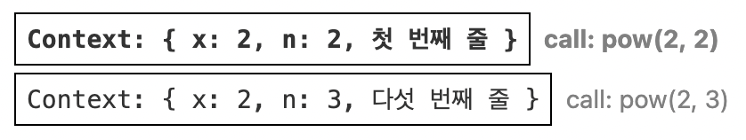
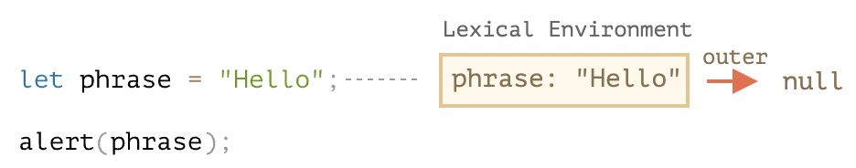

# [모던 JavaScript 튜토리얼 - 코어 자바스크립트] 6. 함수 심화학습

> https://ko.javascript.info/advanced-functions


## 6.1 재귀와 스택

> https://ko.javascript.info/recursion


- 재귀 깊이(recursion depth)
  - 가장 처음 하는 호출을 포함한 중첩 호출의 최대 개수
- 자바스크립트 엔진은 최대 재귀 깊이를 제한합니다. 
  - 만개 정도까진 확실히 허용하고, 엔진에 따라 이보다 더 많은 깊이를 허용하는 경우도 있습니다.
  - 하지만 대다수의 엔진이 십만까지는 다루지 못합니다. 
  - 이런 제한을 완화하려고 엔진 내부에서 자동으로 'tail calls optimization’라는 최적화를 수행하긴 하지만, 모든 곳에 적용되는 것은 아니고 간단한 경우에만 적용됩니다.
- 재귀 깊이 제한 때문에 재귀를 실제 적용하는데 제약이 있긴 하지만, 재귀는 여전히 광범위하게 사용되고 있습니다. 
  - 재귀를 사용하면, 간결하고 유지보수가 쉬운 코드를 만들 수 있기 때문입니다.


### 실행 컨텍스트와 스택

- 실제 재귀 호출이 어떻게 동작하는지 알아봅시다. 이를 위해서 함수의 내부 동작에 대해 살펴보도록 하겠습니다.

- 실행 중인 함수의 실행 절차에 대한 정보는 해당 함수의 *실행 컨텍스트(execution context)* 에 저장됩니다.

- [실행 컨텍스트](https://tc39.github.io/ecma262/#sec-execution-contexts)는 함수 실행에 대한 세부 정보를 담고 있는 내부 데이터 구조입니다. 

  - 제어 흐름의 현재 위치, 변수의 현재 값, `this`의 값(여기선 다루지 않음) 등 상세 내부 정보가 실행 컨텍스트에 저장됩니다.
  - 함수 호출 일 회당 정확히 하나의 실행 컨텍스트가 생성됩니다.

- 함수 내부에 중첩 호출이 있을 때는 아래와 같은 절차가 수행됩니다.

  - 현재 함수의 실행이 일시 중지됩니다.
  - 중지된 함수와 연관된 실행 컨텍스트는 *실행 컨텍스트 스택(execution context stack)* 이라는 특별한 자료 구조에 저장됩니다.
  - 중첩 호출이 실행됩니다.
  - 중첩 호출 실행이 끝난 이후 실행 컨텍스트 스택에서 일시 중단한 함수의 실행 컨텍스트를 꺼내오고, 중단한 함수의 실행을 다시 이어갑니다.

  

```js
// pow 재귀 함수
function pow(x, n) {
  if (n == 1) {
    return x;
  } else {
    return x * pow(x, n - 1);
  }
}

alert( pow(2, 3) );
```

- 이제 `pow (2, 3)`가 호출되면 실행 컨텍스트에서 무슨 일이 일어나는지 살펴봅시다.


#### `pow(2, 3)`

- `pow (2, 3)`를 호출하는 순간, 실행 컨텍스트엔 변수 `x = 2, n = 3`이 저장되고, 실행 흐름은 함수의 첫 번째 줄에 위치합니다.

- 이를 도식화하면 다음과 같습니다.

  

  - 위 그림은  함수 실행이 시작되는 순간을 나타낸 것입니다. 지금 상태론 조건 `n == 1`을 만족하지 못하므로 실행 흐름은 `if`의 두 번째 분기로 넘어갑니다.

- 변수는 동일하지만, 실행 흐름의 위치가 변경되면서 실행 컨텍스트도 다음과 같이 변경됩니다.

  

  - `x * pow (x, n - 1)`을 계산하려면 새로운 인수가 들어가는 `pow`의 서브 호출(subcall), `pow (2, 2)`을 만들어야 합니다.

   

#### `pow(2, 2)`

- 중첩 호출을 하기 위해, 자바스크립트는 *실행 컨텍스트 스택* 에 현재 실행 컨텍스트를 저장합니다.

- 지금 보고 있는 예시에선 실행 컨텍스트 스택에 동일한 함수 `pow`를 호출하였는데, 이는 중요치 않습니다. 모든 함수에 대해 아래 프로세스가 똑같이 적용됩니다.

  1. 스택 최상단에 현재 컨텍스트가 '기록’됩니다.
  2. 서브 호출을 위한 새로운 컨텍스트가 만들어집니다.
  3. 서브 호출이 완료되면. 기존 컨텍스트를 스택에서 꺼내(pop) 실행을 이어나갑니다.

- 다음은 서브 호출 `pow (2, 2)`이 시작될 때의 실행 컨텍스트 스택입니다.

  

- 굵은 테두리로 표시한 새 실행 컨텍스트는 상단에, 기존 컨텍스트는 하단에 있네요.

- 이전 컨텍스트에 변수 정보, 코드가 일시 중단된 줄에 대한 정보가 저장되어있기 때문에 서브 호출이 끝났을 때 이전 컨텍스트가 문제없이 다시 시작됩니다.

> **주의:**
>
> - 예시엔 한 줄에 서브 호출 하나만 있기 때문에, 그림에서 '줄’이라는 단어를 사용했습니다. 
> - 하지만 한 줄에는 `pow(…) + pow(…) + somethingElse(…)` 같이 복수의 서브 호출이 있을 수 있습니다.
>
> 따라서 좀 더 정확히는 실행이 '서브 호출 바로 직후’에 시작된다고 이야기 할 수 있습니다.


#### `pow(2, 1)`

- 동일한 과정이 다시 반복됩니다. 다섯 번째 줄에서 인수 `x = 2`, `n = 1`과 함께 새로운 서브 호출이 만들어집니다.

- 새로운 실행 컨텍스트가 만들어지고, 이전 실행 컨텍스트는 스택 최상단에 올라갑니다(push).

  


#### 실행 종료

- `pow (2, 1)`가 실행될 땐 상황이 달라집니다. 

  - 이전과는 달리 조건 `n == 1`을 만족시키므로 `if`문의 첫 번째 분기가 실행됩니다.
  - 이젠 호출해야 할 중첩 호출이 없습니다. 따라서 함수는 종료되고 `2`가 반환됩니다.

- 함수가 종료되었기 때문에 이에 상응하는 실행 컨텍스트는 쓸모가 없어졌습니다. 

  - 따라서 해당 실행 컨텍스트는 메모리에서 삭제됩니다. 스택 맨 위엔 이전의 실행 컨텍스가 위치하게 됩니다.

  

- `pow (2, 2)`의 실행이 다시 시작됩니다. 

  - 서브 호출 `pow (2, 1)`의 결과를 알고 있으므로, 쉽게 `x * pow (x, n - 1)`를 계산해 `4`를 반환합니다.
  - 그리고 다시 이전 컨텍스트가 스택 최상단에 위치하게 됩니다.

  

- 마지막 실행 컨텍스트까지 처리되면 `pow (2, 3) = 8`이라는 결과가 도출됩니다.

- 지금 보신 예시의 재귀 깊이는 **3** 입니다.

  - 도식을 통해 살펴보았듯이, **<u>재귀 깊이는 스택에 들어가는 실행 컨텍스트 수의 최댓값과 같습니다.</u>**

- 실행 컨텍스트는 메모리를 차지하므로 재귀를 사용할 땐 메모리 요구사항에 유의해야 합니다. 

  - `n`을 늘리면 `n`이 줄어들 때마다 만들어지는 `n`개의 실행 컨텍스트가 저장될 메모리 공간이 필요하기 때문입니다.


## [요약](https://ko.javascript.info/recursion#ref-739)

지금까지 나온 용어를 정리해봅시다.

- *재귀(recursion)* – 함수 내부에서 자기 자신을 호출하는 것을 나타내는 프로그래밍 용어입니다. 재귀 함수는 우아하게 원하는 문제를 해결할 때 자주 쓰이곤 합니다.

  함수가 자신을 호출하는 단계를 *재귀 단계(recursion step)* 라고 부릅니다. basis라고도 불리는 재귀의 *베이스(base)* 는 작업을 아주 간단하게 만들어서 함수가 더 이상은 서브 호출을 만들지 않게 해주는 인수입니다.

- [재귀적으로 정의된](https://en.wikipedia.org/wiki/Recursive_data_type) 자료 구조는 자기 자신을 이용해 자료 구조를 정의합니다.

  재귀적으로 정의된 자료구조에 속하는 연결 리스트는 리스트 혹은 null을 참조하는 객체로 이루어진 데이터 구조를 사용해 정의됩니다.

  ```javascript
  list = {value, next -> list}
  ```

  HTML 문서의 HTML 요소 트리나 위에서 다룬 부서를 나타내는 트리 역시 재귀적인 자료 구조로 만들었습니다. 이렇게 재귀적인 자료 구조를 사용하면 가지가 여러 개인데 각 가지가 여러 가지로 뻗쳐 나가는 형태로 자료 구조를 만들 수 있습니다.

  예시에서 구현한 `sumSalary`같은 재귀 함수를 사용하면 각 분기(가지)를 순회할 수 있습니다.

모든 재귀 함수는 반복문을 사용한 함수로 다시 작성할 수 있습니다. 최적화를 위해 반복문으로 다시 작성해야 할 수도 있죠. 그러나 상당수 작업은 재귀를 사용해도 만족할 만큼 빠르게 동작합니다. 재귀를 사용하면 구현과 유지보수가 쉽다는 장점도 있습니다.


## 6.2 나머지 매개변수와 전개 문법

> https://ko.javascript.info/rest-parameters-spread

**도입**

- 상당수의 자바스크립트 내장 함수는 인수의 개수에 제약을 두지 않습니다.
  - `Math.max(arg1, arg2, ..., argN)` – 인수 중 가장 큰 수를 반환합니다.
  - `Object.assign(dest, src1, ..., srcN)` – `src1..N`의 프로퍼티를 `dest`로 복사합니다.
  - 기타 등등
- 이번 챕터에서는 이렇게 임의의 수의 인수를 받는 방법에 대해 알아보겠습니다. 또한 함수의 매개변수에 배열을 전달하는 방법에 대해서도 알아보겠습니다.


### 나머지 매개변수 `...`

- 함수 정의 방법과 상관없이 함수에 넘겨주는 인수의 개수엔 제약이 없습니다.

- 아래와 같이 말이죠.

  ```js
  function sum(a, b) {
    return a + b;
  }
  
  alert( sum(1, 2, 3, 4, 5) );
  ```

  - 함수를 정의할 땐 인수를 두 개만 받도록 하고, 실제 함수를 호출할 땐 이보다 더 많은 ‘여분의’ 인수를 전달했지만, 에러가 발생하지 않았습니다. 
  - 다만 반환 값은 처음 두 개의 인수만을 사용해 계산됩니다.

- 이렇게 여분의 매개변수는 그 값들을 담을 배열 이름을 마침표 세 개 `...`뒤에 붙여주면 함수 선언부에 포함시킬 수 있습니다. 

  - 이때 마침표 세 개 `...`는 "<u>나머지 매개변수들을 한데 모아 배열에 집어넣어라</u>."는 것을 의미합니다.

- 아래 예시에선 모든 인수가 배열 `args`에 모입니다.

  ```javascript
  function sumAll(...args) { // args는 배열의 이름입니다.
    let sum = 0;
  
    for (let arg of args) sum += arg;
  
    return sum;
  }
  
  alert( sumAll(1) ); // 1
  alert( sumAll(1, 2) ); // 3
  alert( sumAll(1, 2, 3) ); // 6
  ```

- 앞부분의 매개변수는 변수로, 그 이외의 매개변수들은 배열로 모을 수도 있습니다.

  - 아래 예시에선 처음 두 인수는 변수에, 나머지 인수들은 `titles`이라는 배열에 할당됩니다.

  ```javascript
  function showName(firstName, lastName, ...titles) {
    alert( firstName + ' ' + lastName ); // Julius Caesar
  
    // 나머지 인수들은 배열 titles의 요소가 됩니다.
    // titles = ["Consul", "Imperator"]
    alert( titles[0] ); // Consul
    alert( titles[1] ); // Imperator
    alert( titles.length ); // 2
  }
  
  showName("Julius", "Caesar", "Consul", "Imperator");
  ```


> **나머지 매개변수는 항상 마지막에 있어야 합니다.**
>
> 나머지 매개변수는 남아있는 인수를 모으는 역할을 하므로 아래 예시에선 에러가 발생합니다.
>
> ```javascript
> function f(arg1, ...rest, arg2) { // ...rest 후에 arg2가 있으면 안 됩니다.
>   // 에러
> }
> ```
>
> `...rest`는 항상 마지막에 있어야 합니다.


### `arguments` 변수

- `arguemnts`라는 특별한 유사 배열 객체(array-like object)를 이용하면 인덱스를 사용해 모든 인수에 접근할 수 있습니다.

  ```javascript
  function showName() {
    alert( arguments.length );
    alert( arguments[0] );
    alert( arguments[1] );
  
    // arguments는 이터러블 객체이기 때문에
    // for(let arg of arguments) alert(arg); 를 사용해 인수를 나열할 수 있습니다.
  }
  
  // 2, Julius, Caesar가 출력됨
  showName("Julius", "Caesar");
  
  // 1, Bora, undefined가 출력됨(두 번째 인수는 없음)
  showName("Bora");
  ```

  - 나머지 매개변수는 비교적 최신의 문법입니다. 
    - 과거엔 함수의 인수 전체를 얻어내는 방법이 `arguments`를 사용하는 것밖에 없었습니다. 
    - 물론 지금도 `arguments`를 사용할 수 있습니다. 오래된 코드를 보다 보면 `arguments`를 만나게 되죠.
  - `arguments`는 유사 배열 객체이면서 이터러블(반복 가능한) 객체입니다. 어쨌든 배열은 아니죠.
    - 따라서 배열 메서드를 사용할 수 없다는 단점이 있습니다. 
    - `arguments.map (...)`을 호출할 수 없죠.
    - 여기에 더하여 `arguments`는 인수 전체를 담기 때문에 나머지 매개변수처럼 인수의 일부만 사용할 수 없다는 단점도 있습니다.
    - 따라서 배열 메서드를 사용하고 싶거나 인수 일부만 사용하고자 할 때는 나머지 매개변수를 사용하는 것이 좋습니다.

> **화살표 함수에는 `arguments`가 없습니다.**
>
> - 화살표 함수에서 `arguments` 객체에 접근하면, 외부에 있는 ‘일반’ 함수의 arguments 객체를 가져옵니다.
>
> - 예시:
>
>   ```js
>   function f() {
>     let showArg = () => alert(arguments[0]);
>     showArg();
>   }
>   
>   f(1); // 1
>   ```
>
>   - 앞서 배운 바와 같이 화살표 함수는 자체 `this`를 가지지 않습니다. 
>   - 여기에 더하여 `arguments` 객체도 없다는 것을 위 예시를 통해 확인해 보았습니다.


### spread 문법

- 지금까지 매개변수 목록을 배열로 가져오는 방법에 대해 살펴보았습니다.

- 그런데 개발을 하다 보면 반대되는 기능이 필요할 때가 생깁니다. 배열을 통째로 매개변수에 넘겨주는 것 같이 말이죠.

- 예시를 통해 이런 경우를 살펴봅시다. 내장 함수 [Math.max](https://developer.mozilla.org/ko/docs/Web/JavaScript/Reference/Global_Objects/Math/max)는 인수로 받은 숫자 중 가장 큰 숫자를 반환합니다.

  ```javascript
  alert( Math.max(3, 5, 1) ); // 5
  ```

- 배열 `[3, 5, 1]`가 있고, 이 배열을 대상으로 `Math.max`를 호출하고 싶다고 가정해봅시다.

  - 아무런 조작 없이 배열을 ‘있는 그대로’ `Math.max`에 넘기면 원하는 대로 동작하지 않습니다. `Math.max`는 배열이 아닌 숫자 목록을 인수로 받기 때문입니다.

  ```javascript
  let arr = [3, 5, 1];
  
  alert( Math.max(arr) ); // NaN
  ```

- `Math.max (arr[0], arr[1], arr[2])` 처럼 배열 요소를 수동으로 나열하는 방법도 있긴 한데 배열 길이를 알 수 없을 때는 이마저도 불가능합니다. 

  - 스크립트가 돌아갈 때 실제 넘어오는 배열의 길이는 아주 길 수도 있고, 아예 빈 배열일 수도 있기 때문입니다. 
  - 수동으로 이걸 다 처리하다 보면 코드가 지저분해지겠죠.

- ***전개 문법(spread syntax)*** 은 이럴 때 사용하기 위해 만들어졌습니다. 

  - `...`를 사용하기 때문에 나머지 매개변수와 비슷해 보이지만, 전개 문법은 나머지 매개변수와 반대의 역할을 합니다.
  - 함수를 호출할 때 `... arr`를 사용하면, 이터러블 객체 `arr`이 인수 목록으로 '확장’됩니다.

- `Math.max`를 사용한 예시로 다시 돌아가 봅시다.

  ```javascript
  let arr = [3, 5, 1];
  
  alert( Math.max(...arr) ); // 5 (전개 문법이 배열을 인수 목록으로 바꿔주었습니다.)
  ```

- 아래와 같이 이터러블 객체 여러 개를 전달하는 것도 가능합니다.

  ```javascript
  let arr1 = [1, -2, 3, 4];
  let arr2 = [8, 3, -8, 1];
  
  alert( Math.max(...arr1, ...arr2) ); // 8
  ```

- 전개 문법을 평범한 값과 혼합해 사용하는 것도 가능하죠.

  ```javascript
  let arr1 = [1, -2, 3, 4];
  let arr2 = [8, 3, -8, 1];
  
  alert( Math.max(1, ...arr1, 2, ...arr2, 25) ); // 25
  ```

- 배열을 합칠 때 전개 문법을 활용할 수도 있습니다.

  ```javascript
  let arr = [3, 5, 1];
  let arr2 = [8, 9, 15];
  
  let merged = [0, ...arr, 2, ...arr2];
  
  alert(merged); // 0,3,5,1,2,8,9,15 (0, arr, 2, arr2 순서로 합쳐집니다.)
  ```


- 앞선 예시들에선 배열을 대상으로 전개 문법이 어떻게 동작하는지 살펴보았습니다. 

  - 그런데 <u>배열이 아니더라도 이터러블 객체이면 전개 문법을 사용할 수 있습니다.</u>

- 전개 문법을 사용해 문자열을 문자 배열로 변환 시켜 보겠습니다.

  ```javascript
  let str = "Hello";
  
  alert( [...str] ); // H,e,l,l,o
  ```

- 전개 문법은 `for..of`와 같은 방식으로 내부에서 iterator(반복자)를 사용해 요소를 수집합니다.

  - 문자열에 `for..of`를 사용하면 문자열을 구성하는 문자가 반환됩니다. 
  - `...str`도 `"H","e","l","l","o"`가 되는데, 이 문자 목록은 배열 초기자(array initializer) `[...str]`로 전달됩니다.

- 메서드 `Array.from`은 문자열 같은 이터러블 객체를 배열로 바꿔주기 때문에 `Array.from`을 사용해도 동일한 작업을 할 수 있습니다.

  ```javascript
  let str = "Hello";
  
  // Array.from은 이터러블을 배열로 바꿔줍니다.
  alert( Array.from(str) ); // H,e,l,l,o
  ```

  - `[...str]`와 동일한 결과가 출력되는 것을 확인할 수 있습니다.

  

- 그런데 `Array.from(obj)`와 `[...obj]`에는 다음과 같은 미묘한 차이가 있습니다.

  - `Array.from`은 유사 배열 객체와 이터러블 객체 둘 다에 사용할 수 있습니다.
  - 전개 문법은 이터러블 객체에만 사용할 수 있습니다.
  - 이런 이유때문에 무언가를 배열로 바꿀 때는 전개 문법보다 `Array.from`이 보편적으로 사용됩니다.


### 배열이나 객체의 복사본 만들기


- 배열 복사본 만들기

  - [예전](https://ko.javascript.info/object-copy#cloning-and-merging-object-assign)에 `Object.assign()`에 대해 얘기했던 것을 기억하십니까?

  - spread 문법을 사용하면 `Object.assing()`이 하는 일을 똑같이 할 수 있습니다.

    ```js
    let arr = [1, 2, 3];
    let arrCopy = [...arr]; // spread the array into a list of parameters
                            // then put the result into a new array
    
    // do the arrays have the same contents?
    alert(JSON.stringify(arr) === JSON.stringify(arrCopy)); // true
    
    // are the arrays equal?
    alert(arr === arrCopy); // false (not same reference)
    
    // modifying our initial array does not modify the copy:
    arr.push(4);
    alert(arr); // 1, 2, 3, 4
    alert(arrCopy); // 1, 2, 3
    ```

    - 단순한 참조값 복사가 아닌 깊은 복사를 할 수 있습니다.

    

- 객체 복사본 만들기

  - 배열뿐만 아니라 객체도 spread를 이용해 복사할 수 있습니다.

    ```javascript
    let obj = { a: 1, b: 2, c: 3 };
    let objCopy = { ...obj }; // spread the object into a list of parameters
                              // then return the result in a new object
    
    // do the objects have the same contents?
    alert(JSON.stringify(obj) === JSON.stringify(objCopy)); // true
    
    // are the objects equal?
    alert(obj === objCopy); // false (not same reference)
    
    // modifying our initial object does not modify the copy:
    obj.d = 4;
    alert(JSON.stringify(obj)); // {"a":1,"b":2,"c":3,"d":4}
    alert(JSON.stringify(objCopy)); // {"a":1,"b":2,"c":3}
    ```


- 위와 같이 spread 문법을 사용해 복사본을 만드는 것이
  - `let objCopy = Object.assign({}, obj);` 또는 `let arrCopy = Object.assign([], arr);`처럼 
  - `Object.assign()`을 이용하는 것보다 간단합니다.


### 요약

`"..."`은 나머지 매개변수나 전개 문법으로 사용됩니다.

나머지 매개변수와 전개 문법은 아래의 방법으로 구분할 수 있습니다.

- `...`이 함수 매개변수의 끝에 있으면 인수 목록의 나머지를 배열로 모아주는 '나머지 매개변수’입니다.
- `...`이 함수 호출 시 사용되면 배열을 목록으로 확장해주는 '전개 문법’입니다.

사용 패턴:

- 인수 개수에 제한이 없는 함수를 만들 때 나머지 매개변수를 사용합니다.
- 다수의 인수를 받는 함수에 배열을 전달할 때 전개 문법을 사용합니다.

둘을 함께 사용하면 매개변수 목록과 배열 간 전환을 쉽게 할 수 있습니다.

조금 오래된 방법이긴 하지만 `arguments`라는 반복 가능한 유사 배열 객체를 사용해도 인수 모두를 사용할 수 있습니다.


## 6.3 변수의 유효범위와 클로저

- 자바스크립트는 함수 지향 언어입니다. 
  - 이런 특징은 개발자에게 많은 자유를 줍니다. 함수를 동적으로 생성할 수 있고, 생성한 함수를 다른 함수에 인수로 넘길 수 있으며, 생성된 곳이 아닌 곳에서 함수를 호출할 수도 있기 때문입니다.
- 함수 내부에서 함수 외부에 있는 변수에 접근할 수 있다는 사실은 앞서 학습해서 알고 계실 겁니다.
- 그런데 함수가 생성된 이후에 외부 변수가 변경되면 어떤 일이 발생할까요? 함수는 새로운 값을 가져올까요? 아니면 생성 시점 이전의 값을 가져올까요?
- 매개변수를 통해 함수를 넘기고 이 함수를 저 멀리 떨어진 코드에서 호출할 땐 어떤 일이 발생할까요? 함수는 호출되는 곳을 기준으로 외부 변수에 접근할까요?
- 이젠 이런 간단한 시나리오부터 시작해 좀 더 복잡한 시나리오를 다룰 수 있도록 지식을 확장해 봅시다.


> **여기선 `let`, `const`로 선언한 변수만 다룹니다.**
>
> 자바스크립트에서는 3개의 키워드를 사용해 변수를 선언할 수 있습니다. 모던한 방식인 `let`, `const`가 있고, 과거의 잔재인 `var`도 있습니다.
>
> - 이번 주제의 모든 예시에선 `let`으로 선언한 변수를 사용할 예정입니다.
> - `const`로 선언한 변수 역시 `let` 변수와 동일하게 동작합니다. 따라서 예시의 `let`을 `const`로 바꿔도 동일한 동작을 기대할 수 있습니다.
> - `var`는 `let`과 `const`로 선언한 변수와 몇 가지 중요한 차이가 있습니다. 자세한 내용은 [오래된 'var'](https://ko.javascript.info/var)에서 다루겠습니다.


### 코드 블록

- 코드 블록 `{...}` 안에서 선언한 변수는 블록 안에서만 사용할 수 있습니다.

- 예시

  ```javascript
  {
    // 지역 변수를 선언하고 몇 가지 조작을 했지만 그 결과를 밖에서 볼 수 없습니다.
  
    let message = "안녕하세요."; // 블록 내에서만 변숫값을 얻을 수 있습니다.
  
    alert(message); // 안녕하세요.
  }
  
  alert(message); // ReferenceError: message is not defined
  ```

  - 이런 블록의 특징은 특정 작업을 수행하는 코드를 한데 묶어두는 용도로 활용할 수 있습니다. 
  - 블록 안엔 작업 수행에만 필요한 변수가 들어갑니다.

  ```javascript
  {
    // 메시지 출력
    let message = "안녕하세요.";
    alert(message);
  }
  
  {
    // 또 다른 메시지 출력
    let message = "안녕히 가세요.";
    alert(message);
  }
  ```

> **블록이 없으면 에러가 발생합니다.**
>
> 이미 선언된 변수와 동일한 이름을 가진 변수를 별도의 블록 없이 `let`으로 선언하면 에러가 발생합니다.
>
> ```javascript
> // 메시지 출력
> let message = "안녕하세요.";
> alert(message);
> 
> // 또 다른 메시지 출력
> let message = "안녕히 가세요."; // SyntaxError: Identifier 'message' has already been declared
> alert(message);
> ```

- `if`, `for`, `while` 등에서도 마찬가지로 `{...}` 안에서 선언한 변수는 오직 블록 안에서만 접근 가능합니다.

  ```js
  if (true) {
    let phrase = "안녕하세요!";
    alert(phrase); // 안녕하세요!
  }
  alert(phrase); // ReferenceError: phrase is not defined
  ```

  - `if` 블록 밖에 있는 `alert`는 `phrase`에 접근할 수 없기 때문에 위 예시를 실행하면 에러가 발생합니다.
  - 이런 특징은 변수의 유효 범위를 블록 범위, 특히 `if` 분기문 범위로 한정시킬 수 있어서 아주 유용합니다.

- `if` 뿐만 아니라 `for`, `while` 반복문에서도 동일한 특징이 적용됩니다.

  ```js
  for (let i = 0; i < 3; i++) {
    // 변수 i는 for 안에서만 사용할 수 있습니다.
    alert(i); // 0, 1, 2가 출력
  }
  
  alert(i); // ReferenceError: i is not defined
  ```

  - 참고로 `for`문에서 `for` 옆 괄호 안에서 선언한 변수(예시에서 `let i`)는 `{...}` 밖에 있긴 하지만 블록 `{...}`에 속하는 코드로 취급됩니다.


### 중첩 함수

- <u>함수 내부에서 선언한 함수</u>는 **‘중첩(nested)’ 함수**라고 부릅니다.

  - 중첩 함수는 아래와 같이 코드를 정돈하는데 사용할 수 있습니다.

    ```javascript
    function sayHiBye(firstName, lastName) {
    
      // 헬퍼(helper) 중첩 함수
      function getFullName() {
        return firstName + " " + lastName;
      }
    
      alert( "Hello, " + getFullName() );
      alert( "Bye, " + getFullName() );
    
    }
    ```

  - 위 예시에서 <u>외부 변수에 접근</u>해 이름 전체를 반환해주는 *중첩* 함수 `getFullName()`은 편의상 만든 함수입니다. 이렇게 자바스크립트에선 중첩 함수가 흔히 사용됩니다.

- 중첩 함수는 새로운 객체의 프로퍼티 형태나 중첩 함수 그 자체로 반환될 수 있다는 점에서 흥미롭습니다. 

  - 이렇게 반환된 중첩 함수는 어디서든 호출해 사용할 수 있습니다. 
  - 물론 이때도 외부 변수에 접근할 수 있다는 사실은 변함없습니다.

- 아래 함수 `makeCounter`는 호출될 때마다 다음 숫자를 반환해주는 ‘카운터’ 함수를 만듭니다.

  ```javascript
  function makeCounter() {
    let count = 0;
  
    return function() {
      return count++;
    };
  }
  
  let counter = makeCounter();
  
  alert( counter() ); // 0
  alert( counter() ); // 1
  alert( counter() ); // 2
  ```

  - 예시의 `makeCounter`는 아주 단순하지만, 여기에 약간의 변형을 가하면 [난수 생성기](https://en.wikipedia.org/wiki/Pseudorandom_number_generator) 같은 실용성 있는 함수를 만들 수 있습니다.
  - 그런데 `makeCounter`를 살펴보다 보면 “`counter`를 여러 개 만들었을 때, 이 함수들은 서로 독립적일까? 함수와 중첩 함수 내 `count` 변수엔 어떤 값이 할당될까?” 같은 의문이 들기 마련입니다.
  - 이런 의문을 해결할 수 있게 되면 자바스크립트 숙련도가 크게 올라갑니다. 좀 더 복잡한 시나리오도 다룰 수 있게 되죠. 자, 긴말할 필요 없이 바로 시작해봅시다.


### 렉시컬 환경

- 명확한 이해를 돕기 위해 설명을 몇 개의 단계로 나눠서 진행하겠습니다.


#### 단계 1. 변수

- 자바스크립트에선 
  - 실행 중인 함수, 
  - 코드 블록 `{...}`, 
  - 스크립트 전체는 
- *렉시컬 환경(Lexical Environment)* 이라 불리는 내부 숨김 연관 객체(internal hidden associated object)를 갖습니다.


- 렉시컬 환경 객체는 두 부분으로 구성됩니다.
  1. *환경 레코드(Environment Record)* – 모든 지역 변수를 프로퍼티로 저장하고 있는 객체입니다. `this` 값과 같은 기타 정보도 여기에 저장됩니다.
  2. *외부 렉시컬 환경(Outer Lexical Environment)* 에 대한 참조 – 외부 코드와 연관됨


- **’변수’는 특수 내부 객체인 `환경 레코드`의 프로퍼티일 뿐입니다. '변수를 가져오거나 변경’하는 것은 '환경 레코드의 프로퍼티를 가져오거나 변경’함을 의미합니다.**

- 아래 두 줄짜리 코드엔 렉시컬 환경이 하나만 존재합니다.

  

- 이렇게 <u>스크립트 전체와 관련된</u> 렉시컬 환경은 **전역 렉시컬 환경(global Lexical Environment)**이라고 합니다.

- 위 그림에서 네모 상자는 변수가 저장되는 환경 레코드를 나타내고 붉은 화살표는 외부 렉시컬 환경에 대한 참조를 나타냅니다. 

  - 전역 렉시컬 환경은 외부 참조를 갖지 않기 때문에 화살표가 `null`을 가리키는 걸 확인할 수 있습니다.


- 코드가 실행되고 실행 흐름이 이어져 나가면서 렉시컬 환경은 변화합니다.

- 좀 더 긴 코드를 살펴봅시다.

  

  - 우측의 네모 상자들은 코드가 한 줄, 한 줄 실행될 때마다 전역 렉시컬 환경이 어떻게 변화하는지 보여줍니다.
    1. 스크립트가 시작되면 스크립트 내에서 선언한 변수 전체가 렉시컬 환경에 올라갑니다(pre-populated).
       - 이때 변수의 상태는 특수 내부 상태(special internal state)인 'uninitialized’가 됩니다. 자바스크립트 엔진은 uninitialized 상태의 변수를 인지하긴 하지만, `let`을 만나기 전까진 이 변수를 참조할 수 없습니다.
    2. `let phrase`가 나타났네요. 아직 값을 할당하기 전이기 때문에 프로퍼티 값은 `undefined`입니다. `phrase`는 이 시점 이후부터 사용할 수 있습니다.
    3. `phrase`에 값이 할당되었습니다.
    4. `phrase`의 값이 변경되었습니다.


- 아직까진 어려운 게 없어 보이네요. 지금까지 배운 내용을 요약해 봅시다.
  - 변수는 특수 내부 객체인 환경 레코드의 프로퍼티입니다. 환경 레코드는 현재 실행 중인 함수와 코드 블록, 스크립트와 연관되어 있습니다.
  - 변수를 변경하면 환경 레코드의 프로퍼티가 변경됩니다.


> **렉시컬 환경은 명세서에만 존재합니다.**
>
> '렉시컬 환경’은 [명세서](https://tc39.es/ecma262/#sec-lexical-environments)에서 자바스크립트가 어떻게 동작하는지 설명하는 데 쓰이는 ‘이론상의’ 객체입니다. 따라서 코드를 사용해 직접 렉시컬 환경을 얻거나 조작하는 것은 불가능합니다.
>
> 자바스크립트 엔진들은 명세서에 언급된 사항을 준수하면서 엔진 고유의 방법을 사용해 렉시컬 환경을 최적화합니다. 사용하지 않는 변수를 버려 메모리를 절약하거나 다양한 내부 트릭을 써서 말이죠.


#### 단계 2. 함수 선언문

- 함수는 변수와 마찬가지로 값입니다.

- **다만 함수 선언문(function declaration)으로 선언한 함수는 일반 변수와는 달리 <u>바로 초기화된다</u>는 점에서 차이가 있습니다.**

  - 함수 선언문으로 선언한 함수는 렉시컬 환경이 만들어지는 즉시 사용할 수 있습니다. 
  - 변수는 `let`을 만나 선언이 될 때까지 사용할 수 없지만 말이죠.

- 선언되기 전에도 함수를 사용할 수 있는 것은 바로 이 때문입니다.

- 아래 그림은 스크립트에 함수를 추가했을 때 전역 렉시컬 환경 초기 상태가 어떻게 변하는지 보여줍니다.

  

  - 이런 동작 방식은 함수 선언문으로 정의한 함수에만 적용됩니다. 
  - `let say = function(name)...`같이 함수를 변수에 할당한 함수 표현식(function expression)은 해당하지 않습니다.


#### 단계 3. 내부와 외부 렉시컬 환경

- 함수를 호출해 실행하면 새로운 렉시컬 환경이 자동으로 만들어집니다. 

  - 이 렉시컬 환경엔 함수 호출 시 넘겨받은 매개변수와 함수의 지역 변수가 저장됩니다.

- `say("John")`을 호출하면 아래와 같은 내부 변화가 일어납니다(현재 실행 흐름은 붉은색 화살표로 나타낸 줄에 멈춰있는 상황입니다).

  

- 함수가 호출 중인 동안엔 호출 중인 함수를 위한 **내부 렉시컬 환경**과 내부 렉시컬 환경이 가리키는 **외부 렉시컬 환경**을 갖게 됩니다.
  - 예시의 내부 렉시컬 환경은 현재 실행 중인 함수인 `say`에 상응합니다. 
    - 내부 렉시컬 환경엔 함수의 인자인 `name`으로부터 유래한 프로퍼티 하나만 있네요. `say("John")`을 호출했기 때문에, `name`의 값은 `"John"`이 됩니다.
  - 예시의 외부 렉시컬 환경은 전역 렉시컬 환경입니다. 전역 렉시컬 환경은 `phrase`와 함수 `say`를 프로퍼티로 갖습니다.
- 그리고 내부 렉시컬 환경은 `외부` 렉시컬 환경에 대한 참조를 갖습니다.


- **코드에서 변수에 접근할 땐, 먼저 내부 렉시컬 환경을 검색 범위로 잡습니다. **
- **내부 렉시컬 환경에서 원하는 변수를 찾지 못하면 검색 범위를 내부 렉시컬 환경이 참조하는 외부 렉시컬 환경으로 확장합니다. **
- **이 과정은 검색 범위가 전역 렉시컬 환경으로 확장될 때까지 반복됩니다.**
- 전역 렉시컬 환경에 도달할 때까지 변수를 찾지 못하면 엄격 모드에선 에러가 발생합니다. 
  - 참고로 비 엄격 모드에선 정의되지 않은 변수에 값을 할당하려고 하면 에러가 발생하는 대신 새로운 전역 변수가 만들어지는데, 이는 하위 호환성을 위해 남아있는 기능입니다.


- 예시와 그림을 보면서 변수 검색이 어떻게 진행되는지 다시 정리해 봅시다.

  - 
    함수 `say` 내부의 `alert`에서 변수 `name`에 접근할 땐, 먼저 내부 렉시컬 환경을 살펴봅니다. 내부 렉시컬 환경에서 변수 `name`을 찾았습니다.
  - `alert`에서 변수 `phrase`에 접근하려는데, `phrase`에 상응하는 프로퍼티가 내부 렉시컬 환경엔 없습니다. 
    - 따라서 검색 범위는 외부 렉시컬 환경으로 확장됩니다. 
    - 외부 렉시컬 환경에서 `phrase`를 찾았습니다.

  


#### 단계 4. 함수를 반환하는 함수

- `makeCounter` 예시로 돌아가 봅시다.

  ```javascript
  function makeCounter() {
    let count = 0;
  
    return function() {
      return count++;
    };
  }
  
  let counter = makeCounter();
  ```

  - `makeCounter()`를 호출하면 <u>호출할 때마다 새로운 렉시컬 환경 객체가 만들어지고</u> 여기에 `makeCounter`를 실행하는데 필요한 변수들이 저장됩니다.

- 위쪽에서 살펴본 `say("John")` 예시와 마찬가지로 `makeCounter()`를 호출할 때도 두 개의 렉시컬 환경이 만들어집니다.

  

  - 그런데 위쪽에서 살펴본 `say("John")` 예시와 `makeCounter()` 예시에는 차이점이 하나 있습니다. 
  - `makeCounter()`가 실행되는 도중엔 본문(`return count++`)이 한줄 짜리인 <u>중첩 함수가 만들어진다</u>는 점입니다. 
  - 현재는 중첩함수가 생성되기만 하고 실행은 되지 않은 상태입니다.

- 여기서 중요한 사실이 하나 있습니다. 

  - **<u>모든 함수는 함수가 생성된 곳의 렉시컬 환경을 기억한다</u>**는 점입니다. 
  - 함수는 `[[Environment]]`라 불리는 숨김 프로퍼티를 갖는데, 여기에 함수가 만들어진 곳의 렉시컬 환경에 대한 참조가 저장됩니다.

  

- 따라서 `counter.[[Environment]]`엔 `{count: 0}`이 있는 렉시컬 환경에 대한 참조가 저장됩니다. 

  - 호출 장소와 상관없이 함수가 자신이 태어난 곳을 기억할 수 있는 건 바로 이 `[[Environment]]` 프로퍼티 덕분입니다. 
  - `[[Environment]]`는 함수가 생성될 때 딱 한 번 값이 세팅되고 영원히 변하지 않습니다.

- `counter()`를 호출하면 각 호출마다 새로운 렉시컬 환경이 생성됩니다. 

  - 그리고 이 렉시컬 환경은 `counter.[[Environment]]`에 저장된 렉시컬 환경을 외부 렉시컬 환경으로서 참조합니다.

  

- 실행 흐름이 중첩 함수의 본문으로 넘어오면 `count` 변수가 필요한데, 

  - 먼저 자체 렉시컬 환경에서 변수를 찾습니다. 
  - <u>익명 중첩 함수엔 지역변수가 없기 때문에 이 렉시컬 환경은 비어있는 상황입니다</u>(`<empty>`). 
  - 이제 `counter()`의 렉시컬 환경이 참조하는 외부 렉시컬 환경에서 `count`를 찾아봅시다. `count`를 찾았습니다!
  - 이제 `count++`가 실행되면서 count 값이 1 증가해야하는데, **변숫값 갱신은 변수가 저장된 렉시컬 환경에서 이뤄집니다.**
  - 따라서 실행이 종료된 후의 상태는 다음과 같습니다.

  

  - `counter()`를 여러 번 호출하면 `count` 변수가 `2`, `3`으로 증가하는 이유가 바로 여기에 있습니다.


> **클로저**
>
> - '클로저(closure)'는 개발자라면 알고 있어야 할 프로그래밍 용어입니다.
>
> - [클로저](https://en.wikipedia.org/wiki/Closure_(computer_programming))는 **<u>외부 변수를 기억하고 이 외부 변수에 접근할 수 있는 함수</u>**를 의미합니다. 
> - 몇몇 언어에선 클로저를 구현하는 게 불가능하거나 특수한 방식으로 함수를 작성해야 클로저를 만들 수 있습니다. 
> - 하지만 자바스크립트에선 모든 함수가 자연스럽게 클로저가 됩니다. 
>   - 예외가 하나 있긴 한데 자세한 내용은 [new Function 문법](https://ko.javascript.info/new-function)에서 다루도록 하겠습니다.
>
> 
>
> - 요점을 정리해 봅시다. 
>   - 자바스크립트의 함수는 숨김 프로퍼티인 `[[Environment]]`를 이용해 자신이 어디서 만들어졌는지를 기억합니다. 
>   - 함수 본문에선 `[[Environment]]`를 사용해 외부 변수에 접근합니다.
>
> - 프런트엔드 개발자 채용 인터뷰에서 "클로저가 무엇입니까?"라는 질문을 받으면, 클로저의 정의를 말하고 자바스크립트에서 왜 모든 함수가 클로저인지에 관해 설명하면 될 것 같습니다. 
> - 이때 `[[Environment]]` 프로퍼티와 렉시컬 환경이 어떤 방식으로 동작하는지에 대한 설명을 덧붙이면 좋습니다.


### 가비지 컬렉션

- 함수 호출이 끝나면 함수에 대응하는 렉시컬 환경이 메모리에서 제거됩니다. 

  - 함수와 관련된 변수들은 이때 모두 사라지죠. 
  - 함수 호출이 끝나면 관련 변수를 참조할 수 없는 이유가 바로 여기에 있습니다. 
  - 자바스크립트에서 모든 객체는 도달 가능한 상태일 때만 메모리에 유지됩니다.

- 그런데 호출이 끝난 후에도 여전히 도달 가능한 <u>중첩 함수</u>가 있을 수 있습니다. 

  - 이때는 이 중첩함수의 `[[Environment]]` 프로퍼티에 외부 함수 렉시컬 환경에 대한 정보가 저장됩니다. 도달 가능한 상태가 되는 것이죠.
  - 함수 호출은 끝났지만 렉시컬 환경이 메모리에 유지되는 이유는 바로 이 때문입니다.

- 예시

  ```javascript
  function f() {
    let value = 123;
  
    return function() {
      alert(value);
    }
  }
  
  let g = f(); // g.[[Environment]]에 f() 호출 시 만들어지는
  // 렉시컬 환경 정보가 저장됩니다.
  ```


- 그런데 이렇게 중첩함수를 사용할 때는 주의할 점이 있습니다. 

  - `f()`를 여러 번 호출하고 그 결과를 어딘가에 저장하는 경우, 호출 시 만들어지는 <u>각 렉시컬 환경 모두가 메모리에 유지된다</u>는 점입니다. 

- 아래 예시를 실행하면 3개의 렉시컬 환경이 만들어지는데, 각 렉시컬 환경은 메모리에서 삭제되지 않습니다.

  ```javascript
  function f() {
    let value = Math.random();
  
    return function() { alert(value); };
  }
  
  // 배열 안의 세 함수는 각각 f()를 호출할 때 생성된
  // 렉시컬 환경과 연관 관계를 맺습니다.
  let arr = [f(), f(), f()];
  ```

  - 렉시컬 환경 객체는 다른 객체와 마찬가지로 도달할 수 없을 때 메모리에서 삭제됩니다. 
  - 해당 렉시컬 환경 객체를 참조하는 중첩 함수가 하나라도 있으면 사라지지 않죠.

- 아래 예시 같이 중첩 함수가 메모리에서 삭제되고 난 후에야, 이를 감싸는 렉시컬 환경(그리고 그 안의 변수인 `value`)도 메모리에서 제거됩니다.

  ```javascript
  function f() {
    let value = 123;
  
    return function() {
      alert(value);
    }
  }
  
  let g = f(); // g가 살아있는 동안엔 연관 렉시컬 환경도 메모리에 살아있습니다.
  
  g = null; // 도달할 수 없는 상태가 되었으므로 메모리에서 삭제됩니다.
  ```


### 최적화 프로세스

- 앞에서 보았듯이, 함수가 살아있는 동안엔 이론상으론 모든 외부 변수 역시 메모리에 유지됩니다.

- 그러나 실제로는 자바스크립트 엔진이 이를 지속해서 최적화합니다. 

  - 자바스크립트 엔진은 변수 사용을 분석하고 외부 변수가 사용되지 않는다고 판단되면 이를 메모리에서 제거합니다.
  - **디버깅 시, 최적화 과정에서 제거된 변수를 사용할 수 없다는 점은 V8 엔진(Chrome, Opera에서 쓰임)의 주요 부작용입니다.**

- Chrome 브라우저에서 개발자 도구를 열고 아래의 코드를 실행해봅시다.

- 그리고 실행이 일시 중지되었을 때 콘솔에 `alert(value)`를 입력해 보세요.

  ```javascript
  function f() {
    let value = Math.random();
  
    function g() {
      debugger; // Uncaught ReferenceError: value is not defined가 출력됩니다.
    }
  
    return g;
  }
  
  let g = f();
  g();
  ```

  - 정의되지 않은 변수라는 에러가 출력되네요! 이론상으로는 `value`에 접근할 수 있어야 하지만 최적화 대상이 되어서 이런 에러가 발생했습니다.

  

- 이런 외부 변수 최적화는 흥미로운 디버깅 이슈를 발생시키곤 합니다. 

  - 원인을 찾는 데 많은 시간을 허비하게 되면 흥미롭진 않겠지만 말이죠. 

- 발생할 수 있는 상황 중 하나를 여기서 소개해 드리도록 하겠습니다. 

- 예시를 실행해 의도한 변수 대신 같은 이름을 가진 다른 외부 변수가 출력되는 걸 확인해 봅시다.

  ```javascript
  let value = "이름이 같은 다른 변수";
  
  function f() {
    let value = "가장 가까운 변수";
  
    function g() {
      debugger; // 콘솔에 alert(value);를 입력하면 '이름이 같은 다른 변수'가 출력됩니다.
    }
  
    return g;
  }
  
  let g = f();
  g();
  ```

- 이 부작용은 버그라기보다는 V8만의 특별한 기능이라고 생각하시면 될 것 같습니다. 
- 미래에 이 기능은 변경될 수 있습니다. 
- 최적화 과정에서 외부 변수가 어떻게 처리되었는지 확인하고 싶다면 이 페이지로 돌아오셔서 예시를 실행해 보세요.


## 6.4 오래된 'var'

> https://ko.javascript.info/var

**도입**

- 오래된 스크립트를 읽을 때 도움을 주는 글입니다.

  - 새로운 코드를 작성할 때는 이 방법을 쓰면 안 됩니다.

- [변수](https://ko.javascript.info/variables)를 다룬 첫 번째 장에서 변수 선언 방법 세 가지를 배운 바 있습니다.

  1. `let`
  2. `const`
  3. `var`

- `var`로 선언한 변수는 `let`으로 선언한 변수와 유사합니다. 

- 대부분의 경우에 `let`을 `var`로, `var`를 `let`으로 바꿔도 큰 문제 없이 동작합니다.

  ```javascript
  var message = "안녕하세요.";
  alert(message); // 안녕하세요.
  ```

- 하지만 `var`는 초기 자바스크립트 구현 방식 때문에 `let`과 `const`로 선언한 변수와는 다른 방식으로 동작합니다. 
- 근래엔 `var`를 쓰지 않아서 이를 만나는 건 흔치 않은 일이지만, `var`는 오래된 스크립트에서 당신을 기다리고 있는 <u>괴물</u> 같은 존재입니다.


### 'var'는 블록 스코프가 없습니다

- `var`로 선언한 변수의 스코프는 <u>함수 스코프</u>이거나 <u>전역 스코프</u>입니다. 

  - 블록 기준으로 스코프가 생기지 않기 때문에 블록 밖에서 접근 가능합니다.

  ```javascript
  if (true) {
    var test = true; // 'let' 대신 'var'를 사용했습니다.
  }
  
  alert(test); // true(if 문이 끝났어도 변수에 여전히 접근할 수 있음)
  ```
  - `var`는 코드 블록을 무시하기 때문에 `test`는 전역 변수가 됩니다. 전역 스코프에서 이 변수에 접근할 수 있죠.

- 두 번째 행에서 `var test`가 아닌 `let test`를 사용했다면, 변수 `test`는 `if`문 안에서만 접근할 수 있습니다.

  ```javascript
  if (true) {
    let test = true; // 'let'으로 변수를 선언함
  }
  
  alert(test); // Error: test is not defined
  ```

- 반복문에서도 유사한 일이 일어납니다. `var`는 블록이나 루프 수준의 스코프를 형성하지 않기 때문이죠.

  ```javascript
  for (var i = 0; i < 10; i++) {
    // ...
  }
  
  alert(i); // 10, 반복문이 종료되었지만 'i'는 전역 변수이므로 여전히 접근 가능합니다.
  ```

- 코드 블록이 함수 안에 있다면, `var`는 함수 레벨 변수가 됩니다.

  ```javascript
  function sayHi() {
    if (true) {
      var phrase = "Hello";
    }
  
    alert(phrase); // 제대로 출력됩니다.
  }
  
  sayHi();
  alert(phrase); // Error: phrase is not defined
  ```


- 위에서 살펴본 바와 같이, `var`는 `if`, `for` 등의 코드 블록을 관통합니다. 
  - 아주 오래전의 자바스크립트에선 블록 수준 렉시컬 환경이 만들어 지지 않았기 때문입니다.
  - `var`는 구식 자바스크립트의 잔재이죠.


### 'var'은 재선언해도 에러를 발생시키지 않는다

- `let`

  ```javascript
  let user;
  let user; // SyntaxError: 'user' has already been declared
  ```

  - `let`은 재선언시 에러를 뿜는다

- `var`

  ```javascript
  var user = "Pete";
  
  var user = "John"; // this "var" does nothing (already declared)
  // ...it doesn't trigger an error
  
  alert(user); // John
  ```

  - `var`은 재선언해도 에러를 뿜지 않고 무시해버린다.


### 선언하기 전 사용할 수 있는 'var'

- `var` 선언은 함수가 시작될 때 처리됩니다. 전역에서 선언한 변수라면 스크립트가 시작될 때 처리되죠.

- 함수 본문 내에서 `var`로 선언한 변수는 선언 위치와 상관없이 함수 본문이 시작되는 지점에서 정의됩니다(단, 변수가 중첩 함수 내에서 정의되지 않아야 이 규칙이 적용됩니다).

- 따라서 아래 두 예제는 동일하게 동작합니다.

  ```javascript
  function sayHi() {
    phrase = "Hello";
  
    alert(phrase);
  
    var phrase;
  }
  sayHi();
  ```

  - `var phrase`가 위로 이동한 것처럼 말이죠.

  ```javascript
  function sayHi() {
    var phrase;
  
    phrase = "Hello";
  
    alert(phrase);
  }
  sayHi();
  ```

- 코드 블록은 무시되기 때문에, 아래 코드 역시 동일하게 동작합니다.

  ```javascript
  function sayHi() {
    phrase = "Hello"; // (*)
  
    if (false) {
      var phrase;
    }
  
    alert(phrase);
  }
  sayHi();
  ```

- 이렇게 변수가 끌어올려 지는 현상을 '호이스팅(hoisting)'이라고 부릅니다. 
  - `var`로 선언한 모든 변수는 함수의 최상위로 ‘끌어 올려지기(hoisted)’ 때문입니다(*hoist*는 끌어올리다 라는 뜻이 있습니다. – 옮긴이).
- 바로 위 예제에서 `if (false)` 블록 안 코드는 절대 실행되지 않지만, 이는 호이스팅에 전혀 영향을 주지 않습니다. 
- `if` 내부의 `var` 는 함수 `sayHi`의 시작 부분에서 처리되므로 `(*)`로 표시한 줄에서 `phrase`는 이미 정의가 된 상태인 것이죠.


- **선언은 호이스팅 되지만 할당은 호이스팅 되지 않습니다.**

  ```javascript
  function sayHi() {
    alert(phrase);
  
    var phrase = "Hello";
  }
  
  sayHi();
  ```

  - `var phrase = "Hello"`행에선 두 가지 일이 일어납니다.

    1. 변수 선언(`var`)
    2. 변수에 값을 할당(`=`)

  - 변수 선언은 함수 실행이 시작될 때 처리되지만(호이스팅) 

    할당은 호이스팅 되지 않기 때문에 할당 관련 코드에서 처리됩니다. 

  - 따라서 위 예제는 아래 코드처럼 동작하게 됩니다.

  ```javascript
  function sayHi() {
    var phrase; // 선언은 함수 시작 시 처리됩니다.
  
    alert(phrase); // undefined
  
    phrase = "Hello"; // 할당은 실행 흐름이 해당 코드에 도달했을 때 처리됩니다.
  }
  
  sayHi();
  ```

  - 이처럼 모든 `var` 선언은 함수 시작 시 처리되기 때문에, `var`로 선언한 변수는 어디서든 참조할 수 있습니다. 
    - 하지만 변수에 무언가를 할당하기 전까진 값이 undefined이죠.
  - 바로 위의 두 예시에서 `alert`를 호출하기 전에 변수 `phrase`는 선언이 끝난 상태이기 때문에 에러 없이 얼럿 창이 뜹니다. 
    - 그러나 값이 할당되기 전이기 때문에 얼럿 창엔 `undefined`가 출력되죠.


### 즉시 실행 함수 표현식

- 과거엔 `var`만 사용할 수 있었습니다. 

- 그런데 `var`의 스코프는 블록 레벨 수준이 아니죠. 

- 개발자들은 `var`도 블록 레벨 스코프를 가질 수 있게 여러가지 방안을 고려하게 됩니다. 

- 이때 만들어진 것이 '**즉시 실행 함수 표현식(immediately-invoked function expressions)**'입니다. 

  - 즉시 실행 함수 표현식은 `IIFE`라고 부르기도 합니다.

  

- 즉시 실행 함수 표현식을 요즘에는 자주 쓰지 않습니다. 

  - 하지만 오래된 스크립트에서 만날 수 있기 때문에 즉시 실행 함수 표현식이 무엇인지 알아 둘 필요가 있습니다.

- IIFE는 다음과 같이 생겼습니다.

  ```javascript
  (function() {
  
    let message = "Hello";
  
    alert(message); // Hello
  
  })();
  ```

  - 함수 표현식이 만들어지고 바로 호출되면서, 해당 함수가 바로 실행되었습니다. 이 함수는 자신만의 변수를 갖고있네요.

- 즉시 실행 함수를 만들 땐, 함수 표현식을 괄호로 둘러쌓아 (function {…})와 같은 형태로 만듭니다.

- 이렇게 괄호로 둘러싸지 않으면 에러가 발생합니다. 

- 자바스크립트는 'function’이라는 키워드를 만나면 함수 선언문이 시작될 것이라 예상합니다. 

  - 그런데 함수 선언문으로 함수를 만들 땐 반드시 함수의 이름이 있어야 합니다. 
  - 따라서 아래와 같은 예시를 실행하면 에러가 발생합니다.

  ```javascript
  // 함수를 선언과 동시에 실행하려고 함
  function() { // <-- Error: Function statements require a function name
  
    let message = "Hello";
  
    alert(message); // Hello
  
  }();
  ```

- "그럼 이름을 넣으면 되는 거 아닌가?"라고 생각해 이름을 넣어도 에러가 발생합니다. 

  - 자바스크립트는 <u>함수 선언문으로 정의한 함수를 정의와 동시에 바로 호출하는 것을 허용하지 않기 때문</u>입니다.

  ```javascript
  // 맨 아래의 괄호 때문에 문법 에러가 발생합니다.
  function go() {
  
  }(); // <-- 함수 선언문은 선언 즉시 호출할 수 없습니다.
  ```

- 함수를 괄호로 감싸면 자바스크립트가 함수를 함수 선언문이 아닌 표현식으로 인식하도록 속일 수 있습니다. 

  - 함수 표현식은 이름이 없어도 괜찮고, 즉시 호출도 가능합니다.

- 괄호를 사용하는 방법 말고도, 자바스크립트가 함수 표현식이라고 인식하게 해주는 다른 방법들이 있습니다.

  ```javascript
  // IIFE를 만드는 방법
  
  (function() {
    alert("함수를 괄호로 둘러싸기");
  })();
  
  (function() {
    alert("전체를 괄호로 둘러싸기");
  }());
  
  !function() {
    alert("표현식 앞에 비트 NOT 연산자 붙이기");
  }();
  
  +function() {
    alert("표현식 앞에 단항 덧셈 연산자 붙이기");
  }();
  ```

  - 위와 같은 방법을 사용하면 함수 표현식처럼 인식되어 바로 실행이 가능합니다. 그런데 모던 자바스크립트에선 이렇게 코드를 작성할 필요가 없습니다.


### 요약

`var`로 선언한 변수는 `let`이나 `const`로 선언한 변수와 다른 두 가지 주요한 특성을 보입니다.

1. `var`로 선언한 변수는 블록 스코프가 아닌 함수 수준 스코프를 갖습니다.
2. `var` 선언은 함수가 시작되는 시점(전역 공간에선 스크립트가 시작되는 시점)에서 처리됩니다.

이 외에도 전역 객체와 관련된 특성 하나가 더 있는데, 이에 대해선 다음 챕터에서 다루도록 하겠습니다.

`var`만의 특성은 대부분의 상황에서 좋지 않은 부작용을 만들어냅니다. `let`이 표준에 도입된 이유가 바로 이런 부작용을 없애기 위해서입니다. 변수는 블록 레벨 스코프를 갖는 게 좋으므로 이제는 `let`과 `const`를 이용해 변수를 선언하는 게 대세가 되었습니다.


## 6.5 전역 객체

> https://ko.javascript.info/global-object


**도입**

- 전역 객체를 사용하면 어디서나 사용 가능한 변수나 함수를 만들 수 있습니다. 
  - 전역 객체는 언어 자체나 호스트 환경에 기본 내장되어 있는 경우가 많습니다.
- 브라우저 환경에선 전역 객체를 `window`, Node.js 환경에선 `global`라고 부르는데, 각 호스트 환경마다 부르는 이름은 다릅니다.
- 전역 객체의 이름을 `globalThis`로 표준화하자는 내용이 최근에 자바스크립트 명세에 추가되었기 때문에 모든 호스트 환경이 이를 따라야 하죠. 
  - Chromium 기반이 아닌 몇몇 브라우저는 아직 `globalThis`를 지원하진 않지만, 이에 대한 폴리필(polyfill)을 쉽게 만들 수 있습니다.
- 본 튜토리얼은 브라우저 환경에서 구동되기 때문에 `window`라는 전역 객체를 사용하도록 하겠습니다. 
  - 다른 호스트 환경에서 작업하고 계신다면 `window`대신 `globalThis`를 사용하시면 됩니다.


- 전역 객체의 모든 프로퍼티는 아래와 같이 직접 접근할 수 있습니다.

  ```js
  alert("Hello");
  // 위와 동일하게 동작합니다.
  window.alert("Hello");
  ```

- 브라우저에서 `let`이나 `const`가 아닌 `var`로 선언한 전역 함수나 전역 변수는 전역 객체의 프로퍼티가 됩니다.

  ```javascript
  var gVar = 5;
  
  alert(window.gVar); // 5 (var로 선언한 변수는 전역 객체 window의 프로퍼티가 됩니다)
  ```

- 하위 호환성 때문에 이런 방식으로 전역 객체를 사용해도 동작은 하지만, 이 방법은 쓰지 않으시길 바랍니다. 

  - [모듈](https://ko.javascript.info/modules)을 사용하는 모던 자바스크립트는 이런 방식을 지원하지 않습니다.

- `var` 대신 `let`을 사용하면 위 예시와는 달리 전역 객체를 통해 변수에 접근할 수 없습니다.

  ```javascript
  let gLet = 5;
  
  alert(window.gLet); // undefined (let으로 선언한 변수는 전역 객체의 프로퍼티가 되지 않습니다.)
  ```

- 중요한 변수라서 모든 곳에서 사용할 수 있게 하려면, 아래와 같이 전역 객체에 직접 프로퍼티를 추가해 주시기 바랍니다.

  ```javascript
  // 모든 스크립트에서 현재 사용자(current user)에 접근할 수 있게 이를 전역 객체에 추가함
  window.currentUser = {
    name: "John"
  };
  
  // 아래와 같은 방법으로 모든 스크립트에서 currentUser에 접근할 수 있음
  alert(currentUser.name);  // John
  
  // 지역 변수 'currentUser'가 있는 경우
  // 지역 변수와 충돌 없이 전역 객체 window에서 이를 명시적으로 가져올 수 있음
  alert(window.currentUser.name); // John
  ```

  - 전역 변수는 되도록 사용하지 않는 것이 좋습니다. 
  - 함수를 만들 땐 외부 변수나 전역 변수를 사용하는 것보다 ‘인풋’ 변수를 받고 이를 이용해 '아웃풋’을 만들어내게 해야 테스트도 쉽고, 에러도 덜 만들어냅니다.


### 폴리필 사용하기

- 전역 객체를 이용해 현재 사용중인 브라우저가 최신 자바스크립트 기능을 지원하는지 여부를 확인할 수 있습니다.

- 내장 객체 `Promise`를 지원하는지 여부를 아래와 같이 테스트할 수 있죠. 

- 구식 브라우저는 `Promise` 객체를 지원하지 않기 때문에 `alert` 창이 뜰 겁니다.

  ```javascript
  if (!window.Promise) {
    alert("구식 브라우저를 사용 중이시군요!");
  }
  ```

- 명세에는 있는 기능이지만 해당 기능을 지원하지 않는 오래된 브라우저를 사용하고 있다면 직접 함수를 만들어 전역 객체에 추가하는 방식으로 "폴리필"을 만들 수 있습니다.

  ```javascript
  if (!window.Promise) {
    window.Promise = ... // 모던 자바스크립트에서 지원하는 기능을 직접 구현함
  }
  ```


### 요약

- 전역 객체를 사용하면 어디서든 접근 가능한 변수를 만들 수 있습니다.

  전역 객체엔 `Array`와 같은 내장 객체, `window.innerHeight`(뷰포트의 높이를 반환함)같은 브라우저 환경 전용 변수 등이 저장되어 있습니다.

- 전역 객체는 `globalThis`라는 보편적인 이름으로 불립니다.

  하지만 '관습’에 따라 브라우저에서는 `window`, Node.js에서는 `global`이라는 이름으로 불릴 때가 많습니다. `globalThis`는 제안 목록에 추가 된 지 얼마 안 된 기능이기 때문에, 비 크로미움 기반 브라우저에선 지원하지 않습니다(폴리필을 구현하면 사용할 수 있습니다).

- 프로젝트 전체에서 꼭 필요한 변수만 전역 객체에 저장하도록 하고, 전역 변수는 가능한 한 최소한으로 사용합시다.

- [모듈](https://ko.javascript.info/modules)을 사용하고 있지 않다면, 브라우저에서 `var`로 선언한 전역 변수는 전역 객체의 프로퍼티가 됩니다.

- 이해하기 쉽고 요구사항 변경에 쉽게 대응할 수 있는 코드를 구현하려면, `window.x`처럼 전역 객체의 프로퍼티에 직접 접근합시다.


## 6.6 객체로서의 함수와 기명 함수 표현식

> https://ko.javascript.info/function-object

**도입**

- 자바스크립트에서 함수는 값으로 취급됩니다. 이에 대해선 이미 배워서 알고 계실 겁니다.
- 모든 값은 자료형을 가지고 있는데, 그렇다면 함수의 자료형은 무엇일까요?
  - <u>함수는 객체입니다.</u>
- 함수는 호출이 가능한(callable) '행동 객체’라고 이해하면 쉽습니다. 
  - 우리는 함수를 호출 할 수 있을 뿐만 아니라 
  - 객체처럼 함수에 프로퍼티를 추가·제거하거나 참조를 통해 전달할 수도 있습니다.


### 'name' 프로퍼티

- 함수 객체엔 몇 가지 쓸만한 프로퍼티가 있습니다.

- ‘name’ 프로퍼티를 사용하면 함수 이름을 가져올 수 있죠.

  ```js
  function sayHi() {
    alert("Hi");
  }
  
  alert(sayHi.name); // sayHi
  ```

- 함수 객체에 이름을 할당해주는 로직은 아주 똑똑해서 익명 함수라도 자동으로 이름이 할당됩니다.

  ```javascript
  let sayHi = function() {
    alert("Hi");
  };
  
  alert(sayHi.name); // sayHi (익명 함수이지만 이름이 있네요!)
  ```

- 기본값을 사용해 이름을 할당한 경우에도 마찬가지죠.

  ```javascript
  function f(sayHi = function() {}) {
    alert(sayHi.name); // sayHi (이름이 있네요!)
  }
  
  f();
  ```

- 자바스크립트 명세서에서 정의된 이 기능을 'contextual name’이라고 부릅니다. 

  - 이름이 없는 함수의 이름을 지정할 땐 컨텍스트에서 이름을 가져오죠.

    

- 객체 메서드의 이름도 ‘name’ 프로퍼티를 이용해 가져올 수 있습니다.

  ```javascript
  let user = {
  
    sayHi() {
      // ...
    },
  
    sayBye: function() {
      // ...
    }
  
  }
  
  alert(user.sayHi.name); // sayHi
  alert(user.sayBye.name); // sayBye
  ```

- 그런데 객체 메서드 이름은 함수처럼 자동 할당이 되지 않습니다. 

  - 적절한 이름을 추론하는 게 불가능한 상황이 있는데, 이때 name 프로퍼티엔 빈 문자열이 저장됩니다. 아래와 같이 말이죠.

  ```javascript
  // 배열 안에서 함수를 생성함
  let arr = [function() {}];
  
  alert( arr[0].name ); // <빈 문자열>
  // 엔진이 이름을 설정할 수 없어서 name 프로퍼티의 값이 빈 문자열이 됨
  ```

  - 실무에서 대부분의 함수는 이름이 있으므로 위와 같은 상황은 잘 발생하지 않습니다.


### 'length' 프로퍼티

- 내장 프로퍼티 `length`는 **함수 매개변수의 개수**를 반환합니다. 

- 예시를 살펴봅시다.

  ```javascript
  function f1(a) {}
  function f2(a, b) {}
  function many(a, b, ...more) {}
  
  alert(f1.length); // 1
  alert(f2.length); // 2
  alert(many.length); // 2
  ```

  - 위 예시를 통해 나머지 매개변수는 개수에 포함되지 않는다는 사실 또한 확인해 보았습니다.

    

- 한편, `length` 프로퍼티는 다른 함수 안에서 동작하는 함수의 [타입을 검사(type introspection)](https://en.wikipedia.org/wiki/Type_introspection) 할 때도 종종 사용됩니다.

- 질문에 쓰일 `question`과 질문에 대한 답에 따라 호출할 임의의 수의 `handler` 함수를 함께 받는 함수 `ask`를 예시로 이에 대해 알아봅시다.

- 사용자가 답을 제출하면 `ask`는 핸들러 함수를 호출합니다. 이때 우리는 두 종류의 핸들러 함수를 `ask`에 전달할 수 있습니다.

  - 인수가 없는 함수로, 사용자가 OK를 클릭했을 때만 호출됨
  - 인수가 있는 함수로, 사용자가 OK를 클릭하든 Cancel을 클릭하든 호출됨

- 그리고 `handler.length` 프로퍼티를 사용하면 상황에 맞는 `handler`를 호출할 수 있습니다.

- 사용자가 긍정적인 대답을 했을 때 사용 할 인수가 없는 핸들러를 하나 만들고, 사용자의 응답 종류와 관계없이 범용적으로 사용할만한 핸들러도 구축해 `ask` 내부에서 `handler.length`와 함께 사용하면 되죠.

  ```javascript
  function ask(question, ...handlers) {
    let isYes = confirm(question);
  
    for(let handler of handlers) {
      if (handler.length == 0) {
        // 인수가 없는 함수는 사용자가 OK를 클릭했을 때만 호출
        if (isYes) handler();
      } else {
        // 인수가 있는 함수는 사용자가 OK를 클릭하든 Cancel을 클릭하든 호출
        handler(isYes);
      }
    }
  
  }
  
  // 사용자가 OK를 클릭한 경우, 핸들러 두 개를 모두 호출함
  // 사용자가 Cancel을 클릭한 경우, 두 번째 핸들러만 호출함
  ask("질문 있으신가요?", () => alert('OK를 선택하셨습니다.'), result => alert(result));
  ```

  - 인수의 종류에 따라(위 예시에선 인수의 `length` 프로퍼티 값에 따라) 인수를 다르게 처리하는 방식을 프로그래밍 언어에선 [다형성(polymorphism)](https://en.wikipedia.org/wiki/Polymorphism_(computer_science)) 이라고 부릅니다. 
  - 자바스크립트 라이브러리를 뜯어보다 보면 다형성이 곳곳에서 사용되고 있다는 것을 확인할 수 있습니다.


### 커스텀 프로퍼티

- 함수에 자체적으로 만든 프로퍼티를 추가할 수도 있습니다.

- 이런 특징을 이용해 함수 호출 횟수를 `counter` 프로퍼티에 저장해보겠습니다.

  ```javascript
  function sayHi() {
    alert("Hi");
  
    // 함수를 몇 번 호출했는지 세봅시다.
    sayHi.counter++;
  }
  sayHi.counter = 0; // 초깃값
  
  sayHi(); // Hi
  sayHi(); // Hi
  
  alert( `호출 횟수: ${sayHi.counter}회` ); // 호출 횟수: 2회
  ```


- 클로저는 함수 프로퍼티로 대체할 수 있습니다. 

  - [변수의 유효범위와 클로저](https://ko.javascript.info/closure) 챕터에서 살펴본 바 있는 counter 함수를 함수 프로퍼티를 사용해 바꿔보도록 하겠습니다.

    ```javascript
    function makeCounter() {
    
      // let count = 0 대신 아래 메서드(프로퍼티)를 사용함
    
      function counter() {
        return counter.count++;
      };
    
      counter.count = 0;
    
      return counter;
    }
    
    let counter = makeCounter();
    alert( counter() ); // 0
    alert( counter() ); // 1
    ```

    - 이제 `count`는 외부 렉시컬 환경이 아닌 함수 프로퍼티에 바로 저장됩니다.

      

- 그런데 과연 이렇게 함수 프로퍼티에 정보를 저장하는 게 클로저를 사용하는 것보다 나은 방법일까요?

  - 두 방법의 차이점은 `count` 값이 외부 변수에 저장되어있는 경우 드러납니다. 
  - 클로저를 사용한 경우엔 외부 코드에서 `count`에 접근할 수 없습니다. 
    - 오직 중첩함수 내에서만 `count` 값을 수정할 수 있습니다. 
  - 반면 함수 프로퍼티를 사용해 `count`를 함수에 바인딩시킨 경우엔 다음 예시와 같이 외부에서 값을 수정할 수 있습니다.

  ```javascript
  function makeCounter() {
  
    function counter() {
      return counter.count++;
    };
  
    counter.count = 0;
    return counter;
  }
  
  let counter = makeCounter();
  
  counter.count = 10;
  alert( counter() ); // 10
  ```

  

### 기명 함수 표현식

- 기명 함수 표현식(Named Function Expression, NFE)은 <u>이름이 있는 함수 표현식</u>을 나타내는 용어입니다.

- 먼저, 일반 함수 표현식을 살펴봅시다.

  ```javascript
  let sayHi = function(who) {
    alert(`Hello, ${who}`);
  };
  ```

- 여기에 이름을 붙여보겠습니다.

  ```javascript
  let sayHi = function func(who) {
    alert(`Hello, ${who}`);
  };
  ```

  - 이렇게 이름을 붙인다고 해서 뭐가 달라지는 걸까요? `"func"`이라는 이름은 어떤 경우에 붙이는 걸까요?

- 먼저 이렇게 이름을 붙여도 위 함수는 여전히 함수 표현식이라는 점에 주목해야 합니다. 

  - `function` 뒤에 `"func"`이라는 이름을 붙이더라도 여전히 표현식을 할당한 형태를 유지하기 때문에 함수 선언문으로 바뀌지 않습니다.

- 이름을 추가한다고 해서 기존에 동작하던 기능이 동작하지 않는 일은 발생하지 않습니다.

  - `sayHi()`로 호출하는 것도 여전히 가능합니다.

  ```javascript
  let sayHi = function func(who) {
    alert(`Hello, ${who}`);
  };
  
  sayHi("John"); // Hello, John
  ```


- 대신 `func`과 같은 이름을 붙이면 두 가지가 변화가 생깁니다. 이 두 변화 때문에 기명 함수 표현식을 사용하는 것이죠.

  1. 이름을 사용해 함수 표현식 내부에서 <u>자기 자신을 참조</u>할 수 있습니다.
  2. 기명 함수 표현식 외부에선 그 이름을 사용할 수 없습니다.

- 함수 `sayHi`를 예시로 이에 대해 살펴봅시다. 

  - 함수 `sayHi`는 `who`에 값이 없는 경우, 인수 `"Guest"`를 받고 자기 자신을 호출합니다.

  ```javascript
  let sayHi = function func(who) {
    if (who) {
      alert(`Hello, ${who}`);
    } else {
      func("Guest"); // func를 사용해서 자신을 호출합니다.
    }
  };
  
  sayHi(); // Hello, Guest
  
  // 하지만 아래와 같이 func를 호출하는 건 불가능합니다.
  func(); // Error, func is not defined (기명 함수 표현식 밖에서는 그 이름에 접근할 수 없습니다.)
  ```

- 그런데 여기서 왜 중첩 호출을 할 때 `sayHi`대신 `func`을 사용했을까요?

- 사실 대부분의 개발자는 아래와 같이 코드를 작성하곤 합니다.

  ```javascript
  let sayHi = function(who) {
    if (who) {
      alert(`Hello, ${who}`);
    } else {
      sayHi("Guest");
    }
  };
  ```

  - 하지만 이렇게 코드를 작성하면 외부 코드에 의해 `sayHi`가 변경될 수 있다는 문제가 생깁니다.
  - 함수 표현식을 새로운 변수에 할당하고, 기존 변수에 `null`을 할당하면 에러가 발생하죠.

  ```javascript
  let sayHi = function(who) {
    if (who) {
      alert(`Hello, ${who}`);
    } else {
      sayHi("Guest"); // TypeError: sayHi is not a function
    }
  };
  
  let welcome = sayHi;
  sayHi = null;
  
  welcome(); // 중첩 sayHi 호출은 더 이상 불가능합니다!
  ```

  - 에러는 함수가 `sayHi`를 자신의 외부 렉시컬 환경에서 가지고 오기 때문에 발생합니다. 
    - 지역(local) 렉시컬 환경엔 `sayHi`가 없기 때문에 외부 렉시컬 환경에서 `sayHi`를 찾는데,
    - 함수 호출 시점에 외부 렉시컬 환경의 `sayHi`엔 `null`이 저장되어있기 때문에 에러가 발생합니다.

- 함수 표현식에 이름을 붙여주면 바로 이런 문제를 해결할 수 있습니다.

  - 코드를 수정해 봅시다.

  ```javascript
  let sayHi = function func(who) {
    if (who) {
      alert(`Hello, ${who}`);
    } else {
      func("Guest"); // 원하는 값이 제대로 출력됩니다.
    }
  };
  
  let welcome = sayHi;
  sayHi = null;
  
  welcome(); // Hello, Guest (중첩 호출이 제대로 동작함)
  ```

  - `"func"`이라는 이름은 함수 지역 수준(function-local)에 존재하므로 외부 렉시컬 환경에서 찾지 않아도 됩니다. 
    - 외부 렉시컬 환경에선 보이지도 않죠. 
    - 함수 표현식에 붙인 이름은 현재 함수만 참조하도록 명세서에 정의되어있기 때문입니다.

- 이렇게 기명 함수 표현식을 이용하면 `sayHi`나 `welcome` 같은 외부 변수의 변경과 관계없이 

  `func`이라는 '내부 함수 이름’을 사용해 언제든 함수 표현식 내부에서 자기 자신을 호출할 수 있습니다.


> **함수 선언문엔 내부 이름을 지정할 수 없습니다.**
>
> 지금까지 살펴본 '내부 이름’은 함수 표현식에만 사용할 수 있고, 함수 선언문엔 사용할 수 없습니다. 함수 선언문엔 ‘내부’ 이름을 지정할 수 있는 문법이 없습니다.
>
> 개발을 하다 보면 믿을만한 내부 이름이 필요할 때가 생기곤 합니다. 이 때 바로 함수 선언문을 기명 함수 표현식으로 다시 정의하면 됩니다.


### 요약

함수는 객체입니다.

이번 챕터에선 객체로서의 함수에서 사용 할 수 있는 프로퍼티 두 가지를 다뤄보았습니다.

- `name` – 함수의 이름이 저장됩니다. 대개는 함수 선언부에서 이름을 가져오는데, 선언부에 이름이 없는 경우엔 자바스크립트 엔진이 컨텍스트(할당 등)를 이용해 이름을 추론합니다.
- `length` – 함수 선언부에 있는 인수의 수로 나머지 매개변수는 포함되지 않습니다.

함수 표현식으로 함수를 정의하였는데 이름이 있다면 이를 기명 함수 표현식이라 부릅니다. 기명 함수 표현식의 이름은 재귀 호출과 같이 함수 내부에서 자기 자신을 호출하고자 할 때 사용할 수 있습니다.

함수엔 다양한 프로퍼티를 추가할 수 있습니다. 널리 쓰이는 자바스크립트 라이브러리 상당수에서 이런 커스텀 프로퍼티를 잘 활용하고 있습니다.

이런 라이브러리들은 ‘주요’ 함수 하나를 만들고 여기에 다양한 ‘헬퍼’ 함수를 붙이는 식으로 구성됩니다. [jQuery](https://jquery.com/)는 이름이 `$`인 주요 함수로 이루어져 있습니다. [lodash](https://lodash.com/)는 주요 함수 `_`에 `_.clone`, `_.keyBy`등의 프로퍼티를 추가하는 식으로 구성되죠. 자세한 정보는 lodash [공식 문서](https://lodash.com/docs)에서 찾아볼 수 있습니다. 이렇게 함수 하나에 다양한 헬퍼 함수를 붙여 라이브러리를 만들면 라이브러리 하나가 전역 변수 하나만 사용하므로 전역 공간을 더럽히지 않는다는 장점이 있습니다. 이름 충돌도 방지할 수 있죠.

이렇게 객체로서의 함수 특징을 이용해 커스텀 프로퍼티를 만들면 함수는 자기 자신을 이용해 원하는 일을 수행할 수 있고, 함수 자기 자신에 딸린 프로퍼티의 기능도 사용할 수 있다는 장점이 있습니다.


## 6.7 new Function 문법

> https://ko.javascript.info/new-function

**도입**

- 함수 표현식과 함수 선언문 이외에 함수를 만들 수도 있는 방법이 하나 더 있습니다. 
- 잘 사용하는 방법은 아니지만, 이 방법 외에는 대안이 없을 때 사용합니다.


### 문법

- `new Function` 문법을 사용하면 함수를 만들 수 있습니다.

  ```javascript
  let func = new Function ([arg1, arg2, ...argN], functionBody);
  ```

- 새로 만들어지는 함수는 인수 `arg1...argN`과 함수 본문 `functionBody`로 구성됩니다.

- 인수 두 개가 있는 함수를 직접 만들어 보면서 `new Function` 문법에 대해 이해해보도록 합시다.

  ```javascript
  let sum = new Function('a', 'b', 'return a + b');
  
  alert( sum(1, 2) ); // 3
  ```

- 인수가 없고 함수 본문만 있는 함수를 만들어보겠습니다.

  ```javascript
  let sayHi = new Function('alert("Hello")');
  
  sayHi(); // Hello
  ```

- 기존에 사용하던 방법과 `new Function`을 사용해 함수를 만드는 방법의 가장 큰 차이는 <u>런타임에 받은 문자열을 사용해 함수를 만들 수 있다</u>는 점입니다.

  - 함수 표현식과 함수 선언문은 개발자가 직접 스크립트를 작성해야만 함수를 만들 수 있었죠.
  - 그러나 `new Function`이라는 문법을 사용하면 어떤 문자열도 함수로 바꿀 수 있습니다. 
  - 서버에서 전달받은 문자열을 이용해 새로운 함수를 만들고 이를 실행하는 것도 가능합니다.

  ```javascript
  let str = ... 서버에서 동적으로 전달받은 문자열(코드 형태) ...
  
  let func = new Function(str);
  func();
  ```

- 서버에서 코드를 받거나 템플릿을 사용해 **<u>함수를 동적으로 컴파일</u>**해야 하는 경우, 복잡한 웹 애플리케이션을 구현할 때와 같이 아주 특별한 경우에 `new Function`을 사용할 수 있습니다.


### 클로저

- 함수는 특별한 프로퍼티 `[[Environment]]`에 저장된 정보를 이용해 자기 자신이 태어난 곳을 기억합니다. 

  - `[[Environment]]`는 함수가 만들어진 렉시컬 환경을 참조합니다(자세한 내용은 [변수의 유효범위와 클로저](https://ko.javascript.info/closure)에서 다루었습니다).

- 그런데 `new Function`을 이용해 함수를 만들면 <u>함수의 `[[Environment]]` 프로퍼티가 현재 렉시컬 환경이 아닌 전역 렉시컬 환경을 참조하게 됩니다.</u>

- 따라서 `new Function`을 이용해 만든 함수는 외부 변수에 접근할 수 없고, 오직 전역 변수에만 접근할 수 있습니다.

  ```javascript
  function getFunc() {
    let value = "test";
  
    let func = new Function('alert(value)');
  
    return func;
  }
  
  getFunc()(); // ReferenceError: value is not defined
  ```

- 일반적인 방법을 사용해 함수를 정의한 예시와 비교해봅시다.

  ```javascript
  function getFunc() {
    let value = "test";
  
    let func = function() { alert(value); };
  
    return func;
  }
  
  getFunc()(); // getFunc의 렉시컬 환경에 있는 값 "test"가 출력됩니다.
  ```

  

- 지금 당장은 `new Function`이 제공하는 특수한 기능이 익숙하지 않을 수 있는데, 실무에선 이 기능이 아주 유용하게 쓰입니다.
- 문자열을 사용해서 함수를 만들어야 한다고 가정해봅시다. 
  - 스크립트를 작성하는 시점엔 어떻게 함수를 짤지 알 수 없어서 기존의 함수 선언 방법은 사용하지 못하는데, 
  - 스크립트 실행 시점 즈음엔 함수를 어떻게 짜야 할 지 아이디어가 떠오를 수 있을 겁니다. 
  - 이때, 서버를 비롯한 외부 출처를 통해 코드를 받아올 수 있겠죠.
- 그런데 이렇게 만들어진 새 함수는 기존 스크립트와 문제없이 상호작용할 수 있어야 합니다.
- `new Function`으로 만든 새로운 함수 내부에서 외부 변수에 접근하려 할 때, 기존 함수 선언 방식으로 작성한 함수와 동일한 동작이 보장되어야 하죠.
- 그런데 스크립트가 프로덕션 서버에 반영되기 전, *압축기(minifier)* 에 의해 압축될 때 문제가 발생합니다. 
  - 압축기는 스크립트에서 주석이나 여분의 공백 등을 없애 코드 크기를 줄여주는 특수한 프로그램인데 압축기가 지역 변수 이름을 짧게 바꾸면서 문제가 발생하죠.
- 구체적으로 어떤 부분이 문제가 되는지 예시를 통해 알아봅시다. 
  - 함수 내부에 `let userName`라는 변수가 있으면 이 지역변수는 압축기에 의해 `let a` 등(짧은 이름)으로 대체되는데, 
  - 이때 `userName` 모두가 `a`로 교체됩니다. 
  - `userName`은 지역변수이고, 함수 외부에선 함수 내부에 있는 변수에 접근할 수 없기 때문에 이렇게 해도 전혀 문제가 없죠. 
  - 압축기는 단순히 변수를 찾아서 바꾸지 않고 코드 구조를 분석해 기존에 작성한 코드의 기능을 망가뜨리지 않으면서 영리하게 제 역할을 수행합니다.
- 이런 동작 방식 때문에 `new Function` 문법으로 만든 함수 내부에서 외부 변수에 접근하려고 하면 `userName`은 이미 이름이 변경되었기 때문에 찾을 수 없게 됩니다.
  - **압축기가 동작한 이후엔, `new Function`으로 만든 함수 내부에서 외부 렉시컬 환경에 접근하려고 할 때 문제가 발생할 수 있죠.**
- 이런 실수로부터 예방하기 위해 `new Function`에는 특별한 기능이 있습니다.
- 함수 내부에서 외부 변수에 접근하는 것은 아키텍처 관점에서도 좋지 않고 에러에 취약합니다.
- `new Function`으로 만든 함수에 무언갈 넘겨주고 싶다면 인수를 사용하세요.


### 요약

문법:

```javascript
let func = new Function ([arg1, arg2, ...argN], functionBody);
```

인수를 한꺼번에 모아(쉼표로 구분) 전달할 수도 있습니다.

아래 세 선언 방식은 동일하게 동작하죠.

```javascript
new Function('a', 'b', 'return a + b'); // 기본 문법
new Function('a,b', 'return a + b'); // 쉼표로 구분
new Function('a , b', 'return a + b'); // 쉼표와 공백으로 구분
```

`new Function`을 이용해 만든 함수의 `[[Environment]]`는 외부 렉시컬 환경이 아닌 전역 렉시컬 환경을 참조하므로 외부 변수를 사용할 수 없습니다. 단점 같아 보이는 특징이긴 하지만 에러를 예방해 준다는 관점에선 장점이 되기도 합니다. 구조상으론 매개변수를 사용해 값을 받는 게 더 낫습니다. 압축기에 의한 에러도 방지할 수 있죠.


## 6.8 setTimeout과 setInterval을 이용한 호출 스케줄링

> https://ko.javascript.info/settimeout-setinterval

**도입**

- 일정 시간이 지난 후에 원하는 함수를 예약 실행(호출)할 수 있게 하는 것을 '**호출 스케줄링(scheduling a call)**'이라고 합니다.
- 호출 스케줄링을 구현하는 방법은 두 가지가 있습니다.
  - `setTimeout`을 이용해 일정 시간이 지난 후에 함수를 실행하는 방법
  - `setInterval`을 이용해 일정 시간 간격을 두고 함수를 실행하는 방법
- 자바스크립트 명세서엔 `setTimeout`과 `setInterval`가 명시되어있지 않습니다. 
  - 하지만 시중에 나와 있는 모든 브라우저, Node.js를 포함한 자바스크립트 호스트 환경 대부분이 이와 유사한 메서드와 내부 스케줄러를 지원합니다.


### setTimeout

- 문법

  ```js
  let timerId = setTimeout(func|code, [delay], [arg1], [arg2], ...)
  ```

- 매개변수

  - `func|code`
    - 실행하고자 하는 코드로, 함수 또는 문자열 형태입니다. 
    - 대개는 이 자리에 함수가 들어갑니다. 하위 호환성을 위해 문자열도 받을 수 있게 해놓았지만 추천하진 않습니다.
  - `delay`
    - 실행 전 대기 시간으로, 단위는 밀리초(millisecond, 1000밀리초 = 1초)이며 기본값은 0입니다.
  - `arg1`**,** `arg2`**…**
    - 함수에 전달할 인수들로, IE9 이하에선 지원하지 않습니다.

- 아래 코드를 실행하면 1초 후에 `sayHi()`가 호출됩니다.

  ```javascript
  function sayHi() {
    alert('안녕하세요.');
  }
  
  setTimeout(sayHi, 1000);
  ```

- 아래와 같이 함수에 인수를 넘겨줄 수도 있습니다.

  ```javascript
  function sayHi(who, phrase) {
    alert( who + ' 님, ' + phrase );
  }
  
  setTimeout(sayHi, 1000, "홍길동", "안녕하세요."); // 홍길동 님, 안녕하세요.
  ```


- `setTimeout`의 첫 번째 인수가 문자열이면 자바스크립트는 이 문자열을 이용해 함수를 만듭니다.

  ```javascript
  setTimeout("alert('안녕하세요.')", 1000);
  ```

- 그런데 이렇게 문자열을 사용하는 방법은 추천하지 않습니다. 되도록 다음 예시와 같이 익명 화살표 함수를 사용하세요.

  ```javascript
  setTimeout(() => alert('안녕하세요.'), 1000);
  ```


### clearTimeout으로 스케줄링 취소하기

- `setTimeout`을 호출하면 '타이머 식별자(timer identifier)'가 반환됩니다. 

  - 스케줄링을 취소하고 싶을 땐 이 식별자(아래 예시에서 `timerId`)를 사용하면 됩니다.

- 스케줄링 취소하기:

  ```javascript
  let timerId = setTimeout(...);
  clearTimeout(timerId);
  ```

- 아래 예시는 함수 실행을 계획해 놓았다가 중간에 마음이 바뀌어 계획해 놓았던 것을 취소한 상황을 코드로 표현하고 있습니다.

- 예시를 실행해도 스케줄링이 취소되었기 때문에 아무런 변화가 없는 것을 확인할 수 있습니다.

  ```javascript
  let timerId = setTimeout(() => alert("아무런 일도 일어나지 않습니다."), 1000);
  alert(timerId); // 타이머 식별자
  
  clearTimeout(timerId);
  alert(timerId); // 위 타이머 식별자와 동일함 (취소 후에도 식별자의 값은 null이 되지 않습니다.)
  ```

  - 예시를 실행하면 `alert` 창이 2개가 뜨는데, 이 얼럿 창을 통해 브라우저 환경에선 타이머 식별자가 숫자라는 걸 알 수 있습니다. 
  - 다른 호스트 환경에선 타이머 식별자가 숫자형 이외의 자료형일 수 있습니다. 
    - 참고로 Node.js에서 `setTimeout`을 실행하면 타이머 객체가 반환합니다.
  - 다시 한번 말씀드리자면, 스케줄링에 관한 명세는 따로 존재하지 않습니다. 명세가 없기 때문에 호스트 환경마다 약간의 차이가 있을 수밖에 없습니다.
  - 참고로 브라우저는 HTML5의 [timers section](https://www.w3.org/TR/html5/webappapis.html#timers)을 준수하고 있습니다.


### setInterval

- `setInterval` 메서드는 `setTimeout`과 동일한 문법을 사용합니다.

  ```javascript
  let timerId = setInterval(func|code, [delay], [arg1], [arg2], ...)
  ```

- 인수 역시 동일합니다. 다만, `setTimeout`이 함수를 단 한 번만 실행하는 것과 달리 `setInterval`은 함수를 <u>주기적으로 실행</u>하게 만듭니다.

- 함수 호출을 중단하려면 `clearInterval(timerId)`을 사용하면 됩니다.

- 다음 예시를 실행하면 메시지가 2초 간격으로 보이다가 5초 이후에는 더 이상 메시지가 보이지 않습니다.

  ```javascript
  // 2초 간격으로 메시지를 보여줌
  let timerId = setInterval(() => alert('째깍'), 2000);
  
  // 5초 후에 정지
  setTimeout(() => { clearInterval(timerId); alert('정지'); }, 5000);
  ```


### 중첩 setTimeout

(나중에 정리..)

### 대기 시간이 0인 setTimeout


### 요약

- `setInterval(func, delay, ...args)`과 `setTimeout(func, delay, ...args)`은 `delay`밀리초 후에 `func`을 규칙적으로, 또는 한번 실행하도록 해줍니다.
- `setInterval·setTimeout`을 호출하고 반환받은 값을 `clearInterval·clearTimeout`에 넘겨주면 스케줄링을 취소할 수 있습니다.
- 중첩 `setTimeout`을 사용하면 `setInterval`을 사용한 것보다 유연하게 코드를 작성할 수 있습니다. 여기에 더하여 *지연 간격* 보장이라는 장점도 있습니다.
- 대기 시간이 0인 setTimeout(`setTimeout(func, 0)` 혹은 `setTimeout(func)`)을 사용하면 ‘현재 스크립트의 실행이 완료된 후 가능한 한 빠르게’ 원하는 함수를 호출할 수 있습니다.
- 지연 없이 중첩 `setTimeout`을 5회 이상 호출하거나 지연 없는 `setInterval`에서 호출이 5회 이상 이뤄지면, 4밀리초 이상의 지연 간격이 강제로 더해집니다. 이는 브라우저에만 적용되는 사항이며, 하위 호환성을 위해 유지되고 있습니다.

스케줄링 메서드를 사용할 땐 명시한 지연 간격이 *보장*되지 않을 수도 있다는 점에 유의해야 합니다.

아래와 같은 상황에서 브라우저 내 타이머가 느려지면 지연 간격이 보장되지 않습니다.

- CPU가 과부하 상태인 경우
- 브라우저 탭이 백그라운드 모드인 경우
- 노트북이 배터리에 의존해서 구동 중인 경우

이런 상황에서 타이머의 최소 지연 시간은 300밀리초에서 심하면 1,000밀리초까지 늘어납니다. 연장 시간은 브라우저나 구동 중인 운영 체제의 성능 설정에 따라 다릅니다.


## 6.9 call/apply와 데코레이터, 포워딩

> https://ko.javascript.info/call-apply-decorators


**도입**

- 자바스크립트는 함수를 다룰 때 탁월한 유연성을 제공합니다. 
  - 함수는 이곳저곳 전달될 수 있고, 객체로도 사용될 수 있습니다. 
- 이번 챕터에선 함수 간에 호출을 어떻게 *포워딩(forwarding)* 하는지, 함수를 어떻게 *데코레이팅(decorating)* 하는지에 대해 알아보겠습니다.


### 코드 변경 없이 캐싱 기능 추가하기

- CPU를 많이 잡아먹지만 결과는 안정적인 함수 `slow(x)`가 있다고 가정해 봅시다. 

  - 결과가 안정적이라는 말은 `x`가 같으면 호출 결과도 같다는 것을 의미입니다.

- `slow(x)`가 자주 호출된다면, 결과를 어딘가에 저장(캐싱)해 재연산에 걸리는 시간을 줄이고 싶을 겁니다.

- 아래 예시에선 `slow()` 안에 캐싱 관련 코드를 추가하는 대신, 래퍼 함수를 만들어 캐싱 기능을 추가할 예정입니다. 

  - 곧 정리하겠지만, 이렇게 래퍼 함수를 만들면 여러 가지 이점이 있습니다.

- 코드를 먼저 살펴봅시다. 설명은 아래쪽에 적어두었습니다.

  ```javascript
  function slow(x) {
    // CPU 집약적인 작업이 여기에 올 수 있습니다.
    alert(`slow(${x})을/를 호출함`);
    return x;
  }
  
  function cachingDecorator(func) {
    let cache = new Map();
  
    return function(x) {
      if (cache.has(x)) {    // cache에 해당 키가 있으면
        return cache.get(x); // 대응하는 값을 cache에서 읽어옵니다.
      }
  
      let result = func(x);  // 그렇지 않은 경우엔 func를 호출하고,
  
      cache.set(x, result);  // 그 결과를 캐싱(저장)합니다.
      return result;
    };
  }
  
  slow = cachingDecorator(slow);
  
  alert( slow(1) ); // slow(1)이 저장되었습니다.
  alert( "다시 호출: " + slow(1) ); // 동일한 결과
  
  alert( slow(2) ); // slow(2)가 저장되었습니다.
  alert( "다시 호출: " + slow(2) ); // 윗줄과 동일한 결과
  ```

- `cachingDecorator`같이 인수로 받은 함수의 행동을 변경시켜주는 함수를 *데코레이터(decorator)* 라고 부릅니다.

  - 모든 함수를 대상으로 `cachingDecorator`를 호출 할 수 있는데, 이때 반환되는 것은 캐싱 래퍼입니다. 
  - 함수에 `cachingDecorator`를 적용하기만 하면 캐싱이 가능한 함수를 원하는 만큼 구현할 수 있기 때문에 데코레이터 함수는 아주 유용하게 사용됩니다.

- 캐싱 관련 코드를 함수 코드와 분리할 수 있기 때문에 함수의 코드가 간결해진다는 장점도 있습니다.

  - 아래 그림에서 볼 수 있듯이 `cachingDecorator(func)`를 호출하면 ‘래퍼(wrapper)’, `function(x)`이 반환됩니다. 
  - 래퍼 `function(x)`는 `func(x)`의 호출 결과를 캐싱 로직으로 감쌉니다(wrapping).

  

- 바깥 코드에서 봤을 때, 함수 `slow`는 래퍼로 감싼 이전이나 이후나 동일한 일을 수행합니다. 

  - 행동 양식에 캐싱 기능이 추가된 것뿐입니다.

- `slow` 본문을 수정하는 것 보다 독립된 래퍼 함수 `cachingDecorator`를 사용할 때 생기는 이점을 정리하면 다음과 같습니다.

  - `cachingDecorator`를 재사용 할 수 있습니다. 원하는 함수 어디에든 `cachingDecorator`를 적용할 수 있습니다.
  - 캐싱 로직이 분리되어 `slow` 자체의 복잡성이 증가하지 않습니다.
  - 필요하다면 여러 개의 데코레이터를 조합해서 사용할 수도 있습니다(추가 데코레이터는 `cachingDecorator` 뒤를 따릅니다).


### 'func.call'를 사용해 컨텍스트 지정하기

- 위에서 구현한 캐싱 데코레이터는 객체 메서드에 사용하기엔 적합하지 않습니다.

- 객체 메서드 `worker.slow()`는 데코레이터 적용 후 제대로 동작하지 않죠.

  ```javascript
  // worker.slow에 캐싱 기능을 추가해봅시다.
  let worker = {
    someMethod() {
      return 1;
    },
  
    slow(x) {
      // CPU 집약적인 작업이라 가정
      alert(`slow(${x})을/를 호출함`);
      return x * this.someMethod(); // (*)
    }
  };
  
  // 이전과 동일한 코드
  function cachingDecorator(func) {
    let cache = new Map();
    return function(x) {
      if (cache.has(x)) {
        return cache.get(x);
      }
      let result = func(x); // (**)
      cache.set(x, result);
      return result;
    };
  }
  
  alert( worker.slow(1) ); // 기존 메서드는 잘 동작합니다.
  
  worker.slow = cachingDecorator(worker.slow); // 캐싱 데코레이터 적용
  
  alert( worker.slow(2) ); // 에러 발생!, Error: Cannot read property 'someMethod' of undefined
  ```

  - `(*)`로 표시한 줄에서 `this.someMethod` 접근에 실패했기 때문에 에러가 발생했습니다.
    - 원인은 `(**)`로 표시한 줄에서 래퍼가 기존 함수 `func(x)`를 호출하면 `this`가 `undefined`가 되기 때문입니다.

- 아래 코드를 실행해도 비슷한 증상이 나타납니다.

  ```javascript
  let func = worker.slow;
  func(2);
  ```

  - 래퍼가 기존 메서드 호출 결과를 전달하려 했지만 `this`의 컨텍스트가 사라졌기 때문에 에러가 발생하는 것이죠.

- 에러가 발생하지 않게 코드를 수정해 봅시다.

  - 먼저, `this`를 명시적으로 고정해 함수를 호출할 수 있게 해주는 특별한 내장 함수 메서드 [func.call(context, …args)](https://developer.mozilla.org/ko/docs/Web/JavaScript/Reference/Global_Objects/Function/call)에 대해 알아봅시다.

  - 문법은 다음과 같습니다.

    ```javascript
    func.call(context, arg1, arg2, ...)
    ```

  - 메서드를 호출하면 메서드의 첫 번째 인수가 `this`, 이어지는 인수가 `func`의 인수가 된 후, `func`이 호출됩니다.

  - 아래 함수와 메서드를 호출하면 거의 동일한 일이 발생합니다.

    ```javascript
    func(1, 2, 3);
    func.call(obj, 1, 2, 3)
    ```

    - 둘 다 인수로 `1`, `2`, `3`을 받죠. 유일한 차이점은 `func.call`에선 `this`가 `obj`로 고정된다는 점입니다.

- 다른 컨텍스트(다른 객체) 하에 `sayHi`를 호출하는 예시를 살펴봅시다. 

  - `sayHi.call(user)`를 호출하면 `sayHi`의 컨텍스트가 `this=user`로, 

    `sayHi.call(admin)`을 호출하면 `sayHi`의 컨텍스트가 `this=admin`로 설정됩니다.

  ```javascript
  function sayHi() {
    alert(this.name);
  }
  
  let user = { name: "John" };
  let admin = { name: "Admin" };
  
  // call을 사용해 원하는 객체가 'this'가 되도록 합니다.
  sayHi.call( user ); // this = John
  sayHi.call( admin ); // this = Admin
  ```

- 아래 예시에선 `call`을 사용해 컨텍스트와 `phrase`에 원하는 값을 지정해 보았습니다.

  ```javascript
  function say(phrase) {
    alert(this.name + ': ' + phrase);
  }
  
  let user = { name: "John" };
  
  // this엔 user가 고정되고, "Hello"는 메서드의 첫 번째 인수가 됩니다.
  say.call( user, "Hello" ); // John: Hello
  ```

- 래퍼 안에서 `call`을 사용해 컨텍스트를 원본 함수로 전달하면 에러가 발생하지 않습니다.

  ```javascript
  let worker = {
    someMethod() {
      return 1;
    },
  
    slow(x) {
      alert(`slow(${x})을/를 호출함`);
      return x * this.someMethod(); // (*)
    }
  };
  
  function cachingDecorator(func) {
    let cache = new Map();
    return function(x) {
      if (cache.has(x)) {
        return cache.get(x);
      }
      let result = func.call(this, x); // 이젠 'this'가 제대로 전달됩니다.
      cache.set(x, result);
      return result;
    };
  }
  
  worker.slow = cachingDecorator(worker.slow); // 캐싱 데코레이터 적용
  
  alert( worker.slow(2) ); // 제대로 동작합니다.
  alert( worker.slow(2) ); // 제대로 동작합니다. 다만, 원본 함수가 호출되지 않고 캐시 된 값이 출력됩니다.
  ```

  - 이제 에러 없이 모든 게 정상적으로 동작합니다.
  - 명확한 이해를 위해 `this`가 어떤 과정을 거쳐 전달되는지 자세히 살펴보겠습니다.
    1. 데코레이터를 적용한 후에 `worker.slow`는 래퍼 `function (x) { ... }`가 됩니다.
    2. `worker.slow(2)`를 실행하면 래퍼는 `2`를 인수로 받고, `this=worker`가 됩니다(점 앞의 객체).
    3. 결과가 캐시되지 않은 상황이라면 `func.call(this, x)`에서 현재 `this` (`=worker`)와 인수(`=2`)를 원본 메서드에 전달합니다.


### 여러 인수 전달하기

- `cachingDecorator`를 좀 더 다채롭게 해봅시다. 

  - 지금 상태론 인수가 하나뿐인 함수에만 `cachingDecorator`를 적용할 수 있습니다.

  - 복수 인수를 가진 메서드, `worker.slow`를 캐싱하려면 어떻게 해야 할지 생각해 봅시다.

  ```javascript
  let worker = {
    slow(min, max) {
      return min + max; // CPU를 아주 많이 쓰는 작업이라고 가정
    }
  };
  
  // 동일한 인수를 전달했을 때 호출 결과를 기억할 수 있어야 합니다.
  worker.slow = cachingDecorator(worker.slow);
  ```

- 지금까진 인수가 `x` 하나뿐이었기 때문에 `cache.set(x, result)`으로 결과를 저장하고 `cache.get(x)`으로 저장된 결과를 불러오기만 하면 됐습니다. 

- 그런데 이제부턴 `(min,max)`같이 *인수가 여러 개*이고, 이 인수들을 넘겨 호출한 결과를 기억해야 합니다. 네이티브 `맵`은 단일 키만 받지만 말이죠.

- 해결 방법은 여러 가지입니다.

  1. 복수 키를 지원하는 맵과 유사한 자료 구조 구현하기(서드 파티 라이브러리 등을 사용해도 됨)
  2. 중첩 맵을 사용하기. `(max, result)` 쌍 저장은 `cache.set(min)`으로, `result`는 `cache.get(min).get(max)`을 사용해 얻습니다.
  3. 두 값을 하나로 합치기. `맵`의 키로 문자열 `"min,max"`를 사용합니다. 여러 값을 하나로 합치는 코드는 *해싱 함수(hashing function)* 에 구현해 유연성을 높입니다.


- 세 번째 방법만으로 충분하기 때문에 이 방법을 사용해 코드를 수정해 보겠습니다.

- 여기에 더하여 `func.call(this, x)`를 `func.call(this, ...arguments)`로 교체해, 래퍼 함수로 감싼 함수가 호출될 때 복수 인수 넘길 수 있도록 하겠습니다.

- 더 강력해진 `cachingDecorator`를 살펴봅시다.

  ```javascript
  let worker = {
    slow(min, max) {
      alert(`slow(${min},${max})을/를 호출함`);
      return min + max;
    }
  };
  
  function cachingDecorator(func, hash) {
    let cache = new Map();
    return function() {
      let key = hash(arguments); // (*)
      if (cache.has(key)) {
        return cache.get(key);
      }
  
      let result = func.call(this, ...arguments); // (**)
  
      cache.set(key, result);
      return result;
    };
  }
  
  function hash(args) {
    return args[0] + ',' + args[1];
  }
  
  worker.slow = cachingDecorator(worker.slow, hash);
  
  alert( worker.slow(3, 5) ); // 제대로 동작합니다.
  alert( "다시 호출: " + worker.slow(3, 5) ); // 동일한 결과 출력(캐시된 결과)
  ```

  - 이제 인수의 개수에 관계없이 래퍼가 잘 동작합니다. 
  - 해시 함수가 복수의 인수를 자유자재로 처리할 수 있도록 수정을 해야 하긴 하지만 말이죠. 
  - 이를 가능하게 해주는 흥미로운 방법은 아래에서 소개해 드리겠습니다.
  - 개선 후, 바뀐 것은 두 가지입니다.
    - `(*)`로 표시한 줄에서 `hash`가 호출되면서 `arguments`를 사용한 단일 키가 만들어집니다. 여기선 간단한 ‘결합’ 함수로 인수 `(3, 5)`를 키 `"3,5"`로 바꿨는데, 좀 더 복잡한 경우라면 또 다른 해싱 함수가 필요할 수 있습니다.
    - `(**)`로 표시한 줄에선 `func.call(this, ...arguments)`를 사용해 컨텍스트(`this`)와 래퍼가 가진 인수 전부(`...arguments`)를 기존 함수에 전달하였습니다.


### func.apply

- 그런데 여기서 `func.call(this, ...arguments)` 대신, `func.apply(this, arguments)`를 사용해도 됩니다.

- 내장 메서드 [func.apply](https://developer.mozilla.org/ko/docs/Web/JavaScript/Reference/Global_Objects/Function/apply)의 문법은 다음과 같습니다.

  ```javascript
  func.apply(context, args)
  ```

- `apply`는 `func`의 `this`를 `context`로 고정해주고, 유사 배열 객체인 `args`를 인수로 사용할 수 있게 해줍니다.

- `call`과 `apply`의 문법적 차이는 `call`이 복수 인수를 따로따로 받는 대신 `apply`는 인수를 유사 배열 객체로 받는다는 점뿐입니다.

- 따라서 아래 코드 두 줄은 거의 같은 역할을 합니다.

  ```javascript
  func.call(context, ...args); // 전개 문법을 사용해 인수가 담긴 배열을 전달하는 것과
  func.apply(context, args);   // call을 사용하는 것은 동일합니다.
  ```

- 그런데 약간의 차이가 있긴 합니다.

  - 전개 문법 `...`은 *이터러블* `args`을 분해 해 `call`에 전달할 수 있도록 해줍니다.
  - `apply`는 오직 *유사 배열* 형태의 `args`만 받습니다.
  - 이 차이만 빼면 두 메서드는 완전히 동일하게 동작합니다. 
    - 인수가 이터러블 형태라면 `call`을, 유사 배열 형태라면 `apply`를 사용하면 됩니다.

- 배열같이 이터러블이면서 유사 배열인 객체엔 둘 다를 사용할 수 있는데, 

  대부분의 자바스크립트 엔진은 내부에서 `apply`를 최적화 하기 때문에 <u>`apply`를 사용하는 게 좀 더 빠르긴 합니다.</u>

- 이렇게 <u>컨텍스트와 함께 인수 전체를 다른 함수에 전달하는 것</u>을 ***콜 포워딩(call forwarding)*** 이라고 합니다.

- 가장 간단한 형태의 콜 포워딩은 다음과 같습니다.

  ```javascript
  let wrapper = function() {
    return func.apply(this, arguments);
  };
  ```

  - 이런 식으로 외부에서 `wrapper`를 호출하면, 기존 함수인 `func`를 호출하는 것과 명확하게 구분할 수 있습니다.


### 메서드 빌리기

- 위에서 구현한 해싱 함수를 개선해봅시다.

  ```javascript
  function hash(args) {
    return args[0] + ',' + args[1];
  }
  ```

  - 지금 상태에선 인수 두 개만 다룰 수 있습니다. `args`의 요소 개수에 상관없이 요소들을 합칠 수 있으면 더 좋겠네요.

- 가장 자연스러운 해결책은 배열 메서드 [arr.join](https://developer.mozilla.org/ko/docs/Web/JavaScript/Reference/Global_Objects/Array/join)을 사용하는 것입니다.

  ```javascript
  function hash(args) {
    return args.join();
  }
  ```

  - 그런데 아쉽게도 이 방법은 동작하지 않습니다. 
  - `hash(arguments)`를 호출할 때 인수로 넘겨주는 `arguments`는 진짜 배열이 아니고 이터러블 객체나 유사 배열 객체이기 때문입니다.

- 배열이 아닌 것에 `join`을 호출하면 에러가 발생합니다.

  ```javascript
  function hash() {
    alert( arguments.join() ); // Error: arguments.join is not a function
  }
  
  hash(1, 2);
  ```

  - 그런데 아래와 같은 방법을 사용하면 배열 메서드 `join`을 사용할 수 있습니다.

  ```javascript
  function hash() {
    alert( [].join.call(arguments) ); // 1,2
  }
  
  hash(1, 2);
  ```

- 이러한 방법을 **메서드 빌려오기(method borrowing)**이라고 합니다.

  - 일반 배열에서 `join` 메서드를 빌려오고(`[].join`), `[].join.call`를 사용해 `arguments`를 컨텍스트로 고정한 후 `join`메서드를 호출하는 것이죠.
  - 이게 어떻게 가능할까요?
  - 네이티브 메서드 `arr.join(glue)`의 내부 알고리즘은 아주 간단하기 때문입니다.
  - 스펙을 ‘그대로’ 차용해 설명해 보겠습니다.
    1. `glue`가 첫 번째 인수가 되도록 합니다. 인수가 없으면 `","`가 첫 번째 인수가 됩니다.
    2. `result`는 빈 문자열이 되도록 초기화합니다.
    3. `this[0]`을 `result`에 덧붙입니다.
    4. `glue`와 `this[1]`를 `result`에 덧붙입니다.
    5. `glue`와 `this[2]`를 `result`에 덧붙입니다.
    6. `this.length`개의 항목이 모두 추가될 때까지 이 일을 반복합니다.
    7. `result`를 반환합니다.
  - 기존에 `call`을 사용했던 방식처럼 `this`를 받고 `this[0]`, `this[1]` 등이 합쳐집니다. 
  - 이렇게 내부 알고리즘이 구현되어있기 때문에 어떤 유사 배열이던 `this`가 될 수 있습니다. 
  - 상당수의 메서드가 이런 관습을 따르고 있죠. 
  - `this`에 `arguments`가 할당되더라도 잘 동작하는 이유가 여기에 있습니다.


### 데코레이터와 함수 프로퍼티

- 함수 또는 메서드를 데코레이터로 감싸 대체하는 것은 대체적으로 안전합니다. 
  - 그런데 원본 함수에 `func.calledCount` 등의 프로퍼티가 있으면 데코레이터를 적용한 함수에선 프로퍼티를 사용할 수 없으므로 안전하지 않습니다. 
  - **<u>함수에 프로퍼티가 있는 경우엔 데코레이터 사용에 주의해야 합니다.</u>**
- 위 예시에서 함수 `slow`에 프로퍼티가 있었다면 `cachingDecorator(slow)` 호출 결과인 래퍼엔 프로퍼티가 없겠죠.
- 몇몇 데코레이터는 자신만의 프로퍼티를 갖기도 합니다. 
  - 데코레이터는 함수가 얼마나 많이 호출되었는지 세거나 호출 시 얼마나 많은 시간이 소모되었는지 등의 정보를 래퍼의 프로퍼티에 저장할 수 있습니다.
- 함수 프로퍼티에 접근할 수 있게 해주는 데코레이터를 만드는 방법도 있습니다. 
  - 그런데 이걸 구현하려면 `Proxy`라는 특별한 객체를 사용해 함수를 감싸야 합니다. 
  - `Proxy`에 대해선 [Proxy와 Reflect](https://ko.javascript.info/proxy#proxy-apply)에서 다루도록 하겠습니다.


### 요약

*데코레이터*는 함수를 감싸는 래퍼로 함수의 행동을 변화시킵니다. 주요 작업은 여전히 함수에서 처리합니다.

데코레이터는 함수에 추가된 ‘기능’ 혹은 ‘상(相, aspect)’ 정도로 보시면 됩니다. 하나 혹은 여러 개의 데코레이터를 추가해도 함수의 코드는 변경되지 않습니다.

`cachingDecorator`는 아래와 같은 메서드를 사용해 구현하였습니다.

- [func.call(context, arg1, arg2…)](https://developer.mozilla.org/ko/docs/Web/JavaScript/Reference/Global_Objects/Function/call) – 주어진 컨텍스트와 인수를 사용해 `func`를 호출합니다.
- [func.apply(context, args)](https://developer.mozilla.org/ko/docs/Web/JavaScript/Reference/Global_Objects/Function/apply) – `this`에 `context`가 할당되고, 유사 배열 `args`가 인수로 전달되어 `func`이 호출됩니다.

*콜 포워딩*은 대개 `apply`를 사용해 구현합니다.

```javascript
let wrapper = function() {
  return original.apply(this, arguments);
};
```

특정 객체에서 메서드를 가져오고, 다른 객체를 컨텍스트로 고정한 후 함수를 `호출(call)`하는 형태인 *메서드 빌리기*에 대한 예제도 살펴보았습니다. 메서드 빌리기는 배열 메서드를 빌려서 이를 `arguments`에 적용할 때 흔히 사용됩니다. 나머지 매개변수와 배열을 함께 사용하면 유사한 기능을 구현할 수 있습니다.

데코레이터를 사용해서 기능을 구현한 사례들이 많습니다. 아래 문제들을 풀어보면서 데코레이터에 대해 얼마나 이해하고 있는지 확인해봅시다.


## 6.10 함수 바인딩

> https://ko.javascript.info/bind


**도입**

- `setTimeout`에 메서드를 전달할 때처럼, 객체 메서드를 콜백으로 전달할 때 ’`this` 정보가 사라지는’ 문제가 생깁니다.
- 이번 챕터에선 이 문제를 어떻게 해결할지에 대해 알아보겠습니다.


### 사라진 'this'

- 앞서 다양한 예제를 통해 `this` 정보가 사라지는 문제를 경험해보았습니다. 

  - 객체 메서드가 객체 내부가 아닌 다른 곳에 전달되어 호출되면 `this`가 사라집니다.

- `setTimeout`을 사용한 아래 예시에서 `this`가 어떻게 사라지는지 살펴봅시다.

  ```javascript
  let user = {
    firstName: "John",
    sayHi() {
      alert(`Hello, ${this.firstName}!`);
    }
  };
  
  setTimeout(user.sayHi, 1000); // Hello, undefined!
  ```

  - `this.firstName`이 "John"이 되어야 하는데, 얼럿창엔 `undefined`가 출력됩니다.
  - 이렇게 된 이유는 `setTimeout`에 객체에서 분리된 함수인 `user.sayHi`가 전달되기 때문입니다. 

- 위 예시의 마지막 줄은 다음 코드와 같습니다.

  ```javascript
  let f = user.sayHi;
  setTimeout(f, 1000); // user 컨텍스트를 잃어버림
  ```

- 브라우저 환경에서 `setTimeout` 메서드는 조금 특별한 방식으로 동작합니다. 

  - 인수로 전달받은 함수를 호출할 때, `this`에 `window`를 할당합니다(Node.js 환경에선 `this`가 타이머 객체가 되는데, 여기선 중요하지 않으므로 넘어가겠습니다). 
  - 따라서 위 예시의 `this.firstName`은 `window.firstName`가 되는데, `window` 객체엔 `firstName`이 없으므로 `undefined`가 출력됩니다. 
  - 다른 유사한 사례에서도 대부분 `this`는 `undefined`가 됩니다.

- 객체 메서드를 실제 메서드가 호출되는 곳(예시에선 `setTimeout` 스케줄러)으로 전달하는 것은 아주 흔합니다. 

  - 이렇게 메서드를 전달할 때, 컨텍스트도 제대로 유지하려면 어떻게 해야 할까요?


### 방법 1: 래퍼(Wrapper)

- 가장 간단한 해결책은 래퍼 함수를 사용하는 것입니다.

  ```javascript
  let user = {
    firstName: "John",
    sayHi() {
      alert(`Hello, ${this.firstName}!`);
    }
  };
  
  setTimeout(function() {
    user.sayHi(); // Hello, John!
  }, 1000);
  ```

  - 위 예시가 의도한 대로 동작하는 이유는 외부 렉시컬 환경에서 `user`를 받아서 보통 때처럼 메서드를 호출했기 때문입니다.

  - 강조 표시한 줄은 아래와 같이 변경할 수도 있습니다.

    ```javascript
    setTimeout(() => user.sayHi(), 1000); // Hello, John!
    ```

  - 이렇게 코드를 작성하면 간결해져서 보기는 좋지만, 약간의 취약성이 생깁니다.

  - `setTimeout`이 트리거 되기 전에(1초가 지나기 전에) `user`가 변경되면, 변경된 객체의 메서드를 호출하게 됩니다.

    ```js
    let user = {
      firstName: "John",
      sayHi() {
        alert(`Hello, ${this.firstName}!`);
      }
    };
    
    setTimeout(() => user.sayHi(), 1000);
    
    // 1초가 지나기 전에 user의 값이 바뀜
    user = { sayHi() { alert("또 다른 사용자!"); } };
    
    // setTimeout에 또 다른 사용자!
    ```

    - 두 번째 방법을 사용하면 이런 일이 발생하지 않습니다.

    

### 방법 2: bind

- 모든 함수는 `this`를 수정하게 해주는 내장 메서드 [bind](https://developer.mozilla.org/ko/docs/Web/JavaScript/Reference/Global_Objects/Function/bind)를 제공합니다.

- 기본 문법은 다음과 같습니다.

  ```javascript
  // 더 복잡한 문법은 뒤에 나옵니다.
  let boundFunc = func.bind(context);
  ```

- `func.bind(context)`는 함수처럼 호출 가능한 '특수 객체(exotic object)'를 반환합니다. 

  - 이 객체를 호출하면 `this`가 `context`로 고정된 함수 `func`가 반환됩니다.
  - 따라서 `boundFunc`를 호출하면 `this`가 고정된 `func`를 호출하는 것과 동일한 효과를 봅니다.

- 아래 `funcUser`에는 `this`가 `user`로 고정된 `func`이 할당됩니다.

  ```javascript
  let user = {
    firstName: "John"
  };
  
  function func() {
    alert(this.firstName);
  }
  
  let funcUser = func.bind(user);
  funcUser(); // John
  ```

- 여기서 `func.bind(user)`는 `func`의 `this`를 `user`로 '바인딩한 변형’이라고 생각하시면 됩니다.

- 인수는 원본 함수 `func`에 ‘그대로’ 전달됩니다.

  ```javascript
  let user = {
    firstName: "John"
  };
  
  function func(phrase) {
    alert(phrase + ', ' + this.firstName);
  }
  
  // this를 user로 바인딩합니다.
  let funcUser = func.bind(user);
  
  funcUser("Hello"); // Hello, John (인수 "Hello"가 넘겨지고 this는 user로 고정됩니다.)
  ```

- 이제 객체 메서드에 `bind`를 적용해 봅시다.

  ```javascript
  let user = {
    firstName: "John",
    sayHi() {
      alert(`Hello, ${this.firstName}!`);
    }
  };
  
  let sayHi = user.sayHi.bind(user); // (*)
  
  // 이제 객체 없이도 객체 메서드를 호출할 수 있습니다.
  sayHi(); // Hello, John!
  
  setTimeout(sayHi, 1000); // Hello, John!
  
  // 1초 이내에 user 값이 변화해도
  // sayHi는 기존 값을 사용합니다.
  user = {
    sayHi() { alert("또 다른 사용자!"); }
  };
  ```

  - `(*)`로 표시한 줄에서 메서드 `user.sayHi`를 가져오고, 메서드에 `user`를 바인딩합니다.
  - `sayHi`는 이제 ‘묶인(bound)’ 함수가 되어 단독으로 호출할 수 있고 `setTimeout`에 전달하여 호출할 수도 있습니다. 
  - 어떤 방식이든 컨택스트는 원하는 대로 고정됩니다.

- 아래 예시를 실행하면 인수는 ‘그대로’ 전달되고 `bind`에 의해 `this`만 고정된 것을 확인할 수 있습니다.

  ```javascript
  let user = {
    firstName: "John",
    say(phrase) {
      alert(`${phrase}, ${this.firstName}!`);
    }
  };
  
  let say = user.say.bind(user);
  
  say("Hello"); // Hello, John (인수 "Hello"가 say로 전달되었습니다.)
  say("Bye"); // Bye, John ("Bye"가 say로 전달되었습니다.)
  ```

> **`bindAll`로 메서드 전체 바인딩하기**
>
> 객체에 복수의 메서드가 있고 이 메서드 전체를 전달하려 할 땐, 반복문을 사용해 메서드를 바인딩할 수 있습니다.
>
> ```javascript
> for (let key in user) {
>   if (typeof user[key] == 'function') {
>     user[key] = user[key].bind(user);
>   }
> }
> ```
>
> 자바스크립트 라이브러리를 사용해도 대규모 바인딩을 할 수 있습니다. lodash 라이브러리의 [_.bindAll(object, methodNames)](http://lodash.com/docs#bindAll)이 그 예입니다.


### 부분 적용

- 지금까진 `this` 바인딩에 대해서만 이야기해보았습니다. 한 단계 더 나아가 봅시다.

- `this` 뿐만 아니라 인수도 바인딩이 가능합니다. 

  - 인수 바인딩은 잘 쓰이진 않지만 가끔 유용할 때가 있습니다.

- `bind`의 전체 문법은 다음과 같습니다.

  ```javascript
  let bound = func.bind(context, [arg1], [arg2], ...);
  ```

  - `bind`는 컨텍스트를 `this`로 고정하는 것 뿐만 아니라 함수의 인수도 고정해줍니다.

- 곱셈을 해주는 함수 `mul(a, b)`를 예시로 들어보겠습니다.

  ```javascript
  function mul(a, b) {
    return a * b;
  }
  ```

- `bind`를 사용해 새로운 함수 `double`을 만들겠습니다.

  ```javascript
  function mul(a, b) {
    return a * b;
  }
  
  let double = mul.bind(null, 2);
  
  alert( double(3) ); // = mul(2, 3) = 6
  alert( double(4) ); // = mul(2, 4) = 8
  alert( double(5) ); // = mul(2, 5) = 10
  ```

  - `mul.bind(null, 2)`를 호출하면 새로운 함수 `double`이 만들어집니다. 
  - `double`엔 컨텍스트가 `null`, 첫 번째 인수는 `2`인 `mul`의 호출 결과가 전달됩니다. 
    - 추가 인수는 ‘그대로’ 전달됩니다.

- 이런 방식을 [부분 적용(partial application)](https://en.wikipedia.org/wiki/Partial_application)이라고 부릅니다. 

  - 부분 적용을 사용하면 기존 함수의 매개변수를 고정하여 새로운 함수를 만들 수 있습니다.
  - 위 예시에선 `this`를 사용하지 않았다는 점에 주목하시기 바랍니다. 
  - `bind`엔 컨텍스트를 항상 넘겨줘야 하므로 `null`을 사용했습니다.

- 부분 적용을 사용해 3을 곱해주는 함수 `triple`을 만들어보겠습니다.

  ```javascript
  function mul(a, b) {
    return a * b;
  }
  
  let triple = mul.bind(null, 3);
  
  alert( triple(3) ); // = mul(3, 3) = 9
  alert( triple(4) ); // = mul(3, 4) = 12
  alert( triple(5) ); // = mul(3, 5) = 15
  ```

- 그런데 부분 함수는 왜 만드는 걸까요?

  - 가독성이 좋은 이름(`double`, `triple`)을 가진 독립 함수를 만들 수 있다는 이점 때문입니다.
  - 게다가 `bind`를 사용해 첫 번째 인수를 고정할 수 있기 때문에 매번 인수를 전달할 필요도 없어지죠.
  - 이 외에도 부분 적용은 매우 포괄적인 함수를 기반으로 덜 포괄적인 변형 함수를 만들수 있다는 점에서 유용합니다.

- 함수 `send(from, to, text)`가 있다고 가정해 봅시다. 

  - 객체 `user` 안에서 부분 적용을 활용하면, 전송 주체가 현재 사용자인 함수 `sendTo(to, text)`를 구현할 수 있습니다.


### 컨텍스트 없는 부분 적용

- 인수 일부는 고정하고 컨텍스트 `this`는 고정하고 싶지 않다면 어떻게 해야 할까요?

- 네이티브 `bind`만으로는 컨텍스트를 생략하고 인수로 바로 뛰어넘지 못합니다.

- 다행히도 인수만 바인딩해주는 헬퍼 함수 `partial`를 구현하는 건 쉽습니다.

- 아래와 같이 말이죠.

  ```javascript
  function partial(func, ...argsBound) {
    return function(...args) { // (*)
      return func.call(this, ...argsBound, ...args);
    }
  }
  
  // 사용법:
  let user = {
    firstName: "John",
    say(time, phrase) {
      alert(`[${time}] ${this.firstName}: ${phrase}!`);
    }
  };
  
  // 시간을 고정한 부분 메서드를 추가함
  user.sayNow = partial(user.say, new Date().getHours() + ':' + new Date().getMinutes());
  
  user.sayNow("Hello");
  // 출력값 예시:
  // [10:00] John: Hello!
  ```

  - `partial(func[, arg1, arg2...])`을 호출하면 래퍼(`(*)`)가 반환됩니다. 래퍼를 호출하면 `func`이 다음과 같은 방식으로 동작합니다.
    - 동일한 `this`를 받습니다(`user.sayNow`는 `user`를 대상으로 호출됩니다).
    - `partial`을 호출할 때 받은 인수(`"10:00"`)는 `...argsBound`에 전달됩니다.
    - 래퍼에 전달된 인수(`"Hello"`)는 `...args`가 됩니다.
  - 전개 문법 덕분에 이 모든 과정이 쉬워졌습니다.
  - lodash 라이브러리의 [_.partial](https://lodash.com/docs#partial)을 사용하면 컨텍스트 없는 부분 적용을 직접 구현하지 않아도 됩니다.


### 요약

`func.bind(context, ...args)`는 `this`가 `context`로 고정되고 인수도 고정된 함수 `func`을 반환합니다.

`bind`는 보통 객체 메서드의 `this`를 고정해 어딘가에 넘기고자 할 때 사용합니다. `setTimeout`에 넘길 때 같이 말이죠.

기존 함수의 인수 몇 개를 고정한 함수를 *부분 적용(partially applied)* 함수 또는 *부분(partial)* 함수라고 부릅니다.

부분 적용은 같은 인수를 여러 번 반복하고 싶지 않을 때 유용합니다. `send(from, to)`라는 함수가 있는데 `from`을 고정하고 싶다면 `send(from, to)`의 부분 함수를 구현해 사용하면 됩니다.


## 6.11 화살표 함수 다시 살펴보기

> https://ko.javascript.info/arrow-functions

**도입**

- 화살표 함수(arrow function)에 대해 다시 논의해봅시다.
- 화살표 함수는 단순히 함수를 ‘짧게’ 쓰기 위한 용도로 사용되지 않습니다. 
  - 화살표 함수는 몇 가지 독특하고 유용한 기능을 제공합니다.
- 자바스크립트를 사용하다 보면 저 멀리 동떨어진 곳에서 실행될 작은 함수를 작성해야 하는 상황을 자주 만나게 됩니다.
- 예시
  - `arr.forEach(func)` – `func`는 `forEach`가 호출될 때 배열 `arr`의 요소 전체를 대상으로 실행됩니다.
  - `setTimeout(func)` – `func`는 내장 스케줄러에 의해 실행됩니다.
  - 기타 등등…
- 이처럼 자바스크립트에선 함수를 생성하고 그 함수를 어딘가에 전달하는 것이 아주 자연스럽습니다.
- 그런데 어딘가에 함수를 전달하게 되면 <u>함수의 컨텍스트를 잃을 수 있습니다</u>. 
  - 이럴 때 **<u>화살표 함수를 사용하면 현재 컨텍스트를 잃지 않아 편리합니다.</u>**


### 화살표 함수에는 'this'가 없습니다

- [메서드와 this](https://ko.javascript.info/object-methods) 챕터에서 화살표 함수엔 `this`가 없다는 것을 배운 바 있습니다. 

  - 화살표 함수 본문에서 `this`에 접근하면, 외부에서 값을 가져옵니다.

- 이런 특징은 객체의 메서드(`showList()`) 안에서 동일 객체의 프로퍼티(`students`)를 대상으로 순회를 하는 데 사용할 수 있습니다.

  ```javascript
  let group = {
    title: "1모둠",
    students: ["보라", "호진", "지민"],
  
    showList() {
      this.students.forEach(
        student => alert(this.title + ': ' + student)
      );
    }
  };
  
  group.showList();
  ```

  - 예시의 `forEach`에서 화살표 함수를 사용했기 때문에 화살표 함수 본문에 있는 `this.title`은 화살표 함수 바깥에 있는 메서드인 `showList`가 가리키는 대상과 동일해집니다. 
    - 즉 `this.title`은 `group.title`과 같습니다.

- 위 예시에서 화살표 함수 대신 ‘일반’ 함수를 사용했다면 에러가 발생했을 겁니다.

  ```javascript
  let group = {
    title: "1모둠",
    students: ["보라", "호진", "지민"],
  
    showList() {
      this.students.forEach(function(student) {
        // TypeError: Cannot read property 'title' of undefined
        alert(this.title + ': ' + student)
      });
    }
  };
  
  group.showList();
  ```

  - 에러는 `forEach`에 전달되는 함수의 `this`가 `undefined` 이어서 발생했습니다. 
    - `alert` 함수에서 `undefined.title`에 접근하려 했기 때문에 얼럿 창엔 에러가 출력됩니다.

  - 그런데 화살표 함수는 `this` 자체가 없기 때문에 이런 에러가 발생하지 않습니다.

> **화살표 함수는 `new`와 함께 실행할 수 없습니다.**
>
> - `this`가 없기 때문에 화살표 함수는 생성자 함수로 사용할 수 없다는 제약이 있습니다. 
> - 화살표 함수는 `new`와 함께 호출할 수 없습니다.


> **화살표 함수 vs. bind**
>
> 화살표 함수와 일반 함수를 `.bind(this)`를 사용해서 호출하는 것 사이에는 미묘한 차이가 있습니다.
>
> - `.bind(this)`는 함수의 '한정된 버전(bound version)'을 만듭니다.
> - 화살표 함수는 어떤 것도 바인딩시키지 않습니다. 화살표 함수엔 단지 `this`가 없을 뿐입니다. 화살표 함수에서 `this`를 사용하면 일반 변수 서칭과 마찬가지로 `this`의 값을 외부 렉시컬 환경에서 찾습니다.


### 화살표 함수엔 'arguments'가 없습니다

- 화살표 함수는 일반 함수와는 다르게 모든 인수에 접근할 수 있게 해주는 유사 배열 객체 `arguments`를 지원하지 않습니다.

- 이런 특징은 현재 `this` 값과 `arguments` 정보를 함께 실어 호출을 포워딩해 주는 데코레이터를 만들 때 유용하게 사용됩니다.

- 아래 예시에서 데코레이터 `defer(f, ms)`는 함수를 인자로 받고 이 함수를 래퍼로 감싸 반환하는데, 함수 `f`는 `ms` 밀리초 후에 호출됩니다.

  ```javascript
  function defer(f, ms) {
    return function() {
      setTimeout(() => f.apply(this, arguments), ms)
    };
  }
  
  function sayHi(who) {
    alert('안녕, ' + who);
  }
  
  let sayHiDeferred = defer(sayHi, 2000);
  sayHiDeferred("철수"); // 2초 후 "안녕, 철수"가 출력됩니다.
  ```

- 화살표 함수를 사용하지 않고 동일한 기능을 하는 데코레이터 함수를 만들면 다음과 같습니다.

  ```javascript
  function defer(f, ms) {
    return function(...args) {
      let ctx = this;
      setTimeout(function() {
        return f.apply(ctx, args);
      }, ms);
    };
  }
  ```

- 일반 함수에선 `setTimeout`에 넘겨주는 콜백 함수에서 사용할 변수 `ctx`와 `args`를 반드시 만들어줘야 합니다.


### 요약

화살표 함수가 일반 함수와 다른 점은 다음과 같습니다.

- `this`를 가지지 않습니다.
- `arguments`를 지원하지 않습니다.
- `new`와 함께 호출할 수 없습니다.
- 이 외에도 화살표 함수는 `super`가 없다는 특징도 있는데, 아직 `super`에 대해 배우지 않았기 때문에 이번 챕터에선 해당 내용을 다루지 않았습니다. 화살표 함수와 `super`의 관계는 [클래스 상속](https://ko.javascript.info/class-inheritance) 챕터에서 학습할 예정입니다.

화살표 함수는 컨텍스트가 있는 긴 코드보다는 자체 '컨텍스트’가 없는 짧은 코드를 담을 용도로 만들어졌습니다. 그리고 이 목적에 잘 들어맞는 특징을 보입니다.
