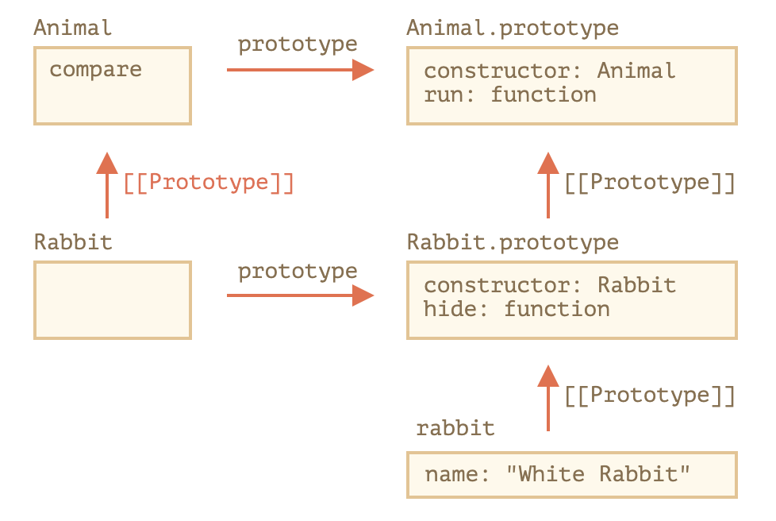

# [모던 JavaScript 튜토리얼 - 코어 자바스크립트] 9. 클래스

> https://ko.javascript.info/classes


- 목차
  - 클래스와 기본 문법
  - 클래스 상속
  - 정적 메서드와 정적 프로퍼티
  - private, protected 프로퍼티와 메서드
  - 내장 클래스 확장하기
  - 'instanceof'로 클래스 확인하기
  - 믹스인


## 9.1 클래스와 기본 문법

> https://ko.javascript.info/class


**도입**

- 실무에선 사용자나 물건같이 동일한 종류의 객체를 여러 개 생성해야 하는 경우가 잦습니다.
  - 이럴 때 [new 연산자와 생성자 함수](https://ko.javascript.info/constructor-new)에서 배운 `new function`을 사용할 수 있습니다.
- 여기에 더하여 모던 자바스크립트에 도입된 `클래스(class)`라는 문법을 사용하면 객체 지향 프로그래밍에서 사용되는 다양한 기능을 자바스크립트에서도 사용할 수 있습니다.


### 기본 문법

- 클래스는 다음과 같은 기본 문법을 사용해 만들 수 있습니다.

  ```javascript
  class MyClass {
  	// 여러 메서드를 정의할 수 있음
    constructor() { ... }
    method1() { ... }
    method2() { ... }
    ...
  }
  ```

  - 위와 같이 클래스를 만들고, `new MyClass()`를 호출하면 내부에서 정의한 메서드가 들어 있는 객체가 생성됩니다.

- 객체의 기본 상태를 설정해주는 생성자 메서드 `constructor()`는 `new`에 의해 자동으로 호출되므로, 특별한 절차 없이 객체를 초기화할 수 있습니다.

  ```js
  class User {
    constructor(name) {
      this.name = name;
    }
    sayHi() {
      alert(this.name);
    }
  }
  
  // 사용법:
  let user = new User("John");
  user.sayHi();
  ```

  - `new User("John")`를 호출하면 다음과 같은 일이 일어납니다.

    1. 새로운 객체가 생성됩니다.
    2. 넘겨받은 인수와 함께 `constructor`가 자동으로 실행됩니다. 이때 인수 `"John"`이 `this.name`에 할당됩니다.

    이런 과정을 거친 후에 `user.sayHi()` 같은 객체 메서드를 호출할 수 있습니다.

> **메서드 사이엔 쉼표가 없습니다.**
>
> - 초보 개발자는 클래스 메서드 사이에 쉼표를 넣는 실수를 저지르곤 합니다. 쉼표를 넣으면 문법 에러가 발생합니다.
> - 클래스와 관련된 표기법은 객체 리터럴 표기법과 차이가 있습니다. 클래스에선 메서드 사이에 쉼표를 넣지 않아도 됩니다.


### 클래스란

- 자바스크립트에서 클래스는 함수의 한 종류입니다.

  ```javascript
  class User {
  	constructor(name) { this.name = name; }
  	sayHi() { alert(this.name); }
  }
  
  // User가 함수라는 증거
  alert(typeof User);  // function
  ```

  

- `class User { ... }` 문법 구조가 진짜 하는 일은 다음과 같습니다.

  1. `User`라는 이름을 가진 함수를 만듭니다. 함수 본문은 생성자 메서드 `constructor`에서 가져옵니다. 생성자 메서드가 없으면 본문이 비워진 채로 함수가 만들어집니다.
  2. `sayHi`같은 클래스 내에서 정의한 메서드를 `User.prototype`에 저장합니다.


- `new User`를 호출해 객체를 만들고, 객체의 메서드를 호출하면 [함수의 prototype 프로퍼티](https://ko.javascript.info/function-prototype)에서 설명한 것처럼 메서드를 프로토타입에서 가져옵니다. 이 과정이 있기 때문에 객체에서 클래스 메서드에 접근할 수 있습니다.

  - `class User` 선언 결과를 그림으로 나타내면 아래와 같습니다.

  

- 지금까지 했던 설명을 코드로 표현하면 다음과 같습니다.

  ```javascript
  class User {
    constructor(name) { this.name = name; }
    sayHi() { alert(this.name); }
  }
  
  // 클래스는 함수입니다.
  alert(typeof User); // function
  
  // 정확히는 생성자 메서드와 동일합니다.
  alert(User === User.prototype.constructor); // true
  
  // 클래스 내부에서 정의한 메서드는 User.prototype에 저장됩니다.
  alert(User.prototype.sayHi); // alert(this.name);
  
  // 현재 프로토타입에는 메서드가 두 개입니다.
  alert(Object.getOwnPropertyNames(User.prototype)); // constructor, sayHi
  ```


### 클래스는 단순한 편의 문법이 아닙니다

- 어떤 사람들은 `class`라는 키워드 없이도 클래스 역할을 하는 함수를 선언할 수 있기 때문에 `클래스`는 '편의 문법'에 불과하다고 이야기합니다.

- 참고로 기능은 동일하나 기존 문법을 쉽게 읽을 수 있게 만든 문법을 편의 문법(syntactic sugar, 문법 설탕)이라고 합니다.

  ```javascript
  // class User와 동일한 기능을 하는 순수 함수를 만들어보겠습니다.
  
  // 1. 생성자 함수를 만듭니다.
  function User(name) {
    this.name = name;
  }
  // 모든 함수의 프로토타입은 'constructor' 프로퍼티를 기본으로 갖고 있기 때문에
  // constructor 프로퍼티를 명시적으로 만들 필요가 없습니다.
  
  // 2. prototype에 메서드를 추가합니다.
  User.prototype.sayHi = function() {
    alert(this.name);
  };
  
  // 사용법:
  let user = new User("John");
  user.sayHi();
  ```

  - 위 예시처럼 순수 함수로 클래스 역할을 하는 함수를 선언하는 방법과 `class` 키워드를 사용하는 방법의 결과는 거의 같습니다. `class`가 단순한 편의 문법이라고 생각하는 이유가 여기에 있습니다.

- 그런데 두 방법에는 중요한 차이가 몇 가지 있습니다.

  1. `class`로 만든 함수엔 특수 내부 프로퍼티인  `[[FunctionKind]]:"classConstructor"`가 이름표처럼 붙습니다. 이것만으로도 두 방법엔 분명한 차이가 있음을 알 수 있습니다.

     

     자바스크립트는 다양한 방법을 사용해 함수에 `[[FunctionKind]]:"classConstructor"`가 있는지를 확인합니다. 

     이런 검증 과정이 있기 때문에 <u>클래스 생성자를 `new`와 함께 호출하지 않으면 에러가 발생합니다.</u>

     ```javascript
     class User {
       constructor() {}
     }
     
     alert(typeof User); // function
     User(); // TypeError: Class constructor User cannot be invoked without 'new'
     ```

     

     대부분의 자바스크립트 엔진이 클래스 생성자를 문자열로 표현할 때 'class...'로 시작하는 문자열로 표현한다는 점 역시 다릅니다.

     ```javascript
     class User {
       constructor() {}
     }
     
     alert(User); // class User { constructor() {} }
     ```

     

  2. 클래스 메서드는 열거할 수 없습니다(non-enumerable). 

     클래스의 `prototype` 프로퍼티에 추가된 메서드 전체의 `enumerable` 플래그는  `false`입니다.

     `for..in`으로 객체를 순회할 때, 메서드는 순회 대상에서 제외하고자 하는 경우가 많으므로 이 특징은 꽤 유용합니다.

     

  3. 클래스는 항상 `엄격 모드`로 실행됩니다(`use strict`). 클래스 생성자 안 코드 전체엔 자동으로 엄격 모드가 적용됩니다.


### 클래스 표현식

- 함수처럼 클래스도 다른 표현식 내부에서 정의, 전달, 반환, 할당할 수 있습니다.

- 먼저 클래스 표현식을 만들어봅시다.

  ```javascript
  let User = class { 
  	sayHi() {
  		console.log('hello');
  	}
  }
  ```

- 기명 함수 표현식(Named Function Expression)과 유사하게 클래스 표현식에도 이름을 붙일 수 있습니다.

  - 클래스 표현식에 이름을 붙이면, 이 이름은 오직 클래스 내부에서만 사용할 수 있습니다.

    ```javascript
    // 기명 클래스 표현식(Named Class Expression)
    // (명세서엔 없는 용어이지만, 기명 함수 표현식과 유사하게 동작합니다.)
    let User = class MyClass {
      sayHi() {
        alert(MyClass); // MyClass라는 이름은 오직 클래스 안에서만 사용할 수 있습니다.
      }
    };
    
    new User().sayHi(); // 제대로 동작합니다(MyClass의 정의를 보여줌).
    
    alert(MyClass); // ReferenceError: MyClass is not defined, MyClass는 클래스 밖에서 사용할 수 없습니다.
    ```

  - 아래와 같이 '필요에 따라' 클래스를 동적으로 생성하는 것도 가능합니다.

    ```javascript
    function makeClass(phrase) {
      // 클래스를 선언하고 이를 반환함
      return class {
        sayHi() {
          alert(phrase);
        };
      };
    }
    
    // 새로운 클래스를 만듦
    let User = makeClass("Hello");
    
    new User().sayHi(); // Hello
    ```

    


### getter와 setter

- 리터럴을 사용해 만든 객체처럼 클래스도 getter나 setter, 계산된 프로퍼티(computed property)를 포함할 수 있습니다.

- `get`과 `set`을 이용해  `user.name`을 조작할 수 있게 해봅시다.

  ```javascript
  class User {
    constructor(name) {
      // setter를 활성화합니다.
      this.name = name;
    }
    get name() {
      return this._name;
    }
    set name(value) {
      if (value.length < 4) {
        alert("이름이 너무 짧습니다.");
        return;
      }
      this._name = value;
    }
  }
  
  let user = new User("John");
  alert(user.name); // John
  
  user = new User(""); // 이름이 너무 짧습니다.
  ```

  - 이런 방법으로 클래스를 선언하면 `User.prototype`에 getter와 setter가 만들어지므로 get과 set을 사용할 수 있습니다.


### 계산된 메서드 이름 [...]

- 대괄호 `[...]`를 이용해 계산된 메서드 이름(computed method name)을 만드는 예시를 살펴봅시다.

  ```javascript
  class User {
    ['say' + 'Hi']() {
      alert("Hello");
    }
  }
  
  new User().sayHi();
  ```

  - 계산된 메서드 이름은 리터럴 객체와 유사한 형태를 띠기 때문에 사용법을 외우기 쉽다는 장점이 있습니다.


### 클래스 필드

> **구식 브라우저에선 폴리필이 필요할 수 있습니다.**
>
> - 클래스 필드는 근래에 더해진 기능입니다.

- '클래스 필드(class field)'라는 문법을 사용하면 어떤 종류의 프로퍼티도 클래스에 추가할 수 있습니다.

  - 클래스 `User`에 `name` 프로퍼티를 추가해봅시다.

  ```javascript
  class User {
    name = "John";
  
    sayHi() {
      alert(`Hello, ${this.name}!`);
    }
  }
  
  new User().sayHi(); // Hello, John!
  ```

- 클래스를 정의할 때 '<프로퍼티 이름> = <값>'을 써주면 간단히 클래스 필드를 만들 수 있습니다.

- 클래스 필드의 중요한 특징 중 하나는 `User.prototype`이 아닌 개별 객체에만 클래스 필드가 설정된다는 점입니다.

  ```javascript
  class User {
    name = "John";
  }
  
  let user = new User();
  console.log(user.name);
  console.log(User.prototype.name); // undefined
  ```

- 아울러 클래스 필드엔 복잡한 표현식이나 함수 호출 결과를 사용할 수 있습니다.

  ```javascript
  class User {
    name = prompt("이름을 알려주세요.", "보라");
  }
  
  let user = new User();
  alert(user.name); // 보라
  ```


#### 클래스 필드로 바인딩 된 메서드 만들기

- [함수 바인딩](https://ko.javascript.info/bind) 챕터에서 살펴본 것처럼 자바스크립트의 함수는 동적인 `this`를 갖습니다.

- 따라서 객체 메서드를 여기저기 전달해 전혀 다른 컨텍스트에서 호출하게 되면 `this`는 원래 객체를 참조하지 않습니다.

- 예제

  ```javascript
  class Button {
    constructor(value) {
      this.value = value;
    }
  
    click() {
      alert(this.value);
    }
  }
  
  let button = new Button("hello");
  
  setTimeout(button.click, 1000); // undefined
  ```

  - 이렇게 `this`의 컨텍스트를 알 수 없게 되는 문제를 '잃어버린 `this`(losing this)'라고 합니다.

  - 문제를 해결하기 위해 두 개의 방법을 사용할 수 있는데 [함수 바인딩](https://ko.javascript.info/bind)에서 이 방법에 대해 살펴본 바 있습니다.

    1. `setTimeout(() => button.click(), 1000)` 같이 래퍼 함수를 전달하기
    2. 생성자 안 등에서 메서드를 객체에 바인딩하기

  - 클래스 필드는 위 문제를 해결하기 위한 또 다른 훌륭한 방법을 제공합니다.

    ```javascript
    class Button {
      constructor(value) {
        this.value = value;
      }
      click = () => {
        alert(this.value);
      }
    }
    
    let button = new Button("hello");
    
    setTimeout(button.click, 1000); // hello
    ```

    - 클래스 필드 `click = () => {...}`는 각 `Button` 객체마다 독립적인 함수를 만들고 함수의 `this`를 해당 객체에 바인딩시켜줍니다.
      - 따라서 개발자는 `button.click`을 아무곳에나 전달할 수 있고, `this`엔 항상 의도한 값이 들어가게 된다.
    - 클래스 필드의 이런 기능은 브라우저 환경에서 메서드를 이벤트 리스너로 설정해야 할 때 특히 유용합니다.

  

### 요약

아래와 같은 기본문법을 사용해 클래스를 만들 수 있습니다.

```javascript
class MyClass {
  prop = value; // 프로퍼티

  constructor(...) { // 생성자 메서드
    // ...
  }

  method(...) {} // 메서드

  get something(...) {} // getter 메서드
  set something(...) {} // setter 메서드

  [Symbol.iterator]() {} // 계산된 이름(computed name)을 사용해 만드는 메서드 (심볼)
  // ...
}
```

`MyClass`는 `constructor`의 코드를 본문으로 갖는 함수입니다. `MyClass`에서 정의한 일반 메서드나 getter, setter는 `MyClass.prototype`에 쓰입니다.

이어지는 챕터에선 상속을 비롯한 클래스의 다양한 기능에 대해 알아보겠습니다.


## 9.2 클래스 상속

> https://ko.javascript.info/class-inheritance


**도입**

- 클래스 상속을 사용하면 클래스를 다른 클래스로 확장할 수 있습니다.
- 기존에 존재하던 기능을 토대로 새로운 기능을 만들 수 있죠.


### 'extends' 키워드

- 먼저, 클래스 `Animal`을 만들어보겠습니다.

  ```javascript
  class Animal {
    constructor(name) {
      this.speed = 0;
      this.name = name;
    }
    run(speed) {
      this.speed = speed;
      alert(`${this.name} 은/는 속도 ${this.speed}로 달립니다.`);
    }
    stop() {
      this.speed = 0;
      alert(`${this.name} 이/가 멈췄습니다.`);
    }
  }
  
  let animal = new Animal("동물");
  ```

- 객체 `animal`과 클래스 `Animal`의 관계를 그림으로 나타내면 다음과 같습니다.

  

- 또 다른 클래스 `Rabbit`을 만들어보겠습니다.

  - 토끼는 동물이므로 `Rabbit`은 동물 관련 메서드가 담긴 `Animal`을 확장해서 만들어야 합니다. 이렇게 하면 토끼도 동물이 할 수 있는 ‘일반적인’ 동작을 수행할 수 있습니다.
  - 클래스 확장 문법 `class Child extends Parent`를 사용해 클래스를 확장해 봅시다.

- `Animal`을 상속받는 `class Rabbit`를 만들어 보겠습니다.

  ```javascript
  class Rabbit extends Animal {
    hide() {
      alert(`${this.name} 이/가 숨었습니다!`);
    }
  }
  
  let rabbit = new Rabbit("흰 토끼");
  
  rabbit.run(5); // 흰 토끼 은/는 속도 5로 달립니다.
  rabbit.hide(); // 흰 토끼 이/가 숨었습니다!
  ```

  - 클래스 `Rabbit`을 사용해 만든 객체는 `rabbit.hide()` 같은 `Rabbit`에 정의된 메서드에도 접근할 수 있고, `rabbit.run()` 같은 `Animal`에 정의된 메서드에도 접근할 수 있습니다.

- **<u>키워드 `extends`는 프로토타입을 기반으로 동작합니다.</u>** 

  - `extends`는 `Rabbit.prototype.[[Prototype]]`을 `Animal.prototype`으로 설정합니다. 
  - 그렇기 때문에 `Rabbit.prototype`에서 메서드를 찾지 못하면 `Animal.prototype`에서 메서드를 가져옵니다.

  

- 엔진은 다음 절차를 따라 메서드 `rabbit.run`의 존재를 확인합니다(그림을 아래부터 보세요).

  1. 객체 `rabbit`에 `run`이 있나 확인합니다. `run`이 없네요.
  2. `rabbit`의 프로토타입인 `Rabbit.prototype`에 메서드가 있나 확인합니다. `hide`는 있는데 `run`은 없습니다.
  3. `extends`를 통해 관계가 만들어진 `Rabbit.prototype`의 프로토타입, `Animal.prototype`에 메서드가 있나 확인합니다. 드디어 메서드 `run`을 찾았습니다.

- [네이티브 프로토타입](https://ko.javascript.info/native-prototypes)에서 알아본 것처럼 자바스크립트의 내장 객체는 프로토타입을 기반으로 상속 관계를 맺습니다. 

  - `Date.prototype.[[Prototype]]`이 `Object.prototype`인 것처럼 말이죠. 
  - `Date` 객체에서 일반 객체 메서드를 사용할 수 있는 이유가 바로 여기에 있습니다.


> **`extends` 뒤에 표현식이 올 수도 있습니다.**
>
> - 클래스 문법은 `extends` 뒤에 표현식이 와도 처리해줍니다.
>
> - 아래 예시처럼 `extends` 뒤에서 부모 클래스를 만들어주는 함수를 호출할 수 있죠.
>
>   ```js
>   function f(phrase) {
>     return class {
>       sayHi() { alert(phrase) }
>     }
>   }
>     
>   class User extends f("Hello") {}
>     
>   new User().sayHi(); // Hello
>   ```
>
>   - 여기서 `class User`는 `f("Hello")`의 반환 값을 상속받습니다.
>   - 이 방법은 조건에 따라 다른 클래스를 상속받고 싶을 때 유용합니다. 
>   - 조건에 따라 다른 클래스를 반환하는 함수를 만들고, 함수 호출 결과를 상속받게 하면 됩니다.


### 메서드 오버라이딩

- 이제 한발 더 나아가 메서드를 오버라이딩 해봅시다. 

  - 특별한 사항이 없으면 `class Rabbit`은 `class Animal`에 있는 메서드를 ‘그대로’ 상속받습니다.
  - 그런데 `Rabbit`에서 `stop()` 등의 메서드를 자체적으로 정의하면, 상속받은 메서드가 아닌 자체 메서드가 사용됩니다.

  ```javascript
  class Rabbit extends Animal {
    stop() {
      // rabbit.stop()을 호출할 때
      // Animal의 stop()이 아닌, 이 메서드가 사용됩니다.
    }
  }
  ```

- 개발을 하다 보면 부모 메서드 전체를 교체하지 않고, 부모 메서드를 토대로 일부 기능만 변경하고 싶을 때가 생깁니다. 

  - 부모 메서드의 기능을 확장하고 싶을 때도 있죠. 이럴 때 커스텀 메서드를 만들어 작업하게 되는데, 이미 커스텀 메서드를 만들었더라도 이 과정 전·후에 부모 메서드를 호출하고 싶을 때가 있습니다.

- 키워드 `super`는 이럴 때 사용합니다.

  - `super.method(...)`는 부모 클래스에 정의된 메서드, `method`를 호출합니다.
  - `super(...)`는 부모 생성자를 호출하는데, 자식 생성자 내부에서만 사용 할 수 있습니다.

- 이런 특징을 이용해 토끼가 멈추면 자동으로 숨도록 하는 코드를 만들어보겠습니다.

  ```javascript
  class Animal {
  
    constructor(name) {
      this.speed = 0;
      this.name = name;
    }
  
    run(speed) {
      this.speed = speed;
      alert(`${this.name}가 속도 ${this.speed}로 달립니다.`);
    }
  
    stop() {
      this.speed = 0;
      alert(`${this.name}가 멈췄습니다.`);
    }
  
  }
  
  class Rabbit extends Animal {
    hide() {
      alert(`${this.name}가 숨었습니다!`);
    }
  
    stop() {
      super.stop(); // 부모 클래스의 stop을 호출해 멈추고,
      this.hide(); // 숨습니다.
    }
  }
  
  let rabbit = new Rabbit("흰 토끼");
  
  rabbit.run(5); // 흰 토끼가 속도 5로 달립니다.
  rabbit.stop(); // 흰 토끼가 멈췄습니다. 흰 토끼가 숨었습니다!
  ```

  - `Rabbit`은 이제 실행 중간에 부모 클래스에 정의된 메서드 `super.stop()`을 호출하는 `stop`을 가지게 되었네요.


> **화살표 함수엔 `super`가 없습니다.**
>
> - [화살표 함수 다시 살펴보기](https://ko.javascript.info/arrow-functions)에서 살펴본 바와 같이, 화살표 함수는 `super`를 지원하지 않습니다.
>
> - `super`에 접근하면 아래 예시와 같이 `super`를 외부 함수에서 가져옵니다.
>
>   ```js
>   class Rabbit extends Animal {
>     stop() {
>       setTimeout(() => super.stop(), 1000); // 1초 후에 부모 stop을 호출합니다.
>     }
>   }
>   ```
>
>   
>
> - 화살표 함수의 `super`는 `stop()`의 `super`와 같아서 위 예시는 의도한 대로 동작합니다. 
>
> - 그렇지만 `setTimeout`안에서 ‘일반’ 함수를 사용했다면 에러가 발생했을 겁니다.
>
>   ```js
>   // Unexpected super
>   setTimeout(function() { super.stop() }, 1000);
>   ```


### 생성자 오버라이딩

- 생성자 오버라이딩은 좀 더 까다롭습니다.

  - 지금까진 `Rabbit`에 자체 `constructor`가 없었습니다.

- [명세서](https://tc39.github.io/ecma262/#sec-runtime-semantics-classdefinitionevaluation)에 따르면, 클래스가 다른 클래스를 상속받고 `constructor`가 없는 경우엔 아래처럼 ‘비어있는’ `constructor`가 만들어집니다.

  ```javascript
  class Rabbit extends Animal {
    // 자체 생성자가 없는 클래스를 상속받으면 자동으로 만들어짐
    constructor(...args) {
      super(...args);
    }
  }
  ```

  - 보시다시피 생성자는 기본적으로 부모 `constructor`를 호출합니다. 
  - 이때 부모 `constructor`에도 인수를 모두 전달합니다. 
  - 클래스에 자체 생성자가 없는 경우엔 이런 일이 모두 자동으로 일어납니다.

- 이제 `Rabbit`에 커스텀 생성자를 추가해보겠습니다. 커스텀 생성자에서 `name`과 `earLength`를 지정해보겠습니다.

  ```javascript
  class Animal {
    constructor(name) {
      this.speed = 0;
      this.name = name;
    }
    // ...
  }
  
  class Rabbit extends Animal {
  
    constructor(name, earLength) {
      this.speed = 0;
      this.name = name;
      this.earLength = earLength;
    }
  
    // ...
  }
  
  // 동작하지 않습니다!
  let rabbit = new Rabbit("흰 토끼", 10); // ReferenceError: Must call super constructor in derived class before accessing 'this' or returning from derived constructor
  ```

  - 아이코! 에러가 발생하네요. 토끼를 만들 수 없습니다. 무엇이 잘못된 걸까요?
  - 이유는 다음과 같습니다.
    - **상속 클래스의 생성자에선 반드시 `super(...)`를 호출해야 하는데, `super(...)`를 호출하지 않아 에러가 발생했습니다. `super(...)`는 `this`를 사용하기 전에 반드시 호출해야 합니다.**

- 그런데 왜 `super(...)`를 호출해야 하는 걸까요?
  - 당연히 이유가 있습니다. 상속 클래스의 생성자가 호출될 때 어떤 일이 일어나는지 알아보며 이유를 찾아봅시다.
- 자바스크립트는 '상속 클래스의 생성자 함수(derived constructor)'와 그렇지 않은 생성자 함수를 구분합니다. 
  - 상속 클래스의 생성자 함수엔 특수 내부 프로퍼티인 `[[ConstructorKind]]:"derived"`가 이름표처럼 붙습니다.
  - 일반 클래스의 생성자 함수와 상속 클래스의 생성자 함수 간 차이는 `new`와 함께 드러납니다.
    - 일반 클래스가 `new`와 함께 실행되면, 빈 객체가 만들어지고 `this`에 이 객체를 할당합니다.
    - 반면, 상속 클래스의 생성자 함수가 실행되면, 일반 클래스에서 일어난 일이 일어나지 않습니다. 상속 클래스의 생성자 함수는 빈 객체를 만들고 `this`에 이 객체를 할당하는 일을 부모 클래스의 생성자가 처리해주길 기대합니다.
- 이런 차이 때문에 상속 클래스의 생성자에선 `super`를 호출해 부모 생성자를 실행해 주어야 합니다. 
  - 그렇지 않으면 `this`가 될 객체가 만들어지지 않아 에러가 발생합니다.


- 아래 예시와 같이 `this`를 사용하기 전에 `super()`를 호출하면 `Rabbit`의 생성자가 제대로 동작합니다.

  ```javascript
  class Animal {
  
    constructor(name) {
      this.speed = 0;
      this.name = name;
    }
  
    // ...
  }
  
  class Rabbit extends Animal {
  
    constructor(name, earLength) {
      super(name);
      this.earLength = earLength;
    }
  
    // ...
  }
  
  // 이제 에러 없이 동작합니다.
  let rabbit = new Rabbit("흰 토끼", 10);
  alert(rabbit.name); // 흰 토끼
  alert(rabbit.earLength); // 10
  ```


### 클래스 필드 오버라이딩: 까다로운 내용

> **사전 공지**
>
> - 이 내용은 자바스크립트 이외의 언어에서 클래스를 사용해 본 경험이 있다는 전제하에 진행됩니다.
> - 여기서 다룰 내용을 잘 습득하면 프로그래밍 언어에 대한 통찰력이 높아지고 드물지만, 버그를 만드는 프로그래밍 습관에 대해 알 수 있습니다.
> - 이해하기 어렵다면 이 부분을 건너뛰었다가 나중에 다시 읽어도 됩니다.


- 오버라이딩은 메서드뿐만 아니라 클래스 필드를 대상으로도 적용할 수 있습니다.

- 부모 클래스의 생성자 안에 있는 오바라이딩한 필드에 접근하려고 할 때 자바스크립트는 다른 프로그래밍 언어와는 다르게 조금 까다롭지만 말이죠.

- 예시를 살펴봅시다.

  ```javascript
  class Animal {
    name = 'animal'
  
    constructor() {
      alert(this.name); // (*)
    }
  }
  
  class Rabbit extends Animal {
    name = 'rabbit';
  }
  
  new Animal(); // animal
  new Rabbit(); // animal
  ```

  - `Animal`을 상속받는 `Rabbit`에서 `name` 필드를 오버라이딩 했습니다.
  - `Rabbit`에는 따로 생성자가 정의되어 있지 않기 때문에 `Rabbit`을 사용해 인스턴스를 만들면 `Animal`의 생성자가 호출됩니다.
  - 흥미로운 점은 `new Animal()`과 `new Rabbit()`을 실행할 때 두 경우 모두 `(*)`로 표시한 줄에 있는 `alert` 함수가 실행되면서 얼럿 창에 `animal`이 출력된다는 점입니다.
    - 이를 통해 우리는 **‘부모 생성자는 자식 클래스에서 오버라이딩한 값이 아닌, 부모 클래스 안의 필드 값을 사용한다’** 는 사실을 알 수 있습니다.

- 상속을 받고 필드 값을 오버라이딩했는데 새로운 값 대신 부모 클래스 안에 있는 기존 필드 값을 사용하다니 이상하지 않나요?

- 이해를 돕기 위해 이 상황을 메서드와 비교해 생각해봅시다.

- 아래 예시에선 필드 `this.name` 대신에 메서드 `this.showName()`을 사용했습니다.

  ```javascript
  class Animal {
    showName() {  // this.name = 'animal' 대신 메서드 사용
      alert('animal');
    }
  
    constructor() {
      this.showName(); // alert(this.name); 대신 메서드 호출
    }
  }
  
  class Rabbit extends Animal {
    showName() {
      alert('rabbit');
    }
  }
  
  new Animal(); // animal
  new Rabbit(); // rabbit
  ```

  - 필드를 오버라이딩한 위쪽 예시와 결과가 다르네요.
  - 위와 같이 자식 클래스에서 부모 생성자를 호출하면 오버라이딩한 메서드가 실행되어야 합니다. 이게 우리가 원하던 결과죠.
  - 그런데 <u>클래스 필드는 자식 클래스에서 필드를 오버라이딩해도 부모 생성자가 오버라이딩한 필드 값을 사용하지 않습니다</u>. 
    - 부모 생성자는 항상 부모 클래스에 있는 필드의 값을 사용합니다.

- 왜 이런 차이가 있을까요?
  - 이유는 **<u>필드 초기화 순서</u>** 때문입니다. 클래스 필드는 다음과 같은 규칙에 따라 초기화 순서가 달라집니다.
    - 아무것도 상속받지 않는 베이스 클래스는 생성자 실행 이전에 초기화됨
    - 부모 클래스가 있는 경우엔 `super()` 실행 직후에 초기화됨
- 위 예시에서 `Rabbit`은 하위 클래스이고 `constructor()`가 정의되어 있지 않습니다. 
  - 이런 경우 앞서 설명한 바와 같이 생성자는 비어있는데 그 안에 `super(...args)`만 있다고 보면 됩니다.
  - 따라서 `new Rabbit()`을 실행하면 `super()`가 호출되고 그 결과 부모 생성자가 실행됩니다. 
  - 그런데 이때 하위 클래스 필드 초기화 순서에 따라 하위 클래스 `Rabbit`의 필드는 `super()` 실행 후에 초기화됩니다. 
  - 부모 생성자가 실행되는 시점에 `Rabbit`의 필드는 아직 존재하지 않죠. 이런 이유로 필드를 오버라이딩 했을 때 `Animal`에 있는 필드가 사용된 것입니다.
- 이렇게 자바스크립트는 <u>오버라이딩시 필드와 메서드의 동작 방식이 미묘하게 다릅니다</u>.
  - 다행히도 이런 문제는 오버라이딩한 필드를 부모 생성자에서 사용할 때만 발생합니다. 
    - 이런 차이가 왜 발생하는지 모르면 결과를 해석할 수 없는 상황이 발생하기 때문에 별도의 공간을 만들어 필드 오버라이딩시 내부에서 벌어지는 일에 대해 자세히 알아보았습니다.
- 개발하다가 필드 오버라이딩이 문제가 되는 상황이 발생하면 필드 대신 메서드를 사용하거나 getter나 setter를 사용해 해결하면 됩니다.


### super 키워드와 [[HomeObject]]

> **어렵습니다.**
>
> - 튜토리얼을 처음 읽는 분이라면 이번 절은 넘어가서도 좋습니다.
> - 이번 절에선 상속과 `super`의 내부 메커니즘에 대해 다룰 예정입니다.

- `super`에 대해서 좀 더 깊이 파봅시다. 중간중간 흥미로운 점을 발견할 수 있을 겁니다.

- 먼저 드려야 할 말은 지금까지 배운 내용만으론 `super`가 제대로 동작하지 않는다는 것입니다.

  - 네 아쉽지만 그렇습니다. 

- "내부에서 super는 ‘어떻게’ 동작할까?"라는 질문을 자신에게 던져봅시다. 

  - "객체 메서드가 실행되면 현재 객체가 `this`가 된다. 이 상태에서 `super.method()`를 호출하면 엔진은 현재 객체의 프로토타입에서 `method`를 찾아야 한다."까진 떠올릴 수 있을 겁니다. 
  - 그런데 이런 과정은 ‘어떻게’ 일어나는 걸까요?

  - 쉬워 보이는 질문 같지만 실제론 그렇지 않습니다. 
  - 엔진은 현재 객체 `this`를 알기 때문에 `this.__proto__.method`를 통해 부모 객체의 `method`를 찾을 수 있을 것 같죠.
  - 하지만 불행하게도 이런 '순진한' 생각은 들어맞지 않습니다.

- 구체적인 코드와 함께 문제를 재현해 보겠습니다. 간결성을 위해 클래스가 아닌 일반 객체를 사용해 예시를 구성해 봅시다.

- 구체적인 내부 동작에 관심이 없으면 이 부분을 지나치고 `[[HomeObject]]`로 바로 넘어가셔도 좋습니다. 

  - 지금부터 다룰 내용을 모르고도 `[[HomeObject]]` 내용을 이해할 수 있기 때문입니다. 깊게 이해하려면 예시와 관련 내용을 살펴보면 됩니다.

- 아래 예시의 `rabbit.__proto__`은 `animal`입니다. `rabbit.eat()`에서 `this.__proto__`를 사용해 `animal.eat()`을 호출해보겠습니다.

  ```javascript
  let animal = {
    name: "동물",
    eat() {
      alert(`${this.name} 이/가 먹이를 먹습니다.`);
    }
  };
  
  let rabbit = {
    __proto__: animal,
    name: "토끼",
    eat() {
      // 예상대로라면 super.eat()이 동작해야 합니다.
      this.__proto__.eat.call(this); // (*)
    }
  };
  
  rabbit.eat(); // 토끼 이/가 먹이를 먹습니다.
  ```

  - `(*)`로 표시한 줄에선 `eat`을 프로토타입(`animal`)에서 가져오고 현재 객체의 컨텍스트에 기반하여 `eat`을 호출합니다. 
  - 여기서 주의해서 봐야 할 부분은 `.call(this)`입니다. 
  - `this.__proto__.eat()`만 있으면 현재 객체가 아닌 프로토타입의 컨텍스트에서 부모 `eat`을 실행하기 때문에 `.call(this)`이 있어야 합니다.
  - 예시를 실행하면 예상한 내용이 얼럿창에 출력되는 것을 확인할 수 있네요.

- 자 이제 체인에 객체를 하나 더 추가해보겠습니다. 이제 슬슬 문제가 발생하기 시작합니다.

  ```javascript
  let animal = {
    name: "동물",
    eat() {
      alert(`${this.name} 이/가 먹이를 먹습니다.`);
    }
  };
  
  let rabbit = {
    __proto__: animal,
    eat() {
      // call을 사용해 컨텍스트를 옮겨가며 부모(animal) 메서드를 호출합니다.
      this.__proto__.eat.call(this); // (*)
    }
  };
  
  let longEar = {
    __proto__: rabbit,
    eat() {
      // longEar를 가지고 무언가를 하면서 부모(rabbit) 메서드를 호출합니다.
      this.__proto__.eat.call(this); // (**)
    }
  };
  
  longEar.eat(); // RangeError: Maximum call stack size exceeded
  ```

  - 예상과 달리 `longEar.eat()`를 호출하니 에러가 발생하네요!

  - 원인이 석연치 않아 보이지만 `longEar.eat()`이 호출될 때 어떤 일이 발생하는지 하나씩 추척하다보면 이유를 알 수 있습니다. 

    - 먼저 살펴봐야 할 것은 `(*)`과 `(**)`로 표시한 줄입니다. 
    - 이 두 줄에서 `this`는 현재 객체인 `longEar`가 됩니다. 여기에 핵심이 있습니다. 
    - 모든 객체 메서드는 프로토타입 등이 아닌 현재 객체를 `this`로 갖습니다.
    - 따라서 `(*)`과 `(**)`로 표시한 줄의 `this.__proto__`엔 정확히 같은 값, `rabbit`이 할당됩니다. 
      - <u>체인 위로 올라가지 않고 양쪽 모두에서 `rabbit.eat`을 호출하기 때문에 무한 루프에 빠지게 되죠.</u>

    

  

- 작동 순서

  1. `longEar.eat()` 내부의 `(**)`로 표시한 줄에서 `rabbit.eat`을 호출하는데, 이때 `this`는 `longEar`입니다.

     ```javascript
     // longEar.eat()안의 this는 longEar입니다.
     this.__proto__.eat.call(this) // (**)
     // 따라서 윗줄은 아래와 같아집니다.
     longEar.__proto__.eat.call(this)
     // longEar의 프로토타입은 rabbit이므로 윗줄은 아래와 같아집니다.
     rabbit.eat.call(this);
     ```

  2. `rabbit.eat` 내부의 `(*)`로 표시한 줄에서 체인 위쪽에 있는 호출을 전달하려 했으나 `this`가 `longEar` 이기 때문에 또다시 `rabbit.eat`이 호출됩니다.

     ```js
     // rabbit.eat()안의 this 역시 longEar입니다.
     this.__proto__.eat.call(this) // (*)
     // 따라서 윗줄은 아래와 같아집니다.
     longEar.__proto__.eat.call(this)
     // longEar의 프로토타입은 rabbit이므로 윗줄은 아래와 같아집니다.
     rabbit.eat.call(this);
     ```

  3. 
     이런 내부 동작 때문에 `rabbit.eat`은 체인 위로 올라가지 못하고 자기 자신을 계속 호출해 무한 루프에 빠지게 됩니다.

- 이런 문제는 `this`만으론 해결할 수 없습니다.


### `[[HomeObject]]`

- 자바스크립트엔 이런 문제를 해결할 수 있는 함수 전용 특수 내부 프로퍼티가 있습니다. 바로 `[[HomeObject]]`입니다.

- 클래스이거나 객체 메서드인 함수의 `[[HomeObject]]` 프로퍼티는 해당 객체가 저장됩니다.

- `super`는 `[[HomeObject]]`를 이용해 부모 프로토타입과 메서드를 찾습니다.

- 예시를 통해 `[[HomeObject]]`가 어떻게 동작하는지 살펴봅시다. 먼저 일반 객체를 이용해 보겠습니다.

  ```javascript
  let animal = {
    name: "동물",
    eat() {         // animal.eat.[[HomeObject]] == animal
      alert(`${this.name} 이/가 먹이를 먹습니다.`);
    }
  };
  
  let rabbit = {
    __proto__: animal,
    name: "토끼",
    eat() {         // rabbit.eat.[[HomeObject]] == rabbit
      super.eat();
    }
  };
  
  let longEar = {
    __proto__: rabbit,
    name: "귀가 긴 토끼",
    eat() {         // longEar.eat.[[HomeObject]] == longEar
      super.eat();
    }
  };
  
  // 이제 제대로 동작합니다
  longEar.eat();  // 귀가 긴 토끼 이/가 먹이를 먹습니다.
  ```

  - `[[HomeObject]]`의 메커니즘 덕분에 메서드가 의도한 대로 동작하는 것을 확인해 보았습니다. 
    - 이렇게 `longEar.eat`같은 객체 메서드는 `[[HomeObject]]`를 알고 있기 때문에 `this` 없이도 프로토타입으로부터 부모 메서드를 가져올 수 있습니다.


### 메서드는 자유롭지 않습니다

- 자바스크립트에서 함수는 대개 객체에 묶이지 않고 ‘자유롭습니다’. 이런 자유성 때문에 `this`가 달라도 객체 간 메서드를 복사하는 것이 가능하죠.

- 그런데 `[[HomeObject]]`는 그 존재만으로도 함수의 자유도를 파괴합니다. 메서드가 객체를 기억하기 때문입니다. 

  - 개발자가 `[[HomeObject]]`를 변경할 방법은 없기 때문에 한 번 바인딩된 함수는 더이상 변경되지 않죠.

- 다행인 점은 `[[HomeObject]]`는 오직 `super` 내부에서만 유효하다는 것입니다. 

  - 그렇기 때문에 메서드에서 `super`를 사용하지 않는 경우엔 메서드의 자유성이 보장됩니다. 
  - 객체 간 복사 역시 가능하죠. 
  - 하지만 메서드에서 `super`를 사용하면 이야기가 달라집니다.

- 객체 간 메서드를 잘못 복사한 경우에 `super`가 제대로 동작하지 않는 경우를 살펴봅시다.

  ```javascript
  let animal = {
    sayHi() {
      console.log(`나는 동물입니다.`);
    }
  };
  
  // rabbit은 animal을 상속받습니다.
  let rabbit = {
    __proto__: animal,
    sayHi() {
      super.sayHi();
    }
  };
  
  let plant = {
    sayHi() {
      console.log("나는 식물입니다.");
    }
  };
  
  // tree는 plant를 상속받습니다.
  let tree = {
    __proto__: plant,
    sayHi: rabbit.sayHi // (*)
  };
  
  tree.sayHi();  // 나는 동물입니다. (?!?)
  ```

  - `tree.sayHi()`를 호출하니 "나는 동물입니다."가 출력됩니다. 뭔가 잘못된 것이 분명해 보이네요.

  - 원인은 꽤 단순합니다.

    - `(*)`로 표시한 줄에서 메서드 `tree.sayHi`는 중복 코드를 방지하기 위해 `rabbit`에서 메서드를 복사해왔습니다.
    - 그런데 복사해온 메서드는 `rabbit`에서 생성했기 때문에 이 메서드의 `[[HomeObject]]`는 `rabbit`입니다, 개발자는 `[[HomeObject]]`를 변경할 수 없습니다.
    - `tree.sayHi()`의 코드 내부엔 `super.sayHi()`가 있습니다. `rabbit`의 프로토타입은 `animal`이므로 `super`는 체인 위에있는 `animal`로 올라가 `sayHi`를 찾습니다.

    


### 함수 프로퍼티가 아닌 메서드 사용하기

- `[[HomeObject]]`는 클래스와 일반 객체의 메서드에서 정의됩니다. 

  - 그런데 객체 메서드의 경우 `[[HomeObject]]`가 제대로 동작하게 하려면 메서드를 반드시 `method()` 형태로 정의해야 합니다. 
  - `"method: function()"` 형태로 정의하면 안 됩니다.

- 개발자 입장에선 두 방법의 차이는 그리 중요하지 않을 수 있지만, 자바스크립트 입장에선 아주 중요합니다.

- 메서드 문법이 아닌(non-method syntax) 함수 프로퍼티를 사용해 예시를 작성해 보면 다음과 같습니다. `[[HomeObject]]` 프로퍼티가 설정되지 않기 때문에 상속이 제대로 동작하지 않는 것을 확인할 수 있습니다.

  ```javascript
  let animal = {
    eat: function() { // 'eat() {...' 대신 'eat: function() {...'을 사용해봅시다.
      // ...
    }
  };
  
  let rabbit = {
    __proto__: animal,
    eat: function() {
      super.eat();
    }
  };
  
  rabbit.eat();  // SyntaxError: 'super' keyword unexpected here ([[HomeObject]]가 없어서 에러가 발생함)
  ```


### 요약

1. 클래스 확장하기: `class Child extends Parent`
   - `Child.prototype.__proto__`가 `Parent.prototype`이 되므로 메서드 전체가 상속됩니다.
2. 생성자 오버라이딩:
   - `this`를 사용하기 전에 `Child` 생성자 안에서 `super()`로 부모 생성자를 반드시 호출해야 합니다.
3. 메서드 오버라이딩:
   - `Child`에 정의된 메서드에서 `super.method()`를 사용해 `Parent`에 정의된 메서드를 사용할 수 있습니다.
4. super 키워드와 [[HomeObject]]
   - 메서드는 내부 프로퍼티 `[[HomeObject]]`에 자신이 정의된 클래스와 객체를 기억해놓습니다. `super`는 `[[HomeObject]]`를 사용해 부모 메서드를 찾습니다.
   - 따라서 `super`가 있는 메서드는 객체 간 복사 시 제대로 동작하지 않을 수 있습니다.

추가 사항:

- 화살표 함수는 `this`나 `super`를 갖지 않으므로 주변 컨텍스트에 잘 들어맞습니다.


## 9.3 정적 메서드와 정적 프로퍼티

> https://ko.javascript.info/static-properties-methods

**도입**

- `"prototype"`이 아닌 <u>클래스 함수 자체</u>에 메서드를 설정할 수도 있습니다. 

  - 이런 메서드를 ***정적(static)* 메서드**라고 부릅니다.

- 정적 메서드는 아래와 같이 클래스 안에서 `static` 키워드를 붙여 만들 수 있습니다.

  ```javascript
  class User {
    static staticMethod() {
      alert(this === User);
    }
  }
  
  User.staticMethod(); // true
  ```

- 정적 메서드는 메서드를 프로퍼티 형태로 직접 할당하는 것과 동일한 일을 합니다.

  ```javascript
  class User { }
  
  User.staticMethod = function() {
    alert(this === User);
  };
  
  User.staticMethod(); // true
  ```

- `User.staticMethod()`가 호출될 때 `this`의 값은 클래스 생성자인 `User` 자체가 됩니다(점 앞 객체).

- 정적 메서드는 어떤 특정한 객체가 아닌 클래스에 속한 함수를 구현하고자 할 때 주로 사용됩니다.

- 객체 `Article`이 여러 개 있고 이들을 비교해줄 함수가 필요하다고 가정해 봅시다. 

  - 가장 먼저 아래와 같이 `Article.compare`를 추가하는 방법이 떠오를 겁니다.

  ```javascript
  class Article {
    constructor(title, date) {
      this.title = title;
      this.date = date;
    }
  
    static compare(articleA, articleB) {
      return articleA.date - articleB.date;
    }
  }
  
  // 사용법
  let articles = [
    new Article("HTML", new Date(2019, 1, 1)),
    new Article("CSS", new Date(2019, 0, 1)),
    new Article("JavaScript", new Date(2019, 11, 1))
  ];
  
  articles.sort(Article.compare);
  
  alert( articles[0].title ); // CSS
  ```

  - 여기서 `Article.compare`는 article(글)을 비교해주는 수단으로, 글 전체를 ‘위에서’ 바라보며 비교를 수행합니다.
  - `Article.compare`이 글 하나의 메서드가 아닌 클래스의 메서드여야 하는 이유가 여기에 있습니다.

- 이번에 살펴볼 예시는 ‘팩토리’ 메서드를 구현한 코드입니다. 

- 다양한 방법을 사용해 조건에 맞는 article 인스턴스를 만들어야 한다고 가정해 봅시다.

  1. 매개변수(`title`, `date` 등)를 이용해 관련 정보가 담긴 article 생성
  2. 오늘 날짜를 기반으로 비어있는 article 생성
  3. 기타 등등

- 첫 번째 방법은 생성자를 사용해 구현할 수 있습니다. 

- 두 번째 방법은 클래스에 정적 메서드를 만들어 구현할 수 있습니다.

  - 아래 `Article.createTodays()`같이 말이죠.

  ```javascript
  class Article {
    constructor(title, date) {
      this.title = title;
      this.date = date;
    }
  
    static createTodays() {
      // this는 Article입니다.
      return new this("Today's digest", new Date());
    }
  }
  
  let article = Article.createTodays();
  
  alert( article.title ); // Today's digest
  ```

  - 이제 Today’s digest라는 글이 필요할 때마다 `Article.createTodays()`를 호출하면 됩니다.
  - 여기서도 마찬가지로 `Article.createTodays()`는 article의 메서드가 아닌 전체 클래스의 메서드입니다.

- 정적 메서드는 아래 예시와 같이 항목 검색, 저장, 삭제 등을 수행해주는 데이터베이스 관련 클래스에도 사용됩니다.

  ```js
  // Article은 article을 관리해주는 특별 클래스라고 가정합시다.
  // article 삭제에 쓰이는 정적 메서드
  Article.remove({id: 12345});
  ```

  

### 정적 프로퍼티

> **최근에 추가됨**
>
> 스펙에 추가된 지 얼마 안 된 문법입니다. 예시는 Chrome에서만 동작할 수 있습니다.

- 정적 프로퍼티도 물론 만들 수 있습니다. 

  - 정적 프로퍼티는 일반 클래스 프로퍼티와 유사하게 생겼는데 앞에 `static`이 붙는다는 점만 다릅니다.

  ```javascript
  class Article {
    static publisher = "Ilya Kantor";
  }
  
  alert( Article.publisher ); // Ilya Kantor
  ```

  - 위 예시는 `Article`에 프로퍼티를 직접 할당한 것과 동일하게 동작합니다.

  ```javascript
  Article.publisher = "Ilya Kantor";
  ```


### 정적 프로퍼티와 메서드 상속

- <u>정적 프로퍼티와 메서드는 상속됩니다.</u>

- 아래 예시에서 `Animal.compare`와 `Animal.planet`은 상속되어서 각각 `Rabbit.compare`와 `Rabbit.planet`에서 접근할 수 있습니다.

  ```javascript
  class Animal {
    static planet = "지구";
  
    constructor(name, speed) {
      this.speed = speed;
      this.name = name;
    }
  
    run(speed = 0) {
      this.speed += speed;
      alert(`${this.name}가 속도 ${this.speed}로 달립니다.`);
    }
  
    static compare(animalA, animalB) {
      return animalA.speed - animalB.speed;
    }
  
  }
  
  // Animal을 상속받음
  class Rabbit extends Animal {
    hide() {
      alert(`${this.name}가 숨었습니다!`);
    }
  }
  
  let rabbits = [
    new Rabbit("흰 토끼", 10),
    new Rabbit("검은 토끼", 5)
  ];
  
  rabbits.sort(Rabbit.compare);
  
  rabbits[0].run(); // 검은 토끼가 속도 5로 달립니다.
  
  alert(Rabbit.planet); // 지구
  ```

  - 이제 `Rabbit.compare`을 호출하면 `Animal.compare`가 호출됩니다.

  - 이게 가능한 이유는 프로토타입 때문입니다. 

  - 이미 예상하셨겠지만, `extends` 키워드는 `Rabbit`의 `[[Prototype]]`이 `Animal`을 참조하도록 해줍니다.

    

- 따라서 `Rabbit extends Animal`은 두 개의 `[[Prototype]]` 참조를 만들어 냅니다.

  1. 함수 `Rabbit`은 프로토타입을 통해 함수 `Animal`을 상속받습니다.
  2. `Rabbit.prototype`은 프로토타입을 통해 `Animal.prototype`을 상속받습니다.

- 이런 과정이 있기 때문에 일반 메서드 상속과 정적 메서드 상속이 가능합니다.

- 코드로 직접 확인해봅시다.

  ```javascript
  class Animal {}
  class Rabbit extends Animal {}
  
  // 정적 메서드
  alert(Rabbit.__proto__ === Animal); // true
  
  // 일반 메서드
  alert(Rabbit.prototype.__proto__ === Animal.prototype); // true
  ```


### 요약

정적 메서드는 특정 클래스 인스턴스가 아닌 클래스 '전체’에 필요한 기능을 만들 때 사용할 수 있습니다.

인스턴스끼리 비교해주는 메서드 `Article.compare(article1, article2)`이나 팩토리 메서드 `Article.createTodays()`를 만들 때 정적 메서드가 쓰입니다.

정적 메서드는 클래스 선언부 안에 위치하고 앞에 `static`이라는 키워드가 붙습니다.

정적 프로퍼티는 데이터를 클래스 수준에 저장하고 싶을 때 사용합니다. 정적 프로퍼티 역시 개별 인스턴스에 묶이지 않습니다.

문법:

```javascript
class MyClass {
  static property = ...;

  static method() {
    ...
  }
}
```

`static`을 사용한 선언은 기술적으론 클래스 자체에 직접 할당하는 것과 동일합니다.

```javascript
MyClass.property = ...
MyClass.method = ...
```

정적 프로퍼티와 정적 메서드는 상속이 가능합니다.

`class B extends A`는 클래스 `B`의 프로토타입이 클래스 `A`를 가리키게 합니다(`B.[[Prototype]] = A`). 따라서 `B`에서 원하는 프로퍼티나 메서드를 찾지 못하면 `A`로 검색이 이어집니다.


## 9.4 private, protected 프로퍼티와 메서드

> https://ko.javascript.info/private-protected-properties-methods

**도입**

- 객체 지향 프로그래밍에서 가장 중요한 원리 중 하나는 '내부 인터페이스와 외부 인터페이스를 구분 짓는 것’입니다.
- 단순히 'hello word’를 출력하는 것이 아닌 복잡한 애플리케이션을 구현하려면, **내부 인터페이스와 외부 인터페이스를 구분**하는 방법을 ‘반드시’ 알고 계셔야 합니다.
- 잠시 개발을 벗어나 현실 세계로 눈을 돌려, **내부 인터페이스와 외부 인터페이스 구분**이 무엇을 의미하는지 알아봅시다.
  - 일상생활에서 접하게 되는 기계들은 꽤 복잡한 구조로 되어 있습니다. 
  - 하지만 내부인터페이스와 외부 인터페이스가 구분되어있기 때문에 문제없이 기계를 사용할 수 있습니다.


### 내부 인터페이스와 외부 인터페이스

- 객체 지향 프로그래밍에서 프로퍼티와 메서드는 두 그룹으로 분류됩니다.
  - *내부 인터페이스(internal interface)* – 동일한 클래스 내의 다른 메서드에선 접근할 수 있지만, 클래스 밖에선 접근할 수 없는 프로퍼티와 메서드
  - *외부 인터페이스(external interface)* – 클래스 밖에서도 접근 가능한 프로퍼티와 메서드
- 자바스크립트에는 아래와 같은 두 가지 타입의 객체 필드(프로퍼티와 메서드)가 있습니다.
  - public: 어디서든지 접근할 수 있으며 외부 인터페이스를 구성합니다. 지금까지 다룬 프로퍼티와 메서드는 모두 public입니다.
  - private: 클래스 내부에서만 접근할 수 있으며 내부 인터페이스를 구성할 때 쓰입니다.
- 자바스크립트 이외의 다수 언어에서 클래스 자신과 자손 클래스에서만 접근을 허용하는 ‘protected’ 필드를 지원합니다. 
  - protected 필드는 private과 비슷하지만, 자손 클래스에서도 접근이 가능하다는 점이 다릅니다. 
  - protected 필드도 내부 인터페이스를 만들 때 유용합니다. 
  - 자손 클래스의 필드에 접근해야 하는 경우가 많기 때문에, protected 필드는 private 필드보다 조금 더 광범위하게 사용됩니다.
  - 자바스크립트는 protected 필드를 지원하지 않지만, protected를 사용하면 편리한 점이 많기 때문에 이를 모방해서 사용하는 경우가 많습니다.
- 이제 지금까지 배운 프로퍼티 타입을 사용해 커피머신을 만들어보겠습니다. 
  - 실제 커피 머신은 아주 복잡하지만, 여기선 간결성을 위해 간이 모델을 만들겠습니다(원한다면 구현은 가능합니다).


### 프로퍼티 보호하기

- 먼저, 간단한 커피 머신 클래스를 만들어보겠습니다.

  ```javascript
  class CoffeeMachine {
    waterAmount = 0; // 물통에 차 있는 물의 양
  
    constructor(power) {
      this.power = power;
      alert( `전력량이 ${power}인 커피머신을 만듭니다.` );
    }
  
  }
  
  // 커피 머신 생성
  let coffeeMachine = new CoffeeMachine(100);
  
  // 물 추가
  coffeeMachine.waterAmount = 200;
  ```

  - 현재 프로퍼티 `waterAmount`와 `power`는 public입니다. 
    - 손쉽게 `waterAmount`와 `power`를 읽고 원하는 값으로 변경하기 쉬운 상태이죠.
  - 이제 `waterAmount`를 보호해서 `waterAmount`를 통제해 보겠습니다. 
    - 예시로 `waterAmount`를 0 미만의 값으로는 설정하지 못하도록 만들어 볼 겁니다.

- **protected 프로퍼티 명 앞엔 밑줄 `_`이 붙습니다.**

  - 자바스크립트에서 강제한 사항은 아니지만, <u>밑줄은 프로그래머들 사이에서 외부 접근이 불가능한 프로퍼티나 메서드를 나타낼 때 씁니다</u>.
  - `waterAmount`에 밑줄을 붙여 protected 프로퍼티로 만들어줍시다.

  ```javascript
  class CoffeeMachine {
    _waterAmount = 0;
  
    set waterAmount(value) {
      if (value < 0) throw new Error("물의 양은 음수가 될 수 없습니다.");
      this._waterAmount = value;
    }
  
    get waterAmount() {
      return this._waterAmount;
    }
  
    constructor(power) {
      this._power = power;
    }
  
  }
  
  // 커피 머신 생성
  let coffeeMachine = new CoffeeMachine(100);
  
  // 물 추가
  coffeeMachine.waterAmount = -10; // Error: 물의 양은 음수가 될 수 없습니다.
  ```

  - 이제 물의 양을 0 미만으로 설정하면 실패합니다.


### 읽기 전용 프로퍼티

- `power` 프로퍼티를 읽기만 가능하도록 만들어봅시다. 

  - 프로퍼티를 생성할 때만 값을 할당할 수 있고, 그 이후에는 값을 절대 수정하지 말아야 하는 경우가 종종 있는데, 이럴 때 읽기 전용 프로퍼티를 활용할 수 있습니다.
  - 커피 머신의 경우에는 전력이 이에 해당합니다.

- 읽기 전용 프로퍼티를 만들려면 setter(설정자)는 만들지 않고 getter(획득자)만 만들어야 합니다.

  ```javascript
  class CoffeeMachine {
    // ...
  
    constructor(power) {
      this._power = power;
    }
  
    get power() {
      return this._power;
    }
  
  }
  
  // 커피 머신 생성
  let coffeeMachine = new CoffeeMachine(100);
  
  alert(`전력량이 ${coffeeMachine.power}인 커피머신을 만듭니다.`); // 전력량이 100인 커피머신을 만듭니다.
  
  coffeeMachine.power = 25; // Error (setter 없음)
  ```


> **getter와 setter 함수**
>
> 위에서는 get, set 문법을 사용해서 getter와 setter 함수를 만들었습니다.
>
> 하지만 대부분은 아래와 같이 `get.../set...` 형식의 함수가 선호됩니다.
>
> ```javascript
> class CoffeeMachine {
>   _waterAmount = 0;
> 
>   setWaterAmount(value) {
>     if (value < 0) throw new Error("물의 양은 음수가 될 수 없습니다.");
>     this._waterAmount = value;
>   }
> 
>   getWaterAmount() {
>     return this._waterAmount;
>   }
> }
> 
> new CoffeeMachine().setWaterAmount(100);
> ```
>
> 다소 길어보이긴 하지만, 이렇게 함수를 선언하면 다수의 인자를 받을 수 있기 때문에 좀 더 유연합니다(위 예시에선 인자가 하나뿐이긴 하지만요).
>
> 반면 get, set 문법을 사용하면 코드가 짧아진다는 장점이 있습니다. 어떤걸 사용해야 한다는 규칙은 없으므로 원하는 방식을 선택해서 사용하세요.


> **protected 필드는 상속됩니다.**
>
> `class MegaMachine extends CoffeeMachine`로 클래스를 상속받으면, 새로운 클래스의 메서드에서 `this._waterAmount`나 `this._power`를 사용해 프로퍼티에 접근할 수 있습니다.
>
> 이렇게 protected 필드는 아래에서 보게 될 private 필드와 달리, 자연스러운 상속이 가능합니다.


### private 프로퍼티

> **최근에 추가됨**
>
> 스펙에 추가된 지 얼마 안 된 문법입니다. 이 문법을 지원하지 않거나 부분적으로만 지원하는 엔진을 사용 중이라면 폴리필을 구현해야 합니다.

- private 프로퍼티와 메서드는 제안(proposal) 목록에 등재된 문법으로, 명세서에 등재되기 직전 상태입니다.

- private 프로퍼티와 메서드는 `#`으로 시작합니다. `#`이 붙으면 클래스 안에서만 접근할 수 있습니다.

- 물 용량 한도를 나타내는 private 프로퍼티 `#waterLimit`과 남아있는 물의 양을 확인해주는 private 메서드 `#checkWater`를 구현해봅시다.

  ```javascript
  class CoffeeMachine {
    #waterLimit = 200;
  
    #checkWater(value) {
      if (value < 0) throw new Error("물의 양은 음수가 될 수 없습니다.");
      if (value > this.#waterLimit) throw new Error("물이 용량을 초과합니다.");
    }
  
  }
  
  let coffeeMachine = new CoffeeMachine();
  
  // 클래스 외부에서 private에 접근할 수 없음
  coffeeMachine.#checkWater(); // Error
  coffeeMachine.#waterLimit = 1000; // Error
  ```

  - `#`은 자바스크립트에서 지원하는 문법으로, private 필드를 의미합니다. 
    - private 필드는 클래스 외부나 자손 클래스에서 접근할 수 없습니다.
  - private 필드는 public 필드와 상충하지 않습니다. private 프로퍼티 `#waterAmount`와 public 프로퍼티 `waterAmount`를 동시에 가질 수 있습니다.

- `#waterAmount`의 접근자 `waterAmount`를 만들어봅시다.

  ```javascript
  class CoffeeMachine {
  
    #waterAmount = 0;
  
    get waterAmount() {
      return this.#waterAmount;
    }
  
    set waterAmount(value) {
      if (value < 0) throw new Error("물의 양은 음수가 될 수 없습니다.");
      this.#waterAmount = value;
    }
  }
  
  let machine = new CoffeeMachine();
  
  machine.waterAmount = 100;
  alert(machine.#waterAmount); // Error
  ```

  - protected 필드와 달리, private 필드는 언어 자체에 의해 강제된다는 점이 장점입니다.

- 그런데 `CoffeeMachine`을 상속받는 클래스에선 `#waterAmount`에 직접 접근할 수 없습니다. 

  - `#waterAmount`에 접근하려면 `waterAmount`의 getter와 setter를 통해야 합니다.

  ```javascript
  class MegaCoffeeMachine extends CoffeeMachine {
    method() {
      alert( this.#waterAmount ); // Error: CoffeeMachine을 통해서만 접근할 수 있습니다.
    }
  }
  ```

  - 다양한 시나리오에서 이런 제약사항은 너무 엄격합니다. 
  - CoffeeMachine`을 상속받는 클래스에선 `CoffeeMachine`의 내부에 접근해야 하는 정당한 사유가 있을 수 있기 때문이죠. 
  - 언어 차원에서 protected 필드를 지원하지 않아도 더 자주 쓰이는 이유가 바로 여기에 있습니다.

> **private 필드는 this[name]로 사용할 수 없습니다.**
>
> - private 필드는 특별합니다.
> - 알다시피, 보통은 `this[name]`을 사용해 필드에 접근할 수 있습니다.
>
> ```javascript
> class User {
>   ...
>   sayHi() {
>     let fieldName = "name";
>     alert(`Hello, ${this[fieldName]}`);
>   }
> }
> ```
>
> - 하지만 private 필드는 `this[name]`으로 접근할 수 없습니다. 이런 문법적 제약은 필드의 보안을 강화하기 위해 만들어졌습니다.


### 요약

객체 지향 프로그래밍에선 내부 인터페이스와 외부 인터페이스를 구분하는 것을 [캡슐화(encapsulation)]라는 용어를 사용해 설명합니다.

캡슐화는 이점은 다음과 같습니다.

- 사용자가 자신의 발등을 찍지 않도록 보호

  커피 머신를 함께 사용하는 개발팀이 있다고 상상해봅시다. "Best CoffeeMachine"이라는 회사에서 만든 이 커피 머신은 현재 잘 작동하고 있지만, 보호 커버가 없어서 내부 인터페이스가 노출되어있는 상황입니다.교양있는 팀원들은 모두 설계 의도에 맞게 커피 머신을 사용합니다. 그런데 어느 날 John이라는 개발자가 자신의 능력을 과신하며 커피 머신 내부를 살짝 만지게 됩니다. 이틀 후, 커피 머신은 고장이 나버렸죠.커피 머신이 고장 난 건 John의 잘못이라기보다는, 보호 커버를 없애고 John이 마음대로 조작하도록 내버려 둔 사람의 잘못입니다.프로그래밍에서도 마찬가지입니다. 외부에서 의도치 않게 클래스를 조작하게 되면 그 결과는 예측할 수 없게 됩니다.

- 지원 가능

  실제 개발 과정에서 일어나는 상황은 커피 머신 사례보다 훨씬 복잡합니다. 커피 머신은 한번 구매하면 끝이지만 실제 코드는 유지보수가 끊임없이 일어나기 때문입니다.**내부 인터페이스를 엄격하게 구분하면, 클래스 개발자들은 사용자에게 알리지 않고도 자유롭게 내부 프로퍼티와 메서드들을 수정할 수 있습니다.**내부 인터페이스가 엄격히 구분된 클래스를 만지고 있다면, 그 어떤 외부 코드도 내부 private 메서드에 의존하고 있지 않기 때문에 private 메서드의 이름을 안전하게 바꿀 수 있고, 매개변수를 변경하거나 없앨 수도 있다는 것을 알아 두면 됩니다.사용자 입장에선 새로운 버전이 출시되면서 내부 정비가 전면적으로 이뤄졌더라도 외부 인터페이스만 똑같다면 업그레이드가 용이하다는 장점이 있습니다.

- 복잡성 은닉

  사람들은 간단한 것을 좋아합니다. 내부는 간단치 않더라도 최소한 외형은 간단해야 하죠.프로그래머들도 예외는 아닙니다.**구현 세부 사항이 숨겨져 있으면 간단하고 편리해집니다. 외부 인터페이스에 대한 설명도 문서화하기 쉬워지죠.**

내부 인터페이스를 숨기려면 protected나 private 프로퍼티를 사용하면 됩니다.

- protected 필드는 `_`로 시작합니다. `_`은 자바스크립트에서 지원하는 문법은 아니지만, protected 필드를 나타낼 때 관습처럼 사용됩니다. 개발자는 protected 프로퍼티가 정의된 클래스와 해당 클래스를 상속받는 클래스에서만 `_`가 붙은 필드에 접근해야 합니다.
- private 필드는 `#`로 시작하며, 자바스크립트에서 지원하는 문법입니다. `#`로 시작하는 필드는 해당 필드가 정의된 클래스 내부에서만 접근 가능합니다.

모든 브라우저에서 private 필드를 지원하진 않지만 폴리필을 구현하여 사용할 수 있습니다.


## 9.5 내장 클래스 확장하기

- 배열, 맵 같은 내장 클래스도 확장 가능합니다.

- 아래 예시에서 `PowerArray`는 기본 `Array`를 상속받아 만들었습니다.

  ```javascript
  // 메서드 하나를 추가합니다(더 많이 추가하는 것도 가능).
  class PowerArray extends Array {
    isEmpty() {
      return this.length === 0;
    }
  }
  
  let arr = new PowerArray(1, 2, 5, 10, 50);
  alert(arr.isEmpty()); // false
  
  let filteredArr = arr.filter(item => item >= 10);
  alert(filteredArr); // 10, 50
  alert(filteredArr.isEmpty()); // false
  ```

  - 뭔가 흥미로운 점이 하나 보이네요. 

  - `filter`, `map` 등의 내장 메서드가 상속받은 클래스인 `PowerArray`의 인스턴스(객체)를 반환합니다. 

  - 이 객체를 구현할 땐 내부에서 객체의 `constructor` 프로퍼티를 사용합니다.

  - 따라서 아래와 같은 관계를 갖습니다.

    ```javascript
    arr.constructor === PowerArray
    ```

- `arr.filter()`가 호출될 때, 내부에선 기본 `Array`가 아닌 `arr.constructor`를 기반으로 새로운 배열이 만들어지고 여기에 필터 후 결과가 담깁니다. 

  - 이렇게 되면 `PowerArray`에 구현된 메서드를 사용할 수 있다는 장점이 생깁니다.

- 물론 동작 방식을 변경할 수 있습니다.

  - 특수 정적 getter인 `Symbol.species`를 클래스에 추가할 수 있는데, `Symbol.species`가 있으면 `map`, `filter` 등의 메서드를 호출할 때 만들어지는 개체의 생성자를 지정할 수 있습니다. 원하는 생성자를 반환하기만 하면 되죠.
  - `map`이나 `filter`같은 내장 메서드가 일반 배열을 반환하도록 하려면 아래 예시처럼 `Symbol.species`가 `Array`를 반환하도록 해주면 됩니다.

  ```javascript
  class PowerArray extends Array {
    isEmpty() {
      return this.length === 0;
    }
  
    // 내장 메서드는 반환 값에 명시된 클래스를 생성자로 사용합니다.
    static get [Symbol.species]() {
      return Array;
    }
  }
  
  let arr = new PowerArray(1, 2, 5, 10, 50);
  alert(arr.isEmpty()); // false
  
  // filter는 arr.constructor[Symbol.species]를 생성자로 사용해 새로운 배열을 만듭니다.
  let filteredArr = arr.filter(item => item >= 10);
  
  // filteredArr는 PowerArray가 아닌 Array의 인스턴스입니다.
  alert(filteredArr.isEmpty()); // Error: filteredArr.isEmpty is not a function
  ```

  - 보시다시피 이제 `.filter`가 `Array`를 반환합니다. 따라서 더는 확장 기능이 전달되지 않습니다.

> **다른 컬렉션도 유사하게 동작합니다.**
>
> - `Map`, `Set` 같은 컬렉션도 위와 같이 동작합니다. 이 컬렉션들도 `Symbol.species`를 사용합니다.


### 내장 객체와 정적 메서드 상속

- 내장 객체는 `Object.keys`, `Array.isArray` 등의 자체 정적 메서드를 갖습니다.
- 앞서 학습한 바와 같이 네이티브 클래스들은 서로 상속 관계를 맺습니다. `Array`는 `Object`를 상속받죠.
- 일반적으론 한 클래스가 다른 클래스를 상속받으면 정적 메서드와 그렇지 않은 메서드 모두를 상속받습니다.
  - 이와 관련된 내용은 [정적 메서드와 정적 프로퍼티](https://ko.javascript.info/static-properties-methods#statics-and-inheritance)에서 자세히 설명해 드린 바 있습니다.
- 그런데 내장 클래스는 다릅니다. 내장클래스는 정적 메서드를 상속받지 못합니다.
- 예를 들어봅시다. 
  - `Array`와 `Date`는 모두 `Object`를 상속받기 때문에 두 클래스의 인스턴스에선 `Object.prototype`에 구현된 메서드를 사용할 수 있습니다. 
  - 그런데 `Array.[[Prototype]]`와 `Date.[[Prototype]]`은 `Object`를 참조하지 않기 때문에 `Array.keys()`나 `Date.keys()`같은 정적 메서드를 인스턴스에서 사용할 수 없습니다.
- 아래는 `Date`와 `Object`의 관계를 나타낸 그림입니다.


- 보시다시피 `Date`와 `Object`를 직접 이어주는 링크가 없습니다. 
  - `Date`와 `Object`는 독립적이죠. 
  - `Date.prototype`만 `Object.prototype`를 상속받습니다.
- 내장 객체 간의 상속과 `extends`를 사용한 상속의 가장 큰 차이점이 여기에 있습니다.


## 9.6 'instanceof'로 클래스 확인하기

> https://ko.javascript.info/instanceof

**도입**

- `instanceof` 연산자를 사용하면 객체가 특정 클래스에 속하는지 아닌지를 확인할 수 있습니다. 
  - `instanceof`는 상속 관계도 확인해줍니다.
- 확인 기능은 다양한 곳에서 쓰이는데, 이번 챕터에선 `instanceof`를 사용해 인수의 타입에 따라 이를 다르게 처리하는 *다형적인(polymorphic)* 함수를 만드는데 사용해보겠습니다.


### `instanceof` 연산자

- 문법은 아래와 같습니다.

  ```javascript
  obj instanceof Class
  ```

  - `obj`가 `Class`에 속하거나 `Class`를 상속받는 클래스에 속하면 `true`가 반환됩니다.

- 예시

  ```javascript
  class Rabbit {}
  let rabbit = new Rabbit();
  
  // rabbit이 클래스 Rabbit의 객체인가요?
  alert( rabbit instanceof Rabbit ); // true
  ```

- `instanceof`는 생성자 함수에서도 사용할 수 있습니다.

  ```javascript
  // 클래스가 아닌 생성자 함수
  function Rabbit() {}
  
  alert( new Rabbit() instanceof Rabbit ); // true
  ```

- `Array` 같은 내장 클래스에도 사용할 수 있습니다.

  ```javascript
  let arr = [1, 2, 3];
  alert( arr instanceof Array ); // true
  alert( arr instanceof Object ); // true
  ```

  - 위 예시에서 `arr`은 클래스 `Object`에도 속한다는 점에 주목해주시기 바랍니다. 
    - `Array`는 프로토타입 기반으로 `Object`를 상속받습니다.
  - `instanceof` 연산자는 보통, 프로토타입 체인을 거슬러 올라가며 인스턴스 여부나 상속 여부를 확인합니다. 
  - 그런데 정적 메서드 `Symbol.hasInstance`을 사용하면 직접 확인 로직을 설정할 수도 있습니다.

- `obj instanceof Class`은 대략 아래와 같은 알고리즘으로 동작합니다.

  1. 클래스에 정적 메서드 `Symbol.hasInstance`가 구현되어 있으면, 

     `obj instanceof Class`문이 실행될 때, `Class[Symbol.hasInstance](obj)`가 호출됩니다. 

     호출 결과는 `true`나 `false`이어야 합니다. 

     이런 규칙을 기반으로 `instanceof`의 동작을 커스터마이징 할 수 있습니다.

  ```javascript
  // canEat 프로퍼티가 있으면 animal이라고 판단할 수 있도록
  // instanceOf의 로직을 직접 설정합니다.
  class Animal {
    static [Symbol.hasInstance](obj) {
      if (obj.canEat) return true;
    }
  }
  
  let obj = { canEat: true };
  
  alert(obj instanceof Animal); // true, Animal[Symbol.hasInstance](obj)가 호출됨
  ```

  2. 그런데, 대부분의 클래스엔 `Symbol.hasInstance`가 구현되어있지 않습니다. 

     이럴 땐 일반적인 로직이 사용됩니다. 

     `obj instanceOf Class`는 `Class.prototype`이 `obj` 프로토타입 체인 상의 프로토타입 중 하나와 일치하는지 확인합니다.

     비교는 차례 차례 진행됩니다.

  ```js
  obj.__proto__ === Class.prototype?
  obj.__proto__.__proto__ === Class.prototype?
  obj.__proto__.__proto__.__proto__ === Class.prototype?
  ...
  // 이 중 하나라도 true라면 true를 반환합니다.
  // 그렇지 않고 체인의 끝에 도달하면 false를 반환합니다.
  ```

  ​	위 예시에서 `rabbit.__proto__ === Rabbit.prototype`가 `true`이기 때문에 `instanceof`는 `true`를 반환합니다.

  ​	상속받은 클래스를 사용하는 경우엔 두 번째 단계에서 일치 여부가 확인됩니다.

  ```javascript
  class Animal {}
  class Rabbit extends Animal {}
  
  let rabbit = new Rabbit();
  alert(rabbit instanceof Animal); // true
  
  // rabbit.__proto__ === Rabbit.prototype
  // rabbit.__proto__.__proto__ === Animal.prototype (일치!)
  ```

- 아래 그림은 `rabbit instanceof Animal`을 실행했을 때 `Animal.prototype`과 비교되는 대상들을 보여줍니다.

  

- 한편, `objA`가 `objB`의 프로토타입 체인 상 어딘가에 있으면 `true`를 반환해주는 메서드, [objA.isPrototypeOf(objB)](https://developer.mozilla.org/ko/docs/Web/JavaScript/Reference/Global_Objects/object/isPrototypeOf)도 있습니다. `obj instanceof Class`는 `Class.prototype.isPrototypeOf(obj)`와 동일합니다.

- `isPrototypeOf`는 `Class` 생성자를 제외하고 포함 여부를 검사하는 점이 조금 특이합니다. 검사 시, 프로토타입 체인과 `Class.prototype`만 고려합니다.

- `isPrototypeOf`의 이런 특징은 객체 생성 후 `prototype` 프로퍼티가 변경되는 경우 특이한 결과를 초래하기도 합니다. 아래와 같이 말이죠.

  ```javascript
  function Rabbit() {}
  let rabbit = new Rabbit();
  
  // 프로토타입이 변경됨
  Rabbit.prototype = {};
  
  // 더 이상 Rabbit이 아닙니다!
  alert( rabbit instanceof Rabbit ); // false
  ```


### 보너스: 타입 확인을 위한 Object.prototype.toString

- 일반 객체를 문자열로 변화하면 `[object Object]`가 된다는 것을 알고 계실 겁니다.

  ```javascript
  let obj = {};
  
  alert(obj); // [object Object]
  alert(obj.toString()); // 같은 결과가 출력됨
  ```

  - 이렇게 `[object Object]`가 되는 이유는 `toString`의 구현방식 때문입니다. 
  - 그런데 `toString`엔 `toString`을 더 강력하게 만들어주는 기능이 숨겨져 있습니다. 
  - `toString`의 숨겨진 기능을 사용하면 확장 `typeof`, `instanceof`의 대안을 만들 수 있습니다.


- 아직 감이 안 잡히시겠지만, 구체적으로 설명하겠습니다.

- [명세서](https://tc39.github.io/ecma262/#sec-object.prototype.tostring)에 따르면, 객체에서 내장 `toString`을 추출하는 게 가능합니다. 이렇게 추출한 메서드는 모든 값을 대상으로 실행할 수 있습니다. 호출 결과는 값에 따라 달라집니다.

  - 숫자형 – `[object Number]`
  - 불린형 – `[object Boolean]`
  - `null` – `[object Null]`
  - `undefined` – `[object Undefined]`
  - 배열 – `[object Array]`
  - 그외 – 커스터마이징 가능

- 예시

  ```javascript
  // 편의를 위해 toString 메서드를 변수에 복사함
  let objectToString = Object.prototype.toString;
  
  // 아래 변수의 타입은 무엇일까요?
  let arr = [];
  
  alert( objectToString.call(arr) ); // [object Array]
  ```

  - [call/apply와 데코레이터, 포워딩](https://ko.javascript.info/call-apply-decorators) 챕터에서 설명한 [call](https://developer.mozilla.org/ko/docs/Web/JavaScript/Reference/Global_Objects/function/call)을 사용해 컨텍스트를 `this=arr`로 설정하고 함수 `objectToString`를 실행하였습니다.
  - `toString` 알고리즘은 내부적으로 `this`를 검사하고 상응하는 결과를 반환합니다. 예시를 더 살펴봅시다.

  ```javascript
  let s = Object.prototype.toString;
  
  alert( s.call(123) ); // [object Number]
  alert( s.call(null) ); // [object Null]
  alert( s.call(alert) ); // [object Function]
  ```


### Symbol.toStringTag

- 특수 객체 프로퍼티 `Symbol.toStringTag`를 사용하면 `toString`의 동작을 커스터마이징 할 수 있습니다.

  ```javascript
  let user = {
    [Symbol.toStringTag]: "User"
  };
  
  alert( {}.toString.call(user) ); // [object User]
  ```

- 대부분의 호스트 환경은 자체 객체에 이와 유사한 프로퍼티를 구현해 놓고 있습니다. 브라우저 관련 예시 몇 가지를 살펴봅시다.

  ```javascript
  // 특정 호스트 환경의 객체와 클래스에 구현된 toStringTag
  alert( window[Symbol.toStringTag]); // Window
  alert( XMLHttpRequest.prototype[Symbol.toStringTag] ); // XMLHttpRequest
  
  alert( {}.toString.call(window) ); // [object Window]
  alert( {}.toString.call(new XMLHttpRequest()) ); // [object XMLHttpRequest]
  ```

  - 실행 결과에서 보듯이 호스트 환경 고유 객체의 `Symbol.toStringTag` 값은 `[object ...]`로 쌓여진 값과 동일합니다.
  - 이처럼 ‘typeof’ 연산자의 강력한 변형들(`toString`과 `toStringTag` – 옮긴이)은 원시 자료형뿐만 아니라 내장 객체에도 사용할 수 있습니다. 그리고 커스터마이징까지 가능합니다.
  - 내장 객체의 타입 확인을 넘어서 타입을 문자열 형태로 받고 싶다면 `instanceof` 대신, `{}.toString.call`을 사용할 수 있습니다.


### 요약

지금까지 배운 타입 확인 메서드를 요약하면 다음과 같습니다.

|               | 동작 대상                                           | 반환값       |
| :------------ | :-------------------------------------------------- | :----------- |
| `typeof`      | 원시형                                              | 문자열       |
| `{}.toString` | 원시형, 내장 객체, `Symbol.toStringTag`가 있는 객체 | 문자열       |
| `instanceof`  | 객체                                                | true나 false |

예시에서 보았듯이 `{}.toString`은 `typeof`보다 ‘기능이 더’ 많습니다.

`instanceof` 연산자는 계층 구조를 가진 클래스를 다룰 때나 클래스의 상속 여부를 확인하고자 할 때 그 진가를 발휘합니다.


## 9.7 믹스인

> https://ko.javascript.info/mixins


